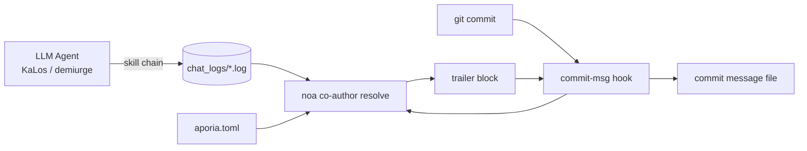

# Идентификация AI Агентов и Стратегия Соавторства в Коммитах

## Обзор

Этот документ определяет, как сгенерированные AI коммиты в проектах celestia-island
(`noa`, `entelecheia`, `evernight`) снабжаются **метаданными происхождения**: какие
модели создали изменение, через какого провайдера/платформу они были доступны, сколько
токенов они потребили, и было ли изменение создано в режиме автономной
(YOLO) итерации.

Механизм представляет собой **прагматичные метаданные**: каждый коммит, созданный AI агентом, получает
блок `Co-authored-by` (и опциональный блок `Token usage`), добавляемый
git-хуком `commit-msg`, который устанавливает и разрешает `noa`. Это не ворота
юридического соответствия; это отслеживаемость, позволяющая людям проверять, какая модель и какой
провайдер работали с кодом.

## Мотивация

| Проблема | Как это помогает |
| --- | --- |
| **Отслеживаемость** | Каждый коммит записывает точные модели, которые его создали. |
| **Ответственность провайдера** | Email автора кодирует провайдера/платформу, включая сторонние ретрансляторы. |
| **Защита от отравления** | Если ретранслятор или провайдер доставляет скомпрометированные данные, трейлер соавтора идентифицирует источник. |
| **Отслеживание затрат** | Опциональный блок `Token usage` записывает загрузку/выгрузку/кэш на модель. |
| **Маркировка автономного режима** | Цепочка, полностью выполненная в режиме YOLO, помечается полномочием `Entelecheia`. |

## Модель Идентичности Провайдера

Email автора использует единое пространство имён доверия — `celestia.world` — с локальной
частью, кодирующей **кто обслуживал модель**:

```text
Отображаемое Имя <provider-or-platform-id@celestia.world>
```

Идентификатор провайдера — это **обязательное поле `website_domain`**, объявленное в каждой
конфигурации провайдера (TOML-файлы входных точек реестра провайдеров и локальный
`aporia.toml`). Он **не** извлекается из API `base_url` — один провайдер может предоставлять
несколько хостов `base_url` (например, `zhipu_glm` обслуживает и `open.bigmodel.cn`, и
`api.z.ai`, но его канонический домен — `zhipuai.cn`). Если у провайдера отсутствует
`website_domain`, ему не приписывается соавтор (резолвер пропускает его, а не
угадывает по URL или префиксу модели).

- **Провайдеры первого уровня** идентифицируются по каноническому домену:

`anthropic.com`, `deepseek.com`, `openai.com`, `zhipuai.cn`, `google.com`, ...

- **Сторонние / ретранслирующие провайдеры** сохраняют свой домен, чтобы ретранслятор был виден:

`opencode.ai`, `jdcloud.com`, `openrouter.ai`, `dashscope.aliyuncs.com`, ...

Это означает, что *одна и та же* модель, доступная через разные маршруты, различима:

```text
GLM 5 <zhipuai.cn@celestia.world>              # напрямую от Zhipu AI
GLM 5 <jdcloud.com@celestia.world>           # GLM 5 через JD Cloud
Deepseek V4 Pro <deepseek.com@celestia.world> # напрямую от DeepSeek
Deepseek V4 Pro <opencode.ai@celestia.world>  # DeepSeek через opencode
```

## Спецификация Трейлера Соавтора

- Ключ трейлера: `Co-authored-by` (распознаваемый git трейлер).
- Значение: `Отображаемое Имя <local@celestia.world>`.
- **Один трейлер на отдельную модель**, в порядке использования.
- Отображаемое имя производится от идентификатора модели (бренд + версия, в заглавном регистре).
- Локальная часть должна быть допустимым поддоменом RFC-5321 (буквы, цифры, `.`, `-`).

## Трейлер Полномочия YOLO

Когда вся цепочка рассуждений, создавшая коммит, выполнялась под **круиз-контролем YOLO**
(автономная итерация), добавляется дополнительный соавтор:

```text
Co-authored-by: Entelecheia <demiurge@celestia.world>
```

Режим YOLO определяется из:

1. Журнала чата сессии, содержащего маркер `YOLO cruise control` / `YOLO auto`, или
1. Наличия файла-индикатора `/run/entelecheia/yolo_active`.

Это позволяет человеку сразу увидеть, что "этот коммит был сделан без участия человека".

## Встроенное Использование Токенов

Встраивается в отображаемое имя каждой модели в трейлере `Co-authored-by` (один блок трейлера, который GitHub корректно разбирает):

```text
Co-authored-by: Claude Opus 4.8 (↑ 12.5k ↓ 8.3k ●45.2k) <anthropic.com@celestia.world>
Co-authored-by: Deepseek V4 Pro (↑ 5.1k ↓ 3.2k) <deepseek.com@celestia.world>
```

Правила:

- Использование встраивается как `(↑ загрузка ↓ выгрузка)`, с добавлением `●кэш` только

когда токены кэшированного ввода были сообщены и > 0.

- `↑` = токены запроса/ввода; `↓` = токены завершения/вывода.
- Количество отображается в тысячах (`k`), один десятичный знак, с обрезкой конечных нулей.

## Пример Полного Сообщения Коммита

```python
fix(auto_fix): raise clippy/check timeouts from 180s to 300s

The previous 180s timeout was too tight for clean builds on a loaded
machine; raise it to 300s to avoid spurious validation failures.

Co-authored-by: Entelecheia <demiurge@celestia.world>
Co-authored-by: GLM 5 (↑ 36.4k ↓ 1.5k) <zhipuai.cn@celestia.world>
```

## Установка Хука noa

`noa` предоставляет жизненный цикл хука:

```text
noa hook install --repo <path> [--force] [--noa-bin <path>]
```

- Записывает `.git/hooks/commit-msg` (режим `0755`).
- Хук вызывает `<noa> co-author resolve` и добавляет его stdout в файл

сообщения коммита (`$1`).

- Хук **никогда не блокирует коммит**: при любой ошибке резолвера он молча выходит с `0`.
- Если сообщение коммита уже содержит трейлер `Co-authored-by:`, хук ничего не делает

(никогда не дублирует и не перезаписывает).

- `NOA_COAUTHOR_DISABLE=1` в окружении отключает хук для одного коммита.

## Разрешение Соавторства noa

```text
noa co-author resolve [--repo <path>] [--chat-log-dir <dir>]
                      [--aporia-config <path>] [--lookback-secs <n>]
```

Резолвер:

1. Загружает карту провайдеров: встроенный реестр, объединённый с конфигурацией провайдера

`aporia.toml` (которая даёт точное отображение модель→точка подключения→провайдер).

1. Читает последние журналы чата entelecheia и агрегирует использование токенов на

модель. С `--lookback-secs 0` (по умолчанию) используется только последний журнал.

1. Определяет режим YOLO (маркер в журнале чата или файл-индикатор).
1. Строит список соавторов (сначала полномочие `Entelecheia`, если YOLO, затем модели)

и блок использования токенов, и выводит блок трейлера в stdout.

## Поток Данных



## Интеграция с entelecheia

- Хук `commit-msg` устанавливается в `/mnt/sdb1/entelecheia/.git/hooks/`.
- Все коммиты, созданные конвейером surgery (`NoaMergeCommit` хук в

`packages/scepter/src/state_machine/skill_chain/execution/noa_post_chain.rs`) и
циклом самовосстановления `KaLos:auto_fix`, проходят через git хук `commit-msg`,
поэтому они автоматически маркируются.

- Изменения в местах вызова коммитов не требуются: хук является единой точкой

вставки.

## Интеграция с evernight

Когда AI агент оркеструет коммит через `evernight` (например, агент на хосте A →
evernight SSH → хост B → `git commit`), хук `commit-msg` на стороне хоста всё равно срабатывает
локально и маркирует коммит. `evernight` сам может фигурировать как **транзитный
провайдер** в email автора, когда он ретранслирует трафик модели (например,
`GLM 5 <evernight.celestia.world@celestia.world>`), делая транспортный переход
аудируемым.

## Соображения Безопасности

- Трейлеры соавторов — это **самостоятельно сообщаемое** происхождение, а не криптографическое доказательство.

В будущем могут быть добавлены подписанные аттестации.

- Резолвер безопасно деградирует: отсутствующий журнал чата, отсутствующий `noa` или ошибка парсинга

— всё это приводит к пустому блоку, и коммит продолжается без изменений.

- Идентификаторы провайдеров берутся из локального `aporia.toml`, поэтому пользователь всегда видит

провайдеров, которых *он* настроил.

## Справочник Идентификаторов Провайдеров (начальный реестр)

| Идентификатор провайдера | Бренд | Подсказка точки подключения |
| --- | --- | --- |
| `zhipuai.cn` | GLM | `open.bigmodel.cn` |
| `deepseek.com` | Deepseek | `api.deepseek.com` |
| `anthropic.com` | Claude | `api.anthropic.com` |
| `openai.com` | GPT / OpenAI | `api.openai.com` |
| `google.com` | Gemini | `googleapis.com` |
| `dashscope.aliyuncs.com` | Qwen | `dashscope.aliyuncs.com` |
| `moonshot.cn` | Kimi | `api.moonshot.cn` |
| `mistral.ai` | Mistral | `api.mistral.ai` |
| `opencode.ai` | (ретранслятор) | `opencode.ai` |
| `jdcloud.com` | (ретранслятор) | `jdcloud.com` |
| `openrouter.ai` | (ретранслятор) | `openrouter.ai` |
