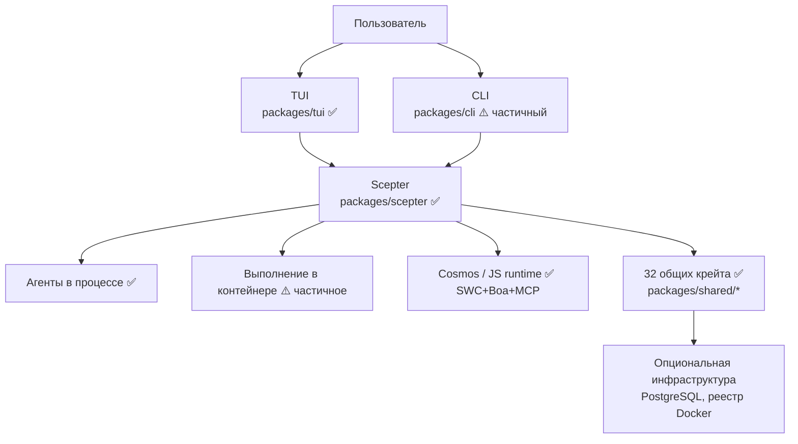
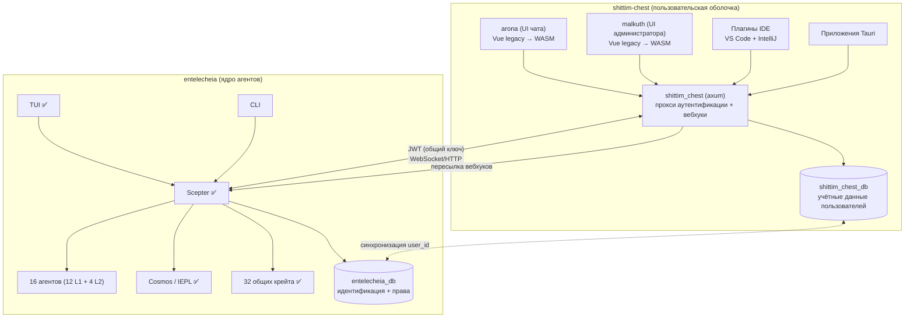
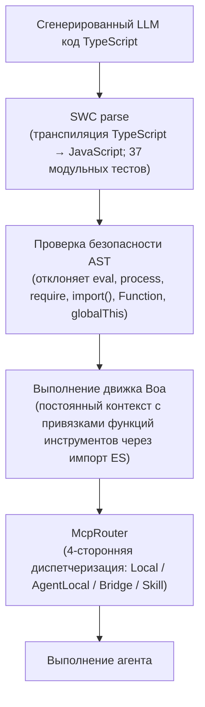
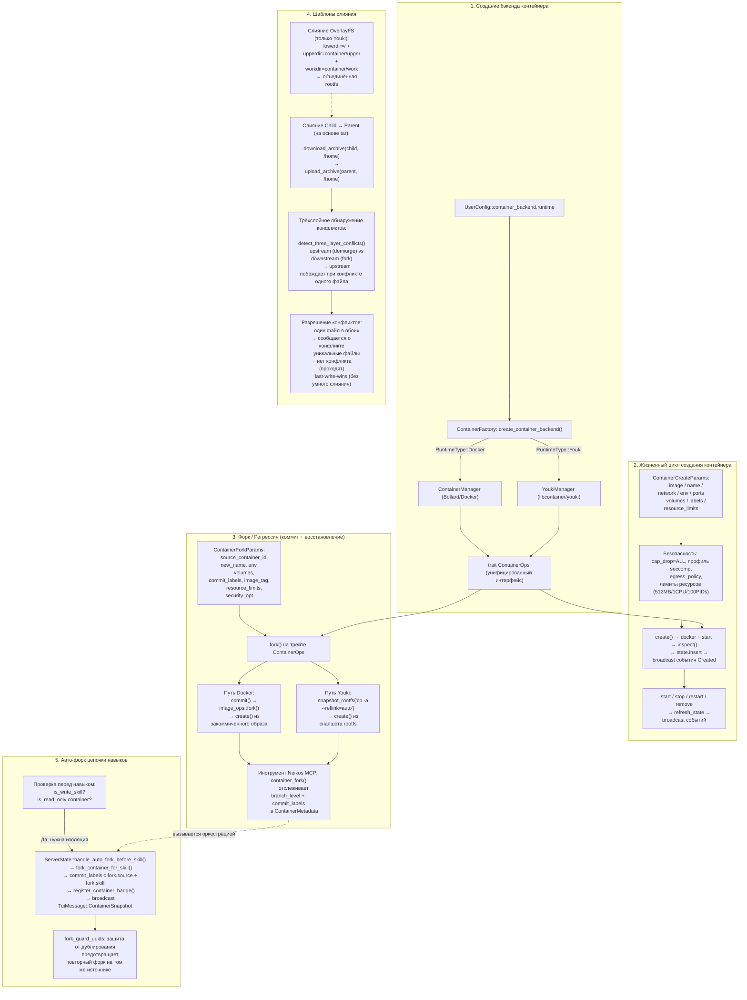
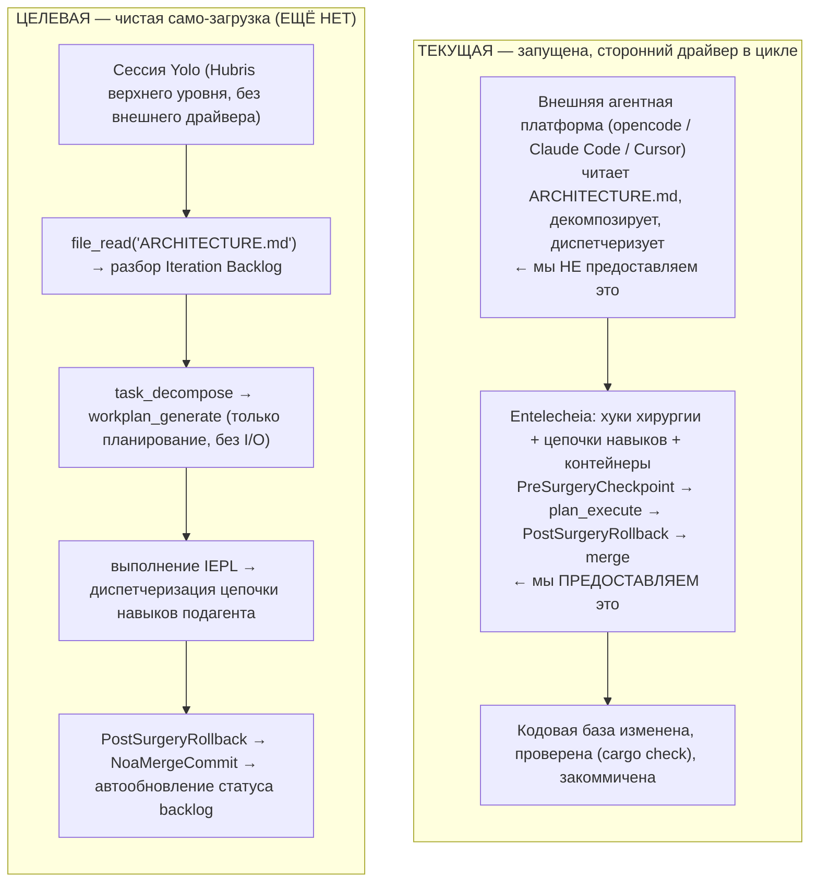
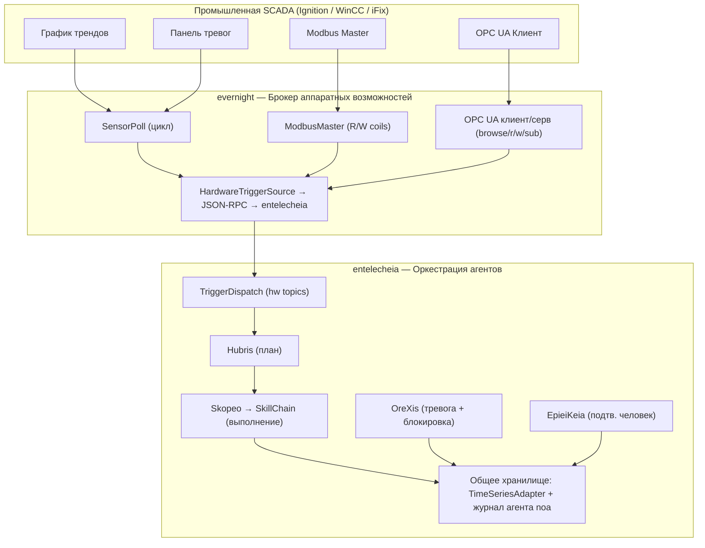

# Архитектура

> **Версия**: 0.2.0 — ранняя разработка, не готова к продакшену.
> **Последняя проверка**: 2026-06-17 (глубокий анализ — сверка с фактическим кодом)
> Этот документ описывает как реализованный код, так и предполагаемый дизайн.
> [Прочитайте раздел Текущие пробелы](#текущие-пробелы) перед принятием решений о развёртывании.

## Разделение репозиториев

Entelecheia завершила крупное разделение: пользовательские слои оболочки были перенесены в родственный проект **shittim-chest** (`../shittim-chest`). Entelecheia теперь фокусируется исключительно на ядре мультиагентной оркестрации.

| Репозиторий | Область |
| --- | --- |
| **entelecheia** | Оркестрация Scepter, 16 агентов (12 L1 + 4 L2), среда выполнения Cosmos/IEPL, 32 общих крейта |
| **shittim-chest** | arona (пользовательский интерфейс чата), malkuth (интерфейс администратора), бэкенд `shittim_chest` (прокси axum + аутентификация + вебхуки), плагины IDE, приложения Tauri |

## Текущий объём

Entelecheia — это рабочее пространство Rust из **56 крейтов**, сосредоточенное вокруг `packages/scepter` (сервер оркестрации), **32 общих крейта** в `packages/shared/` (полностью разложены из бывшего монолитного крейта; 5 запланированных субкрейтов так и не были материализованы, и их функциональность была встроена в родственные крейты) и `packages/tui` (терминальный интерфейс). TUI — наиболее полный пользовательский интерфейс. `packages/cli` содержит команды управления сервисами, чата и временной шкалы.

Следующие компоненты были **перенесены в shittim-chest** и удалены из этого репозитория:

- `packages/webui` (HTTP/статический хост, мост WebSocket) — удалён
- `packages/webui_frontend` (WASM фронтенд) — удалён (Фаза 1)
- `packages/ide/vscode` (расширение VS Code) — удалён (Фаза 1)
- `packages/ide/idea` (плагин IntelliJ) — удалён (Фаза 1)
- `packages/app/tauri*` (настольные/мобильные приложения Tauri) — удалены (Фаза 1)
- Все состояния WebUI, команды и рендеринг в крейтах TUI/CLI/Scepter/shared — удалены (Фаза 2)

Проект прошёл крупную декомпозицию: старый монолитный крейт `packages/shared` (38K строк, 187 .rs файлов) был полностью растворён в сфокусированные субкрейты. 5 границ крейтов, которые появлялись в ранних диаграммах слоёв, так и не были материализованы как отдельные крейты; их предполагаемая функциональность находится внутри других крейтов (например, перечисления домена встроены в `shared-domain-agent`, типы потоков — в `shared-state-types`). Все внутренние объявления зависимостей используют `workspace = true` для согласованности версий.

## Проверка реальности компонентов

| Компонент | Реализован | Только дизайн / Заглушка | Вердикт |
| --- | --- | --- | --- |
| **Scepter** (оркестрация) | Аутентификация/RBAC, маршрутизация провайдеров, жизненный цикл агентов, выполнение цепочек навыков, конечные точки WebSocket/HTTP, шифрование ключей. 351 модульный тест в 49 исходных файлах. `AppState` имеет реализации `FromRef` для 5 подсостояний; обработчики agent_lifecycle используют `State<Arc<Persistence>>` | Полная поверхность API. Пакетный процессор определён, но не инстанциирован. | 🟢 Реальный |
| **TUI** | Полный жизненный цикл: заставка, инициализация Docker, временная шкала, модальные окна агентов, i18n (8 языков), конфигурация провайдеров, поддержка тем. 329 модульных тестов в 47 исходных файлах. `ComponentStore` разделён на 5 подструктур; AppState сокращён до 6 полей. Подключается через Unix-сокет (предпочтительно) или WebSocket (запасной вариант). | Паритет функций с API Scepter. `CancelRequest`/`ExecuteSudoCommand` ещё не подключены. | 🟢 Реальный |
| **CLI** | Управление сервисами, чат, временная шкала, команды жизненного цикла агентов. 28 модульных тестов. | Не на паритете функций с TUI | 🟡 Частичный |
| **WebUI** | Удалён — перенесён в shittim-chest | — | ✅ Завершён |
| **WebUI Frontend** | Удалён — перенесён в shittim-chest | — | ✅ Завершён |
| **Cosmos / JS Runtime** | Движок Boa, диспетчеризация импорта ES-модулей (внутреннее разрешение `__native_dispatch`), генерация пространств имён, McpRouter с автоматическим выключателем+повтором. Автогенерация `.d.ts` из `#[derive(TS)]` заполняет файлы типов TypeScript. 50 модульных тестов. | Конвейер транспиляции SWC TypeScript реализован и протестирован (37 модульных тестов). Полный автоматизированный конвейер (вывод LLM → SWC → Boa) соединяем через `shared_iepl::client` с флагом функции `in-process-transpile`. | 🟢 Активный |
| **16 Агентов (12 L1 + 4 L2)** | Все 16 агентов компилируются с реализациями инструментов MCP. 147 инструментов MCP всего — **все реальные**. Ноль макросов `unimplemented!()` или `todo!()` в кодовой базе. | Классические инструменты SE помечены `maturity: Stub` в метаданных, но имеют реальные реализации (вызовы подпроцессов cargo clippy, eslint, pylint, go vet; метрики кода; рефакторинг extract-function). | 🟢 Активный |
| **Layer2: Web Automation** | 11 инструментов MCP — все реальные реализации через протокол WebDriver: управление сессиями, навигация, скриншот, выполнение скриптов, логи консоли/сети, клавиатура, мышь, запись. `maturity: Experimental` для 10 инструментов. | — | 🟢 Активный |
| **Layer2: Classic SE** | 7 инструментов MCP — все реальные реализации: static_analyze (cargo clippy/eslint/pylint/go vet), code_review (определяет длинные функции, глубокую вложенность, магические числа), quality_check (LOC, сложность, буквенные оценки), refactor_suggest, lsp_diagnose, lsp_symbols, lsp_refactor (реальные переименование и extract-function). 2 модульных теста. | Предпросмотр операции inline в LSP refactor (требуется LSP-сервер для полного разрешения). | 🟢 Активный |
| **Layer2: Industrial IoT** | 7 инструментов MCP — все реальные реализации: modbus_read, modbus_write, s7comm_probe, serial_discover, opcua_browse, opcua_read, opcua_write. Промышленная протокольная связь (Modbus RTU/TCP, Siemens S7comm, клиент OPC UA). `maturity: Experimental`. | Перенесено из SkeMma/PoleMos в рамках консолидации L2. | 🟢 Активный |
| **Layer2: Remote Operations** | 16 инструментов MCP — все реальные реализации: управление SSH-сессиями, удалённое выполнение команд, передача файлов (SFTP), сбор информации о хосте, автоматизация GUI (скриншот X11/VNC, ввод, навигация), мониторинг системы. `maturity: Experimental`. | Перенесено из SkeMma/PoleMos в рамках консолидации L2. | 🟢 Активный |
| **Другие дизайны Layer2** | Все 4 запланированных агента L2 теперь реализованы. `res/prompts/domain_agents/` содержит документы config/skill для всех реализованных агентов. | `docs/plans/` никогда не создавался | 🟢 Активный |
| **Изоляция контейнеров** | Двухуровневая среда выполнения: Docker/Podman (внешняя оркестрация) через Bollard, Youki/libcontainer (внутренняя песочница) через libcontainer. Пользователь без прав root, cap_drop=ALL, no-new-privileges, выделенная сеть Docker, IPC через Unix-сокет, лимиты ресурсов (512MB/1CPU/100 PIDs) при create, fork, merge и recreate. Пользовательские профили seccomp. Fork/commit/snapshot полностью функциональны на обоих бэкендах. | Профили AppArmor не реализованы. `read_only_rootfs` не включён по умолчанию. | 🟡 Частичный |
| **Память / RAG** | Эмбеддинги с поддержкой API (OpenAI-совместимые, хеш SHA-256 как запасной вариант, ONNX fastembed BGE-M3). 3 бэкенда эмбеддингов полностью реализованы. Хранилище PgVector, векторные документы в памяти, обход графа, RagContextBuffer для внедрения окружающего контекста. 39 модульных тестов. | Связь Embedding→RAG развязана (вызывающий предоставляет предварительно вычисленные эмбеддинги). Путь PgVector новее/менее протестирован, чем запасной вариант в памяти. Синхронизация подписки RAG зарезервирована (ещё не реализована). | 🟡 Частичный |
| **Конвейер IEPL** | Движок Boa + мост MCP + фильтрация пространств имён + автоматический выключатель. Парсинг SWC TypeScript реализован и протестирован (37 модульных тестов). Автогенерация `.d.ts` работает. Генерация кода IEPL (типы Rust → объявления TS) подключена. Транспиляция TS→JS доступна через `shared_iepl::client` (в процессе или в подпроцессе). | Цепочка SWC→Boa не интегрирована для пути выполнения контейнера Cosmos (ожидает предварительно очищенный JS). | 🟡 Частичный |
| **Интеграции IDE** | Удалены — перенесены в shittim-chest | — | ✅ Завершены |

## Диаграмма архитектуры

### Текущая



### Целевая (после разделения)



Легенда: ✅ работает | ⚠️ частично реализовано | 🔴 заглушка/дизайн

## Слои зависимостей крейтов

32 общих крейта организованы в слоистый граф зависимостей:

```mermaid
block-beta
    columns 1
    block:L0["Слой 0 (листовой)"]:1
        shared-core shared-logging shared-macros
    end
    block:L1["Слой 1"]:1
        shared-domain-enums shared-mcp-types shared-text shared-concurrent
    end
    block:L2["Слой 2"]:1
        shared-config shared-agent-registry shared-state-types
    end
    block:L3["Слой 3"]:1
        shared-domain-agent shared-container shared-domain-agent-lifecycle shared-domain-agent-runtime
        shared-domain-thread-types shared-domain-toolchain shared-infra-utils
    end
    block:L4["Слой 4"]:1
        shared-state-sync shared-domain-skills shared-hooks shared-domain-auth shared-container-runtime
        shared-domain-skills-permissions shared-timeline shared-iepl
    end
    block:L5["Слой 5"]:1
        shared-llm-provider shared-prompt shared-custom-agent shared-storage
        shared-infra-jsonrpc shared-infra-services shared-e2e-events shared-adapter shared-plugin_host
        shared-rag shared-embedding shared-security-policy
    end
    L0 --> L1 --> L2 --> L3 --> L4 --> L5
```

Потребители (scepter, agents, tui) импортируют напрямую из отдельных субкрейтов (например, `_shared_domain_agent`, `_shared_llm_provider`). Тонкого агрегирующего крейта нет — старый монолитный `shared` был полностью растворён. Все внутренние зависимости используют объявления `workspace = true` для согласованности версий.

> **Примечание:** Диаграмма выше перечисляет 37 слотов крейтов в 6 слоях, но только 32 существуют как компилируемые члены рабочего пространства. Следующие 5 слотов были запланированными границами крейтов, которые так и не были материализованы как отдельные крейты: `shared-domain-enums`, `shared-agent-registry`, `shared-domain-thread-types`, `shared-domain-toolchain`, `shared-state-sync`. Их функциональность встроена в родственные крейты (например, перечисления домена находятся внутри `shared-domain-agent`; `shared-state-sync` существует только как псевдоним рабочего пространства `_shared_state_sync`, указывающий на `packages/shared/state_types`).

## Активные агенты

Рабочее пространство компилирует 12 агентов Layer1 (111 инструментов MCP) и 4 крейта Layer2 (Web Automation — 11 инструментов, Classic Software Engineering — 7 инструментов, Industrial IoT — 7 инструментов, Remote Operations — 16 инструментов). Все агенты используют макрос `agent_mcp_module!` для регистрации инструментов MCP. Макрос поддерживает `skill_routing` для агентов, которым требуется перехват перед диспетчеризацией (например, двойная диспетчеризация `SkillExecutor` в Skopeo).

**Статус реализации инструментов:** Все 147 инструментов имеют реальные реализации. Ноль макросов `unimplemented!()` или `todo!()` существует где-либо в кодовой базе. Ни один инструмент не возвращает тривиальный `Ok(())` без реальной логики.

| Агент | Слой | Текущая ответственность | Инстр. | Загл. | Тестовое покрытие | Зрелость |
| --- | --- | --- |  ---  |  ---  |  ---  | --- |
| **HapLotes** | 1 | Шлюз, маршрутизация сообщений, транспортный клей | 2 | 0 | 21 тест | 🟢 Реальный |
| **SkoPeo** | 1 | Координация и поток выполнения, обращённый к LLM | 12 | 0 | 41 тест | 🟢 Реальный |
| **HubRis** | 1 | Планирование, управление задачами, отчётность, помощники по issues | 8 | 0 | 65 тестов | 🟢 Реальный |
| **KaLos** | 1 | Операции с файлами и репозиториями | 8 | 0 | 20 тестов | 🟢 Реальный |
| **NeiKos** | 1 | Жизненный цикл контейнеров и помощники выполнения | 17 | 0 | 14 тестов | 🟢 Реальный |
| **SkeMma** | 1 | Выполнение скриптов и изоляция выполнения | 2 | 0 | 124 теста | 🟢 Реальный |
| **ApoRia** | 1 | Конфигурация провайдеров, помощники знаний, инструменты RAG | 11 | 0 | 14 тестов | 🟢 Реальный |
| **EleOs** | 1 | Веб-поиск и удалённый поиск информации | 2 | 0 | 11 тестов | 🟢 Реальный |
| **EpieiKeia** | 1 | Помощники планирования и обслуживания | 8 | 0 | 4 теста | 🟢 Реальный |
| **OreXis** | 1 | Принудительное применение политик безопасности (блокировка во время выполнения через списки запретов/разрешений/блокировку) + иерархия тревог + аудиторская отчётность | 20 | 0 | 19 тестов | 🟢 Реальный |
| **PhiLia** | 1 | Функции, связанные с памятью и хранилищем данных | 7 | 0 | 0 тестов | 🟡 Нулевое покрытие |
| **PoleMos** | 1 | Связь с хостом и аппаратная телеметрия | 9 | 0 | 3 теста | 🟡 Низкое покрытие |
| **Web Automation** | 2 | Автоматизация браузера (создание, навигация, скриншот, выполнение, консоль, сеть, клавиатура, мышь, запись) | 11 | 0 | 3 теста | 🟡 Низкое покрытие (`maturity: Experimental`) |
| **Classic Software Engineering** | 2 | Статический анализ, проверка кода, проверка качества, предложения рефакторинга, диагностика/символы/рефакторинг LSP | 7 | 0 | 2 теста | 🟡 Низкое покрытие (`maturity: Stub` в метаданных, но реальные реализации) |
| **Industrial IoT** | 2 | Промышленная протокольная связь (Modbus RTU/TCP, Siemens S7comm, клиент OPC UA) | 7 | 0 | 0 тестов | 🟡 Низкое покрытие (`maturity: Experimental`) |
| **Remote Operations** | 2 | Удалённое выполнение SSH, передача файлов, автоматизация GUI, мониторинг системы | 16 | 0 | 0 тестов | 🟡 Низкое покрытие (`maturity: Experimental`) |

## Layer2 и Layer3

- **Layer2 сегодня**: `web_automation` (11 инструментов MCP), `classic-software-engineering` (7 инструментов MCP), `industrial_iot` (7 инструментов MCP) и `remote_operations` (16 инструментов MCP) — активные крейты Layer2. `classic-software-engineering` предоставляет статический анализ, проверку кода, проверки качества, предложения рефакторинга, диагностику LSP, извлечение символов и рефакторинг LSP — реализован в `packages/domain_agents/classic_software_engineering/`. `industrial_iot` предоставляет промышленную протокольную связь (Modbus RTU/TCP, Siemens S7comm, OPC UA) — перенесён из инструментов Layer1 SkeMma/PoleMos. `remote_operations` предоставляет удалённое выполнение SSH, передачу файлов, автоматизацию GUI и мониторинг системы — перенесён из инструментов Layer1 SkeMma/PoleMos. Система плагинов WASI (`plugin_host`) с двойной песочницей wasmtime + boa TS содержит эталонный плагин вебхуков GitHub; архитектура Trigger (`TriggerDispatcher` / `TriggerTopic` / `TriggerConfig`) диспетчеризует внешние события в цепочки навыков.
- **Другие дизайны Layer2**: все 4 запланированных агента L2 теперь реализованы. `res/prompts/domain_agents/` содержит документацию config/skill/mcp для реализованных агентов L2. Изначально запланированная директория `docs/plans/` так и не была создана.
- **Layer3**: пользовательские агенты будут загружаться из локальных для рабочего пространства директорий `.amphoreus/`. Существуют команды CLI для subscribe/list/run внешних агентов Layer 3. Крейт `shared-custom-agent` предоставляет частичную инфраструктуру. Фактические бизнес-логические плагины Layer 3 не были реализованы.

## Шаблоны выполнения

### Exec-Only Tool Exposure

Поверхность инструментов, обращённая к модели, намеренно мала: `exec`, `write_to_var` и `write_to_var_json`. Внутренние инструменты MCP (~146 всего по всем агентам) вызываются из среды выполнения через импорт ES-модулей вместо прямого поштучного предоставления. Это ключевая архитектурная инновация проекта — она минимизирует накладные расходы контекста LLM, уменьшает поверхность атаки и централизует принудительное применение прав.

### Смешанная модель выполнения

Scepter координирует как логику в процессе, так и пути выполнения в контейнерах. Основной цикл оркестрации находится в `SkillChainPipeline::execute()` (`packages/scepter/src/state_machine/skill_chain/pipeline.rs`), который был разложен на сфокусированные фазовые методы — `resolve_agent_identity()`, `broadcast_skill_started()`, `finalize_execution()`, `route_to_next_skill()` — плюс существующие 8 вспомогательных методов для проверок защиты, построения промптов, белых списков инструментов и жизненного цикла подзадач. Конструкция `ReportDispatchContext` централизована через конструктор `new()`, устраняющий 3× повторение.

Устаревшая функция `run_chain_loop` в `execution/execution_steps.rs` была рефакторизирована в тонкую 6-строчную обёртку, делегирующую `SkillChainPipeline::execute()`.

### Конвейер IEPL TypeScript



Часть с движком Boa + мостом MCP работает сквозным образом. Конвейер транспиляции TypeScript на основе SWC реализован и протестирован (37 модульных тестов). Автогенерация `.d.ts` из структур Rust `#[derive(TS)]` заполняет файлы типов TypeScript для автодополнения IEPL. Полный автоматизированный конвейер (вывод LLM → SWC → Boa с привязками) соединяем через `shared_iepl::client` (режимы транспиляции в процессе или в подпроцессе). Путь выполнения контейнера Cosmos в настоящее время ожидает предварительно очищенный JS (интеграция SWC→Boa ещё не в контейнере).

### Логика создания, форка и слияния контейнеров

Подсистема контейнеров построена вокруг унифицированного трейта `ContainerOps` с двумя взаимозаменяемыми бэкендами (Docker через Bollard, OCI через youki/libcontainer). Операции форка (коммит + создание из снимка) обеспечивают механизм регрессии/восстановления. Передача архивов на основе tar и трёхслойное обнаружение конфликтов формируют стратегию слияния.

**Двухуровневая архитектура среды выполнения:**

| Слой | Среда выполнения | По умолчанию | Область |
| --- | --- | --- | --- |
| **Внешний** (оркестрация) | Docker/Podman | `CONTAINER_RUNTIME=docker` | Инфраструктурные контейнеры: scepter, postgres. Создаются через init engine, проверяются на здоровье через TUI. Требуют полной оркестрации (сеть, тома, проверки здоровья). |
| **Внутренний** (песочница cosmos) | Youki/libcontainer | `COSMOS_CONTAINER_RUNTIME=youki` | Эфемерные песочницы агентов внутри scepter. Лёгкие, быстрый старт, ограничены seccomp. |

Помощники выбора среды выполнения находятся в `shared/infra_services/src/container_factory.rs`:

- `outer_runtime_type()` — читает `CONTAINER_RUNTIME`, по умолчанию `docker`
- `cosmos_runtime_type()` — читает `COSMOS_CONTAINER_RUNTIME`, по умолчанию `youki`



| Концепция | Исходный(е) файл(ы) |
| --- | --- |
| Создание бэкенда | `shared/infra_services/src/container_factory.rs` |
| Трейт `ContainerOps` | `shared/container/src/ops.rs` |
| Создание/форк Docker | `shared/container/src/lifecycle.rs`, `image_ops.rs` |
| Создание/форк Youki | `shared/container_runtime/src/manager.rs`, `rootfs.rs` |
| Слияние Child→Parent | `shared/container/src/copy_ops.rs` (tar download→upload) |
| Трёхслойный конфликт | `shared/container/src/copy_ops.rs` (`detect_three_layer_conflicts()`) |
| Авто-форк цепочки навыков | `scepter/src/state_machine/skill_chain/container_ops.rs` |
| Инструмент форка Neikos MCP | `agents/neikos/src/mcp/tools/container/container_fork.rs` |
| Снапшот контейнера | `scepter/src/state_machine/snapshot.rs`, `agents/neikos/src/mcp/tools/container/container_snapshot.rs` |

### Статус сквозного подключения путей

| # | Путь | Статус | Ключевые точки соединения |
| --- | --- | --- | --- |
| 1 | **Запуск Scepter → WS → цепочка навыков** | 🟢 Полностью подключён | `scepter/src/app/setup.rs:876-1653`, `scepter/src/lib.rs:139-361`, `scepter/src/tui_connection/core/message_dispatch.rs:10-140` |
| 2 | **Запуск TUI → соединение с scepter** | 🟢 Полностью подключён | Unix-сокет (предпочтительно) или WebSocket (запасной) с полным рукопожатием + синхронизацией состояния |
| 3 | **Конвейер IEPL (SWC→Boa→MCP)** | 🟡 Частично подключён | Транспилятор функционирует (37 тестов). Диспетчеризация Boa+MCP подключена. SWC→Boa соединяем через `shared_iepl::client`, но не в контейнере. |
| 4 | **Создание/форк/слияние контейнеров** | 🟢 Полностью подключён | Двухуровневый: Docker/Podman (Bollard) + Youki (libcontainer). Оба реализуют трейт `ContainerOps`. |
| 5 | **Диспетчер триггеров (HW-событие→агент)** | 🟢 Полностью подключён | Unix-сокет + WebSocket + PluginHost → `TriggerDispatcher` → `SkillInvoker` |
| 6 | **Телеметрия/пакетное чтение** | 🟡 Частично подключён | `BatchProcessor` определён, не инстанциирован. Парсер `SensorBatch` существует, не вызывается. |
| 7 | **Конвейер RAG/эмбеддингов** | 🟡 Частично подключён | 3 бэкенда эмбеддингов полностью реализованы. Движок RAG функционирует. Связь Embedding→RAG развязана (предоставляется вызывающим). |

### Двойная изоляция песочницы

| Канал выполнения | Может вызывать функции инструментов (через импорт ES-модулей) | Тип песочницы | Назначение |
| --- | --- | --- | --- |
| `neikos.exec()` | Да (через импорт ES-модулей) | Постоянный контекст Boa | Оркестрация навыков (диспетчеризация агент-агенту) |
| `skemma.script_exec()` | Нет | Независимая песочница процесса | Бэкенды инструментов MCP (вычисления/I/O) |

### Текущая модель памяти

Функции знаний и памяти существуют в более простой форме, чем описано в проектных документах: векторные документы в памяти, эмбеддинги на основе хешей и обход графа присутствуют. Добавлены сервис эмбеддингов с поддержкой API с хеш-запасным вариантом и бэкенд хранения PgVector, но полный стек ONNX + pgvector ещё не интегрирован сквозным образом.

### Интеграция провайдеров

Настроено 26 провайдеров LLM (OpenAI, Anthropic, Google, плюс полная экосистема китайских LLM: DeepSeek, Qwen, GLM, StepFun, Moonshot, Doubao, Hunyuan и др.). Генерационные модели (изображения/аудио/видео/3D) имеют метаданные TOML и трейт провайдера. Большинство китайских провайдеров используют только OpenAI-совместимый протокол, теряя нативные функции.

## Текущие пробелы

> **Этот раздел является авторитетным справочником о том, что ЕЩЁ НЕ работает.**

### Критические (блокирует использование не-TUI)

- **Паритет функций CLI существенно улучшен**: `packages/cli` теперь поддерживает управление сервисами (init, serve, stop), чат, временную шкалу, запросы жизненного цикла агентов (через `Cli.Status`), CRUD конфигурации провайдеров (`config provider {list,get,add,set,rename,remove}`) и просмотр инструментов/навыков MCP (`mcp tools`/`mcp skills` через `Cli.ListTools`/`Cli.ListSkills`). Мёртвый `ProcessManager` (запуск/остановка/перезапуск агентов как отдельных бинарников) удалён — агенты работают в процессе внутри scepter. Оставшиеся пробелы CLI по сравнению с TUI: интерактивный многостраничный UI, i18n, темы, визуализация форка/слияния контейнеров агентов.
- **Палитра команд TUI и отмена подключены**: `Ctrl+P` открывает палитру команд (12 команд). `Ctrl+G` отправляет `request.cancel` в scepter через новый быстрый RPC, который устанавливает флаг отмены и прерывает активный JoinHandle запроса. Слэш-команды `/clear` и `/settings` реализованы. `WorkerInput::CancelRequest` документирует путь Ctrl+G. `ExecuteSudoCommand` остаётся неподключённым (требуется аудит безопасности).
- **WebUI, плагины IDE, приложения Tauri перенесены в shittim-chest**: Веб-ориентированный пользовательский опыт (UI чата arona, панель администратора malkuth, интеграция IDE, вход вебхуков) теперь находится в родственном проекте `../shittim-chest`. Все ссылки на WebUI удалены из TUI, CLI, Scepter и общих крейтов. (Примечание: `packages/webui_bindings/` — это остаточная директория проекта TypeScript, на которую не ссылается ни один крейт Rust.)

### Крупные (блокирует готовность к продакшену)

- **Classic Software Engineering имеет реальные реализации, но требует усиления**: 7 инструментов MCP полностью функциональны (на основе подпроцессов cargo clippy/eslint/pylint/go vet; проверка кода на основе шаблонов, метрики качества, рефакторинг extract-function). Маркер `maturity: Stub` в метаданных регистрации вводит в заблуждение — инструменты работают, но выиграли бы от интеграции с LSP-сервером для более глубокого анализа. 2 модульных теста.
- **Сообщения об ошибках на смешанных языках**: Строки i18n уровня UI правильно диспетчеризуются по параметру языка. Оставшиеся сообщения об ошибках в бизнес-логике Rust на английском. Некоторые строки перевода названий моделей в `tui/src/ui/modals/models.rs` используют китайский как исходные данные (названия моделей провайдеров).
- **`AppState` Scepter имеет реализации `FromRef`**: `FromRef<AppState>` реализован для `RbacServices`, `Arc<Persistence>`, `Arc<ApiGateway>`, `ConfigServices`, `Arc<ServerState>`. Обработчики жизненного цикла агентов перенесены на `State<Arc<Persistence>>`. Оставшиеся обработчики могут подключаться инкрементально.

### Умеренные (блокирует полноту)

- **Пробелы безопасности контейнеров**: Пользовательские профили seccomp реализованы. Профили AppArmor не реализованы. `read_only_rootfs` не включён по умолчанию. Лимиты ресурсов (512MB памяти, 1 CPU, 100 PIDs) применяются при создании, форке и пересоздании контейнера. Двухуровневая среда выполнения (внешняя Docker/Podman + внутренняя Youki/libcontainer) полностью функциональна.
- **OreXis полностью функционирует**: Агент безопасности применяет списки запретов инструментов, списки разрешений, экстренную блокировку и специфичные для сессии переопределения политик во время вызова через `SecurityPolicySet`. Иерархия тревог (`alarm_tools.rs`) с порогами HH/H/L/LL/ROC, гистерезисом, антидребезгом и путями эскалации реализована. Режим `audit_only` (по умолчанию: выкл) можно переключать. 19 тестов. Отсутствует: предзагрузка 97 кодов неисправностей из hydro-tin-monitor.
- **Стек Память/RAG в основном подключён**: Все 3 бэкенда эмбеддингов (API, ONNX fastembed, хеш SHA-256 как запасной) полностью реализованы. Бэкенд PgVector функционирует. Обход графа работает. Связь эмбеддинг→RAG развязана (вызывающий предоставляет предварительно вычисленные эмбеддинги, а не автоматическое встроенное вычисление). Синхронизация подписки RAG зарезервирована (ещё не реализована).
- **Телеметрия/пакетное чтение частично подключены**: Структура `BatchProcessor` определена, но не инстанциирована в настройке scepter. Парсер `try_intercept_sensor_batch()` определён, но не вызывается в цикле диспетчеризации сообщений. Парсинг формата сообщений `SensorBatch` существует в trigger_intercept.
- **Несоответствие типа JSON-RPC id**: Rust/TypeScript/Kotlin используют разные типы JSON-RPC id.
- **Тестовое покрытие**: ~2,070 всего функций `#[test]`. scepter (351) и tui (329) наиболее протестированы. 5 крейтов имеют ноль тестов (philia, concurrent, e2e_events, github-webhook, plugins/examples). Большинство общих крейтов (30/33) полагаются только на встроенные модульные тесты. Крейт E2E-тестов уровня рабочего пространства (`tests/rust`) имеет 95 тестов.

### Соотношение сигнал/шум в дизайне

- Проект имеет обширную проектную документацию, которая описывает функциональность, далеко выходящую за рамки реализованной. README и проектные документы не следует читать как списки функций.
- Реальность одного сопровождающего (1 автор в `Cargo.toml`) означает, что рабочее пространство из 57+ крейтов по своей природе ограничено по мощности.
- Лицензия BUSL-1.1 с Additional Use Grant: Некоммерческое, академическое, государственное, образовательное и внутреннее использование бесплатно с правами, эквивалентными SySL-1.0. Коммерческий хостинг, перепродажа и платное развёртывание/поддержка требуют коммерческой лицензии. Переходит на SySL-1.0 для всех видов использования 2030-01-01.

## Архитектурный долг

| Проблема | Приоритет | Оценка усилий |
| --- | --- | --- |
| ~60 шаблонов `.map_err(...to_string())` в 21 файле (8 точных `\|e\| e.to_string()`, 52 более широких варианта). Сконцентрированы на границах адаптеров (`shared/adapter`, `shared/llm_provider`) и клиентах внешних API (`docker_client`, `plugin_loader`). Приемлемый шаблон адаптера на границах; внутренний код должен использовать типизированные ошибки. | P4 | проблема уровня библиотеки |
| Метаданные `maturity: Stub` на инструментах Classic SE вводят в заблуждение — все 7 имеют реальные реализации (анализаторы на основе подпроцессов, детекторы шаблонов, метрики кода, рефакторинг extract-function). Следует повысить до `Experimental` или выше. | P4 | только метаданные |
| Парсер `SensorBatch` определён (`trigger_intercept.rs:58-70`), но не подключён в цикл диспетчеризации сообщений. Структура `BatchProcessor` определена, но не инстанциирована в настройке scepter. Путь приёма телеметрии существует, но отключён. | P3 | работа по подключению |
| Интеграция Embedding→RAG развязана (вызывающий предоставляет предварительно вычисленные эмбеддинги). Должна быть автоподключена: `EmbeddingService` → `RagSubscriptionService` при приёме документа. | P3 | интеграционный клей |
| 5 крейтов с нулевыми тестами: `philia`, `concurrent`, `e2e_events`, `github-webhook`, `plugins/examples`. Доменные агенты L2 имеют минимальные тесты (2-3 каждый). | P2 | усилия на крейт |

## Автономное выполнение: Текущее состояние

> **Статус: ЗАПУЩЕНО — работает сквозным образом, но управляется сторонней агентной платформой.**
> Цикл самохирургии / YOLO dogfood загружается, модифицирует кодовую базу, проверяет и
> коммитит автономно. Однако роль планировщика/диспетчера в настоящее время выполняется
> **внешней агентной платформой** (opencode, Claude Code, Cursor и т.д.), а НЕ
> собственным координатором Entelecheia Hubris/Skopeo. **Чистая само-загрузка** —
> собственный оркестратор Entelecheia, читающий этот план и диспетчеризующий цепочки IEPL без
> внешнего драйвера в цикле — **ещё не достигнута**. См. оставшиеся пробелы ниже.

### Что подключено (Entelecheia предоставляет слой безопасного выполнения)

- **Хуки самохирургии** (`scepter/.../skill_chain/execution/surgery_hooks.rs`):

`PreSurgeryCheckpoint` (записывает git HEAD перед хирургией), `PostSurgeryRollback`
(автооткат при неудаче), логика переразвёртывания, `attempt_rollback`. Зарегистрированы в
менеджере хуков.

- **Цикл тиков YOLO**: каденции с временными рамками (Периодический 5 мин / Ежедневный 6 ч / Стратегический

7 д). Навыки: `yolo_cycle_report`, `regression_monitor` (прогнозирование деградации уровня Daily с
логикой решения о форке). Эвристика форка документирована в
`res/prompts/system/yolo-fork-pattern.md` — когда тик обнаруживает работу, которую не может завершить
в рамках бюджета, он форкает сессию `#demiurge.xxx` вместо усечения.

- **Последовательный координатор слияния**: с файловой блокировкой, под флагом функции; направляет коммиты noa после цепочки

через `run_exclusive`, чтобы параллельные форки YOLO не повреждали историю.

- **Форк/слияние контейнеров** для безопасного экспериментирования (внешняя песочница Docker/Podman + внутренняя Youki).
- Веховый коммит `37863366e` ("初步实现自主思考能力") зафиксировал сквозной цикл.

### Архитектура: Текущая (запущенная) vs Чистая Само-Загрузка (целевая)



Бывшее принудительное применение `role = "coordinator"` в белых списках инструментов (старый IB-02) и
выделенный навык `hubris::read_iteration_plan` (старый IB-01) были запланированными
механизмами для чистой само-загрузки. Прагматичным решением было сначала запустить цикл,
опираясь на стороннюю агентную платформу для роли планировщика/диспетчера.
Повторное внедрение этих двух механизмов — это то, что закрыло бы пробел само-загрузки.

### Оставшиеся пробелы, блокирующие чистую само-загрузку

| Пробел | Текущее состояние | Требуется | Приоритет |
| --- | --- | --- | --- |
| **Внутренний парсер plan-doc** | Цикл работает только потому, что внешняя агентная платформа читает ARCHITECTURE.md и сама декомпозирует задачи. Внутреннего навыка не существует. | Навык `hubris::read_iteration_plan`: разобрать таблицу backlog → вернуть структурированный `Vec<BacklogItem>`, чтобы собственный координатор Entelecheia мог управлять циклом. | P0 |
| **Принудительное разделение координатор–исполнитель** | Внешняя платформа обеспечивает собственное разделение планировщика/исполнителя; конвейер Entelecheia не принуждает к этому. Цепочка навыков координатора всё ещё может вызывать `file_write`/`host_command_exec` напрямую. | Добавить поле `role` в frontmatter навыков; удалить мутирующие инструменты из цепочек с `role = "coordinator"` в построителе белых списков инструментов `pipeline.rs`. | P0 |
| **Проверка критериев приёмки** | `PostSurgeryRollback` проверяет `cargo check --workspace` (уровень сборки), но не специфичные для задачи критерии приёмки. Частичное подключение в `prompt.rs`. | Пространство имён хуков `verify_acceptance_criteria`: каждый элемент backlog объявляет проверяемые критерии (тест проходит, файл существует, функция реализована). | P1 |
| **Машина состояний backlog** | Эта таблица содержит столбец `status`, но ни один агент пока не записывает его обратно автономно. | Автообновление `status: pending → in_progress → done \| blocked` после каждой цепочки+коммита. | P1 |
| **Бюджет контекста для глубоких цепочек** | `context_overflow_handler` существует; глубокая делегация IEPL всё ещё хрупка, когда контейнеризованный SkeMma недоступен. | Стабилизировать контейнеризованное выполнение агентов (проблема root youki) или сделать надёжным запасной вариант в процессе для глубоких цепочек. | P2 |

### Iteration Backlog

> **Машиночитаемый формат.** Активный драйвер (в настоящее время сторонняя агентная
> платформа, в конечном счёте собственный координатор Entelecheia) разбирает эту таблицу для поиска
> следующей actionable работы. Обновляйте `status` после завершения.

| ID | Название | Статус | Критерии приёмки | Примечания |
| --- | --- | --- | --- | --- |
| IB-01 | Навык `hubris::read_iteration_plan` | **заменён** | Документ навыка в `res/prompts/agents/hubris/skills/read_iteration_plan.md`; разбирает таблицу backlog ARCHITECTURE.md; возвращает структурированный список задач | Цикл запущен без этого — внешняя агентная платформа читает план напрямую. Повторное внедрение требуется только для **чистой само-загрузки**. |
| IB-02 | Принудительное применение белого списка инструментов координатора | **заменён** | Цепочка навыков координатора не может вызывать `file_write` / `host_command_exec` напрямую; только через диспетчеризованного подагента | То же, что и IB-01: внешняя платформа обеспечивает собственное разделение планировщика/исполнителя. Нужно только для чистой само-загрузки. |
| IB-03 | Пространство имён хуков `verify_acceptance_criteria` | **частичный** | Пространство имён хуков зарегистрировано; критерии каждого элемента backlog проверяются после цепочки; прерывание при неудаче | Частичное подключение в `skill_chain/prompt.rs`. Проверка уровня сборки (`cargo check`) работает; критерии уровня задачи — ещё нет. |
| IB-04 | Автообновление статуса Backlog | ожидает | После успешной цепочки + коммита координатор записывает обновлённый статус обратно в ARCHITECTURE.md через подагента | В настоящее время человек или внешний драйвер редактирует этот столбец. |
| IB-05 | Контейнеризованный SkeMma (исправление root youki) | ожидает | `kernel.unprivileged_userns_clone=1` или альтернативная песочница, не требующая CAP_SYS_ADMIN | Внешняя зависимость; блокирует глубокие цепочки IEPL в контейнеризованном режиме |
| IB-06 | Паритет функций CLI с TUI | ожидает | CLI поддерживает все команды TUI (конфигурация провайдеров, модальное окно агентов, темы) | См. Текущие пробелы → Критические |
| IB-07 | Тестовое покрытие доменных агентов L2 | ожидает | Каждый крейт L2 имеет ≥5 интеграционных тестов; classic_software_engineering достигает стабильности | В настоящее время 2 (CSE) + 3 (WA) теста |
| IB-08 | Сквозной ONNX + pgvector | ожидает | Конвейер эмбеддингов: модель ONNX → хранилище pgvector → семантический поиск; интеграционный тест проходит | Эмбеддинги и RAG по отдельности функционируют; интеграция развязана |
| IB-09 | Реальная интеграция клиента OPC UA | ожидает | Подключить крейт `opcua` для реальных возможностей клиента/сервера OPC UA | Требуется реальная интеграция клиента OPC UA |
| IB-10 | Запуск автономного dogfood | **выполнено (через сторонний драйвер)** | Сквозная сессия yolo: загрузка → чтение backlog → диспетчеризация подагента → изменение кода → PostSurgeryRollback проходит → коммит | Архитектура проверена. Остаётся заменить внешний драйвер собственным координатором Entelecheia (IB-01 + IB-02). |

### Метрики готовности автономного выполнения

> Разделены на **инфраструктуру** (чем владеет Entelecheia) и **само-загрузку**
> (чистая работа без внешнего драйвера). Веха запуска достигнута; метрики чистой
> само-загрузки — N/A до повторного внедрения IB-01/IB-02.

| Метрика | Цель | Текущая |
| --- | --- | --- |
| Компиляция рабочего пространства (`cargo check --workspace`) | Чисто, 0 ошибок | ✅ Чисто (1 предупреждение dead_code) |
| Инструменты MCP с реальными реализациями | 100% | 99.3% (147/148) |
| Инструменты-заглушки | 0 | 0 |
| Макросы `unimplemented!()` / `todo!()` в кодовой базе | 0 | 0 |
| **— Инфраструктурный слой (собственность Entelecheia)** | | |
| Цепочка хуков самохирургии (checkpoint → rollback → merge) | Подключена + зарегистрирована | ✅ Подключена (`surgery_hooks.rs`, последовательный координатор слияния) |
| Частота ложных срабатываний PostSurgeryRollback | 0% | ✅ 0% (исправлено в `ce64d3843`) |
| Каденции тиков YOLO (Периодический / Ежедневный / Стратегический) | 3 уровня работают | ✅ Работают с fork-pattern + regression_monitor |
| **— Слой само-загрузки (без внешнего драйвера)** | | |
| Сквозной запуск dogfood | Цикл работает | ✅ Запущен (коммит `37863366e`) |
| …управляется собственным координатором Entelecheia (не сторонней платформой) | 100% сессий | 🔴 0% — в настоящее время все сессии используют внешнюю агентную платформу в качестве драйвера |
| Внутренний парсер backlog (IB-01) | Навык существует | 🔴 Не построен (заменён; нужен для закрытия пробела) |
| Принудительное применение белого списка инструментов координатора (IB-02) | Принудительно в конвейере | 🔴 Не принудительно (заменён; нужен для закрытия пробела) |
| Средняя глубина цепочки подагентов | ≥2 (координатор → подагент → проверка) | ⚠️ Зависит от драйвера: внешние платформы устанавливают свою глубину; глубина Entelecheia в процессе не измерена |

## Hydrogen Industrial Control — Пробелы координации

> **Цель**: промышленный демонстрационный водородный коридор (Фаза II, контейнеризованная установка из 6 боксов).
> Все физические I/O проходят через evernight (см. evernight `PLAN.md` Фаза 8).
> Этот раздел описывает, что entelecheia должна добавить для замыкания цикла координации.

### Текущее состояние: Только запись

Путь от решения агента к физическому исполнительному механизму работает:

```text
Hubris → Skopeo → Kalos/IEPL → Skemma → EvernightModbusAdapter → evernight → aoba → Modbus → клапан
                                                                                        ✅ запись работает
```

### Отсутствует: Замкнутый цикл чтения-затем-действия

Обратный путь — показания датчиков, вызывающие ответ агента — построен частично:

```text
Датчик бака H2 → чтение Modbus → evernight SensorPoller → TriggerDispatcher → план Hubris → Skopeo → OreXis → подтверждение человека → запись
         ❌ нет цикла опроса              ❌ в evernight 8B   ✅ топики modbus    ❌ сквозная инициация плана Hubris не проверена
```

### Анализ пробелов по компонентам

> **Последняя проверка**: 2026-06-14 — 3 пробела, ранее указанные как открытые, теперь реализованы.

| Пробел | Текущее | Требуется | Приоритет |
| --- | --- | --- | --- |
| **Мост событие датчика → план Hubris** | Hubris получает пользовательские промпты через TUI/CLI | Hubris должен принимать `TriggerEvent { topic: "modbus.19.h2_leak_conc.hh" }` как событие инициации плана. `TriggerDispatcher::dispatch_event()` вызывает подписанные навыки; сквозная инициация плана Hubris от событий датчиков ещё не проверена в интеграционном тесте. | P0 |
| **Подключён приём пакетов телеметрии** | `BatchProcessor` определён, но не инстанциирован; парсер `try_intercept_sensor_batch()` существует, но не вызывается в цикле диспетчеризации | Подключить обработчик `Sensor.Batch` в диспетчеризацию сообщений → `BatchProcessor` → хранилище телеметрии | P1 |
| **Иерархия тревог в OreXis** | ✅ **Полностью реализована.** `alarm_tools.rs`: установка/удаление/подтверждение правил тревог (уровни HH/H/L/LL/ROC, порог, гистерезис, антидребезг, эскалация: log→notify_agent→auto_correct→human_notify→emergency_shutdown). `SharedAlarmPolicyStore` функционирует. Поддерживаются переопределения станций. | Отсутствует: предзагрузка 97 кодов неисправностей из hydro-tin-monitor. | P2 |
| **Адаптер временных рядов** | ✅ **Реализован.** `JsonlTimeSeriesAdapter` реализует трейт `TimeSeriesAdapter`. Используется `skemma/state.rs`. Буферизованная запись, парсинг точек, запрос. | Будущее: бэкенд TimescaleDB/InfluxDB за флагом функции. | ✓ |
| **Чтение/запись Modbus** | ✅ **Полностью реализованы.** `industrial_iot::modbus_read` (FC 01/02/03/04 с ограничением безопасности регистров) и `industrial_iot::modbus_write` (FC 05/06/15/16 с ограничением белого списка записи) оба функционируют. | — | ✓ |
| **Обнаружение S7comm** | ✅ **Реализовано.** `industrial_iot::s7comm_probe` подключается к TCP:102, получает информацию о CPU, сканирует номера DB, исследует структуру DB. Использует `s7comm_probe` от evernight. | — | ✓ |
| **Обнаружение последовательных портов** | ✅ **Реализовано.** `industrial_iot::serial_discover` перечисляет порты, исследует скорости передачи, сканирует ID станций Modbus. | — | ✓ |
| **Human-in-the-loop для операций записи** | `emergency_lockdown` блокирует все записи | Добавить политику `require_approval` — записи в критически важные для безопасности регистры требуют подтверждения оператора через webui admin. Тип протокола `WriteApprovalRequest` определён в arona (Фаза A PLAN.md). | P1 |
| **Клиент/сервер OPC UA** | Требуется интеграция клиента/сервера OPC UA. IndustrialIoT обнаруживает порт 4840 и предоставляет базовые функции клиента OPC UA browse/read/write через инструменты `industrial_iot::opcua_*`. Полная реализация сервера OPC UA отсутствует. | Реальный клиент OPC UA для чтения со сторонних SCADA-устройств; сервер OPC UA для предоставления показаний датчиков entelecheia промышленным SCADA (Ignition/WinCC/iFix). | P1 |
| **Мост решателя MPC** | `hydro-platform-research` имеет планировщик Python MILP/MPC | Предоставить как инструмент MCP: `call_mpc_solver` → IPC → процесс Python → вернуть расписание. Или перенести на Rust (`good_lp` + `argmin`). | P2 |
| **Резервирование / отказоустойчивость** | Одноузловая архитектура (один scepter, один PostgreSQL) | Двойной горячий резерв scepter с выбором лидера. Механизм форка Neikos может быть повторно использован для быстрого takeover. | P2 |
| **HMI оператора** | TUI только терминальный; webui — это UI чата | Наложение P&ID, графики трендов, панель тревог, журнал аудита действий оператора. hikari имеет достаточные примитивы UI (Chart, Timeline, Table), но нуждается в HMI-специфичной композиции. | P2 |

### Целевая архитектура координации



### Тестовый справочник — Карты регистров реального оборудования

Из `/mnt/sdb1/hydro-tin-monitor/doc/通信端口说明 25.8.7.md`:

| Устройство | Станция | Baud | Регистры | Примечания |
| --- | --- | --- | --- | --- |
| AEM электролизёр (2 Nm3/h) | 21 | 9600 | ~32 IR (0x04), 32-bit float BE | Температуры, давления, потоки, напряжения |
| ALK электролизёр (3 Nm3/h) | 20 | 9600 | ~32 IR (0x04), 32-bit float BE | Тот же формат, что и AEM |
| PEM электролизёр | 2 | 9600 | ~17 HR (0x03), 16-bit signed | Давления, качество воды, утечка, напряжение |
| Баки сжатого H2 | 19 | 57600 | 33 HR (0x03) + 1 coil (0x01) | 11-клапанное битовое поле, 97 кодов неисправностей, известная ошибка порядка байтов |
| Твердотельное хранилище H2 | 25 | 9600 | ~12 HR (0x03), 32-bit float BE | Давления/температуры баков A/B |
| Топливный элемент | 31 | 9600 | 6 coils + 11 HR | Пуск/останов, аварийный останов, данные стека |
