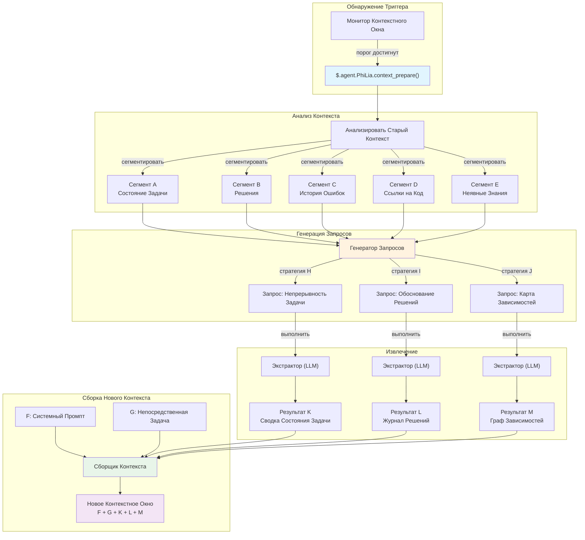
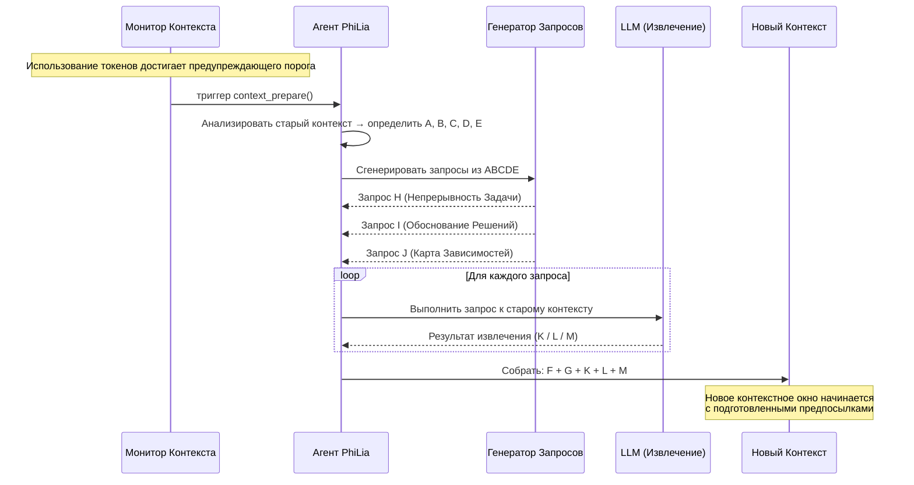

# Механизм Подготовки Контекста

## Обзор

Подготовка Контекста — это проактивный механизм извлечения, который заменяет традиционное сжатие контекста. Вместо сжатия старой истории разговора с потерями, он анализирует существующий контекст, генерирует целевые запросы и извлекает именно ту информацию, которая необходима для заполнения нового контекстного окна. Механизм принадлежит агенту PhiLia и предоставляется через `$.agent.PhiLia.context_prepare()`.

## Постановка Проблемы

### Ограничения Контекстного Окна

LLM-агенты работают в пределах конечных контекстных окон. Длительные задачи — многофайловый рефакторинг, сессии отладки на десятки сообщений или сложные многошаговые рабочие процессы — в конечном итоге исчерпывают доступный бюджет токенов. Когда это происходит, система должна решить, что сохранить, а что отбросить.

### Сжатие Теряет Детали

Традиционные подходы к сжатию контекста (суммаризация, усечение, скользящее окно) по своей природе являются потерями. Компрессор не знает, что понадобится *следующему* контексту, поэтому он должен угадывать. Критические детали неизбежно отбрасываются:

- Имена переменных и их текущие значения
- Промежуточные решения и их обоснование
- Состояния ошибок, которые появлялись и были частично разрешены
- Неявные зависимости между задачами

Фундаментальный недостаток: **сжатие оптимизирует краткость, а не релевантность**.

### Межзадачная Интерференция

Когда контекстное окно содержит несколько задач или тем, сжатие истории одной задачи часто искажает информацию, необходимую другой. Сводка, сохраняющая состояние Задачи A, может скрыть критическую цепочку ошибок Задачи B. Не существует универсальной стратегии сжатия, которая обслуживает все возможные будущие потребности.

### Настоящий Вопрос

> Что *следующему* контекстному окну нужно знать из *текущего* контекста?

Это не вопрос сжатия. Это вопрос **информационного поиска** — и ответ зависит от того, что будет дальше, а не от того, что было раньше.

## Основная Концепция

### Проактивное Извлечение против Сжатия

| Аспект | Сжатие | Подготовка Контекста |
| --- | --- | --- |
| Направление | Прошлое → более короткое прошлое | Прошлое → готовый к будущему экстракт |
| Знание будущего | Отсутствует | Запросы предвосхищают предстоящие потребности |
| Потеря информации | Неизбежная, нецелевая | Целевая, намеренная |
| Аналогия | Заархивировать файл | Поиск по базе данных |
| Потолок качества | Качество сводки | Точность извлечения |

Подготовка Контекста рассматривает старый контекст как **источник данных** — подобно тому, как RAG рассматривает внешний корпус документов — но корпусом является сам разговор. Вместо сжатия всего в сводку, он задаёт целевые вопросы старому контексту и собирает ответы.

### Модель ABCDE/KLM

Механизм использует буквенную нотацию для описания потока информации:

```text
Старый Контекст:  A + B + C + D + E
                     ↓ (анализ)
Запросы:        ABCDE+H  ABCDE+I  ABCDE+J
                     ↓ (извлечение)
Результаты:          K        L        M
                     ↓ (сборка)
Новый Контекст:  F + G + K + L + M
```

- **A–E**: Различные сегменты/аспекты старого контекста (состояние задачи, решения, история ошибок, ссылки на код, неявные знания)
- **H, I, J**: Стратегии запросов, полученные из анализа ключевых элементов A–E. Каждая стратегия нацелена на различную информационную потребность
- **K, L, M**: Результаты извлечения — точные ответы на каждый запрос
- **F, G**: Новый системный промпт и контекст непосредственной задачи для нового окна
- **Новый контекст** получает F + G (свежее) + K + L + M (извлечённое), пропуская полную историю A–E

### Почему Это Заменяет Сжатие

Как только существует Подготовка Контекста, традиционное сжатие становится ненужным, потому что:

1. **Информация не теряется из-за угадывания** — запросы генерируются на основе того, что новому контексту действительно понадобится
1. **Извлечение детерминировано по структуре** — одна и та же стратегия запроса всегда производит одну и ту же категорию ответа
1. **Множественные углы обеспечивают покрытие** — запросы H/I/J охватывают разные измерения (состояние задачи, контекст ошибок, обоснование решений)
1. **Старый контекст остаётся доступным** — он не отбрасывается, а *запрашивается по требованию* во время фазы подготовки

## Архитектура

### Высокоуровневый Поток



### Диаграмма Последовательности



## Дизайн API

### `$.agent.PhiLia.context_prepare()`

Основная точка входа. Вызывается, когда монитор контекстного окна обнаруживает, что использование токенов достигло предупреждающего порога.

```typescript
interface ContextPrepareRequest {
    old_context: string;
    current_task: string;
    warning_threshold: number;
    current_usage: number;
    max_tokens: number;
}

interface ContextPrepareResult {
    segments: ContextSegment[];
    queries: GeneratedQuery[];
    extractions: ExtractionResult[];
    prepared_context: string;
    metadata: {
        old_context_tokens: number;
        prepared_context_tokens: number;
        compression_ratio: number;
        queries_executed: number;
        extraction_time_ms: number;
    };
}

// Конечная точка API PhiLia
$.agent.PhiLia.context_prepare(request: ContextPrepareRequest): ContextPrepareResult
```

### `$.agent.PhiLia.context_query()`

API более низкого уровня для выполнения отдельных запросов к контексту. Используется внутренне `context_prepare()`, но также доступен для ad-hoc запросов.

```typescript
interface ContextQueryRequest {
    context: string;
    query: string;
    strategy: "task_continuity" | "decision_rationale" | "dependency_map" | "custom";
    max_result_tokens: number;
}

interface ContextQueryResult {
    result: string;
    confidence: number;
    source_segments: string[];
    tokens_used: number;
}

$.agent.PhiLia.context_query(request: ContextQueryRequest): ContextQueryResult
```

### `$.agent.PhiLia.context_segment()`

Анализирует контекст и разбивает его на помеченные сегменты (A–E).

```typescript
interface SegmentRequest {
    context: string;
    max_segments: number;
}

interface Segment {
    id: string;           // "A", "B", "C" и т.д.
    label: string;        // "Состояние Задачи", "Решения" и т.д.
    content: string;
    token_count: number;
    importance_rank: number;
}

$.agent.PhiLia.context_segment(request: SegmentRequest): Segment[]
```

## Стратегия Запросов

### Как Генерируются Запросы H/I/J

Процесс генерации запросов берёт сегментированный старый контекст (A–E) и производит три категории запросов, каждая из которых нацелена на различное измерение информации, необходимой новому контексту.

### Стратегия H: Непрерывность Задачи

**Цель**: Обеспечить, чтобы новый контекст мог возобновить текущую задачу без потери прогресса.

**Логика генерации**:

1. Определить активные задачи из сегментов A и E (состояние задачи + неявные знания)
1. Извлечь текущие индикаторы прогресса (что сделано, что в процессе, что заблокировано)
1. Сгенерировать запрос, который спрашивает: *"Каково текущее состояние всех активных задач и каковы следующие шаги?"*

**Пример запроса**:

```text
Учитывая историю разговора, определите:
1. Все задачи, находящиеся в процессе, и их статус завершения
2. Любые блокирующие факторы или неразрешённые ошибки
3. Точный следующий шаг, который должен был быть предпринят
4. Пути к файлам и номера строк, которые в настоящее время изменяются
```

### Стратегия I: Обоснование Решений

**Цель**: Сохранить *почему* за решениями, а не только *что*.

**Логика генерации**:

1. Сканировать сегменты B и C (решения + история ошибок) на точки выбора
1. Определить решения, где альтернативы рассматривались и были отклонены
1. Сгенерировать запрос, который спрашивает: *"Какие решения были приняты, какие альтернативы были отклонены и почему?"*

**Пример запроса**:

```text
Из этого разговора извлеките:
1. Все принятые архитектурные или реализационные решения
2. Для каждого решения: какие альтернативы рассматривались
3. Для каждого решения: конкретная причина, по которой выбранный подход был предпочтён
4. Любые ограничения или требования, повлиявшие на этот выбор
```

### Стратегия J: Карта Зависимостей

**Цель**: Захватить отношения между элементами кода, файлами и концепциями.

**Логика генерации**:

1. Сканировать сегменты D и E (ссылки на код + неявные знания) на отношения сущностей
1. Сопоставить, какие файлы зависят от каких, какие функции вызывают какие, какие концепции связаны
1. Сгенерировать запрос, который спрашивает: *"Каковы ключевые зависимости и отношения между обсуждаемыми сущностями?"*

**Пример запроса**:

```text
Проанализируйте разговор и составьте карту:
1. Все упомянутые файлы/модули и их отношения
2. Обсуждаемые или изменяемые цепочки вызовов функций
3. Поток данных между компонентами
4. Значения конфигурации и где они используются
5. Любые неявные зависимости, не указанные прямо, но подразумеваемые работой
```

### Расширяемость

Три стратегии (H, I, J) являются набором по умолчанию. Система поддерживает пользовательские стратегии:

```typescript
interface QueryStrategy {
    id: string;
    name: string;
    description: string;
    source_segments: string[];     // какие сегменты анализировать
    query_template: string;        // шаблон с плейсхолдерами {segment_X}
    priority: number;              // приоритет выполнения
    max_result_tokens: number;
}
```

Новые стратегии могут быть зарегистрированы через конфигурацию, позволяя доменно-специфичные шаблоны извлечения.

## Точки Интеграции

### Монитор Контекстного Окна

Триггер для Подготовки Контекста находится в подсистеме мониторинга контекстного окна. Когда использование токенов пересекает предупреждающий порог (по умолчанию: 80% от максимума), монитор вызывает `$.agent.PhiLia.context_prepare()`.

```rust
// В мониторе контекстного окна (концептуально)
fn check_context_health(&mut self) {
    let usage_ratio = self.current_tokens as f64 / self.max_tokens as f64;
    if usage_ratio >= self.warning_threshold {
        let result = philia.context_prepare(ContextPrepareRequest {
            old_context: self.get_full_context(),
            current_task: self.get_current_task_description(),
            warning_threshold: self.warning_threshold,
            current_usage: self.current_tokens,
            max_tokens: self.max_tokens,
        });
        self.spawn_new_context(result.prepared_context);
    }
}
```

### Интеграция с skill_chain.rs

Исполнитель цепочки навыков должен быть осведомлён о подготовке контекста. Когда цепочка навыков охватывает несколько контекстных окон, механизм подготовки гарантирует, что:

1. Состояние цепочки навыков захватывается в сегменте A (состояние задачи)
1. Ввод/вывод текущего навыка захватывается в сегменте D (ссылки на код)
1. Оставшиеся шаги цепочки сохраняются в результате извлечения K (непрерывность задачи)

```rust
// skill_chain.rs (концептуальная интеграция)
impl SkillChainExecutor {
    fn execute_step(&mut self, step: ChainStep) -> Result<StepResult> {
        // Перед выполнением проверить, нужна ли подготовка контекста
        if self.context_monitor.should_prepare() {
            let prepared = self.philia.context_prepare(
                self.build_prepare_request()
            )?;
            self.context = prepared.prepared_context;
        }
        // Продолжить выполнение шага
        self.execute_with_context(step, &self.context)
    }
}
```

### Владение Агентом PhiLia

Подготовка Контекста — это возможность, принадлежащая PhiLia. Это означает:

- API `$.agent.PhiLia.context_prepare()` зарегистрирован как навык PhiLia
- PhiLia управляет шаблонами генерации запросов и стратегиями извлечения
- Другие агенты запрашивают подготовку контекста через PhiLia по стандартному протоколу вызова навыков
- PhiLia может использовать своё хранилище знаний для обогащения запросов историческими шаблонами

### Порождение Контекста

Когда система порождает новое контекстное окно, подготовленный контекст (F + G + K + L + M) заменяет традиционную сжатую сводку:

```rust
fn spawn_new_context(&mut self, prepared: ContextPrepareResult) {
    let system_prompt = self.build_system_prompt();      // F
    let immediate_task = self.get_current_task();         // G
    let new_context = format!(
        "{}\n\n{}\n\n---\n## Результаты Подготовки Контекста\n### Состояние Задачи\n{}\n### Журнал Решений\n{}\n### Зависимости\n{}\n",
        system_prompt,    // F
        immediate_task,   // G
        prepared.extractions[0].result,  // K
        prepared.extractions[1].result,  // L
        prepared.extractions[2].result,  // M
    );
    self.launch_context(new_context);
}
```

## Фазы Реализации

### Фаза 1: Основа (MVP)

- Реализовать `$.agent.PhiLia.context_segment()` — анализ и сегментация контекста
- Реализовать три стратегии запросов по умолчанию (H: непрерывность задачи, I: обоснование решений, J: карта зависимостей)
- Реализовать `$.agent.PhiLia.context_prepare()` — оркестровка сегмент → запрос → извлечение → сборка
- Интегрировать с триггером монитора контекстного окна
- Проверить на одно-задачных разговорах

### Фаза 2: Надёжность

- Добавить оценку уверенности к результатам извлечения
- Реализовать резервные стратегии, когда уверенность извлечения низкая
- Добавить поддержку потоковой передачи для больших контекстов
- Оптимизация производительности: параллельное выполнение запросов
- Добавить `$.agent.PhiLia.context_query()` для ad-hoc запросов

### Фаза 3: Интеллект

- Изучать оптимальные стратегии запросов из исторических результатов подготовки
- Адаптивное взвешивание сегментов на основе типа задачи
- Разрешение межконтекстных ссылок (связывание результатов подготовки через несколько порождений)
- Интеграция с осаждением памяти для долгосрочного сохранения

### Фаза 4: Полная Замена

- Удалить унаследованный путь сжатия контекста
- Подготовка Контекста становится единственным механизмом для переходов контекста
- Полная телеметрия и метрики качества
- Документация и руководство по миграции для пользовательских агентов

## Примеры

### Пример 1: Многофайловый Рефакторинг

**Сценарий**: Агент рефакторит крейт Rust, изменяя 15 файлов в 3 модулях. Контекстное окно заполняется после изменения файла 10.

**Старый контекст (A–E)**:

- **A** (Состояние Задачи): 10/15 файлов изменено, модули `auth` и `storage` завершены, `api` в процессе
- **B** (Решения): Выбрана абстракция на основе трейтов вместо enum dispatch; сохранена обратная совместимость через `#[deprecated]`
- **C** (Ошибки): Возникла проблема времени жизни в `storage/mod.rs:142`, разрешена с `Arc<Mutex<>>`
- **D** (Ссылки на Код): `auth/traits.rs`, `storage/mod.rs:142`, `api/handler.rs:38-56`
- **E** (Неявное): Структура `User` должна оставаться `Clone` для downstream крейтов; покрытие тестами отслеживается

**Сгенерированные запросы**:

- **H** (Непрерывность Задачи): "Какие файлы осталось изменить, какой шаблон применяется и какой следующий файл рефакторить?"
- **I** (Обоснование Решений): "Почему выбрана абстракция на основе трейтов вместо enum dispatch и какие ограничения обратной совместимости существуют?"
- **J** (Карта Зависимостей): "Составьте карту зависимостей между модулями `auth`, `storage` и `api`, отметив, какие структуры/трейты пересекают границы модулей."

**Результаты извлечения (K, L, M)** собираются с новым системным промптом (F) и инструкцией следующей задачи (G).

### Пример 2: Сессия Отладки

**Сценарий**: Отладка проблемы соединения WebSocket, охватывающая несколько гипотез и попыток тестирования.

**Старый контекст (A–E)**:

- **A** (Состояние Задачи): Проблема сужена до фазы рукопожатия; heartbeat не является причиной
- **B** (Решения): Исключена неправильная конфигурация TLS; исключено вмешательство прокси; текущая гипотеза — порядок заголовков
- **C** (Ошибки): `ConnectionReset` на отметке 3с, воспроизводится стабильно с curl, но не с браузером
- **D** (Ссылки на Код): `ws/handshake.rs:67-89`, `headers/mod.rs:23`, тестовый файл `tests/ws_test.rs`
- **E** (Неявное): Сервер находится за nginx; проблема проявляется только в production, не в локальной разработке

**Сгенерированные запросы** извлекают состояние отладки, отклонённые гипотезы и оставшиеся пути исследования в новый контекст.

### Пример 3: Межагентная Цепочка Навыков

**Сценарий**: PhiLia делегирует цепочку задач Skemma (дизайн схемы), затем Logos (документация). Контекст заполняется во время работы Logos.

**Старый контекст (A–E)**:

- **A** (Состояние Задачи): Дизайн схемы завершён, документация на 60%
- **B** (Решения): Схема использует таблицы соединений для отношений M:N согласно архитектурному руководству PhiLia
- **C** (Ошибки): Skemma сообщила о неоднозначности в кардинальности `user_roles`, разрешено добавлением ограничения `UNIQUE`
- **D** (Ссылки на Код): `schema.sql:45-67`, `docs/api/endpoints.md:12-34`
- **E** (Неявное): Документация должна соответствовать формату спецификации OpenAPI 3.0, используемому в остальной части проекта

Подготовка гарантирует, что новый контекст Logos получает решения по схеме и ограничение формата документации без необходимости полного разговора о дизайне Skemma.
