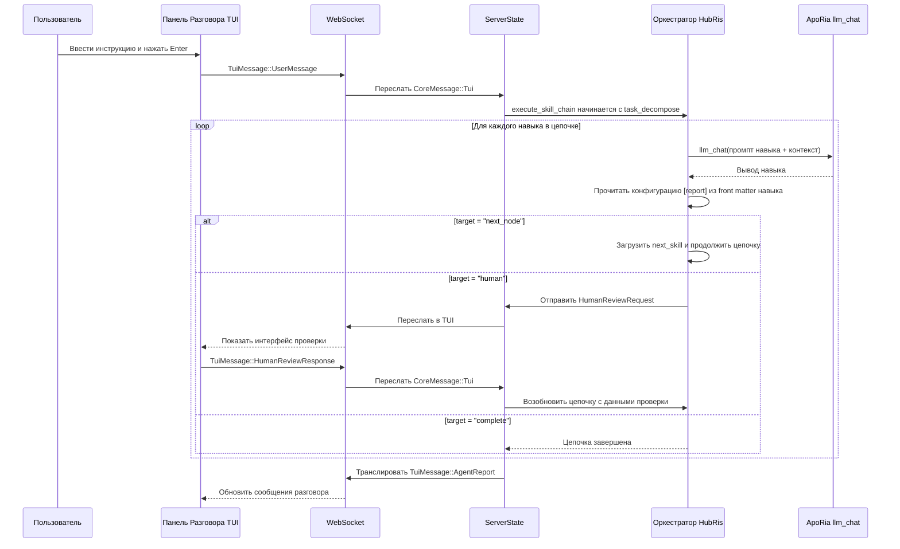

# Проект Оркестровки Разговоров (HubRis + ApoRia)

## Предыстория

HubRis — это «Агент Чистого Навыка» — все возможности являются навыками на основе промптов,
вызываемыми через ApoRia `llm_chat`. После реализации слоя маршрутизации отчётов
навыки объявляют своё поведение маршрутизации в front matter TOML через
секцию `[report]`, заменяя жёстко закодированную логику оркестровки.

## Цели

1. Навыки объявляют поведение маршрутизации в front matter (не жёстко закодировано).
1. Универсальный исполнитель цепочки навыков заменяет жёстко закодированный 2-этапный конвейер.
1. Человеческая проверка является первоклассной целью маршрутизации.
1. Очистка языка промптов: плоские файлы навыков/MCP только на английском.

## Конфигурация Отчёта Навыка (TOML Front Matter)

```toml
[report]
target = "next_node"              # "next_node" | "parent" | "human" | "complete"
next_skill = "workplan_generate"  # требуется, если target = "next_node"
```

## Цепочка Навыков HubRis

```text
task_decompose → workplan_generate → operator → workplan_execute → submit_report → human
```

## Сквозной Поток



## Цели Маршрутизации Отчётов

| Цель         | Поведение                                                        |
| --- | --- |
| `next_node`  | Исполнитель загружает навык, указанный в `next_skill`, и запускает его.     |
| `parent`     | Возвращает управление родительскому оркестратору (зарезервировано для вложенных цепочек). |
| `human`      | Приостанавливает цепочку, отправляет `HumanReviewRequest` в TUI, возобновляет по `HumanReviewResponse`. |
| `complete`   | Завершает цепочку и возвращает накопленный `AgentReport`.  |

## Структура Файлов (Фаза 1)

```text
res/prompts/agents/hubris/skills/
  task_decompose.md
  workplan_generate.md
  operator.md
  workplan_execute.md
  submit_report.md
```

Каждый файл является плоским документом Markdown, только на английском, с front matter TOML,
содержащим секцию `[report]` и любые другие метаданные навыка.

## Конфигурация Человеческого Языка

Конфигурация времени выполнения агента включает поле `human_language`, использующее нативные названия
языков (например, `"中文"`, `"English"`, `"日本語"`). Это управляет языком
всего вывода, обращённого к пользователю, не затрагивая файлы промптов навыков только на английском.

## Политика Модели по Умолчанию

При запуске используется `glm-4.7-flash` как нормализованная модель по умолчанию для окружения.
ApoRia `llm_chat` использует эту модель по умолчанию для снижения затрат на разработку
и тестирование.

## Политика Отказоустойчивости

1. Если навык завершается сбоем: вернуть сообщение об ошибке и завершить текущую цепочку.
1. Если ApoRia не в сети: вернуть сообщение `Агент не готов`.
1. Если проверка человеком истекает по времени: вернуть уведомление о таймауте без блокировки

последующих чатов.
