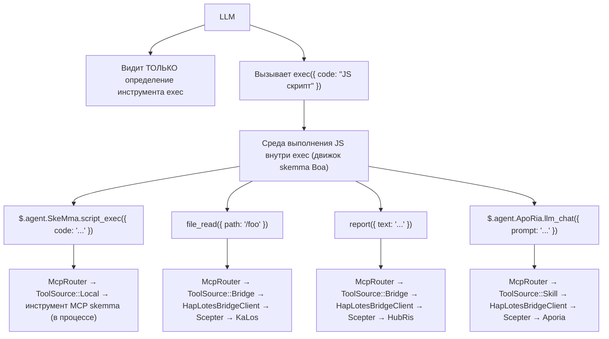
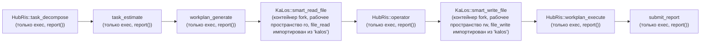
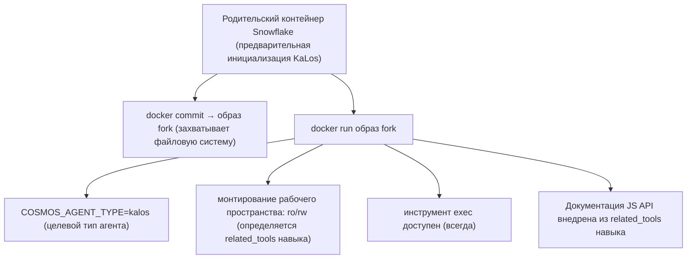

# Архитектура Межагентной Маршрутизации Навыков

## Проблема

Цепочка навыков (`execute_skill_chain`) использует архитектуру микроядра только для выполнения. LLM видит только три инструмента: `exec`, `write_to_var`, `write_to_var_json` — без белых списков инструментов на агента, без определений инструментов на навык. Все вызовы инструментов MCP происходят внутри среды выполнения TypeScript (движок IEPL) через импорты ES модулей и межагентные TS API, такие как `file_read()`.

## Принципы Проектирования

1. **Микроядро только для выполнения** — LLM никогда не получает определения инструментов MCP напрямую. У него есть три инструмента: `exec`, `write_to_var` и `write_to_var_json`. Все вызовы инструментов происходят внутри среды выполнения TS движка IEPL.
1. **`related_tools` управляют всем** — Навыки объявляют `related_tools` в своём frontmatter TOML. Эти имена становятся документацией TS API, внедряемой в промпт LLM (например, `file_read()`, `report()`).
1. **Маршрутизация через TS API → McpRouter** — Внутри среды выполнения IEPL `exec`, импорты ES модулей маршрутизируются к правильной реализации инструмента MCP через `McpRouter`. Межагентные вызовы, такие как `file_read()`, разрешаются в реализацию `file_read` агента KaLos.
1. **Изоляция контейнеров** — Дочерние контейнеры наследуют родительскую файловую систему через `docker commit` fork. Рабочие пространства монтируются только для чтения или чтения-записи в зависимости от `related_tools` навыка.
1. **`related_tools` определяют режим чтения/записи** — `skill_needs_write_access()` проверяет `related_tools` на имена инструментов записи (`file_write`, `file_edit` и т.д.), чтобы решить режим монтирования контейнера fork.

## Архитектура

### Поток Микроядра Только для Выполнения



### Поток Выполнения Цепочки Навыков



### Механизм Fork Контейнера



## Детали Реализации

### Основные Компоненты

| Компонент | Файл | Ответственность |
| --- | --- | --- |
| `skill_to_agent_name()` | `skill_chain.rs` | Ищет имя агента, владеющего данным навыком |
| `skill_needs_write_access()` | `skill_chain.rs` | Проверяет `related_tools` на имена инструментов записи для определения режима монтирования контейнера fork |
| `fork_for_sub_skill()` | `snowflake_manager.rs` | Выполняет `docker commit` + `docker run`; монтирует рабочее пространство как ro/rw на основе `skill_needs_write_access()` |
| `find_by_agent_type()` | `snowflake_manager.rs` | Ищет в обратном порядке, возвращая самый последний контейнер fork |
| `McpRouter` | `packages/cosmos/src/bin/cosmos/mcp_router.rs` | Маршрутизирует вызовы импорта ES модулей: `ToolSource::Local` → skemma, `ToolSource::Bridge` → HapLotes |
| `HapLotesBridgeClient` | `packages/agents/haplotes/src/bridge/client.rs` | Мост Cosmos → Scepter: `bridge_call()`, `bridge_list_tools()` |
| `BridgeInvoker` | `packages/scepter/src/agent_manager/bridge_invoker.rs` | Сторона Scepter: маршрутизирует вызовы инструментов к правильному зарегистрированному агенту |
| `build_js_api_docs()` | `skill_chain.rs` | Генерирует документацию JS API из `related_tools` навыка для внедрения в промпт |
| `build_skill_user_prompt(имя_агента, ...)` | `skill_chain.rs` | Собирает промпт навыка с внедрённой документацией JS API |

### Как Генерируется Документация JS API

Frontmatter TOML навыка объявляет `related_tools`:

```toml
# smart_read_file.md
related_tools = ["file_read", "file_list", "file_exists"]
```

Система разрешает каждый инструмент к его владеющему агенту и генерирует документацию TS API из объявлений `.d.ts`:

```typescript
// Внедряется в промпт LLM как доступные API (с объявлениями типов из .d.ts):
file_read({ path: string }): Promise<string>
file_list({ dir: string }): Promise<string[]>
file_exists({ path: string }): Promise<boolean>
report({ text: string }): Promise<void>
```

LLM вызывает эти API внутри своего кода `exec`; McpRouter диспетчеризует к реализации инструмента MCP правильного агента.

### Жизненный Цикл Fork

1. **Создать**: `docker commit` родительский контейнер → образ fork → `docker run` дочерний контейнер
1. **Подключить**: `CosmosConnector` подключается к Unix-сокету дочернего контейнера
1. **Мост**: `HapLotesBridgeClient` внутри контейнера fork подключается к `HapLotesBridgeServer` Scepter
1. **Выполнить**: LLM вызывает `exec` с JS-кодом; среда выполнения JS использует McpRouter → мост → агенты Scepter
1. **Очистка**: Когда цепочка заканчивается, `snowflake.remove()` уничтожает контейнер + `docker rmi` очищает образ

### Стратегия Монтирования Рабочего Пространства

| Тип навыка | Характеристика `related_tools` | Монтирование рабочего пространства |
| --- | --- | --- |
| Только чтение (smart_read_file) | Только file_read, file_list, file_exists | `:ro` (только чтение) |
| Запись (smart_write_file) | Включает file_write, file_edit, file_delete | `:rw` (чтение-запись) |

### Межагентная Маршрутизация Инструментов

Внутри среды выполнения JS `exec`, McpRouter разрешает вызовы инструментов через мост HapLotes:

```mermaid
flowchart TB
    subgraph Bridge["Вызов через Мост"]
        A1["exec({ code: &quot;file_read({path:'/foo'})&quot; })"] --> B1["McpRouter разрешает &quot;kalos&quot; + &quot;file_read&quot;"]
        B1 --> C1["tool_to_source → ToolSource::Bridge"]
        C1 --> D1["HapLotesBridgeClient → bridge.call(&quot;kalos.file_read&quot;, params)"]
        D1 --> E1["HapLotesBridgeServer Scepter → BridgeInvoker"]
        E1 --> F1["маршрутизирует к агенту KaLos → инструмент MCP file_read"]
    end
    subgraph Local["Локальный Вызов"]
        A2["exec({ code: &quot;$.agent.SkeMma.script_exec({code:'1+1'})&quot; })"] --> B2["McpRouter разрешает &quot;skemma&quot; + &quot;script_exec&quot;"]
        B2 --> C2["tool_to_source → ToolSource::Local"]
        C2 --> D2["вызывает инструмент MCP skemma напрямую (движок Boa в процессе)"]
    end
```



### Обнаружение Доступа на Запись

```rust
fn skill_needs_write_access(skill: &Skill) -> bool {
    const WRITE_TOOLS: &[&str] = &["file_write", "file_edit", "file_delete", "file_rename"];
    skill.related_tools.iter().any(|t| WRITE_TOOLS.contains(&t.as_str()))
}
```

Эта функция читает `related_tools` навыка из его frontmatter TOML. Если присутствует любой инструмент записи, рабочее пространство контейнера fork монтируется для чтения-записи.

## Конфигурация

### Frontmatter TOML Навыка

```toml
# smart_read_file.md
+++
related_tools = ["file_read", "file_list", "file_exists"]

[[next_action]]
agent = "hubris"
name = "operator"
+++

# smart_write_file.md
+++
related_tools = ["file_write", "file_edit"]

[[next_action]]
agent = "hubris"
name = "workplan_execute"
+++
```

### Цепочка next_action (TOML навыка)

```toml
# workplan_generate.md
[[next_action]]
agent = "kalos"
name = "smart_read_file"

# smart_read_file.md
[[next_action]]
agent = "hubris"
name = "operator"

# operator.md
[[next_action]]
agent = "kalos"
name = "smart_write_file"

# smart_write_file.md
[[next_action]]
agent = "hubris"
name = "workplan_execute"
```

## Справочник JS API Навыков

| Навык | Агент | JS API (из `related_tools`) | Статус |
| --- | --- | --- | --- |
| `smart_read_file` | KaLos | `file_read()`, `file_list()`, `file_exists()` | ✅ Реализовано |
| `smart_write_file` | KaLos | `file_write()`, `file_edit()` | ✅ Реализовано |
| `exec_script` | SkeMma | `$skeMma.script_exec()` | Ожидается |
| `smart_command` | SkoPeo | `$skoPeo.smart_command_execute()` | Ожидается |

## Риски и Соображения

1. **Ресурсы контейнеров** — Каждый fork создаёт новый контейнер Docker; контейнеры автоматически очищаются при завершении цепочки.
1. **Стоимость токенов** — Каждый fork имеет свой независимый контекст LLM; документация JS API добавляет скромные накладные расходы на навык.
1. **Глубина цепочки fork** — В настоящее время нет ограничения глубины; fork происходят только когда `step_index > 1`.
1. **Передача контекста** — Родитель → потомок передаётся через содержимое отчёта; могут потребоваться стратегии усечения.
1. **Параллельная безопасность** — Когда несколько цепочек одновременно форкают один и тот же тип агента, поиск в обратном порядке гарантирует, что каждый использует свой последний fork.
1. **Контроль поверхности API** — LLM может вызывать только JS API, перечисленные во внедрённой документации; McpRouter отклоняет неизвестные имена инструментов.
