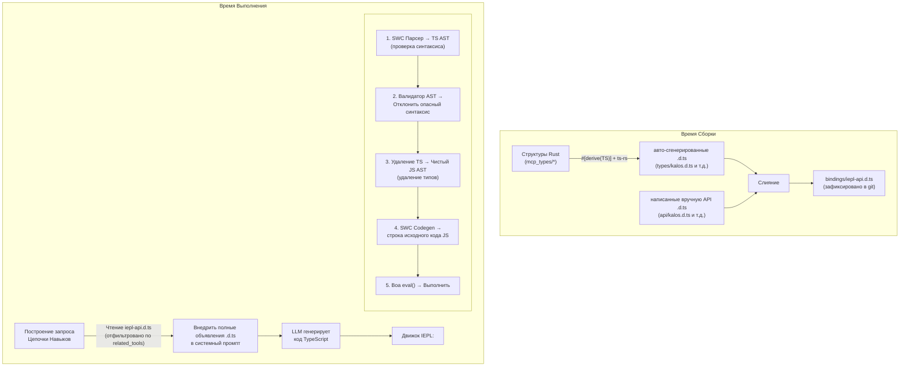
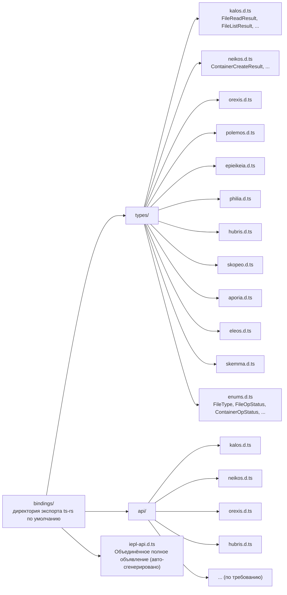
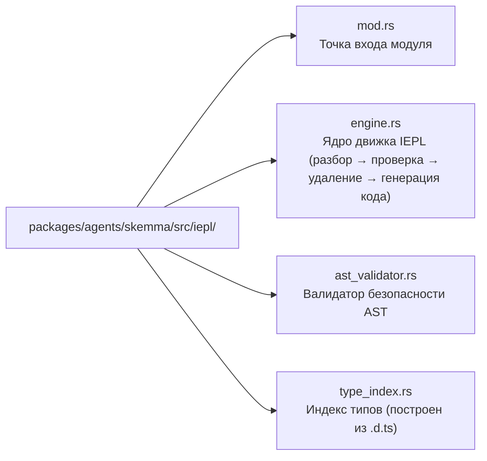

# 22 — Проект Движка Выполнения IEPL TypeScript

## Обзор

IEPL (In-Execution Prompt Language) Движок Выполнения — это архитектурное обновление существующей среды выполнения Cosmos/SkeMma JS, повышающее код выполнения, сгенерированный LLM, с JavaScript до TypeScript. Основные изменения включают:

1. **Встроенный крейт SWC**: Строгая проверка синтаксиса, удаление типов и транспиляция TypeScript, сгенерированного LLM
1. **Rust derive → генерация типов TypeScript**: Авто-экспорт структур Rust в файлы объявлений `.d.ts` через `ts-rs`
1. **Типобезопасный Промпт Навыка**: Внедрение полных объявлений `.d.ts` вместо жёстко закодированных списков функций, значительно повышая надёжность

## Текущее Состояние и Проблемы

### Текущий Поток Выполнения


### Существующие Проблемы

| Проблема | Описание |
| --- | --- |
| **Нет ограничений типов** | Сгенерированный LLM JS-код имеет нулевую статическую информацию о типах; опечатки параметров обнаруживаются только во время выполнения |
| **Хрупкие описания интерфейсов** | `build_report_tool_instruction()` жёстко кодирует текстовые списки, такие как `- file_read (импортирован из 'kalos')`, неспособные выразить типы параметров или структуры возвращаемых значений |
| **Нет предварительной проверки** | Код LLM напрямую поступает в Boa `eval()`; синтаксические ошибки обнаруживаются только во время выполнения |
| **Схема и промпт разъединены** | `McpSchemaWriter` генерирует файлы схем JSON, но они никогда не используются для внедрения в промпт |
| **Параметры инструментов нетипизированы** | Текущие параметры инструментов передаются как `serde_json::Value`, извлекаются вручную через `get("field")`, без гарантий типобезопасности |

### Задействованные Ключевые Файлы

| Файл | Текущая Ответственность |
| --- | --- |
| `packages/agents/skemma/src/js_runtime/runtime.rs` | Среда выполнения Boa JS, `exec()` напрямую вызывает `eval()` |
| `packages/agents/skemma/src/mcp/tools/script_exec.rs` | Принимает только язык `"javascript"` |
| `packages/cosmos/src/bin/cosmos/js_repl/js_commands.rs` | Динамически генерирует `globalThis.$agent.tool = (...) => ...` |
| `packages/scepter/src/state_machine/skill_chain/prompt.rs:51` | `build_report_tool_instruction()` жёстко кодирует список API |
| `packages/shared/src/mcp_types/*.rs` | Все определения типов результатов инструментов MCP (только serde, без экспорта TS) |
| `packages/shared/src/mcp_types/schema.rs` | `McpSchemaWriter` генерирует схему JSON (не используется промптом) |

## Целевая Архитектура



## Выбор Технологии

### 1. Rust → Генерация Типов TypeScript: `ts-rs`

| Атрибут | Значение |
| --- | --- |
| Крейт | `ts-rs` (Aleph-Alpha/ts-rs) |
| Версия | ≥ 12.0 |
| Звёзды | 1,772 |
| Загрузки | ~7.3M |
| Лицензия | MIT |

**Обоснование:**

- Глубоко совместим с существующей экосистемой `serde` проекта (функция `serde-compat` автоматически распознаёт `rename`/`rename_all`/`skip` и т.д.)
- `#[derive(TS)]` неинтрузивен, не изменяет существующие определения структур
- Поддерживает `#[ts(export)]` для авто-экспорта в директорию `bindings/` во время `cargo test`
- Генерирует стандартные псевдонимы `type` TypeScript, напрямую используемые в `.d.ts`
- Поддерживает межфайловые импорты, обобщения, типы объединения
- Богатая интеграция с экосистемой: `chrono-impl`, `uuid-impl`, `serde-json-impl`

**Исключённые Альтернативы:**

| Крейт | Причина Исключения |
| --- | --- |
| `specta` | Склонён к экосистеме Tauri/rspc; экспорт типов функций не нужен в этом сценарии |
| `typeshare` | Управляется через CLI, неудобен для интеграции CI; генерирует `interface` вместо `type` (нет практической разницы для промптов LLM) |
| `tsify` | Привязан к `wasm-bindgen`; этот проект не является рабочим процессом WASM |

### 2. Парсинг и Транспиляция TypeScript: SWC

| Крейт | Назначение |
| --- | --- |
| `swc_core` (функция: `ecma_parser`) | Разбор исходного кода TS в AST |
| `swc_core` (функция: `ecma_ast`) | Типы узлов AST |
| `swc_core` (функция: `ecma_visit`) | Обход/трансформация AST |
| `swc_core` (функция: `ecma_transforms_typescript`) | TS → JS удаление типов |
| `swc_core` (функция: `ecma_codegen`) | AST → генерация исходного кода |

**Ключевые Возможности:**

- Полная поддержка синтаксиса TypeScript (обобщения, условные типы, mapped типы, декораторы и т.д.)
- Высокопроизводительная нативная реализация на Rust (в 20–70 раз быстрее tsc)
- Удаление типов (`strip`) преобразует TS AST в JS AST
- Отчётность об ошибках на уровне синтаксиса (незакрытые скобки, недопустимые токены и т.д.)

**Ограничения:**

- SWC **не выполняет полную проверку типов** (нет эквивалента `tsc --noEmit`). Это означает, что он не может обнаружить семантические ошибки, такие как "вызов несуществующего свойства"
- Для данного сценария это приемлемо: код, сгенерированный LLM, в первую очередь нуждается в гарантиях синтаксической корректности; движок Boa обеспечивает динамическую типобезопасность во время выполнения
- Если в будущем потребуется полная проверка типов, можно ввести пользовательскую проверку на уровне AST (см. "Валидатор AST" ниже)

## Детальный Проект

### Фаза 1: Инфраструктура Экспорта Типов ts-rs

#### 1.1 Новая Зависимость Рабочего Пространства

```toml
# Cargo.toml (workspace)
[workspace.dependencies]
ts-rs = { version = "12", features = ["serde-compat", "format"] }
```

#### 1.2 Добавить `#[derive(TS)]` к Типам MCP

Все структуры в `packages/shared/src/mcp_types/` получают derive `ts-rs`:

```rust
// packages/shared/src/mcp_types/kalos.rs
use ts_rs::TS;

# [derive(Debug, Clone, Serialize, Deserialize, TS)]
# [ts(export)]
pub struct FileReadResult {
    pub path: String,
    pub size_bytes: u64,
    pub content: String,
}

# [derive(Debug, Clone, Serialize, Deserialize, TS)]
# [ts(export)]
pub struct FileListResult {
    pub path: String,
    pub total_count: usize,
    pub entries: Vec<FileEntry>,
}

// ... другие типы аналогично
```

Перечислениям нужна адаптация макроса `str_enum!`:

```rust
// packages/shared/src/mcp_types/enums.rs
// Существующие перечисления, сгенерированные макросом str_enum!, нуждаются в дополнительном derive TS

# [derive(Debug, Clone, Copy, PartialEq, Eq, Serialize, Deserialize, TS)]
pub enum FileType {
    File,
    Directory,
}
// Примечание: макрос str_enum! нужно расширить для также derive TS
// или индивидуально добавить #[derive(TS)] к существующим перечислениям, сгенерированным макросом
```

#### 1.3 Структура Файлов `.d.ts`



#### 1.4 Пример Написанного Вручную `.d.ts` API

```typescript
// bindings/api/kalos.d.ts

import type {
  FileReadResult,
  FileListResult,
  FileWriteResult,
  FileEditResult,
  FileDeleteResult,
  FileExistsResult,
  MkDirResult,
  FileInfoResult,
} from "../types/kalos";

export interface KalosApi {
  /**
   * Прочитать содержимое файла
   * @param params.path - Путь к файлу (абсолютный путь)
   */
  file_read(params: { path: string }): Promise<FileReadResult>;

  /**
   * Записать в файл
   * @param params.path - Путь к файлу
   * @param params.content - Содержимое файла
   */
  file_write(params: { path: string; content: string }): Promise<FileWriteResult>;

  /**
   * Редактировать файл (найти и заменить)
   * @param params.path - Путь к файлу
   * @param params.old_string - Исходная строка для замены
   * @param params.new_string - Строка замены
   */
  file_edit(params: {
    path: string;
    old_string: string;
    new_string: string;
  }): Promise<FileEditResult>;

  file_delete(params: { path: string }): Promise<FileDeleteResult>;
  file_exists(params: { path: string }): Promise<FileExistsResult>;
  file_list(params: { path: string }): Promise<FileListResult>;
  file_get_info(params: { path: string }): Promise<FileInfoResult>;
  file_create_dir(params: { path: string }): Promise<MkDirResult>;
}
```

#### 1.5 Скрипт Слияния во Время Сборки

В `packages/shared/build.rs` или отдельном `xtask`:

```rust
// xtask/src/bin/iepl_codegen.rs
// 1. Запустить cargo test для запуска экспорта ts-rs
// 2. Прочитать bindings/types/*.d.ts + bindings/api/*.d.ts
// 3. Сгруппировать и объединить по агенту, сгенерировать финальный iepl-api.d.ts
// 4. Вывести в bindings/iepl-api.d.ts
```

Или проще, добавить модуль `iepl_codegen` в `packages/shared/src/mcp_types/`, который запускает экспорт и слияние во время тестов.

**Ключевой принцип: После генерации файлы `.d.ts` фиксируются в git и становятся постоянной частью дерева исходного кода.** Последующие изменения типов Rust регенерируют и фиксируют обновления.

### Фаза 2: Движок Выполнения IEPL

#### 2.1 Новые Зависимости SWC

```toml
# Cargo.toml (workspace)
[workspace.dependencies]
swc_core = { version = "65", features = [
    "ecma_parser",
    "ecma_ast",
    "ecma_visit",
    "ecma_transforms_base",
    "ecma_transforms_typescript",
    "ecma_codegen",
    "common",
] }
```

#### 2.2 Ядро Движка IEPL

Новый модуль `iepl/` в `packages/agents/skemma/src/`:



##### engine.rs — Основной Поток Транспиляции

```rust
use anyhow::{anyhow, Result};
use swc_core::{
    common::{errors::ColorConfig, SourceFile, SourceMap, GLOBALS},
    ecma::{
        ast::Program,
        codegen::{text_writer::JsWriter, Emitter},
        parser::{lexer::Lexer, Parser, StringInput, Syntax, TsSyntax},
        transforms::{
            base::fixer::fixer,
            typescript::strip,
        },
        visit::FoldWith,
    },
};

pub struct IeplEngine {
    cm: Arc<SourceMap>,
}

pub struct TranspileResult {
    pub js_code: String,
    pub parse_errors: Vec<String>,
}

impl IeplEngine {
    pub fn new() -> Self {
        Self {
            cm: Arc::new(SourceMap::default()),
        }
    }

    /// Транспилировать код TypeScript в JavaScript
    pub fn transpile(&self, ts_code: &str) -> Result<TranspileResult> {
        let fm = self.cm.new_source_file(
            swc_core::common::FileName::Custom("iepl-input".into()),
            ts_code.into(),
        );

        // 1. Разбор TS → AST
        let mut parse_errors = Vec::new();
        let module = self.parse_ts(&fm, &mut parse_errors)?;

        if !parse_errors.is_empty() {
            return Err(anyhow!("Ошибки разбора TypeScript:\n{}", parse_errors.join("\n")));
        }

        // 2. Проверка безопасности AST
        let validator = AstValidator::new();
        validator.validate(&module)?;

        // 3. Удаление типов TS → JS
        let mut transforms = swc_core::common::pass::Optional::new(
            strip::strip_typescript(swc_core::common::comments::NoComments),
            true,
        );
        let program = module.fold_with(&mut transforms);

        // 4. AST → исходный код JS
        let js_code = self.emit(program)?;

        Ok(TranspileResult {
            js_code,
            parse_errors,
        })
    }

    fn parse_ts(
        &self,
        fm: &SourceFile,
        errors: &mut Vec<String>,
    ) -> Result<Program> {
        let lexer = Lexer::new(
            Syntax::Typescript(TsSyntax {
                tsx: false,
                decorators: true,
                dts: false,
                no_early_errors: false,
                disallowAmbiguousJSXLike: true,
            }),
            Default::default(),
            StringInput::from(fm),
            None,
        );
        let mut parser = Parser::new_from(lexer);
        match parser.parse_program() {
            Ok(program) => Ok(program),
            Err(e) => {
                errors.push(format!("{:?}", e));
                Err(anyhow!("Не удалось разобрать TypeScript"))
            }
        }
    }

    fn emit(&self, program: Program) -> Result<String> {
        let mut buf = Vec::new();
        let writer = JsWriter::new(self.cm.clone(), "\n", &mut buf, None);
        let mut emitter = Emitter {
            cfg: Default::default(),
            cm: self.cm.clone(),
            comments: None,
            wr: writer,
        };
        emitter.emit_program(&program)?;
        Ok(String::from_utf8(buf)?)
    }
}
```

##### ast_validator.rs — Валидатор Безопасности

```rust
use anyhow::{anyhow, Result};
use swc_core::ecma::ast::{Module, Program};
use swc_core::ecma::visit::{Visit, VisitWith};

/// Проверяет, что AST не содержит опасных шаблонов
pub struct AstValidator {
    violations: Vec<String>,
}

impl AstValidator {
    pub fn new() -> Self {
        Self {
            violations: Vec::new(),
        }
    }

    pub fn validate(&self, program: &Program) -> Result<()> {
        // Реализовать обнаружение опасных шаблонов
        // - Запретить вызовы eval() / Function()
        // - Запретить динамический import()
        // - Запретить доступ к __proto__ / constructor
        // - Запретить операторы with
        // - Опционально: запретить доступ к глобальным переменным, не входящим в список разрешённых
        if self.violations.is_empty() {
            Ok(())
        } else {
            Err(anyhow!("Нарушения проверки AST:\n{}", self.violations.join("\n")))
        }
    }
}
```

#### 2.3 Интеграция в script_exec

Изменить `packages/agents/skemma/src/mcp/tools/script_exec.rs`:

```rust
// До (строка 53):
if !matches!(language.as_str(), "javascript" | "js" | "node") {
    return McpToolResult::failure(format!(
        "Неподдерживаемый язык: '{}'. Поддерживается только JavaScript.", language
    ));
}

// После:
let executable_code = match language.as_str() {
    "typescript" | "ts" => {
        let engine = crate::iepl::IeplEngine::new();
        match engine.transpile(code) {
            Ok(result) => result.js_code,
            Err(e) => return McpToolResult::failure(format!("Ошибка транспиляции TS: {}", e)),
        }
    }
    "javascript" | "js" | "node" => code.to_string(),
    _ => {
        return McpToolResult::failure(format!(
            "Неподдерживаемый язык: '{}'. Поддерживаются только TypeScript и JavaScript.",
            language
        ));
    }
};
```

#### 2.4 Интеграция в Cosmos JS REPL

Изменить путь выполнения в `packages/cosmos/src/bin/cosmos/js_repl/mod.rs`, чтобы добавить шаг транспиляции IEPL перед вызовом `runtime.exec()`.

### Фаза 3: Внедрение Типов в Промпт Навыка

#### 3.1 Текущее Построение Промпта

`prompt.rs:51` `build_report_tool_instruction()`:

```rust
// Текущее: жёстко закодированный список API
let items: Vec<String> = available_apis
    .iter()
    .map(|a| format!("- ${}", a))
    .collect();
parts.push(format!("\nДоступные JS API:\n{}", items.join("\n")));
```

Это генерирует:

```text
Доступные JS API:
- file_read (импортирован из 'kalos')
- file_write (импортирован из 'kalos')
- report()
```

#### 3.2 Новое Построение Промпта

```rust
pub(super) fn build_report_tool_instruction(
    next_targets: &[String],
    related_tools: &[RelatedTool],  // Изменено для приёма полной информации RelatedTool
) -> String {
    let mut parts = Vec::new();

    // Загрузить сгруппированные по агентам .d.ts из bindings/
    let type_declarations = load_iepl_type_declarations(related_tools);
    if !type_declarations.is_empty() {
        parts.push(format!(
            "Вы пишете код TypeScript. Доступные объявления типов API:\n\n\
             ```typescript\n{}\n```",
            type_declarations
        ));
    }

    // ... next_targets и mcp_conv остаются без изменений
}
```

Пример содержимого, внедряемого в промпт:

```typescript
Вы пишете код TypeScript. Доступные объявления типов API:

```

// === Типы (авто-сгенерированы из Rust) ===
type `FileReadResult` = { path: string; `size_bytes`: number; content: string };
type `FileListResult` = { path: string; `total_count`: number; entries: Array<{ name: string; `file_type`: "file" | "directory" }> };
type `FileWriteResult` = { path: string; `size_bytes`: number; status: "created" | "deleted" | "edited" | "written" };

// === API (написано вручную) ===
interface KalosApi {
`file_read`(params: { path: string }): Promise<`FileReadResult`>;
`file_write`(params: { path: string; content: string }): Promise<`FileWriteResult`>;
`file_list`(params: { path: string }): Promise<`FileListResult`>;
// ...
}

declare const $kalos: KalosApi;

```text

#### 3.3 Загрузчик .d.ts

```

// packages/shared/src/iepl/decl_loader.rs

use `include_dir`::{Dir, `include_dir`};

static IEPL_BINDINGS: Dir = `include_dir`!("$CARGO_MANIFEST_DIR/../../../bindings");

pub struct `IeplDeclLoader`;

impl `IeplDeclLoader` {
/// Загрузить требуемые объявления .d.ts, отфильтрованные по `related_tools`
pub fn `load_for_tools`(`related_tools`: &[`RelatedTool`]) -> String {
let mut declarations = Vec::new();

// Собрать набор задействованных агентов
let agents: std::collections::HashSet<&str> = `related_tools`
.iter()
.map(|t| t.agent_name.as_str())
.collect();

for agent in &agents {
// Загрузить авто-сгенерированные объявления типов
if let Some(`types_file`) = IEPL_BINDINGS.get_file(format!("types/{}.d.ts", agent)) {
if let Ok(content) = std::str::`from_utf8`(types_file.contents()) {
declarations.push(content.to_string());
}
}

// Загрузить написанные вручную объявления API
if let Some(`api_file`) = IEPL_BINDINGS.get_file(format!("api/{}.d.ts", agent)) {
if let Ok(content) = std::str::`from_utf8`(api_file.contents()) {
declarations.push(content.to_string());
}
}
}

declarations.join("\n\n")
}
}

```text

#### 3.4 Обновление Построителя Пространства Имён JS

`js_commands.rs` `build_tool_namespace_js()` продолжает генерировать обёртки функций JavaScript без изменений (движок Boa выполняет только JS), но описания интерфейсов на стороне промпта предоставляются `.d.ts` вместо жёсткого кодирования.

## Сравнение Потока Данных

### Текущий (JavaScript)

```

flowchart TD
Meta["Метаданные Навыка\`nrelated_tools`:\n- kalos.file_read\n- kalos.file_write"]
Meta --> Build["`build_report_tool_instruction`\n→ '- `file_read` (импортирован)'\n→ '- `file_write` (импортирован)'\n(жёстко закодированный текст)"]
Build -->|"внедрён в\nсистемный промпт"| LLM1["LLM генерирует JavaScript\`nfile_read`({path:'x'})\n(без проверки типов)"]
LLM1 --> Boa1["Boa eval() прямое выполнение\n(без предварительной проверки)"]

```text

### Целевой (TypeScript + IEPL)

```

flowchart TD
Meta2["Метаданные Навыка\`nrelated_tools`:\n- kalos.file_read\n- kalos.file_write"]
Meta2 --> Loader["`IeplDeclLoader`\n→ types/kalos.d.ts\n→ api/kalos.d.ts\n(полные объявления типов)"]
Loader -->|"внедрён в\nсистемный промпт"| LLM2["LLM генерирует TypeScript\nconst r: `FileReadResult` =\n  await `file_read`(\n    {path: 'x'}\n  );\n(ограничен типами)"]
LLM2 --> IEPL["Движок IEPL\n1. SWC разбор → AST (проверка синтаксиса)\n2. Валидатор AST (проверка безопасности)\n3. удаление типов → JS (удаление типов)\n4. codegen → строка JS"]
IEPL --> Boa2["Boa eval() выполнение"]

```text

## Анализ Улучшения Надёжности

### Сравнение: Текущий против IEPL

| Измерение | Текущий (JS + жёстко закодированный список) | IEPL (TS + .d.ts) |
|-----------|------------------------------|-------------------|
| **Понимание интерфейсов LLM** | Видит `- file_read (импортирован из 'kalos')` | Видит полный `file_read(params: {path: string}): Promise<FileReadResult>` |
| **Ошибки параметров** | LLM угадывает имена параметров | LLM знает точные типы параметров |
| **Использование возвращаемых значений** | Не знает, какие поля возвращаются | Знает полную структуру `FileReadResult` |
| **Синтаксические ошибки** | Обнаруживаются только во время выполнения | Отклоняются SWC до транспиляции |
| **Изменения интерфейса** | Требуют ручного обновления жёстко закодированного текста | Изменить структуру Rust → регенерировать .d.ts → автоматически отражено в промпте |
| **Подключение новых инструментов** | Изменить логику prompt.rs | Добавить ts-rs derive + написанный вручную api .d.ts |
| **Обслуживание экспорта типов** | Отсутствует | .d.ts в git с отслеживаемыми diff |

### Улучшение Качества Промпта LLM

Текущий фрагмент промпта, который видит LLM:

```

Доступные JS API:

- `file_read` (импортирован из 'kalos')
- `file_write` (импортирован из 'kalos')
- report()

```text

Фрагмент промпта, который видит LLM в IEPL:

```

declare const $kalos: {
`file_read`(params: { path: string }): Promise<{ path: string; `size_bytes`: number; content: string }>;
`file_write`(params: { path: string; content: string }): Promise<{ path: string; `size_bytes`: number; status: "created" | "deleted" | "edited" | "written" }>;
`file_list`(params: { path: string }): Promise<{ path: string; `total_count`: number; entries: Array<{ name: string; `file_type`: "file" | "directory" }> }>;
};
// инструменты hubris доступны через импорт ES модуля: import { report } from 'hubris'
report(params: { summary: string }): Promise<{ summary: string }>;
};

```text

Последнее предоставляет:
- Точные имена и типы параметров
- Полную структуру возвращаемого значения
- Литералы типов объединения (например, `"file" | "directory"`)
- Нативный TypeScript `Promise<>`, выражающий асинхронную семантику

## Сводка Новых Зависимостей Рабочего Пространства

```

# Новые

ts-rs = { version = "12", features = ["serde-compat", "format"] }
`swc_core` = { version = "65", features = [
"`ecma_parser`",
"`ecma_ast`",
"`ecma_visit`",
"`ecma_transforms_base`",
"`ecma_transforms_typescript`",
"`ecma_codegen`",
"common",
] }

```text

## Новая Структура Крейтов

```

flowchart LR
SkemmaIepl["packages/agents/skemma/src/iepl/"] --> SM1["mod.rs\npub mod engine; pub mod `ast_validator`;"]
SkemmaIepl --> SM2["engine.rs\`nIeplEngine`: transpile(`ts_code`) -> Result&lt;`TranspileResult`&gt;"]
SkemmaIepl --> SM3["ast_validator.rs\`nAstValidator`: обнаружение опасных шаблонов"]
SharedIepl["packages/shared/src/iepl/"] --> SH1["mod.rs\npub mod `decl_loader`;"]
SharedIepl --> SH2["decl_loader.rs\`nIeplDeclLoader`: загрузка .d.ts, отфильтрованных по `related_tools`"]
Bindings["bindings/\nСгенерированные артефакты, отслеживаются в git"] --> BTypes["types/\nts-rs авто-экспорт"]
Bindings --> BApi["api/\nНаписано и поддерживается вручную"]
Bindings --> BIepl["iepl-api.d.ts\nОбъединённый артефакт (опционально)"]
BTypes --> BT1["kalos.d.ts"]
BTypes --> BT2["neikos.d.ts"]
BTypes --> BT3["..."]
BApi --> BA1["kalos.d.ts"]
BApi --> BA2["neikos.d.ts"]
BApi --> BA3["..."]

```text

## Путь Реализации

### Фаза 1: Инфраструктура ts-rs (~2–3 дня)

1. Добавить зависимость `ts-rs` рабочего пространства
2. Добавить `#[derive(TS)]` ко всем структурам `mcp_types/*.rs`
3. Расширить макрос `str_enum!` для совместимости с `ts-rs` derive
4. Запустить `cargo test` для генерации `bindings/types/*.d.ts`
5. Написать вручную `bindings/api/*.d.ts` (один файл на агента)
6. Написать скрипт слияния для генерации `bindings/iepl-api.d.ts`
7. Зафиксировать все `.d.ts` в git

### Фаза 2: Движок Выполнения IEPL (~3–5 дней)

1. Добавить зависимость `swc_core` рабочего пространства
2. Реализовать `iepl/engine.rs`: разбор → удаление → генерация кода
3. Реализовать `iepl/ast_validator.rs`: обнаружение опасных шаблонов
4. Изменить `script_exec.rs` для поддержки языка TypeScript
5. Интегрировать в путь выполнения Cosmos JS REPL
6. Сквозной тест: код TS → SWC → JS → Boa

### Фаза 3: Внедрение Типов в Промпт (~2–3 дня)

1. Реализовать `IeplDeclLoader`
2. Изменить `build_report_tool_instruction()` для использования .d.ts
3. Обновить логику построения системного промпта в `execution_steps.rs`
4. Проверить улучшенное качество кода TS, сгенерированного LLM

### Фаза 4: Очистка и Оптимизация (~1–2 дня)

1. Удалить или объявить устаревшим `McpSchemaWriter` (заменён системой .d.ts)
2. Добавить шаг CI: после `cargo test` проверять незафиксированные изменения в `bindings/`
3. Обновления документации

## Риски и Смягчения

| Риск | Смягчение |
|------|-----------|
| Увеличение времени компиляции SWC | Функции `swc_core` по требованию, минимизация импортов |
| Конфликты макроса `str_enum!` с `ts-rs` | Расширение макроса или реализация трейта `TS` для перечислений индивидуально |
| `.d.ts` слишком большой, превышает лимит токенов промпта | Точная фильтрация по `related_tools`, внедрение только типов, необходимых текущему навыку |
| Boa не поддерживает `async/await` | SWC можно настроить на понижение до стиля колбэков (или поддержка будущей версии Boa) |
| Версия ts-rs несовместима с версией serde | Зафиксировать версии рабочего пространства, проверка CI |

## Возможности Расширения

1. **Проверка типов на уровне AST**: Реализовать легковесную проверку типов на SWC AST (проверка, что вызовы импорта ES модулей используют объявленные параметры)
2. **Управление версиями .d.ts**: Добавить номера версий в заголовки файлов `.d.ts`, включить информацию о версии в промпты LLM
3. **Инкрементальные обновления**: Когда типы Rust изменяются, CI авто-обнаруживает diff `bindings/` и оповещает о необходимости обновлений
4. **Мультиязычное выполнение**: Фреймворк IEPL расширяем для поддержки других языков (Python через RustPython и т.д.)
5. **Проверка типов во время выполнения**: Добавить проверку serde до/после выполнения Boa, чтобы гарантировать, что используемые LLM параметры и возвращаемые значения соответствуют определениям типов
