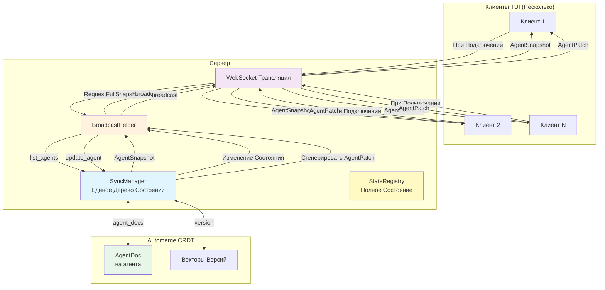
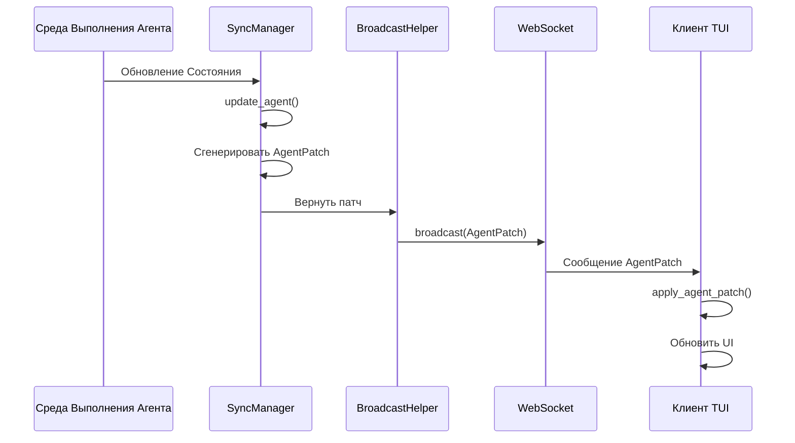
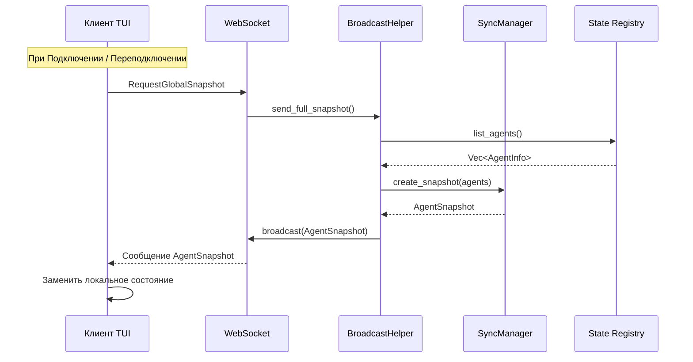
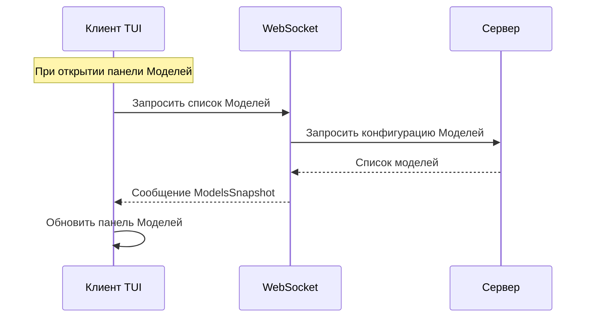
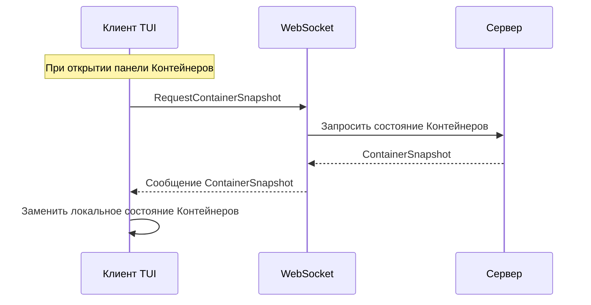
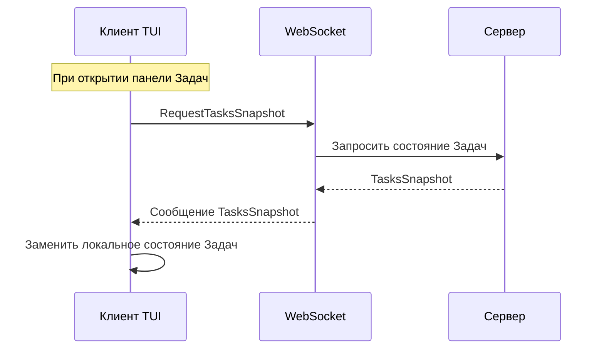

# Архитектура Инкрементальной Синхронизации

## Обзор

Механизм инкрементальной синхронизации состояния нескольких клиентов на основе Automerge CRDT, поддерживающий инкрементальные обновления в реальном времени и полную синхронизацию при подключении/переподключении, охватывающий все панели TUI.

## Диаграмма Архитектуры



## Матрица Стратегии Синхронизации

| Панель | Метод Синхронизации | Триггер | Частота | Типы Сообщений |
| --- | --- | --- | --- | --- |
| **Временная Шкала Агентов** | Инкрементальная + Полная | Синхронизация при Подключении + Push в Реальном Времени | При Подключении / В Реальном Времени | `AgentPatch` / `GlobalSnapshot` |
| **Контейнеры** | Инкрементальная + Полная | Синхронизация при Подключении + Push в Реальном Времени | При Подключении / В Реальном Времени | `ContainerPatch` / `GlobalSnapshot` |
| **Задачи** | Инкрементальная + Полная | Синхронизация при Подключении + Push в Реальном Времени | При Подключении / В Реальном Времени | `TaskPatch` / `GlobalSnapshot` |
| **Список Моделей** | Полная | Активный Запрос Клиента | При Открытии Панели | `ModelsSnapshot` |
| **Конфигурация Провайдеров** | Полная | Активный Запрос Клиента | При Открытии Панели | `ProvidersSnapshot` |

## Поток Сообщений

### Поток Инкрементального Обновления (Агенты)



### Поток Полной Синхронизации



### Поток Синхронизации Списка Моделей



### Поток Полной Синхронизации Контейнеров



### Поток Полной Синхронизации Задач



## Структуры Данных

### AgentPatch (Инкрементальное Обновление)

```rust
pub struct AgentPatch {
    pub agent_id: String,
    pub version: u64,
    pub llm_working_changed: Option<bool>,
    pub work_status: Option<String>,
    pub current_model: Option<String>,
    pub token_usage_delta: Option<(u32, u32)>,
    pub token_usage_absolute: Option<(u32, u32)>,
    pub request_state: Option<RequestState>,
    pub cpu_usage: Option<f64>,
    pub memory_mb: Option<u64>,
}
```

### AgentSnapshot (Полный Снимок)

```rust
pub struct AgentSnapshot {
    pub version: u64,
    pub timestamp: i64,
    pub agents: Vec<TuiAgentInfo>,
}
```

### GlobalSnapshot (Глобальный Снимок)

```rust
pub struct GlobalSnapshot {
    pub version: u64,
    pub timestamp: i64,
    pub agents: Vec<TuiAgentInfo>,
    pub models: Vec<ModelInfo>,
    pub providers: Vec<ProviderInfo>,
    pub active_tasks: Vec<TaskInfo>,
}
```

### ModelsSnapshot (Список Моделей)

```rust
pub struct ModelsSnapshot {
    pub models: Vec<ModelInfo>,
}
```

### ContainerPatch (Инкрементальное Состояние Контейнера)

```rust
pub struct ContainerPatch {
    pub container_id: String,
    pub version: u64,
    pub status_changed: Option<String>,
    pub cpu_usage_changed: Option<f64>,
    pub memory_usage_changed: Option<u64>,
}
```

### ContainerSnapshot (Полное Состояние Контейнера)

```rust
pub struct ContainerSnapshot {
    pub version: u64,
    pub timestamp: i64,
    pub containers: Vec<ContainerInfo>,
}
```

### TaskPatch (Инкрементальное Состояние Задачи)

```rust
pub struct TaskPatch {
    pub task_id: Uuid,
    pub version: u64,
    pub status_changed: Option<String>,
    pub progress_changed: Option<u8>,
}
```

### TasksSnapshot (Полное Состояние Задач)

```rust
pub struct TasksSnapshot {
    pub version: u64,
    pub timestamp: i64,
    pub tasks: Vec<TaskInfo>,
}
```

## Стратегия Синхронизации

| Тип | Направление | Триггер | Частота |
| --- | --- | --- | --- |
| Инкрементальное Обновление Агента | Сервер → Клиент | Изменение Состояния | В Реальном Времени |
| Полная Синхронизация Агента | Сервер → Клиент | При Подключении | При Подключении / Переподключении |
| Инкрементальное Обновление Контейнеров | Сервер → Клиент | Изменение Состояния | В Реальном Времени |
| Полная Синхронизация Контейнеров | Сервер → Клиент | При Подключении | При Подключении / Переподключении |
| Инкрементальное Обновление Задач | Сервер → Клиент | Изменение Состояния | В Реальном Времени |
| Полная Синхронизация Задач | Сервер → Клиент | При Подключении | При Подключении / Переподключении |
| Список Моделей | Клиент → Сервер | Активный Запрос | При открытии панели |
| Конфигурация Провайдеров | Клиент → Сервер | Активный Запрос | При открытии панели |

## Ключевые Особенности

- **Единое Дерево Состояний**: Сервер поддерживает один `SyncManager`, все клиенты получают одинаковые обновления состояния
- **Разрешение Конфликтов CRDT**: Автоматическое разрешение конфликтов на основе Automerge
- **Инкрементальные Обновления**: Передаются только изменённые поля для снижения сетевого трафика
- **Согласованность в Конечном Счёте**: Полная синхронизация при подключении гарантирует согласованность в конечном счёте
- **Pull по Требованию**: Модели и Провайдеры запрашиваются по требованию при открытии их панелей, чтобы избежать ненужной сетевой передачи
- **Синхронизация Главной Страницы**: Агенты, Контейнеры и Задачи синхронизируются при подключении, так как они видны на главной странице

## Статус Реализации

- ✅ Инкрементальная/полная синхронизация агентов
- ✅ Синхронизация списка моделей
- ✅ Синхронизация конфигурации провайдеров
- ✅ Инкрементальная/полная синхронизация контейнеров
- ✅ Инкрементальная/полная синхронизация задач
- ✅ Персистентность состояния (хранение /tmp, перезагрузка при перезапуске)
