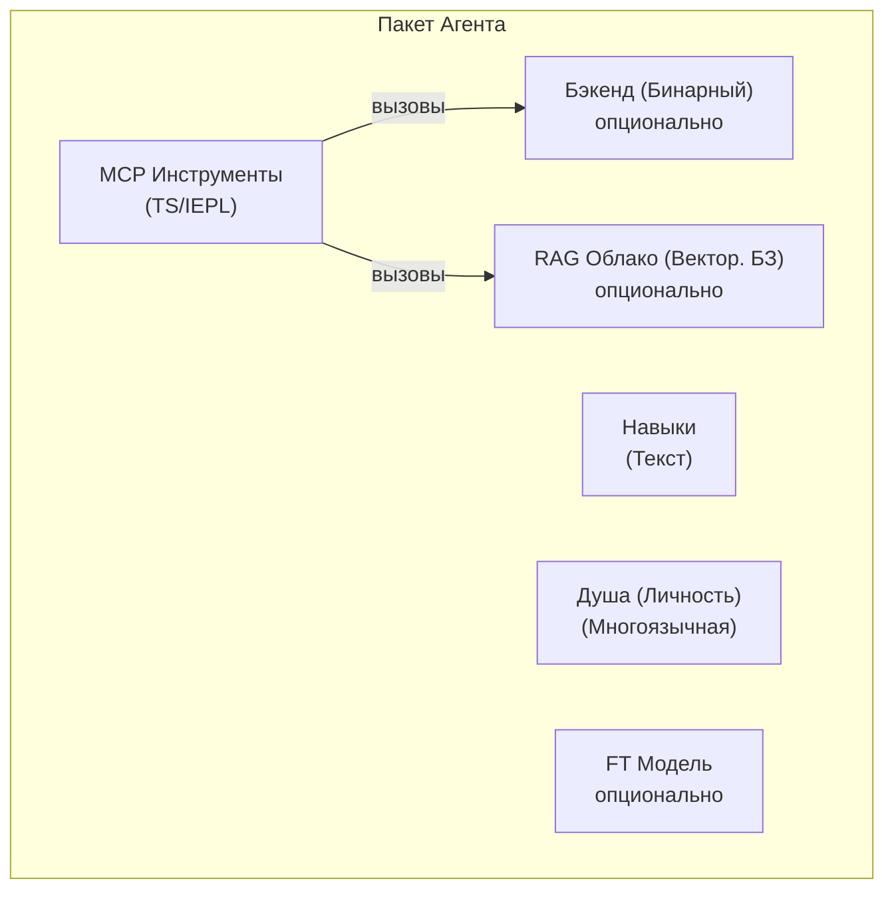

# Спецификация Пакета Агента Уровня 2/3

> **Статус**: Черновик v1 — 2026-06-26
> **Область**: Определяет самодостаточный формат пакета для агентов Уровня 2 и Уровня 3.

## Обзор

Агент Уровня 2/3 — это **самодостаточный пакет**, состоящий из до пяти
компонентов. Пакет является единицей распространения — он может быть установлен,
обновлён и удалён независимо.



## Пять Компонентов

### 1. Инструменты MCP (IEPL TypeScript)

Основной интерфейс инструментов. Написан как исходный код TypeScript, выполняющийся в
песочнице IEPL (среда выполнения Boa JS). Каждый файл инструмента экспортирует функцию:

```typescript
// mcp/memory_store.ts
import type { McpResult } from '@entecheia/sdk';

export async function memory_store(params: {
  text: string;
  node_type: string;
  entity_type?: string;
  properties?: Record<string, string>;
}): Promise<McpResult> {
  // Логика инструмента — может вызывать примитивы бэкенда, компоновать другие инструменты,
  // или делать HTTP-запросы к облачным сервисам.
  const result = await backend.memory_store(params);
  return { ok: true, data: result };
}
```

Инструменты могут быть:

- **Чистый TS**: Только логика, компонует другие инструменты или преобразует данные
- **С поддержкой бэкенда**: Вызывает примитив, предоставленный MCP Бэкендом
- **С поддержкой облака**: Вызывает удалённый API (RAG, модель, внешний сервис)

Исходный код TypeScript — это чистый текст — он может быть версионирован,
проверен и распространён без компиляции. Средство самообслуживания упаковки
может опционально объединить несколько файлов `.ts` в один
`bundle.js` для эффективной загрузки.

### 2. MCP Бэкенд (Опциональный Бинарный Файл)

Некоторым инструментам нужны возможности за пределами песочницы IEPL (файловый В/В, доступ
к оборудованию, соединения с базой данных). Они предоставляются **бинарным бэкендом** —
бинарным файлом Rust, который работает вместе с процессом scepter.

- Бэкенд компилируется в образ Docker и переносится в

"кармане" scepter (директория `/workspace-base/target/`).

- Во время выполнения scepter динамически передаёт путь к бинарному файлу в среду

IEPL через импорт модуля `backend`.

- Бэкенд предоставляет примитивные операции; вся композиция и оркестровка

происходит на уровне TS.

Пример интерфейса бэкенда (авто-сгенерирован из Rust):

```typescript
// Авто-сгенерировано из бэкенда Rust
declare module 'backend' {
  export function memory_store_raw(params: {...}): Promise<McpResult>;
  export function memory_query_raw(query: string): Promise<McpResult>;
}
```

### 3. Навыки (Чистый Текст)

Промпты навыков — это файлы markdown с front-matter TOML. Они определяют
**как** агент выполняет задачи — системный промпт, белый список инструментов,
режим выполнения и структуру конвейера.

```markdown
+++
name = "memory_consolidate"
agent = "philia"
related_tools = ["memory_consolidate", "memory_query"]
location = "scepter"
execution_mode = "read"

[features]
tier = "worker"
+++

# memory_consolidate

Консолидировать узлы памяти в эпизод для структурированного вспоминания...
```

Навыки не зависят от языка (тело `#` — это шаблон промпта).
Они являются чистым текстом — без компиляции, без бинарных файлов.

### 4. База Данных RAG (Опционально, Облачное Размещение)

Векторная база знаний, предоставляющая доменно-специфичные знания
агенту. Размещена на облачной инфраструктуре Entelecheia.

- Опционально: агент может функционировать без RAG (сниженная возможность).
- С ограничением запросов: когда квота исчерпана, запросы возвращают пустоту —

агент плавно деградирует.

- Ссылается по URL + API-ключ в манифесте, не входит в пакет.

### 5. Дообученная Модель (Опционально, Облачное Размещение)

Модель, дообученная для конкретной области агента. Также размещена в облаке.

- Опционально: агенты по умолчанию используют общую модель платформы (например, GLM-5).
- Может быть с открытыми весами в будущем для самостоятельного размещения.
- Ссылается по идентификатору модели в манифесте.

## Структура Директории Пакета

```text
packages/agents/{имя_агента}/
├── manifest.toml           # Метаданные пакета и конфигурация
├── mcp/
│   ├── *.ts                # Реализации инструментов TypeScript (IEPL)
│   └── *.md                # Документация инструментов (параметры, возвраты)
├── backend/                # Опциональный бэкенд Rust
│   ├── Cargo.toml
│   └── src/
│       └── lib.rs
├── skills/
│   └── *.md                # Промпты навыков
├── soul/
│   └── {lang}.md           # Личность агента на язык
├── rag.toml                # Опционально: ссылка на базу данных RAG
└── model.toml              # Опционально: ссылка на дообученную модель
```

## Формат manifest.toml

```toml
[package]
name = "philia"              # Должно совпадать с именем директории
version = "0.2.0"
description = "Когнитивная система памяти — хранение, запрос, консолидация"
layer = 2                    # 2 = агент платформы, 3 = расширение
category = "complex_tool"    # simple_tool | complex_tool | coordinator

[dependencies]
# Другие пакеты агентов, чьи инструменты вызывает этот агент
aporia = "0.2.0"

[backend]
# Опустить полностью для чисто-TS агентов
type = "rust"
binary = "philia"            # Имя бинарного файла в /workspace-base/target/debug/
provides = [                 # Примитивы, предоставляемые уровню TS
  "memory_store_raw",
  "memory_query_raw",
  "memory_consolidate_raw",
]

[rag]
# Опустить, если не используется облачное RAG
provider = "entelecheia-cloud"
database_id = "philia-knowledge-v1"
endpoint = "https://rag.entelecheia.ai/v1"

[model]
# Опустить, если используется модель платформы по умолчанию
provider = "entelecheia-cloud"
model_id = "philia-ft-v1"
endpoint = "https://model.entelecheia.ai/v1"
```

## TS SDK (`@entecheia/sdk`)

SDK предоставляет типы и утилиты для авторов инструментов:

```typescript
// @entecheia/sdk — типы
export interface McpResult {
  ok: boolean;
  data?: unknown;
  error?: string;
}

export interface McpToolParams {
  [key: string]: unknown;
}

// @entecheia/sdk — утилиты
export function rag_search(query: string): string;        // Поиск RAG (синхронный, кэшированный)
export function llm_chat(prompt: string): Promise<string>; // Вызов LLM
export function vars_get(key: string): unknown;           // Состояние между навыками
export function vars_set(key: string, value: unknown): void;
```

Модуль `backend` авто-генерируется для каждого агента из списка `[backend].provides`
в манифесте. Он предоставляет типизированные обёртки вокруг бинарных примитивов.

## Архитектура Уровней

| Уровень | Агенты | Способ Поставки | Пакет? | Контейнер? |
| --- | --- | --- | --- | --- |
| L1 | SkeMma, HapLotes, HubRis, KaLos, NeiKos, ApoRia, EleOs, EpieiKeia, OreXis, PhiLia, PoleMos, SkoPeo | Встроены в образ | Только бэкенд (крейты Rust) | Нет (в процессе) |
| L2 | ClassicSoftwareEngineering, WebAutomation, WebUiPanel, IndustrialIoT | Встроены в образ | **Полный пакет** (TS + навыки + душа) | Да (e-skemma) |
| L3 | Устанавливаемые пользователем расширения | Динамическая установка | **Полный пакет** | Да (e-skemma) |

- **Уровень 1** (12 агентов): Основные агенты платформы. Их крейты Rust предоставляют

примитивные операции (файловый В/В, память, контейнеры, оборудование и т.д.).
Они НЕ являются пакетами — они ЯВЛЯЮТСЯ платформой. Их инструменты предоставляются
как импортируемые модули (например, `import { file_write } from 'kalos'`).

- **Уровень 2** (4 агента): Первые настоящие пакеты. У них **нет бинарного

бэкенда** — они являются чистыми композициями TS/IEPL примитивов Уровня 1.
Они поставляются с образом как примеры формата пакета.

- **Уровень 3**: Устанавливаемые пользователем пакеты. Тот же формат, что и L2, но загружаются

динамически. Могут опционально объявить бинарный бэкенд (компилируется
пользователем, внедряется через scepter).

## Путь Миграции

Существующие крейты агентов Rust (`packages/agents/*/src/`) становятся **бэкендами**.
Их документация инструментов MCP (`res/prompts/agents/*/mcp/*.md`) перемещается в пакет.
Промпты навыков (`res/prompts/agents/*/skills/*.md`) перемещаются в пакет.
Файлы души (`res/prompts/soul/`) перемещаются в пакет.

Старый `shared/plugin_host` (на основе wasm) заменяется средой выполнения IEPL TS,
уже присутствующей в `shared/iepl`. Компиляция wasm не требуется.
