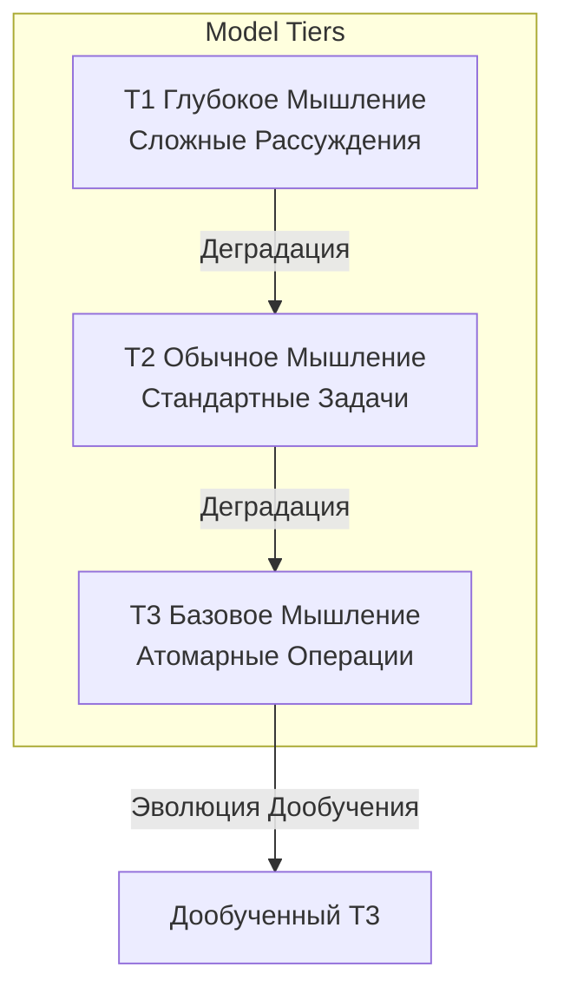
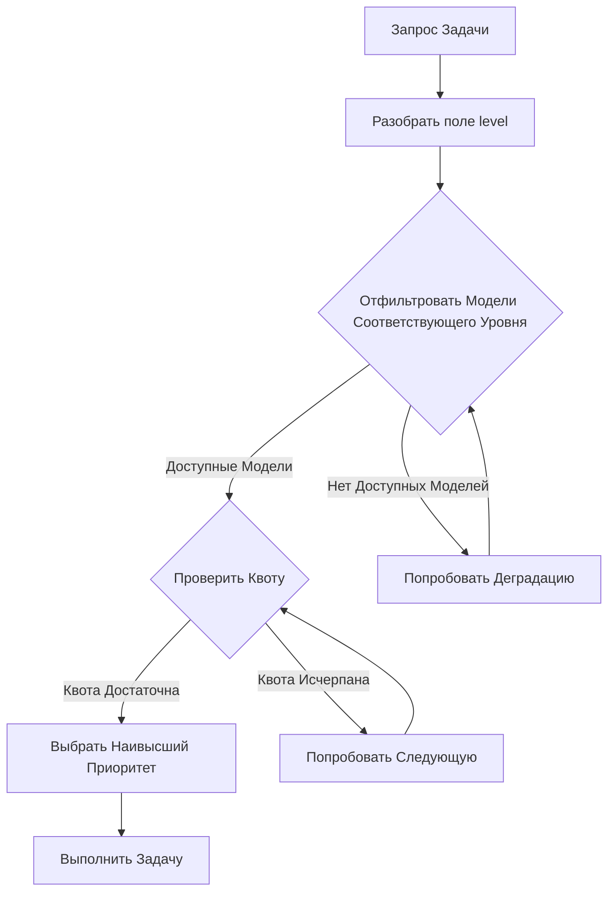
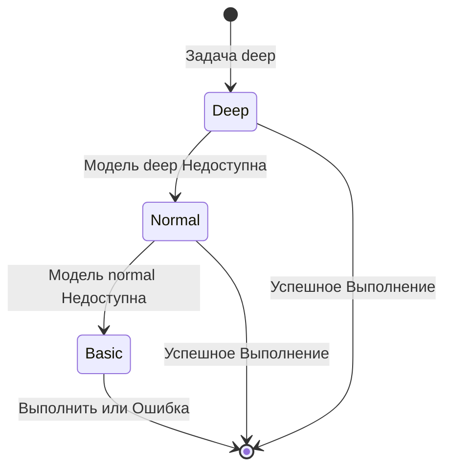
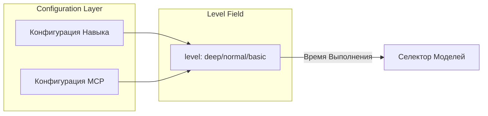
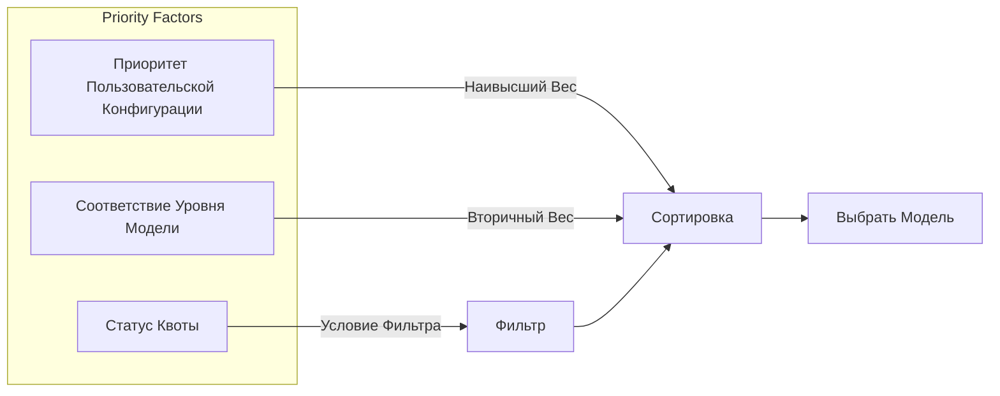
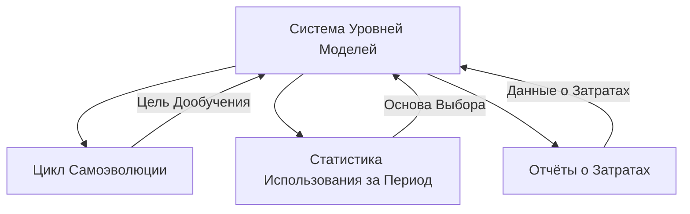

# Проект Системы Уровней Моделей

## Обзор

Система Уровней Моделей — это интеллектуальный механизм выбора модели, который назначает соответствующие уровни моделей в зависимости от сложности задачи, максимизируя использование ресурсов при обеспечении качества.

> **Связанный Документ**: Трёхуровневая система моделей, определённая в этом документе, является основой [Системы Цикла Самоэволюции](04-self-evolution-loop.md).

## Основные Принципы

### Трёхуровневая Система Моделей

### Сравнение Уровней

| Уровень | Позиционирование | Стоимость | Типичные Сценарии |
| --- | --- | --- | --- |
| T1 (глубокий) | Сложные рассуждения, решения | Наивысшая | Архитектурный дизайн, анализ проблем |
| T2 (обычный) | Стандартные задачи | Средняя | Написание кода, генерация документов |
| T3 (базовый) | Атомарные операции | Наинизшая | Чтение файлов, преобразование формата |

## Механизм Выбора Модели

### Процесс Выбора

### Стратегия Деградации

## Механизм Конфигурации

### Аннотация Уровня Навыка/MCP

Каждый Навык и инструмент MCP объявляет требуемый уровень модели через поле `level`:

### Управление Приоритетом

## Связи с Другими Модулями

## Соображения Проектирования

### Оптимизация Затрат

- Приоритет моделей низшего уровня
- Автоматическая деградация избегает сбоя задачи
- Оповещения мониторинга квоты

### Обеспечение Качества

- Сложные задачи требуют высокого уровня
- Деградация требует проверки осуществимости
- Автоматический повтор при сбое

### Расширяемость

- Поддержка пользовательских уровней
- Гибкая конфигурация приоритетов
- Подключаемые стратегии выбора
