# Архитектура пространств имён: `vars`, `refs`, `env`

> **Примечание (2026-06)**: Поверхность инструментов, видимая LLM, сокращена с 5 до 3 примитивов. `ref_add` и `ref_remove` **больше не доступны LLM** — `agent_allowed_tools()` возвращает только `exec`, `write_to_var`, `write_to_var_json`. Пространство имён `__refs` по-прежнему существует как внутренняя структура данных (снапшот/восстановление, вставка в промпт), но больше не изменяется моделью напрямую. Разделы ниже, описывающие диспетчеризацию `ref_add`/`ref_remove`, документируют остаточную внутреннюю инфраструктуру, а не поверхность инструментов LLM.

## Обзор

Entelecheia предоставляет три разделяемых пространства имён в среде выполнения IEPL JavaScript (`globalThis.$`), которые служат коммуникационной основой между навыками и агентами. Эти пространства имён работают на **уровне среды выполнения Cosmos**, то есть все агенты и навыки прозрачно разделяют их в рамках одной сессии.

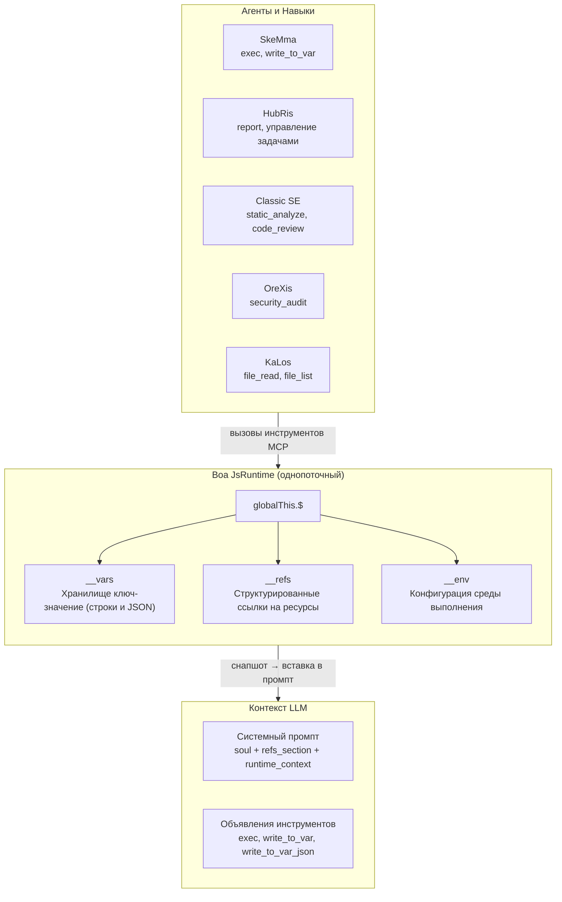

### Принципы проектирования

| Принцип | Описание |
| --- | --- |
| **Единый источник истины** | Каждое пространство имён имеет ровно один модуль (`var_namespace.rs`, `ref_namespace.rs`, `namespace.rs`), который генерирует **все** строки JS-кода, ссылающиеся на это пространство имён |
| **Ленивая инициализация** | `__vars` и `__refs` инициализируются один раз в `JsRuntime::new()` и сохраняются между цепочками навыков; `__env` инициализируется во время вычисления JS пространства имён |
| **Снапшот/Восстановление** | Полное состояние `__vars` + `__refs` может быть сохранено в снапшот и восстановлено, обеспечивая персистентность сессии |
| **Вставка в промпт** | Данные снапшота формируют контекстно-насыщенные системные промпты — LLM видит доступные имена переменных, сводки ссылок и настройки окружения |
| **Контроль доступа к инструментам** | Все 3 внутренних инструмента cosmos (`exec`, `write_to_var`, `write_to_var_json`) предоставляются каждому агенту через `agent_allowed_tools()`; индивидуальные SOP навыков определяют, какие из них использовать |

-----------------------------------------------------------------------------

## Сравнение пространств имён

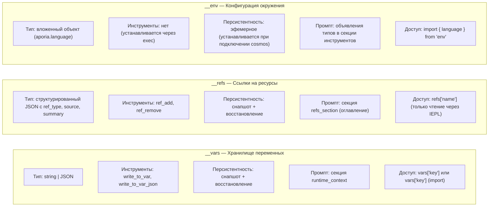

-----------------------------------------------------------------------------

## 1. `__vars` — Хранилище переменных (`vars`)

### 1.1 Назначение

`__vars` является **основным механизмом межшаговой коммуникации** в цепочке навыков. Навыки используют `write_to_var` / `write_to_var_json` для сохранения вычисленных результатов, а последующие шаги (или навыки) читают из `__vars` в блоках `exec`.

### 1.2 Архитектура модуля

Вся генерация JS-кода для `__vars` централизована в `packages/shared/core/src/var_namespace.rs`.

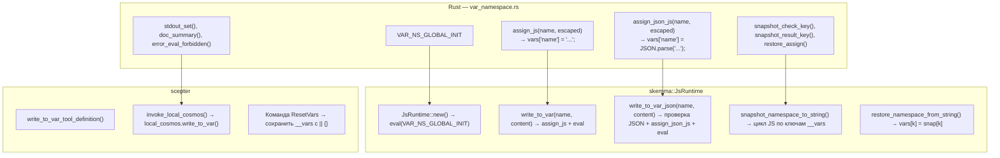

### 1.3 Последовательность инициализации

```text
JsRuntime::new()
  → context.eval("globalThis.$ = globalThis.$ || {}; globalThis.__vars = {}; globalThis.__refs = {};")
  → __vars инициализируется как пустой объект
```

Инициализация выполняется **до** `build_namespace_js()` (которая настраивает `__env` и `$.variant`), гарантируя, что `__vars` всегда доступен при загрузке модулей пространства имён.

> **Примечание:** `__refs` инициализируется вместе с `__vars` через `VAR_NS_GLOBAL_INIT` (определён в `var_namespace.rs`). Отдельный `REF_NS_GLOBAL_INIT` в `ref_namespace.rs` существует для симметрии, но никогда не вызывается напрямую — фактическая инициализация происходит в `JsRuntime::new()`.

### 1.4 Операции

| Операция | Имя инструмента | Тип | Поведение |
| --- | --- | --- | --- |
| Сохранить строку | `write_to_var` | Блокирующий | Экранирует содержимое для JS, выполняет `vars['name'] = 'content'` |
| Сохранить JSON | `write_to_var_json` | Блокирующий | Проверяет JSON, выполняет `vars['name'] = JSON.parse('content')` |
| Чтение в exec | `exec` | FireAndForget | Прямой доступ: `vars['name']` или `import vars from 'vars'` |
| Снапшот | (внутренний) | — | Захватывает все ключи `__vars` как `{"$vars": {...}}` |
| Восстановление | (внутренний) | — | Устанавливает `vars[k] = snap['$vars'][k]` для каждого ключа |
| Сброс | (внутренний) | — | `__vars = __vars \|\| {}` — сохраняет существующие значения, обеспечивает структуру |

### 1.5 Вставка в промпт

В `build_runtime_context()` (`prompt.rs:472`) хранилище переменных появляется в системном промпте как:

```text
## JS Runtime Context

__vars (из write_to_var / write_to_var_json, всего N):
  `var_1`, `var_2`, `var_3`, ... (показано до 30)
  Импорт: `import vars from 'vars';`  Доступ: `vars['key']`
```

### 1.6 Отображение вывода

- Сохранение строки: `vars['name'] set:\n{первые 200 символов / 5 строк}... (всего chars символов)`
- Сохранение JSON: `vars['name'] set (parsed JSON): object with 3 key(s)`
- Ошибка разбора: Ошибка с предпросмотром содержимого (первые 200 символов)

### 1.7 Синтетический модуль `vars`

По аналогии с `env`, модуль `vars` является синтетическим модулем Boa, который оборачивает `__vars` для удобного импорта:

```python
import vars from 'vars';
// vars === __vars (живая ссылка)
const report = vars['analysis_results'];
```

**Реализация:** `packages/agents/skemma/src/js_runtime/module_loader.rs` строки 142-156. Модуль использует `Module::synthetic()` с замыканием, которое возвращает `globalThis.__vars` напрямую (живая ссылка, а не снапшот). Это означает, что изменения через `vars['key'] = value` эквивалентны `vars['key'] = value`.

-----------------------------------------------------------------------------

## 2. `__refs` — Ссылки на ресурсы (`refs`)

### 2.1 Назначение

`__refs` обеспечивает **структурированную передачу ресурсов между агентами**. В отличие от `__vars` (сырые строки), ссылки несут типизированные метаданные (`ref_type`, `source`, `summary`) и опциональные полезные данные. Агенты могут:

- **Публиковать** ссылки на файлы, изображения или свои собственные результаты
- **Обнаруживать** ссылки по имени/типу в системных промптах
- **Получать доступ** к содержимому ссылок через `refs['name']` в блоках IEPL exec

### 2.2 Архитектура модуля

Вся генерация JS-кода для `__refs` централизована в `packages/shared/core/src/ref_namespace.rs`.

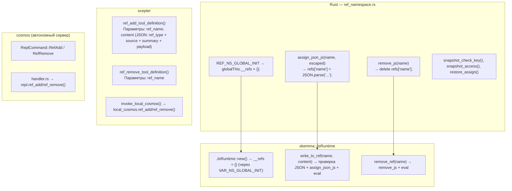

### 2.3 Структура RefItem

```typescript
// Определения типов TypeScript (из iepl-api.d.ts)
type RefType = "code" | "image" | "agent_output";

// Используется в системном промпте и runtime_context для перечисления имён
type RefItemSummary = {
  name: string;
  ref_type: RefType;
  source: string;
  summary: string;
};

interface RefItem {
  name: string;        // например "code:src/main.rs", "image:diagram", "agent:orexis/audit-1"
  ref_type: RefType;   // категория для сортировки/фильтрации
  source: string;      // кто предоставил ("user", имя агента, имя инструмента)
  summary: string;     // однострочное описание для отображения в промпте
  files?: RefCodeFile[];   // для ссылок типа "code"
  images?: RefImage[];     // для ссылок типа "image"
  output?: RefAgentOutput; // для ссылок типа "agent_output"
}

interface RefCodeFile {
  path: string;
  language: string;
  content: string;
  selection?: { start_line: number; end_line: number; content: string };
}

interface RefImage {
  mime: string;          // например "image/png"
  data: string;          // base64 или data URL
  description?: string;
}

interface RefAgentOutput {
  source_agent: string;  // имя агента
  source_tool: string;   // инструмент, создавший этот вывод
  content: Record<string, unknown>;
}
```

### 2.4 Операции

| Операция | Имя инструмента | Тип | Поведение |
| --- | --- | --- | --- |
| Добавить ссылку | `ref_add` | Блокирующий | Проверяет JSON, выполняет `refs['name'] = JSON.parse('...')` |
| Удалить ссылку | `ref_remove` | FireAndForget | Выполняет `delete refs['name']` |
| Чтение в exec | (через `exec`) | — | `refs['name'].files[0].content` |
| Снапшот | (внутренний) | — | Захватывает все ключи `__refs` как `{"$refs": {...}}` |
| Восстановление | (внутренний) | — | Устанавливает `refs[k] = snap['$refs'][k]` для каждого ключа |

### 2.5 Вставка в промпт

Ссылки появляются в **двух** местах системного промпта:

#### Место 1: `refs_section` (специальное оглавление)

```text
## Referenced Resources (refs)

Доступны следующие ресурсы через `refs['name']`.
- `code:src/main.rs` [code] от user — основной файл rust
- `image:architecture` [image] от user — диаграмма архитектуры системы
- `agent:orexis/audit-1` [agent_output] от OreXis — результаты аудита безопасности
```

Генерируется `build_refs_section()` в `prompt.rs:426`. Каждая ссылка показывает **имя, тип, источник и сводку** — LLM видит, что доступно, но должен читать содержимое через блоки `exec`.

#### Место 2: `runtime_context` (перечисление имён)

```text
__refs (ресурсы от пользователя/агентов, всего 3):
  `code:src/main.rs`, `image:architecture`, `agent:orexis/audit-1`
  Доступ: `refs['name']` — каждая ссылка имеет .ref_type, .source, .summary
```

### 2.6 Принцип видимости

> **Имена ссылок видны всем агентам. Содержимое ссылок — нет.**

`refs_section` в системном промпте раскрывает **оглавление** (имя, тип, источник, сводка) для каждого выполнения навыка. Однако фактическое содержимое (`files[].content`, `images[].data`, `output.content`) доступно только через явный доступ `refs['name']` в блоках IEPL exec. Это означает:

- OreXis может видеть, что `code:src/main.rs` существует (из его сводки), но должен явно прочитать его содержимое для аудита
- LLM решает, когда разыменовывать содержимое в зависимости от релевантности задачи
- Ни один агент не может случайно раскрыть содержимое ссылки в потоке разговора

-----------------------------------------------------------------------------

## 3. `__env` — Конфигурация окружения (`env`)

### 3.1 Назначение

`__env` содержит **настройки среды выполнения**, необходимые движку IEPL и агентам. В настоящее время единственным подключом является `env.aporia.language`, который управляет языком вывода агента.

### 3.2 Архитектура модуля

Инициализация окружения находится в `packages/shared/iepl/src/namespace.rs`.

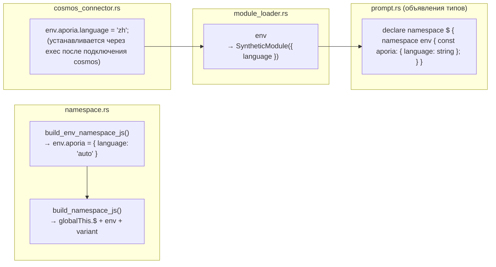

### 3.3 Операции

| Операция | Механизм | Поведение |
| --- | --- | --- |
| Инициализация | `build_namespace_js()` | `__env = __env \|\| {}; env.aporia = env.aporia \|\| { language: 'auto' }` |
| Установка языка | вызов `exec` через cosmos connector | `env.aporia.language = 'zh'` |
| Чтение в IEPL | `import { language } from 'env'` | Возвращает `env.aporia.language` с резервным значением `'auto'` |
| Снапшот/Восстановление | **Не поддерживается** | `__env` НЕ включается в снапшот/восстановление — он эфемерен и переинициализируется при каждом подключении cosmos |

### 3.4 Поток языка

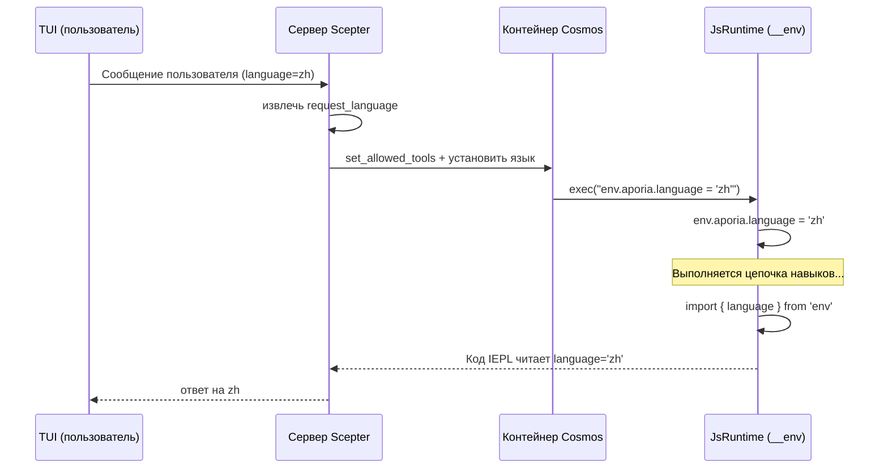

### 3.5 `$.variant` — Аксессор обратной совместимости

**Файл:** `packages/shared/iepl/src/namespace.rs:199-207`

`build_variant_namespace_js()` создаёт циклическое самореференцирующееся свойство:

```javascript
Object.defineProperty(globalThis.$, 'variant', {
  get: function() { return globalThis.$; },
  set: function(val) { Object.assign(globalThis.$, val); },
  configurable: true,
  enumerable: true,
});
```

Это позволяет коду, написанному как `$.variant.tools.agent.method()`, разрешаться в тот же объект, что и `$.tools.agent.method()`. Существует для обратной совместимости с альтернативными шаблонами доступа к пространствам имён.

> **Осторожность при снапшоте:** Поскольку `$.variant` является циклической ссылкой (`$.variant === $`), попытка `JSON.stringify` вызывает `TypeError`. JS-код снапшота явно обращается к `__vars` и `__refs` напрямую, а не итерирует ключи `globalThis.$`, избегая этой проблемы.

-----------------------------------------------------------------------------

## 4. Архитектура снапшота и восстановления

### 4.1 Зачем нужен снапшот/восстановление?

`LocalCosmosRuntime` запускает **единственный долгоживущий `JsRuntime`** в выделенном потоке. Между выполнениями цепочек навыков состояние среды выполнения (`__vars`, `__refs`) сохраняется естественным образом. Однако снапшоты используются для:

1. **Вставки в промпт** — `build_runtime_context()` и `build_refs_section()` читают JSON снапшота для заполнения системного промпта
1. **Персистентности сессии** — дамп/восстановление на диск для восстановления после сбоя или миграции сессии
1. **Синхронизации контейнеров** — отправка состояния в контейнеры cosmos через `cosmos_set_rag_context()`

### 4.2 Формат снапшота

```json
{
  "$vars": {
    "var_name_1": "value",
    "parsed_json": { "key": "value" }
  },
  "$refs": {
    "code:src/main.rs": {
      "ref_type": "code",
      "source": "user",
      "summary": "основной файл rust",
      "files": [{ "path": "src/main.rs", "language": "rust", "content": "..." }]
    }
  },
  "__lexical": {
    "my_const": 42
  }
}
```

### 4.3 Поток кода снапшота

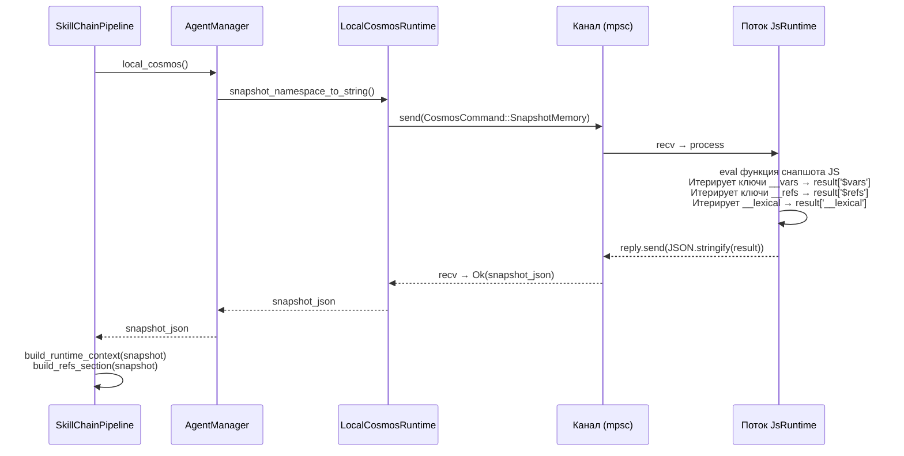

### 4.4 JS-код снапшота (развёрнутая форма)

> **Примечание:** JS-код ниже показан в **развёрнутой форме**, которую код Rust динамически строит во время выполнения. Он не хранится как строковый литерал Rust в исходном коде. Секция `__lexical` генерируется из `self.lexical_var_names`, отслеживаемых во время предыдущих вызовов `exec()`. См. `packages/agents/skemma/src/js_runtime/runtime.rs:549-607` для построителя строк Rust.

Функция снапшота напрямую обращается к известным деревьям пространств имён:

```javascript
(function() {
    var result = {};
    if (globalThis.$ && globalThis.__vars) {
        var dollarVars = {};
        var dollarKeys = Object.keys(globalThis.__vars);
        for (var j = 0; j < dollarKeys.length; j++) {
            var dk = dollarKeys[j];
            try {
                var dv = globalThis.vars[dk];
                if (typeof dv === 'function') continue;
                dollarVars[dk] = dv;
            } catch(e) {}
        }
        if (Object.keys(dollarVars).length > 0) {
            result['$vars'] = dollarVars;
        }
    }
    if (globalThis.$ && globalThis.__refs) {
        var dollarRefs = {};
        var refsKeys = Object.keys(globalThis.__refs);
        for (var j = 0; j < refsKeys.length; j++) {
            var dk = refsKeys[j];
            try {
                var dv = globalThis.refs[dk];
                if (typeof dv === 'function') continue;
                dollarRefs[dk] = dv;
            } catch(e) {}
        }
        if (Object.keys(dollarRefs).length > 0) {
            result['$refs'] = dollarRefs;
        }
    }
    // ... захват __lexical ...
    return JSON.stringify(result);
})( )
```

### 4.5 Код восстановления (развёрнутый)

```javascript
(function() {
    var snap = JSON.parse(snapshot_string);
    if (snap['$vars'] && globalThis.$) {
        Object.keys(snap['$vars']).forEach(function(k) {
            try { globalThis.vars[k] = snap['$vars'][k]; } catch(e) {}
        });
    }
    if (snap['$refs'] && globalThis.$) {
        Object.keys(snap['$refs']).forEach(function(k) {
            try { globalThis.refs[k] = snap['$refs'][k]; } catch(e) {}
        });
    }
    if (snap['__lexical']) {
        Object.keys(snap['__lexical']).forEach(function(k) {
            try { globalThis[k] = snap['__lexical'][k]; } catch(e) {}
        });
    }
})()
```

-----------------------------------------------------------------------------

## 5. Регистрация инструментов и контроль доступа

### 5.1 Внутренние инструменты Cosmos

Все пять инструментов уровня cosmos **универсально предоставляются** всем агентам:

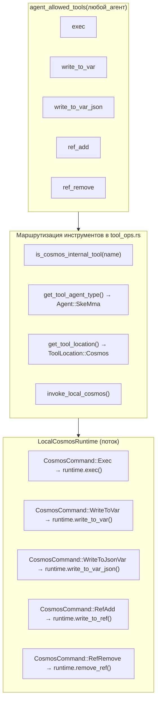

### 5.2 Определения инструментов

| Инструмент | Режим вызова | Требует | Схема параметров |
| --- | --- | --- | --- |
| `exec` | FireAndForget | `code: string` | Одна строка JS-кода |
| `write_to_var` | Блокирующий | `var_name, content` | `{var_name: string, content: string}` |
| `write_to_var_json` | Блокирующий | `var_name, content` | `{var_name: string, content: string (валидный JSON)}` |
| `ref_add` | Блокирующий | `ref_name, content` | `{ref_name: string, content: string (JSON: ref_type + source + summary)}` |
| `ref_remove` | FireAndForget | `ref_name` | `{ref_name: string}` |

### 5.3 Автономный сервер Cosmos

Бинарный файл `cosmos` (автономный сервер среды выполнения JS) диспетчеризует все имена инструментов через один и тот же интерфейс `JsRuntime`, включая устаревшие обработчики `ref_add`/`ref_remove`, которые остаются как остаточная внутренняя инфраструктура. Только три примитива, видимых LLM (`exec`, `write_to_var`, `write_to_var_json`), доступны модели; см. примечание об устаревании в начале этого документа.

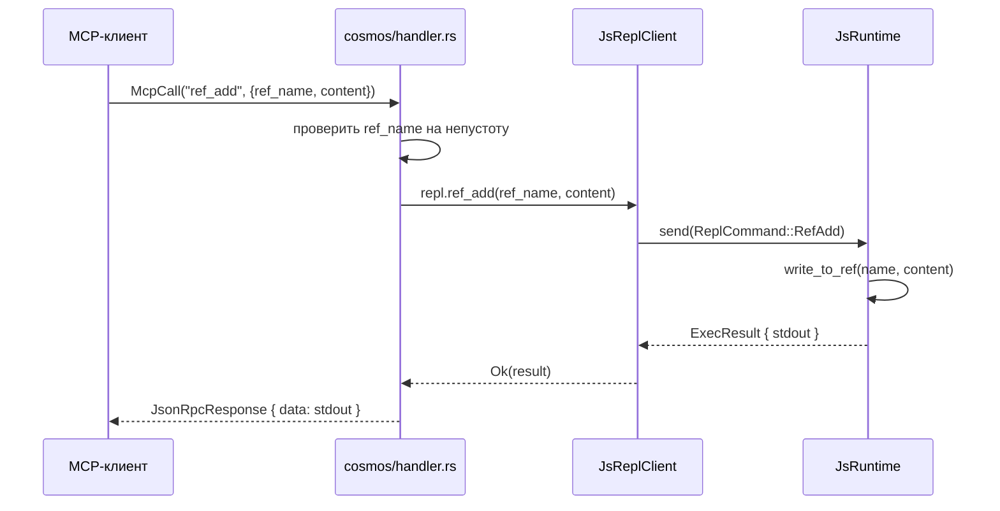

### 5.4 `is_cosmos_internal_tool` — Вспомогательная функция маршрутизации

**Файл:** `packages/scepter/src/agent_manager/tool_ops.rs:7-13`

```rust
fn is_cosmos_internal_tool(tool_name: &str) -> bool {
    tool_name == cosmos::EXEC
        || tool_name == cosmos::WRITE_TO_VAR
        || tool_name == cosmos::WRITE_TO_VAR_JSON
        || tool_name == cosmos::REF_ADD
        || tool_name == cosmos::REF_REMOVE
}
```

Эта вспомогательная функция служит двум критическим целям:

1. **Разрешение типа агента** — `get_tool_agent_type()` возвращает `Agent::SkeMma` для внутренних инструментов, поскольку они выполняются в среде выполнения Cosmos (а не в процессе доменного агента).
1. **Резервная маршрутизация** — Когда контейнеризованный вызов cosmos терпит неудачу для внутреннего инструмента, система возвращается к локальной среде выполнения cosmos. Для не внутренних инструментов резервный вариант идёт на внутрипроцессное выполнение. Это гарантирует, что операции cosmos никогда не завершатся молчаливым отказом в контейнеризованном режиме.

### 5.5 Контейнеризованная и локальная маршрутизация Cosmos

Система поддерживает два режима выполнения для среды выполнения Cosmos, выбираемых при регистрации агента:

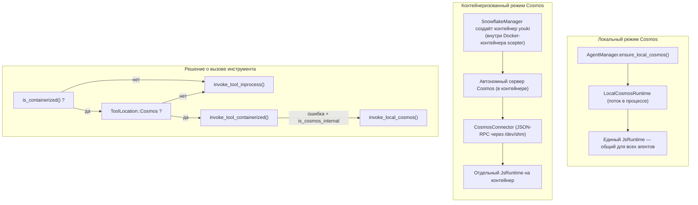

**Ключевые различия:**

| Аспект | Локальный режим | Контейнеризованный режим |
| --- | --- | --- |
| `__vars` / `__refs` | Общие для всех агентов | Общие внутри контейнера, изолированы между контейнерами |
| `__env` | Устанавливается напрямую через `exec` | Устанавливается через вызов JSON-RPC `CosmosConnector` |
| Производительность | Нулевые накладные расходы на сериализацию | Сериализация JSON-RPC на каждый вызов |
| Безопасность | Только песочница Boa | Boa + seccomp + песочница youki |
| Среда контейнера | Только Docker/Podman | Docker/Podman (внешний) + youki (внутренний cosmos) |
| Используется | Неконтейнеризованными агентами (layer=1) | Контейнеризованными агентами (layer=2+) |

### 5.6 Сборка JS пространства имён

Полный JavaScript пространства имён собирается функцией `build_scepter_namespace_config_and_js()` в `packages/scepter/src/services/local_cosmos/namespace.rs:116-124`:

```rust
pub async fn build_scepter_namespace_config_and_js(
    registry: &SharedAgentRegistry,
    scepter_tools: &HashSet<String>,
    plugin_router: &PluginRouter,
) -> (NamespaceConfig, String) {
    let config = build_namespace_config(registry, scepter_tools, plugin_router).await;
    let js = build_namespace_js(&config);
    (config, js)
}
```

Эта функция:

1. Собирает все MCP-инструменты зарегистрированных агентов из `AgentRegistry`
1. Строит `NamespaceConfig` со списками инструментов для каждого агента и метаданными (sync/async, `unwrap_data`)
1. Генерирует JS пространства имён через `build_namespace_js(&config)`, которая:

   - Создаёт `globalThis.$`, если отсутствует
   - Инициализирует `env.aporia` с `{ language: 'auto' }`
   - Определяет свойство `$.variant` (циклический геттер, возвращающий `globalThis.$`)
   - Регистрирует все модули инструментов агентов через `register_tool_modules_with_rag()`

JS пространства имён вычисляется:

- **Один раз** при запуске `LocalCosmosRuntime::new()`
- **По требованию** во время перестроения цепочки навыков через `CosmosCommand::RebuildNamespace`

-----------------------------------------------------------------------------

## 6. Порядок сборки системного промпта

Полный системный промпт собирается в `pipeline.rs:869-882`:

```text
You are the {Agent} {skill_name} skill execution engine. Execute the skill faithfully.

[capability_section]
  → Описание возможностей конкретного агента
  → Объявления типов TypeScript (типы IEPL API, env)
  → Подсказки по импорту
  → Правила безопасности параметров и руководство по персистентности данных

[tool_decls_section]
  → ## Available Tool APIs
  → Содержимое .d.ts для всех доступных MCP-инструментов

[container_context]
  → Метки режима выполнения в контейнере, информация о ветке, ограничения

[soul_section]
  → ## Soul Identity: {name}
  → Личность агента и операционные принципы

[refs_section]
  → ## Referenced Resources (refs)
  → Оглавление: имя, тип, источник, сводка

[output_section]
  → Маршрутизация к следующему целевому агенту
  → Соглашения вызова MCP report

[runtime_context]
  → ## JS Runtime Context
  → Имена __vars (с подсказкой импорта)
  → Имена __refs (с подсказкой доступа)
  → Имена лексических переменных

[rag_section]
  → Секции памяти Philia (релевантные прошлые взаимодействия)
  → Секции знаний Aporia (релевантная документация)

[skill_chain_note]
  → Навигация по цепочке: "Это шаг N из M" или "Последний шаг"
```

### Обоснование размещения секций

| Секция | Позиция | Причина |
| --- | --- | --- |
| Идентичность агента + имя навыка | Первое предложение | Немедленно устанавливает роль |
| Объявления инструментов | Перед soul | LLM должен знать доступные инструменты до того, как личность повлияет на выбор |
| Soul | После инструментов, перед refs | Личность влияет на то, как интерпретируются ссылки |
| Секция refs | После soul, перед output | LLM знает, какие ресурсы доступны, прежде чем решать, что произвести |
| Маршрутизация вывода | Перед runtime context | LLM знает, куда отправлять результаты, прежде чем читать контекст |
| Runtime context | Перед RAG, перед chain note | Переменные и ссылки предоставляют контекст выполнения для поиска знаний |

-----------------------------------------------------------------------------

## 7. Поведение ResetVars

При переключении между навыками в цепочке вызывается `ResetVars` для очистки состояния среды выполнения. Команда использует **неразрушающую** инициализацию:

```javascript
globalThis.$ = globalThis.$ || {};
globalThis.__vars = globalThis.__vars || {};
globalThis.__refs = globalThis.__refs || {};
```

Это означает:

- **Существующие значения сохраняются** — `__vars` и `__refs` остаются нетронутыми
- **Повреждённые состояния восстанавливаются** — если `__refs` был случайно удалён, он создаётся заново
- **Изоляция навыков опциональна** — навыки должны читать только те переменные, о которых они знают (по имени в промпте runtime context)
- **Принудительная очистка отсутствует** — ответственность за управление загрязнением пространства имён переменных лежит на LLM

-----------------------------------------------------------------------------

## 8. Карта файлов реализации

| Компонент | Файл | Строки | Описание |
| --- | --- | --- | --- |
| Константы и генераторы `__vars` | `packages/shared/core/src/var_namespace.rs` | 1-211 | Вся генерация JS-кода для vars |
| Константы и генераторы `__refs` | `packages/shared/core/src/ref_namespace.rs` | 1-145 | Вся генерация JS-кода для refs |
| Генерация `__env` | `packages/shared/iepl/src/namespace.rs` | 193-197 | `build_env_namespace_js()` |
| Генерация `$.variant` | `packages/shared/iepl/src/namespace.rs` | 199-207 | `build_variant_namespace_js()` |
| Инициализация `JsRuntime` | `packages/agents/skemma/src/js_runtime/runtime.rs` | 153 | `eval(VAR_NS_GLOBAL_INIT)` |
| Реализация `write_to_var` | тот же файл | 349-403 | Сохранение строковой переменной |
| Реализация `write_to_var_json` | тот же файл | 405-443 | Сохранение JSON переменной |
| Реализация `write_to_ref` | тот же файл | 445-492 | Сохранение ссылки с извлечением типа |
| Реализация `remove_ref` | тот же файл | 494-503 | Удаление ссылки |
| `snapshot_namespace_to_string` | тот же файл | 549-607 | Генерирует JS снапшота |
| `restore_namespace_from_string` | тот же файл | 617-646 | Генерирует JS восстановления |
| `LocalCosmosRuntime` | `packages/scepter/src/services/local_cosmos/runtime.rs` | 1-507 | Потокобезопасный канал команд cosmos |
| Перечисление `CosmosCommand` | тот же файл | 21-65 | Все варианты операций cosmos (включая SnapshotMemory, Shutdown) |
| Обработчик `ResetVars` | тот же файл | 448-460 | Неразрушающий сброс |
| Обработчик `RebuildNamespace` | тот же файл | 478-494 | Переинициализация модулей инструментов |
| Определения инструментов | `packages/scepter/src/agent_manager/tool_ops.rs` | 1-795 | Определения всех 5 инструментов cosmos |
| `is_cosmos_internal_tool` | тот же файл | 7-13 | Вспомогательная функция маршрутизации |
| `invoke_local_cosmos` | тот же файл | 714-787 | Диспетчеризация инструментов в LocalCosmosRuntime |
| `build_runtime_context` | `packages/scepter/src/state_machine/skill_chain/prompt.rs` | 472-598 | Промпт: vars + refs + lexical |
| `build_refs_section` | тот же файл | 426-470 | Промпт: оглавление refs |
| Сборка системного промпта | `packages/scepter/src/state_machine/skill_chain/pipeline.rs` | 869-882 | Строка формата полного системного промпта |
| Список разрешённых инструментов | `packages/shared/domain_skills/src/tool_names.rs` | 265-273 | Универсальный доступ к инструментам cosmos |
| Автономный обработчик cosmos | `packages/cosmos/src/handler.rs` | 447-521 | Диспетчеризация `ref_add` / `ref_remove` |
| Cosmos JsReplClient | `packages/cosmos/src/js_repl/mod.rs` | 442-467 | Методы `ref_add()` / `ref_remove()` |
| Перечисление ReplCommand | тот же файл | 57-96 | Варианты `RefAdd` / `RefRemove` |
| Типы IEPL TypeScript | `packages/shared/bindings/iepl-api.d.ts` | 133-154 | Объявления RefItem, RefType, __refs |
| Модуль `vars` | `packages/agents/skemma/src/js_runtime/module_loader.rs` | 142-156 | Экспорт живой ссылки `__vars` |
| Модуль `env` | тот же файл | 160-172 | Экспорт значения языка |
| Сборка JS пространства имён | `packages/scepter/src/services/local_cosmos/namespace.rs` | 116-124 | `build_scepter_namespace_config_and_js` |
| Установщик языка CosmosConnector | `packages/scepter/src/services/cosmos_connector.rs` | 351-363 | `env.aporia.language` в контейнерах |
| E2E тесты | `packages/agents/skemma/tests/mcp_test.rs` | 1677-1726 | Модуль `refs_and_snapshot_tests` |
| Модульные тесты | `packages/agents/skemma/src/js_runtime/runtime.rs` | 679-746 | Тесты `write_to_ref`, снапшота, восстановления |
| Тесты пространства имён ref | `packages/shared/core/src/ref_namespace.rs` | 99-145 | Тесты шаблонов генерации JS-кода |

-----------------------------------------------------------------------------

## 9. Сквозные аспекты

### 9.1 Потокобезопасность

- `LocalCosmosRuntime` владеет **единственным `JsRuntime`** в выделенном потоке (с именем `"local-cosmos"`)
- Все операции сериализуются через `mpsc::channel<CosmosCommand>`
- `JsRuntime` никогда не доступен из нескольких потоков — потокобезопасность обеспечивается шаблоном канала
- `AgentManager` содержит `OnceCell<Arc<LocalCosmosRuntime>>` для ленивой инициализации

### 9.2 Ограничения памяти

| Ограничение | Значение | Применяется в |
| --- | --- | --- |
| Макс. переменных в промпте | 30 | `build_runtime_context()` — константа `MAX_NAMES` |
| Макс. ссылок в промпте | 30 | `build_refs_section()` — `.take(30)` |
| Макс. ссылок в runtime_context | 30 | `build_runtime_context()` — константа `MAX_NAMES` |
| Мягкий лимит кода exec | N/A (отключён) | Ограничения внешнего контейнера + автоматические выключатели |
| Таймаут exec (SkeMma) | 120с по умолчанию | `skemma/COMPUTE_TIMEOUT` |
| Абсолютный потолок exec | 600с | `skemma/ABSOLUTE_CEILING` |

### 9.3 Обработка ошибок

| Ошибка | Обработка |
| --- | --- |
| `write_to_var_json` с невалидным JSON | Возвращает ошибку с предпросмотром (первые 200 символов) |
| `ref_add` с невалидным JSON | Возвращает `SkemmaError::JsEval` с предпросмотром |
| Снапшот циклической ссылки (`$.variant`) | Молча перехватывает `TypeError`, пропускает ключ |
| Отсутствующий `__refs` в снапшоте | `build_refs_section` возвращает пустую строку |
| Повреждённый `__refs` после ResetVars | `\|\| {}` гарантирует переинициализацию |

### 9.4 Жизненный цикл RebuildNamespace

При переключении навыков в неконтейнеризованной цепочке навыков JS пространства имён может потребоваться **перестроить** для включения новых инструментов агентов, обнаруженных во время цепочки:

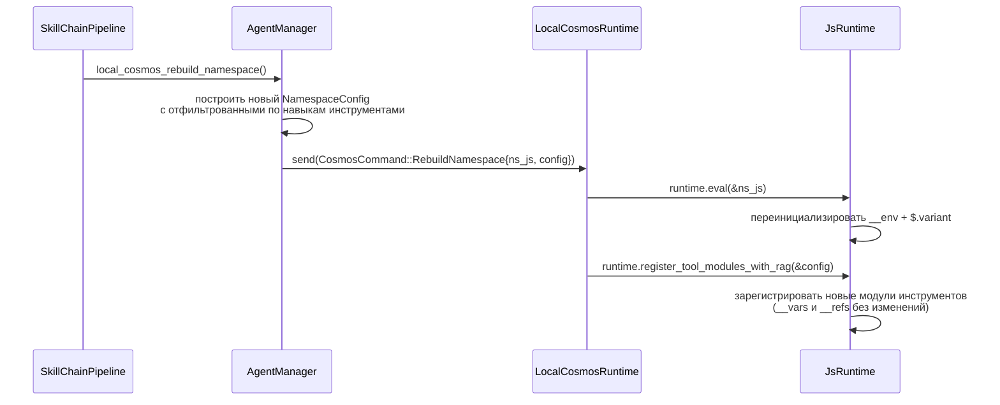

> **Ключевой инвариант:** `RebuildNamespace` только обновляет регистрации инструментов и настройки окружения. Он **не** сбрасывает `__vars` или `__refs` — они обрабатываются отдельно командой `ResetVars`.

### 9.5 Распространение языка в контейнеризованном режиме

Когда агенты работают в контейнерах youki (вложенных в Docker-контейнер scepter), значение `env.aporia.language` устанавливается через `CosmosConnector`:

```rust
// packages/scepter/src/services/cosmos_connector.rs:351-363
let lang_code = format!(
    "env.aporia.language = {};",
    serde_json::to_string(&lang).unwrap_or_else(|_| "\"en\"".to_string())
);
connector.cosmos_exec(&container_uuid, &lang_code).await?;
```

Это отправляет MCP-вызов `exec` через транспорт JSON-RPC в контейнер cosmos, который вычисляет JS-присваивание в изолированном `JsRuntime` контейнера. Полный путь распространения языка:

```text
Язык запроса TUI → Scepter (извлечь request_language)
  → [локальный режим] прямой exec("env.aporia.language = 'zh'")
  → [контейнеризованный] CosmosConnector::cosmos_exec(json_rpc_call)
      → обработчик cosmos → js_runtime.eval(...)
```

### 9.6 Безопасность

- Валидация `exec`: весь код проходит проверку синтаксиса SWC AST перед вычислением Boa
- Использование `eval()` в блоках `exec` обнаруживается и блокируется с указанием использовать `write_to_var`
- Содержимое `ref_add` проходит через `JSON.parse()` — произвольный код не может быть внедрён
- Ни один инструмент пространства имён не раскрывает сырой доступ к контексту Boa
- Контейнеры Cosmos работают в изолированных контейнерах youki с профилями seccomp, каждый вложен внутрь Docker/Podman контейнера scepter (двухуровневая контейнерная изоляция)
