# Проектирование системы статистики периодов использования

## Обзор

Система статистики периодов использования управляет и отслеживает использование токенов LLM на основе временных периодов, поддерживая несколько типов периодов (5 часов, 7 дней, 30 дней, произвольный), предоставляя основу данных для контроля затрат и управления квотами.

## Основные принципы

### Агрегация по временным окнам

Система использует механизм агрегации скользящего окна для расчёта статистики использования в реальном времени для любого временного диапазона через представления базы данных:

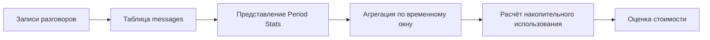

### Поток данных

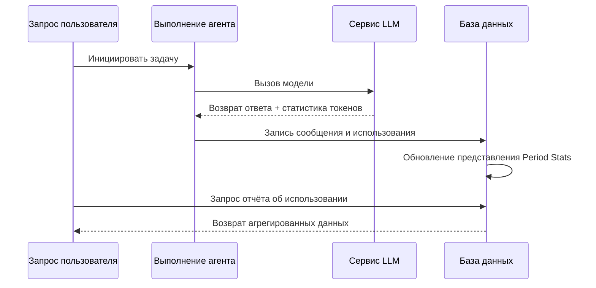

## Типы периодов

| Тип периода | Длительность | Типичное использование |
| --- | --- | --- |
| Краткосрочный | 5 часов | Быстрая итеративная разработка |
| Среднесрочный | 7 дней | Недельный контроль квот |
| Долгосрочный | 30 дней | Месячный учёт затрат |
| Произвольный | Любой | Гибкие бизнес-потребности |

## Проектирование архитектуры

### Архитектура агрегации представлений

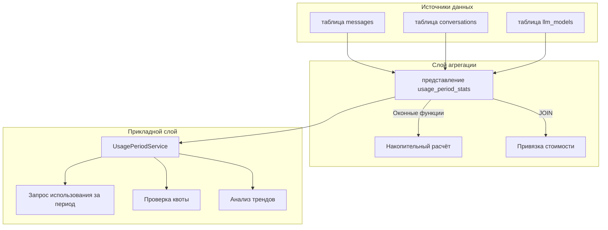

### Основная логика расчёта

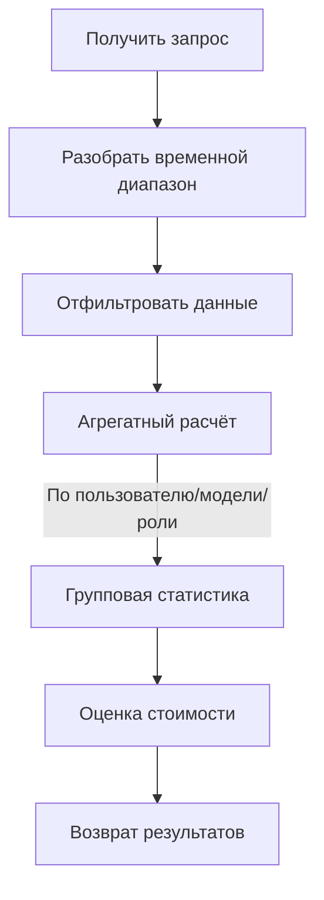

## Механизм контроля квот

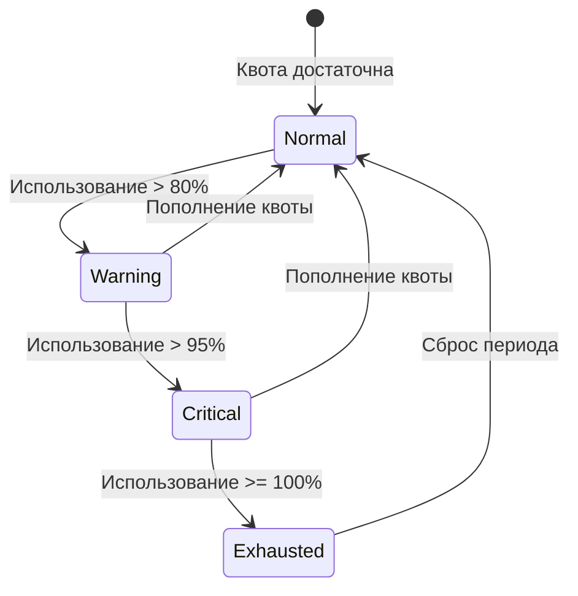

## Связь с другими модулями

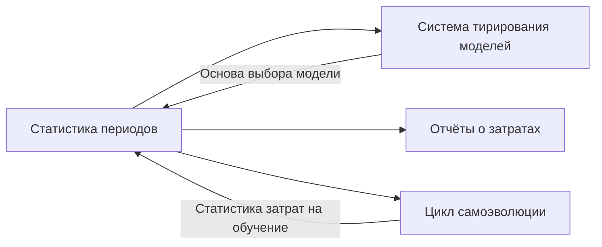

## Соображения по проектированию

### Оптимизация производительности

- Использование представлений базы данных для предварительной агрегации
- Оконные функции избегают избыточных вычислений
- Временные индексы ускоряют запросы по диапазонам

### Расширяемость

- Поддержка новых типов периодов
- Расширяемые измерения агрегации
- Гибкие модели расчёта стоимости

### Согласованность данных

- Представления только для чтения обеспечивают целостность данных
- Временные метки единообразно используют UTC
- Транзакции гарантируют атомарность записи

# Проектирование потока конфигурации LLM

## Обзор

Этот документ описывает полный поток настройки провайдеров LLM пользователем, включая взаимодействие с интерфейсом конфигурации, передачу данных, серверную обработку и использование в разговорах.

## Архитектура потока конфигурации

### Общий поток

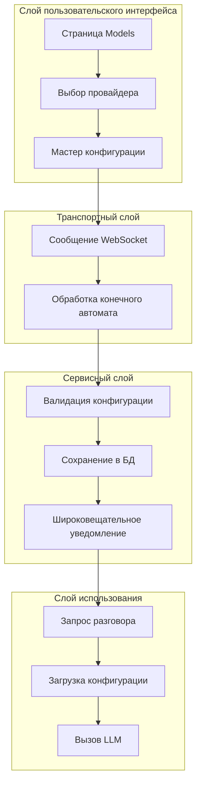

## Поток конфигурации провайдера

```text
### Последовательность шагов конфигурации

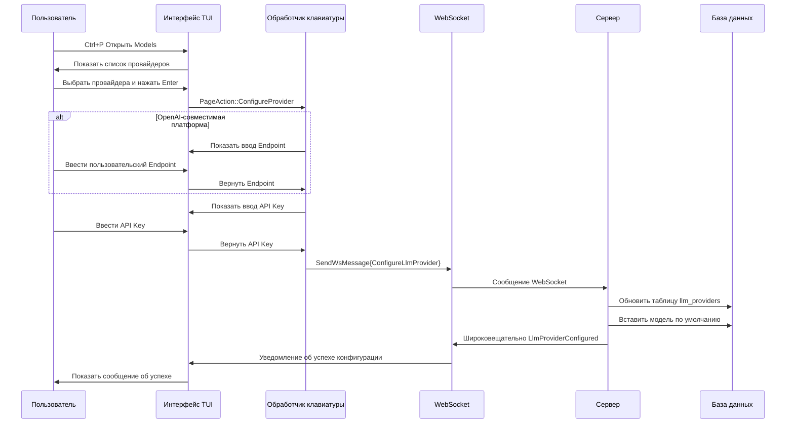

### Конечный автомат конфигурации

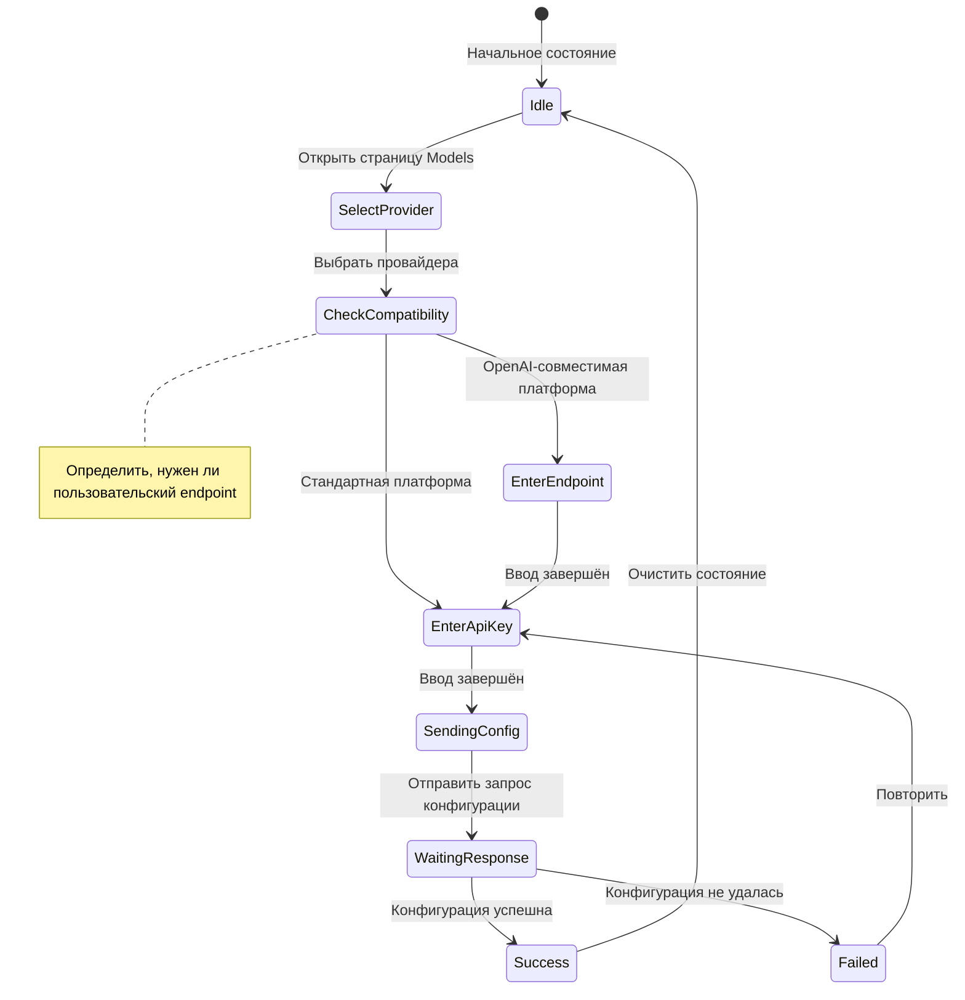

```text

## Поток использования в разговоре

### Последовательность вызова LLM

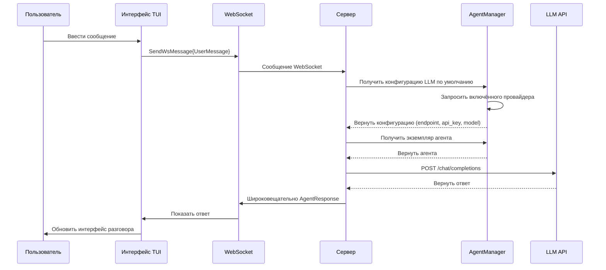

## Ключевые проектные решения

### Двухшаговый поток конфигурации

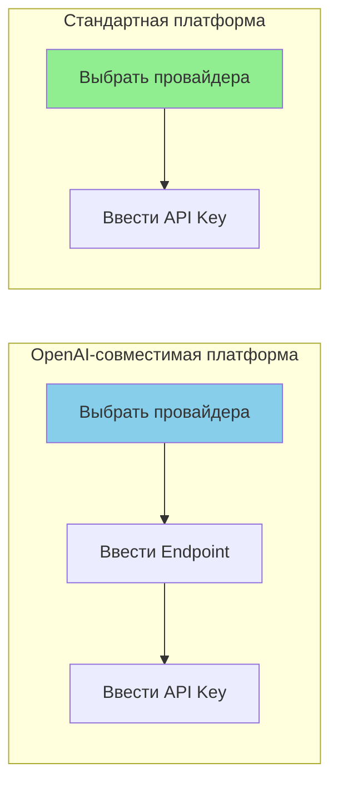

| Тип платформы | Шаги конфигурации | Причина |
| --- | --- | --- |
| OpenAI-совместимая | Endpoint + API Key | Нужен пользовательский сервисный endpoint |
| Стандартная платформа | Только API Key | Использовать официальный endpoint |

### Управление состоянием конфигурации

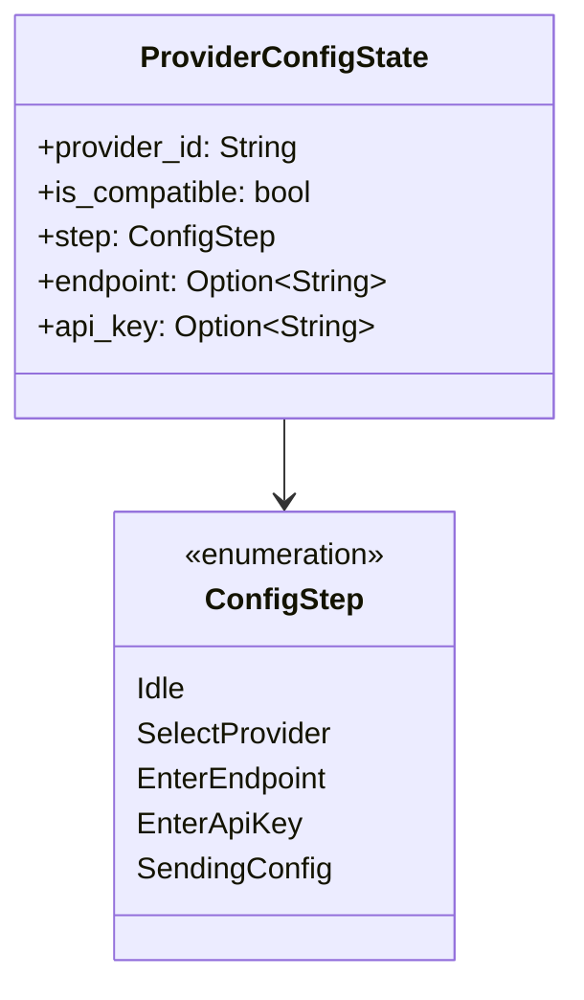

### Автовставка модели по умолчанию

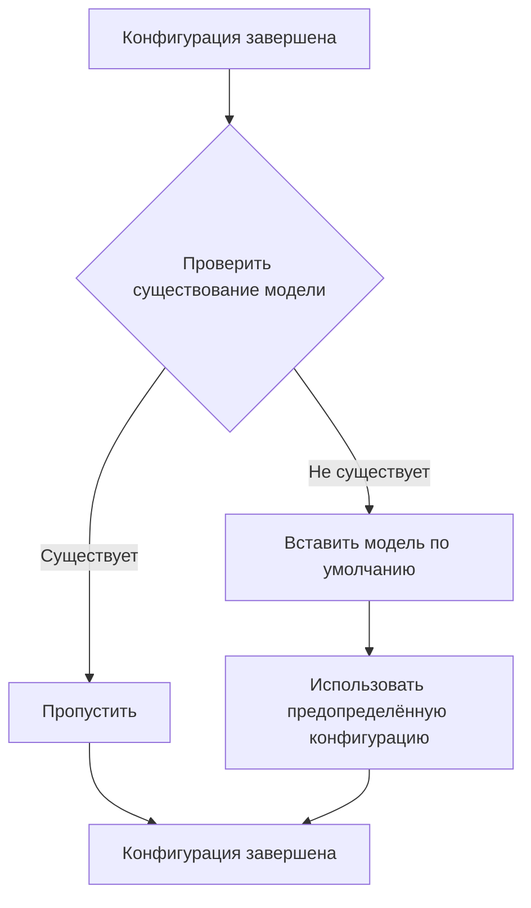

## Оптимизация производительности

### Стратегия кэширования конфигурации

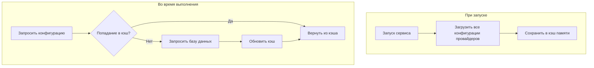

### Управление пулом соединений

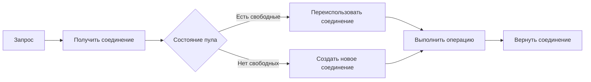

## Обработка ошибок

### Валидация пользовательского ввода

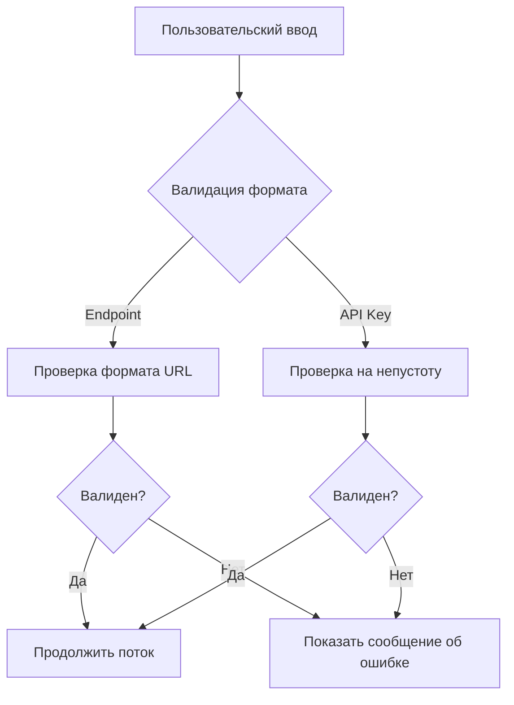

### Обработка сетевых ошибок

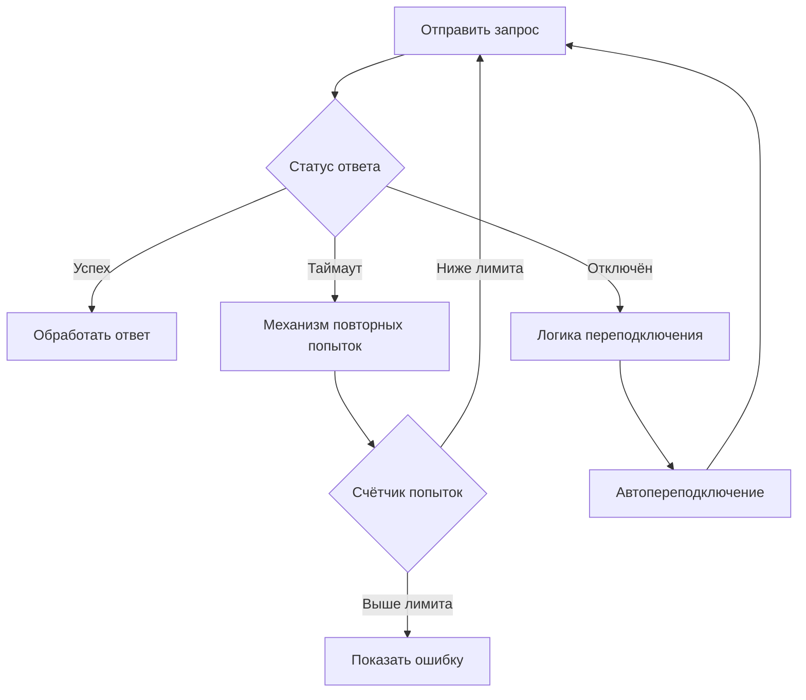

## Соображения безопасности

### Защита API Key

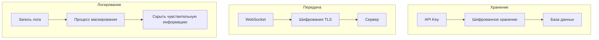

### Меры безопасности

| Этап | Мера | Описание |
| --- | --- | --- |
| Хранение | Шифрованное хранение | Шифрование API Key в базе данных |
| Передача | Шифрование TLS | WebSocket использует шифрованный канал |
| Логирование | Маскирование | Не логировать Key в открытом виде |
| Ввод | Параметризованные запросы | Предотвращение SQL-инъекций |

## Проектирование расширяемости

### Добавление нового провайдера

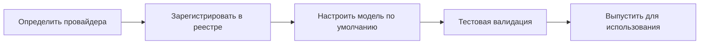

### Поддержка нескольких провайдеров

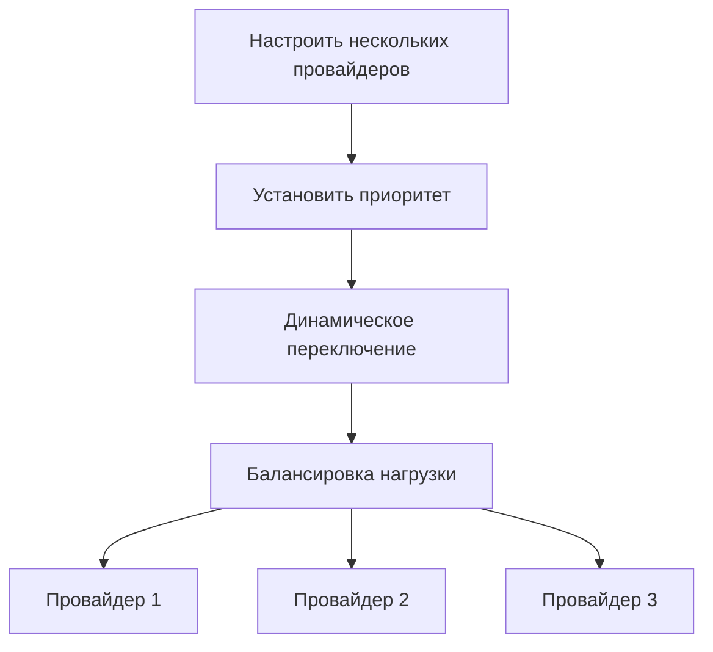

## Определение типов сообщений

### Сообщения WebSocket

| Тип сообщения | Направление | Описание |
| --- | --- | --- |
| ConfigureLlmProvider | TUI → Сервер | Запрос конфигурации |
| LlmProviderConfigured | Сервер → TUI | Результат конфигурации |
| UserMessage | TUI → Сервер | Разговор пользователя |
| AgentResponse | Сервер → TUI | Ответ агента |

## Планирование на будущее

| Функция | Описание | Приоритет |
| --- | --- | --- |
| Импорт/экспорт конфигурации | Поддержка миграции файлов конфигурации | Высокий |
| Проверка здоровья провайдера | Периодическое обнаружение доступности провайдера | Средний |
| Авто-аварийное переключение | Автопереключение при недоступности провайдера | Средний |
| Интеграция статистики использования | Связь с системой статистики использования | Низкий |

# Механизм внедрения MCP-промпта и сжатия контекста

## Обзор

Этот документ описывает два ключевых архитектурных решения: механизм обязательного внедрения промпта инструментов MCP и механизм сжатия контекста на основе маркеров Todo. Эти два механизма работают вместе для стандартизации поведения агентов и оптимизации управления контекстом в сценариях длительных разговоров.

## I. Внедрение документации инструментов MCP (Exec-Only)

### Основная концепция

В архитектуре микроядра exec-only LLM получает только **три определения инструментов**: `exec`, `write_to_var` и `write_to_var_json`. Инструменты MCP являются внутренними API, вызываемыми через среду выполнения JS команды exec. Документация инструментов MCP внедряется в промпт навыка как документация JS API через механизм `related_tools` — не как отдельные определения инструментов, отправляемые LLM.

```mermaid
flowchart LR
    A[Навык related_tools] --> B[McpToolDocLoader]
    B --> C[Чтение параметров TOML + описания MD]
    C --> D[Форматирование как документация JS API]
    D --> E[Внедрение в системный промпт]

    style D fill:#90EE90
```

### Ключевые характеристики

| Характеристика | Описание |
| --- | --- |
| Поверхность только exec | LLM видит только `exec`, `write_to_var`, `write_to_var_json`; инструменты MCP никогда не раскрываются как определения инструментов |
| Ограничено навыком | Документация инструментов внедряется для каждого навыка через `related_tools`, а не глобально |
| Формат JS API | Документация форматируется как `ES module import API reference — description` |
| Внутренняя маршрутизация | McpToolRegistry привязан к агенту, но используется только для внутренней диспетчеризации |

### Мотивация проектирования

```mermaid
flowchart TB
    subgraph Проблемные сценарии
        A[Слишком много определений инструментов раздувает контекст]
        B[Внедрение промпта для каждого инструмента хрупко]
        C[LLM путается от изобилия инструментов]
    end

    subgraph Решения
        D[Поверхность из трёх инструментов: exec, write_to_var, write_to_var_json]
        E[Документация MCP как ссылки JS API]
        F[Внедрение related_tools в рамках навыка]
    end

    A --> D
    B --> E
    C --> F
```

### Поток внедрения

```mermaid
sequenceDiagram
    participant Skill as Навык (related_tools)
    participant Loader as McpToolDocLoader
    participant MCP as Конфигурация инструмента MCP (TOML + MD)
    participant Prompt as Системный промпт

    Skill->>Loader: Список имён связанных инструментов
    Loader->>MCP: Чтение параметров TOML + описания MD
    MCP-->>Loader: Метаданные инструмента

    Loader->>Loader: Форматирование как ES module import API reference — description
    Loader->>Prompt: Внедрение в секцию навыка системного промпта

    Note over Prompt: LLM видит только инструмент exec<br/>Документация MCP отображается как ссылки JS API
```

### Формат внедрения

Документация каждого инструмента MCP форматируется как ссылка JS API:

$agent.todo_list_view() — Просмотр текущей структуры дерева задач
$agent.todo_create({ title: String, description: String }) — Создание нового элемента задачи
$agent.todo_update_status({ `todo_id`: String, status: String }) — Обновление статуса элемента задачи

### Пример конфигурации

```mermaid
flowchart TB
    subgraph Навык related_tools
        A[TOML навыка: поле related_tools]
        A --> A1["[tool_name]"]
        A1 --> B[todo_list_view]
        A1 --> C[todo_create]
        A1 --> D[todo_update_status]
    end

    subgraph McpToolDocLoader
        E[Чтение параметров TOML]
        F[Чтение описания MD]
        G[Форматирование как документация JS API]
    end

    B --> E
    C --> E
    D --> E
    E --> F --> G
```

### Уровни разрешений

Каждая запись `[[related_tools]]` может опционально объявить `access_mode`:

[[`related_tools`]]
`agent_name` = "polemos"
`tool_name` = "`node_execute`"
`access_mode` = "read"       # Навыку нужен только доступ уровня чтения (по умолчанию: "read")

Шлюз двойной авторизации проверяет, что:

1. Объявленный `ToolCapability` инструмента поддерживает запрошенный `access_mode`
1. `TrustLevel` целевого узла разрешает операцию
1. Для внешних узлов применяется дополнительное ограничение по уровню риска

См. `docs/design/en/22-mcp-tool-permission-model.md` для полной информации.

### Преимущества и компромиссы

```mermaid
graph TB
    subgraph Преимущества
        A[Минимальная поверхность инструментов]
        B[Документация в рамках навыка]
        C[Согласованный формат API]
        D[Гибкость внутренней маршрутизации]
    end

    subgraph Компромиссы
        E[LLM должен конструировать JS-вызовы]
        F[Отладка требует трассировки exec]
        G[related_tools должны поддерживаться]
    end
```

## II. Механизм сжатия контекста на основе маркеров Todo

### Основная концепция

Традиционное сжатие основано на суммаризации текста, что приводит к потере ключевых деталей. Новый механизм переходит к маркировке ключевых элементов Todo, сохраняя исходные детали как пользовательский ввод, напрямую продолжая выполнение исходного навыка.

```mermaid
flowchart LR
    subgraph Традиционный способ
        A1[Контекст] --> B1[Текст резюме]
        B1 --> C1[Новый разговор]
        C1 --> D1[Возможна потеря деталей]
    end

    subgraph Способ с маркерами Todo
        A2[Контекст] --> B2[Отметить ключевые Todo]
        B2 --> C2[Сохранить исходные детали]
        C2 --> D2[Без потери информации]
    end
```

### Сравнение мотивации проектирования

| Проблемы традиционного способа | Преимущества маркеров Todo |
| --- | --- |
| Потеря информации | Сохранение оригинала |
| Семантический дрейф | Отслеживаемость |
| Невозможность проверки | Проверяемость |
| Инвалидация навыка | Непрерывность навыка |

### Поток сжатия

```mermaid
sequenceDiagram
    participant User as Пользователь
    participant Agent as Исходный агент
    participant Marker as Маркер Todo
    participant NewAgent as Новый агент
    participant TodoMCP as Todo MCP

    User->>Agent: Запросить сжатие контекста
    Agent->>Marker: Получить ключевые элементы Todo

    Note over Marker: Применить стратегию маркировки

    Marker-->>Agent: Список отмеченных элементов
    Agent->>TodoMCP: Пакетное получение деталей
    TodoMCP-->>Agent: Детали Todo

    Agent->>NewAgent: Начать новую сессию

    Note over NewAgent: Системный промпт = Исходный навык<br/>Пользовательский ввод = Детали Todo

    NewAgent->>TodoMCP: Просмотр дерева Todo
    Note over NewAgent: Найти детали уже во вводе<br/>Продолжить напрямую
```

### Стратегии маркировки

```mermaid
flowchart TB
    subgraph Типы стратегий
        A[Ручная маркировка]
        B[AutoCritical — Критический путь]
        C[AutoUnfinished — Незавершённые задачи]
        D[Гибридная стратегия]
    end

    A --> A1[Пользователь выбирает ключевые элементы]
    B --> B1[Автоопределение основной цепочки задач]
    C --> C1[Отметить все незавершённые элементы]
    D --> D1[Комбинирование нескольких стратегий]
```

### Сравнение стратегий

| Стратегия | Отмеченное содержимое | Применимые сценарии |
| --- | --- | --- |
| Ручная | Указано пользователем | Точное управление |
| AutoCritical | Основная цепочка задач + блокирующие задачи | Сложные задачи |
| AutoUnfinished | Все незавершённые задачи | Простое восстановление |
| Гибридная | Комбинированная + пользовательские отметки | Общие сценарии |

### Структура отмеченного элемента

```mermaid
classDiagram
    class MarkedTodoItem {
        +todo_id: String
        +include_depth: u32
        +include_ancestors: bool
        +include_artifacts: bool
    }

    class MarkerStrategy {
        <<enumeration>>
        Manual
        AutoCritical
        AutoUnfinished
        Hybrid
    }

    class TodoMarker {
        +marked_items: List~MarkedTodoItem~
        +marker_strategy: MarkerStrategy
        +mark_critical_todos()
    }

    TodoMarker --> MarkedTodoItem
    TodoMarker --> MarkerStrategy
```

## III. Совместная работа двух механизмов

### Поток совместной работы

```mermaid
sequenceDiagram
    participant User as Пользователь
    participant OldAgent as Старый агент
    participant Marker as Маркер Todo
    participant Loader as McpToolDocLoader
    participant NewAgent as Новый агент

    Note over OldAgent: Контекст близок к пределу

    User->>OldAgent: Сжать контекст
    OldAgent->>Marker: Отметить ключевые Todo
    Marker-->>OldAgent: Список отмеченных элементов

    OldAgent->>NewAgent: Создать новую сессию

    Note over NewAgent: Системный промпт = Soul + Навык<br/>related_tools загружены McpToolDocLoader

    NewAgent->>Loader: Загрузить документацию инструментов для related_tools
    Loader-->>NewAgent: Форматированная документация JS API

    Note over NewAgent: Системный промпт содержит:<br/>1. Идентичность Soul<br/>2. Шаблон навыка + документация related_tools<br/>3. Три инструмента: exec, write_to_var, write_to_var_json

    NewAgent->>NewAgent: Выполнение через среду выполнения JS exec
    Note over NewAgent: Инструменты MCP — внутренние API<br/>Найти детали уже во вводе

    NewAgent-->>User: Бесшовное продолжение задачи
```

### Ключевые точки совместной работы

```mermaid
flowchart TB
    subgraph Механизм совместной работы
        A[McpToolDocLoader внедряет документацию JS API]
        B[Marker предоставляет полный контекст]
        C[Soul + промпт навыка сохранены]
    end

    A --> D[Навык имеет ссылки JS API для инструментов MCP]
    B --> E[Предоставлена достаточная полная информация]
    C --> F[Согласованность поведения поддерживается]

    D --> G[Бесшовное продолжение задачи]
    E --> G
    F --> G
```

## IV. Дорожная карта реализации

```mermaid
flowchart LR
    subgraph Фаза 1 — Высокий приоритет
        A[Внедрение MCP-промпта]
        A --> A1[Структура данных]
        A --> A2[Логика внедрения]
        A --> A3[Управление конфигурацией]
    end

    subgraph Фаза 2 — Средний приоритет
        B[Механизм маркеров Todo]
        B --> B1[Стратегия маркировки]
        B --> B2[Восстановление при сжатии]
        B --> B3[Ручная маркировка]
    end

    subgraph Фаза 3 — Низкий приоритет
        C[Умная стратегия]
        C --> C1[AutoCritical]
        C --> C2[Гибридная]
        C --> C3[Умные предложения]
    end
```

## V. Оценка рисков и смягчение

### Матрица рисков

| Риск | Влияние | Меры смягчения |
| --- | --- | --- |
| Слишком большие накладные расходы токенов | Деградация производительности | Ограничение количества отметок, настраиваемый уровень сжатия |
| Слишком строгий промпт | Снижение гибкости | Предоставление механизма обхода, руководство по обработке исключений |
| Неточная стратегия маркировки | Пропуск информации | Ручное переопределение, визуальное подтверждение |

### Поток обработки ошибок

```mermaid
flowchart TB
    A[Операция не удалась] --> B{Тип ошибки}
    B -->|Превышение токенов| C[Обрезать некритические элементы]
    B -->|Стратегия не удалась| D[Возврат к ручному режиму]
    B -->|Внедрение не удалось| E[Использовать поведение по умолчанию]

    C --> F[Повторить операцию]
    D --> F
    E --> F
```

## VI. Интеграция конфигурации

### Общая структура конфигурации

```mermaid
flowchart TB
    subgraph Конфигурация навыка
        A[related_tools]
        B[список tool_names]
    end

    subgraph Конфигурация сжатия
        C[enabled]
        D[default_strategy]
        E[trigger_threshold]
    end

    subgraph Конфигурация стратегии
        F[include_critical_path]
        G[include_unfinished]
        H[max_marked_items]
    end

    A --> I[Генерация документации JS API]
    C --> J[Управление сжатием]
    F --> K[Правила маркировки]
```

## VII. Будущие расширения

| Функция | Описание | Приоритет |
| --- | --- | --- |
| Динамическая генерация промпта | Корректировка ограничений в зависимости от сложности задачи | Средний |
| Многосессионное разделение | Несколько агентов разделяют маркеры Todo | Средний |
| Умные предложения маркировки | Авто-рекомендация отмеченных элементов | Низкий |
| Визуальный инструмент маркировки | Графический интерфейс маркировки | Низкий |

## VIII. Дополнительное внедрение контекста RAG (v2.1+)

Внедрение инструментов MCP, описанное в разделах I-VII, предоставляет LLM **ссылки API** — оно говорит LLM *как* вызывать инструменты. Дополнительный механизм, внедрение контекста RAG, предоставляет LLM **предварительно вычисленные знания** — он внедряет *результаты* запросов RAG напрямую в системный промпт.

| Аспект | Внедрение инструментов MCP | Внедрение контекста RAG |
| --- | --- | --- |
| Что получает LLM | Справочная документация API (импорты ES модулей) | Фактическое содержимое знаний (узлы памяти, документы рабочего пространства) |
| Когда внедряется | Для каждого навыка, на основе `related_tools` | Для каждого шага навыка, на основе контекста навыка |
| Участие LLM | LLM должен вызвать инструмент | Без участия LLM — предварительно вычислено |
| Влияние на задержку | N раундов (один на вызов) | 1 предварительное вычисление на шаг навыка |
| Модули IEPL | `{agent}` (диспетчеризация MCP) | `rag/{philia,aporia}` (чтение буфера) |

Оба механизма сосуществуют: инструменты MCP остаются доступными как резервный вариант для запросов, которые не покрывает предварительно вычисленный контекст. См. `docs/design/en/26-rag-context-injection.md` для полного проекта.

# Проектирование двойной идентичности агентов и границ видимости

## Цели

- Полностью отделить видимые экземпляры выполнения навыков от внутренних провайдеров инструментов MCP/LLM.
- Разрешить только вызовам навыков создавать временные видимые агенты с трёхзначными значками.
- Приписывать использование модели и токенов MCP/LLM связанному экземпляру навыка вместо создания дополнительных видимых агентов.
- Сохранять идентичность UUID времени выполнения для аудита, истории и воспроизведения, не допуская её утечки во временную шкалу TUI.

## Слои идентичности

- `agent_number`: трёхзначный значок, видимый в UI, и стабильный ключ для узлов видимой временной шкалы.
- `agent_uuid`: UUID времени выполнения, используемый для реестра, аудита и истории.
- `agent_id`: поле совместимости.
  - В видимых полезных данных TUI `agent_id` должен совпадать с видимым на панели `agent_number`.
  - Во внутренних реестрах и путях выполнения MCP `agent_id` может оставаться в стиле UUID.

## Правила видимости и создания экземпляров

- Только вызовы навыков создают временные видимые экземпляры агентов.
- Провайдеры SimpleTool/MCP не должны создавать дополнительные видимые агенты только потому, что один из их инструментов был вызван.
- Когда навык использует инструменты MCP или внутренний вызов `llm_chat`, эти вызовы остаются подчинённым выполнением в рамках этого экземпляра навыка.
- Пример: если HubRis вызывает `llm_chat` ApoRia, ApoRia остаётся внутренним исполнителем и не должен появляться как второй видимый узел на временной шкале в правом верхнем углу.

## Правила атрибуции MCP и LLM

- Если вызов MCP/LLM принадлежит видимому экземпляру навыка, его имя модели и использование токенов должны быть приписаны этому экземпляру навыка.
- Внутренние провайдеры могут вести собственный аудит или глобальный учёт, но эта внутренняя статистика не должна вызывать создание узлов TUI.
- Логи и контекст MCP должны сохранять:
  - `agent_number`
  - `agent_uuid`
  - `tool_name`
  - `phase` (`start`/`finish`)
  - `success` и `error`

## Контракт отрисовки TUI

- TUI создаёт узлы временной шкалы только для явных трёхзначных идентификаторов панели.
- Полезные данные без видимого `agent_number` могут обновлять только глобальную статистику модели/токенов и не должны создавать видимые узлы агентов.
- Метки отображения и ключи узлов никогда не должны извлекать видимый значок из UUID или произвольных цифр, найденных внутри `agent_id`.
- Для видимых узлов:
  - `agent_number` используется для отображения и взаимодействия.
  - `agent_uuid` сохраняется только для аудита, истории и отладки.

## Выделение и жизненный цикл значков

- `agent_number` выделяется случайным образом из доступного пула `000`-`999`, а не назначается последовательно.
- Освобождённые номера могут быть переиспользованы.
- Когда все 1000 значков активны, распределитель может прибегнуть к случайному переиспользованию; историческое различение должно тогда опираться на `agent_uuid`.
- Очистка видимых экземпляров и возврат значков обрабатываются менеджером жизненного цикла навыков.

## Ограничения совместимости

- Устаревшие полезные данные, содержащие только `agent_id`, могут по-прежнему разбираться внутренне, но видимый UI не должен синтезировать новые узлы из идентификаторов в стиле UUID.
- Когда присутствуют и `agent_number`, и `agent_uuid`, применяется модель двойной идентичности:
  - `agent_number` для отображения и взаимодействия.
  - `agent_uuid` для аудита и истории.

# Архитектура параллелизма запросов

## Обзор

Scepter управляет двумя независимыми слоями параллелизма:

```mermaid
flowchart LR
    User["Запросы пользователей"] --> Semaphore["Семафор запросов"]
    Semaphore --> Cosmos["Контейнеры Cosmos"]
    Cosmos --> Queue["Очередь уровней (RequestPool)"]
    Queue --> LLM["LLM API"]
```

## Аналогия

Представьте ресторан:

- **Посетители** (запросы пользователей) приходят и делают заказы одновременно
- **Столики** (контейнеры Cosmos) создаются для каждого запроса — каждый получает своё рабочее пространство
- **Кухонные станции** (параллелизм провайдера LLM) ограничены — возможно, всего 3
- **Система талонов** (очередь уровней `RequestPool`) управляет порядком FIFO для каждого уровня

30 посетителей могут заказать одновременно (scepter принимает несколько запросов), но кухня может готовить только 3 блюда одновременно (ограничение скорости LLM API).

## Слой 1: Семафор запросов

**Расположение**: `state_machine/domains/control_domain.rs` — `concurrent_request_semaphore`

Управляет тем, сколько пользовательских запросов scepter принимает одновременно. Каждый запрос создаёт независимый контейнер Cosmos с собственным обработчиком LLM.

```mermaid
flowchart LR
    User1["Сообщение пользователя"] -->|"N = сумма max_concurrent всех моделей"| Semaphore["Semaphore(N)"]
    User2["Сообщение пользователя"] --> Semaphore
    User3["Сообщение пользователя"] --> Semaphore
    Semaphore --> Container1["Контейнер Cosmos + обработчик LLM"]
    Semaphore --> Container2["Контейнер Cosmos + обработчик LLM"]
    Semaphore --> Container3["Контейнер Cosmos + обработчик LLM"]
```

N = общее количество одновременных слотов для всех включённых моделей. Если модель A (3 слота) + B (2 слота) = 5 одновременных запросов.

Ранее это был `AtomicBool` (N=1), теперь это `Semaphore(N)`.

## Слой 2: Очередь уровней (RequestPool)

**Расположение**: `infra/request_pool.rs` — `RequestPool`

Очередь FIFO для каждого уровня с семафорами для каждой модели. Внутри уровня:

1. Входящие запросы LLM попадают в очередь уровня
1. Попытка получить слот на модели с наивысшим приоритетом
1. Если занята — попробовать следующую модель в порядке приоритета
1. Если все заняты — ожидать в очереди FIFO — какая модель освободится первой, та и обслуживает следующий запрос

```mermaid
flowchart TB
    subgraph Tier["Уровень: 'normal'"]
        direction TB
        Queue["Очередь FIFO: req1 → req2 → req3 → req4"]
        MA["Модель A (приоритет 10): Semaphore(3) ■■□"]
        MB["Модель B (приоритет 5):  Semaphore(2) □□"]
        MC["Модель C (приоритет 1):  Semaphore(1) ■"]
        Queue -->|"req1 → Модель A (доступна)"| MA
        Queue -->|"req2 → Модель B (доступна, A занята)"| MB
        Queue -->|"req3 → ожидание... Модель A освобождается → обслужить"| MA
        Queue -->|"req4 → ожидание... Модель C освобождается → обслужить"| MC
    end
```

### Ключевые свойства

- **Изоляция провайдеров**: `max_concurrent` каждой модели независим
- **Приоритетный порядок**: Модели с более высоким приоритетом предпочитаются, когда доступны
- **Резервный вариант**: Если модель с высоким приоритетом насыщена, модели с низким приоритетом обслуживают немедленно
- **Справедливость FIFO**: Ожидающие запросы обслуживаются в порядке поступления

### Конфигурация

\# provider_config.toml
[[models]]
id = "gpt-5.4"
tier = "normal"
priority = 10
`max_concurrent` = 3        # 3 одновременных вызова API к этой модели

[[models]]
id = "gpt-4o-mini"
tier = "normal"
priority = 5
`max_concurrent` = 5        # 5 одновременных вызовов API

[[models]]
id = "deepseek-v3"
tier = "deep"
priority = 8
`max_concurrent` = 2

С этой конфигурацией:

- Уровень `normal`: Модель A (3 слота) + Модель B (5 слотов) = 8 одновременных вызовов LLM уровня normal
- Уровень `deep`: Модель C (2 слота) = 2 одновременных вызова LLM уровня deep
- Семафор запросов: 3 + 5 + 2 = 10 одновременных пользовательских запросов

## Поток: Сообщение пользователя → Ответ LLM

```text
    1. Пользователь отправляет сообщение через TUI/CLI/сокет
    1. `handle_user_message`():

a. `try_acquire`() на семафоре запросов (Слой 1)

          - Если нет слотов: вернуть ошибку "занято"
          - Каждый слот → независимый контейнер Cosmos

b. `execute_skill_chain`() → `invoke_aporia_llm_chat`()

    1. `invoke_aporia_llm_chat`():

a. `acquire_tier`("normal", `excluded_models`) на `RequestPool` (Слой 2)

          - Попробовать каждую модель в порядке приоритета (неблокирующий)
          - Если все заняты: ожидать в FIFO, пока любой слот модели не освободится
          - Возвращает TierPermit { `model_id`, `display_name` }

b. `chat_loop` → llm_backend.chat() → LlmService::`chat_with_tools`()

          - Использует выбранную модель для вызова API

c. TierPermit сброшен → слот семафора освобождён

    1. `finish_handling`():

a. Разрешение семафора запросов возвращено
b. Контейнер Cosmos может быть очищен (или переиспользован)

```

## E2E тестирование

Тесты используют таймаут бездействия (а не абсолютный дедлайн). Таймер сбрасывается при каждом значимом событии:

\# Активность сбрасывает таймер бездействия — цепочка может работать бесконечно, пока остаётся активной
ACTIVE_METHODS = {
"Tui.`OrchestrationStatus`",
"Tui.`McpToolResult`",
"Tui.`AgentReport`",
"Tui.`AgentStreamingChunk`",
"Tui.`TaskStatusUpdate`",
"Tui.`AskHumanRequest`",
"Tui.AgentPatch",
"Tui.`ContainerSnapshot`",
}

Это обеспечивает:

- Короткий таймаут бездействия (120с) отлавливает действительно зависшие цепочки
- Длительные, но активные цепочки (сложные multi-skill) никогда не завершаются преждевременно

# Встроенная база данных для разработки и feature-gated изоляция в production

## Обзор

entelecheia использует [pglite-oxide](https://crates.io/crates/pglite-oxide) как встроенный PostgreSQL для двух целей:

1. **Локальная разработка**: Когда `DATABASE_URL` не настроен, scepter автоматически запускает внутрипроцессный PostgreSQL (PG 17.5 через WASM/wasmer) с поддержкой pgvector.
1. **Интеграционные тесты**: Интеграционные тесты PG используют pglite-oxide вместо Docker/testcontainers.

В production (Docker) функция `embedded-db` исключена, и scepter подключается к реальному контейнеру PostgreSQL.

## Мотивация проектирования

Ранее локальная разработка требовала либо Docker Compose, либо ручной установки PostgreSQL. Интеграционные тесты полагались на `testcontainers`, добавляя сложность Docker-в-Docker в CI. pglite-oxide устраняет оба требования — `cargo run` «просто работает» для локальной разработки, а `cargo test` работает без Docker.

## Архитектура feature gate

```mermaid
flowchart TB
    Cargo["scepter Cargo.toml<br/>[features] default = ['all-agents', 'embedded-db']  ← dev<br/>embedded-db = ['dep:pglite-oxide']<br/>[dependencies] pglite-oxide = { workspace = true, optional = true }"]

    Cargo -->|"cargo build (default)"| Dev["pglite-oxide + wasmer WASM<br/>включены"]
    Cargo -->|"Dockerfile<br/>--no-default-features<br/>--features all-agents"| Prod["Нет pglite, нет wasmer<br/>(production)"]
```

| Контекст сборки | Команда | pglite-oxide | wasmer | DATABASE_URL |
| --- | --- |  ---  |  ---  | --- |
| `cargo run` (локальная разработка) | функции по умолчанию | ✓ | ✓ | Опционально — авто-запуск встроенной PG, если отсутствует |
| `cargo test` (тесты) | функции по умолчанию | ✓ | ✓ | Авто-запуск тестовым окружением |
| `just build` (релиз) | `--no-default-features --features all-agents` | ✗ | ✗ | Обязателен |
| Docker `Dockerfile` | `--no-default-features --features all-agents` | ✗ | ✗ | Обязателен (указывает на контейнер PG) |

## Порядок разрешения БД во время выполнения

```rust
// packages/scepter/src/app/setup.rs
let `db_url` = if let Ok(url) = std::env::var("DATABASE_URL") {
// 1. Переменная окружения (production: Docker PG, dev: файл .env)
url
} else if !user_config.database.url.is_empty() {
// 2. Файл конфигурации пользователя (~/.config/entelecheia/config.toml)
user_config.database.url.clone()
} else {
// 3. Встроенный pglite-oxide (feature-gated)
#[cfg(feature = "embedded-db")]
{
let server = `PgliteServer`::builder()
.extension(`pglite_oxide`::extensions::VECTOR)  // поддержка pgvector
.start()?;
let url = server.database_url();
std::mem::forget(server);  // сохранить живым на время жизни процесса
url
}
#[cfg(not(feature = "embedded-db"))]
{
return Err(/* "DATABASE_URL не настроен" */);
}
};
```

## Шаблон тестового окружения

```no_run
// tests/pg_integration/auth_test.rs
static PG: OnceCell<(String, PgliteServer)> = OnceCell::const_new();

# [test]
fn pg_integration_tests() {
    let rt = tokio::Runtime::new().unwrap();
    rt.block_on(async {
        let url = ensure_pg_url().await;
        let db = connect_db(&url).await;  // max_connections=1
        pg_user_crud(&db).await;
        pg_unique_username(&db).await;
        pg_rbac_role_persistence(&db).await;
        pg_rbac_audit_log(&db).await;
    });
    std::process::exit(0);  // обход зависания пула sqlx
}
```

## Создаваемые таблицы

Все 23 таблицы + 1 таблица в схеме + 4 представления создаются через миграции SeaORM:

**Ядро**: `users`, `rbac_user_roles`, `rbac_audit_log`, `agents`, `conversations`, `messages`, `tasks`
**Цели**: `goals`, `tracks`, `goal_tasks`
**Знания**: `knowledge_bases`, `knowledge_documents` (эмбеддинги pgvector), `rag_subscriptions`
**Консенсус**: `consensus_records`, `consensus_references`, `consensus_verifications`
**Инфраструктура**: `credentials`, `ssh_credentials`, `container_snapshots`, `model_usage_stats`
**Рабочее пространство**: `workspace_registry`, `todo_items`, `workspace_bindings`
**Логирование**: `log.entries` (отдельная схема `log`)
**Представления**: `usage_period_stats`, `usage_model_stats`, `usage_role_stats`, `usage_session_stats`

## Ограничения PGlite

```text
| Ограничение | Влияние | Смягчение |
| --- | --- | --- |
| `max_connections=1` | Только один пул одновременно | Общее соединение с БД между подтестами; без `db.close()` между тестами |
| Строгое приведение типов | `uuid = text` не работает | Всегда передавать типизированные значения (например, `Uuid`, а не `String` для столбцов UUID) |
| Отсутствие параллельного доступа | Тесты должны быть последовательными | Один `#[test]` runner со всеми подтестами внутри |
| Фоновые задачи пула sqlx | `close()` зависает бесконечно | `std::process::exit(0)` после завершения всех тестов |
```
## Усиление сборки Docker

Все production Dockerfile исключают embedded-db:

\# Dockerfile
RUN cargo build --release -p scepter \
--no-default-features --features all-agents

Это обеспечивает нулевой код wasmer/pglite в production-образах, сохраняя минимальный размер бинарного файла и уменьшая поверхность атаки.
