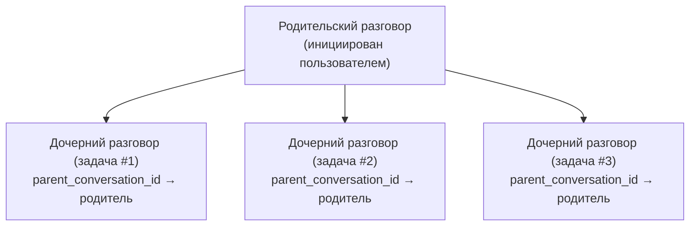

# ADR-004: Управление жизненным циклом хранения сессий

> **Статус**: Принято (2026-06-10)
> **Контекст**: entelecheia + shittim-chest
> **Вдохновлено**: [opencode #16101](https://github.com/anomalyco/opencode/issues/16101)

## Контекст

opencode (сопоставимый AI-агент для кодинга) накопил 9 ГБ истории чатов в БД всего за 2 месяца с потреблением ~30B токенов. Использование памяти регулярно превышало 30 ГиБ при загрузке всего ~10 проектов. Корневая причина — отсутствие управления жизненным циклом сессий: нет TTL, нет автоочистки, нет лимита хранения и нет освобождения после уплотнения.

entelecheia и shittim-chest сталкиваются с той же фундаментальной проблемой, если её не решить:

- **entelecheia**: Таблицы `conversations` и `messages` существовали, но никогда не наполнялись; фактический чат хранился как неограниченные TOML-лог-файлы; таблица `dialogue_events` имела CRUD-код, но не имела миграции; ограничения конфигурации (`MAX_DIALOGUE_HISTORY_LEN`, `MAX_DIALOGUE_RECORDS`, `DIALOGUE_TIMEOUT_MS`) были определены, но никогда не применялись.
- **shittim-chest**: Имеет работающую персистентность разговоров/сообщений, но без автоматической очистки истёкших сессий аутентификации, устаревших сессий рабочих пространств, истории круизов или логов доставки вебхуков.

## Решение

Внедрить унифицированную систему управления жизненным циклом хранения со следующими принципами:

### 1. У разговоров есть жизненный цикл, а не только рождение

- **TTL**: Разговоры, неактивные более `CONVERSATION_TTL_DAYS` (по умолчанию 90 дней), подлежат очистке после архивации.
- **Архивация перед удалением**: Разговоры должны быть архивированы (`is_archived = TRUE`) перед тем, как очистка TTL удалит их.
- **Дочерние сессии**: Родительско-дочерние связи разговоров отслеживаются через `parent_conversation_id`. Дочерние разговоры могут быть независимо архивированы и очищены после `CHILD_SESSION_RETENTION_DAYS` (по умолчанию 7 дней).

### 2. Очистка автоматическая, а не ручная

- **Фоновые задачи**: Периодическая очистка выполняется с настраиваемыми интервалами (`CLEANUP_INTERVAL_MINUTES`, по умолчанию 60).
- **Смешанная стратегия**: Сканирование при запуске + периодический таймер. Не требует вмешательства пользователя.
- **Идемпотентность**: Задачи очистки можно безопасно выполнять несколько раз.

### 3. Уплотнение обеспечивает освобождение хранилища

- Сообщения, помеченные как `is_compacted = TRUE`, имеют суммаризированное содержимое. Их детальное содержимое может быть очищено после периода хранения.
- Консервативно по умолчанию: очищать только содержимое уплотнённых сообщений, сохранять метаданные (имя инструмента, временные метки, количество токенов).

### 4. Конфигурация централизована

Все параметры жизненного цикла находятся в `StorageLifecycleConfig` (entelecheia) и `CleanupConfig` (shittim-chest), загружаются из переменных окружения с разумными значениями по умолчанию.

### 5. Файловые логи вторичны

- `CHAT_LOG_ENABLED` по умолчанию `false`. TOML-файлы логов чата предназначены только для отладки.
- Когда включено, файлы логов очищаются после `CHAT_LOG_RETENTION_DAYS` (по умолчанию 7).

## Изменения схемы

### Таблица conversations (entelecheia)

Добавлены столбцы:

- `parent_conversation_id UUID REFERENCES conversations(conversation_id)` — отслеживание дочерних сессий
- `is_archived BOOLEAN NOT NULL DEFAULT FALSE` — флаг архивации
- `archived_at TIMESTAMPTZ` — когда архивировано
- `metadata JSONB NOT NULL DEFAULT '{}'` — расширяемые метаданные

### Таблица messages (entelecheia)

Добавлены столбцы:

- `is_compacted BOOLEAN NOT NULL DEFAULT FALSE` — помечает уплотнённые сообщения, подлежащие очистке содержимого
- `metadata JSONB NOT NULL DEFAULT '{}'` — расширяемые метаданные

### Таблица dialogue_events (entelecheia)

Ранее имела CRUD-код, но не имела миграции `CREATE TABLE`. Теперь включена в `baseline_tables.sql`.

### Таблица rbac_sessions (entelecheia)

Новая таблица для персистентности сессий kirino (SQL-бэкенд).

## Фазы реализации

| Фаза | Описание | Статус |
| --- | --- | --- |
| 0.1 | Исправления миграции схемы (dialogue_events, обновление conversations/messages) | Готово |
| 1.2 | Унифицированное пространство имён конфигурации (`StorageLifecycleConfig`) | Готово |
| 0.2 | `ConversationStore` с CRUD + методами очистки | Готово |
| 2.1 | Общая инфраструктура `CleanupScheduler` | Готово |
| 2.2 | Задачи очистки entelecheia подключены в scepter `setup.rs` | Готово |
| 2.3 | Задачи очистки shittim-chest | Удалено (пакет не существует) |
| 1.3 | kirino `PgSessionManager` (SQL-бэкенд сессий) | Готово |
| 3.1 | Применение существующих лимитов диалогов (`max_dialogue_records`, `enforce_max_conversations`) | Готово |
| 3.2 | Отключение по умолчанию лог-файлов чата + очистка TTL | Готово |
| 4.1 | Команды управления CLI (`session stats`, `session purge`) | Готово |
| 5 | Каскад дочерних сессий + жизненный цикл сирот | Готово |

## Последствия

### Положительные

- Предотвращает неограниченный рост хранилища, от которого страдал opencode
- Разговоры имеют явный жизненный цикл: активный -> архивирован -> очищен
- Фоновая очистка не требует вмешательства пользователя
- Управляется конфигурацией с разумными значениями по умолчанию
- PostgreSQL VACUUM освобождает дисковое пространство после удаления (в отличие от SQLite, используемого opencode)

### Отрицательные

- Дополнительные фоновые задачи потребляют минимальные CPU/память
- Архивированные разговоры теряют детальное содержимое после TTL (по замыслу)
- Требуется мониторинг для обеспечения работы задач очистки

### Смягчённые риски

- **Потеря данных**: Архивация перед удалением предоставляет льготный период. Очистка удаляет только уже архивированные разговоры.
- **Влияние на производительность**: Очистка выполняется с настраиваемыми интервалами, использует индексированные запросы по `updated_at`/`created_at`.
- **Осиротение дочерних сессий**: `parent_conversation_id` отслеживает связи; TTL сирот короче (30 дней против 90 дней).

## Проектирование жизненного цикла дочерних сессий (Фаза 5)

### Проблема

Выпуск opencode #16101 показал, что 86% сессий являются дочерними сессиями, порождёнными `task()`, и составляют 75% хранилища. Эти дочерние сессии накапливаются без независимого управления жизненным циклом.

### Архитектура



### Правила жизненного цикла

1. **Создание**: Когда цепочка навыков порождает подзадачу, создаётся новый разговор с `parent_conversation_id`, установленным в `conversation_id` родителя.

1. **Независимая архивация**: Дочерние разговоры могут быть архивированы независимо от родителя. Когда дочерняя задача завершена, она автоматически архивируется после `CHILD_SESSION_RETENTION_DAYS` (по умолчанию 7 дней).

1. **Каскад при архивации родителя**: Когда родитель архивируется, все дочерние архивируются. Когда родитель удаляется, все дочерние удаляются.

1. **Обработка сирот**: Разговоры с `parent_conversation_id`, указывающим на удалённого/несуществующего родителя, рассматриваются как сироты и очищаются после `ORPHAN_CONVERSATION_TTL_DAYS` (по умолчанию 30 дней).

1. **Право на уплотнение**: Дочерние разговоры подлежат уплотнению сообщений сразу после архивации (без льготного периода), поскольку родитель сохраняет сводку.

### Запросы очистки

```sql
-- Архивировать дочерние, чей родитель архивирован
UPDATE conversations SET is_archived = TRUE, archived_at = NOW()
WHERE parent_conversation_id IN (
    SELECT conversation_id FROM conversations WHERE is_archived = TRUE
) AND is_archived = FALSE;

-- Удалить дочерние, чей родитель удалён
DELETE FROM conversations WHERE parent_conversation_id IS NOT NULL
    AND parent_conversation_id NOT IN (SELECT conversation_id FROM conversations);

-- Удалить архивированные дочерние старше срока хранения
DELETE FROM conversations WHERE is_archived = TRUE
    AND archived_at < NOW() - (CHILD_SESSION_RETENTION_DAYS || ' days')::interval
    AND parent_conversation_id IS NOT NULL;
```

### Статус реализации

- Столбец `parent_conversation_id` существует в таблице `conversations` (Фаза 0.1)
- `ConversationStore.cleanup_expired_conversations()` обрабатывает очистку на основе TTL (Фаза 0.2)
- `StorageLifecycleConfig.child_session_retention_days` и `orphan_conversation_ttl_days` настроены (Фаза 1.2)
- Каскадные запросы реализованы в `ConversationStore`:
  - `cascade_archive_children()` — архивирует дочерние при архивации родителя
  - `cascade_delete_orphaned_children()` — удаляет дочерние, чей родитель был удалён
  - `cleanup_expired_child_conversations()` — очистка на основе TTL для архивированных дочерних
  - `cleanup_orphan_conversations()` — очистка дочерних с отсутствующим родителем
  - `enforce_max_dialogue_records()` — жёсткий лимит на количество `dialogue_events`
  - `enforce_max_conversations()` — жёсткий лимит на количество активных разговоров
- Все зарегистрированы как периодические задачи очистки в scepter `setup.rs`
