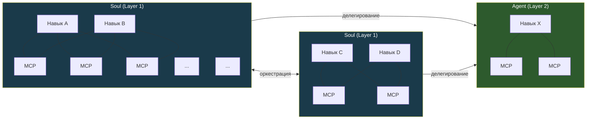
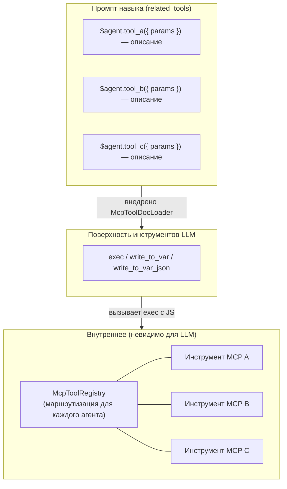
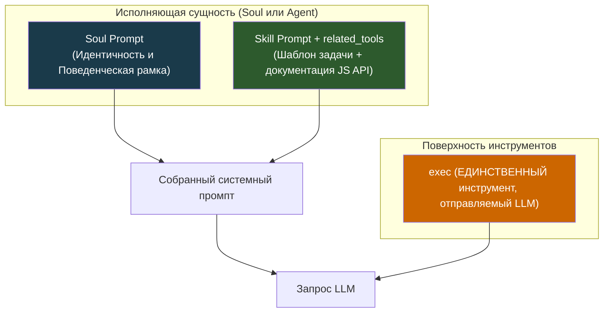
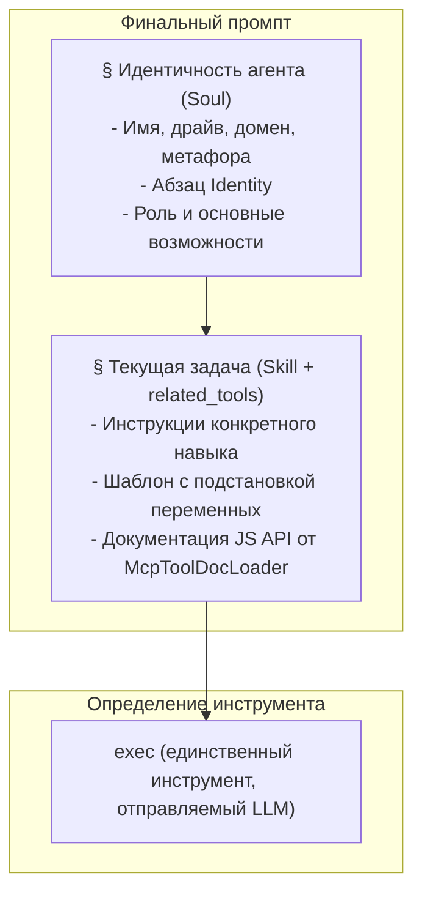
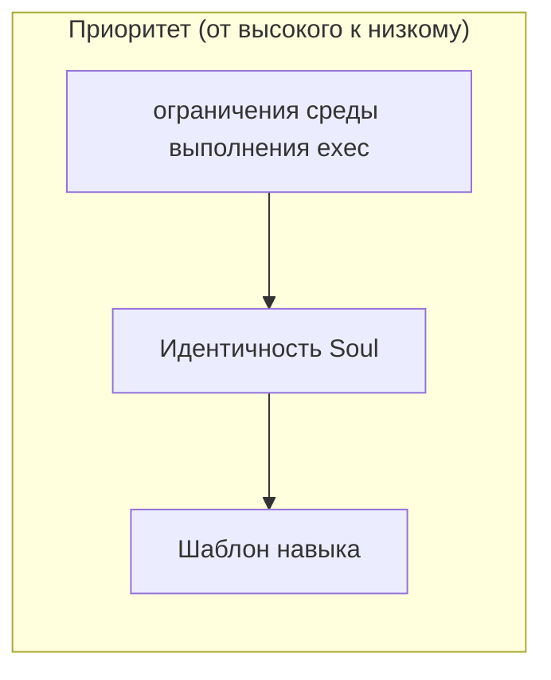
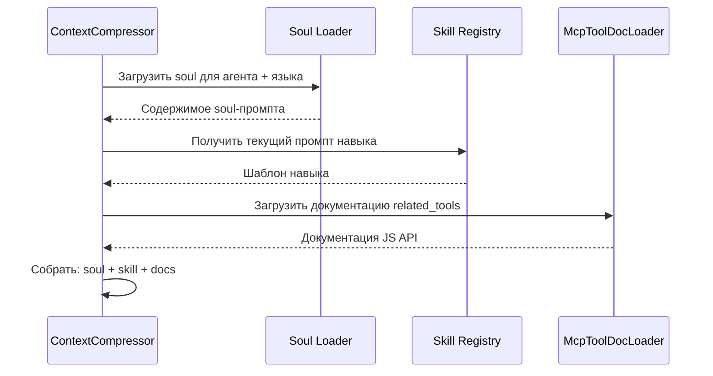
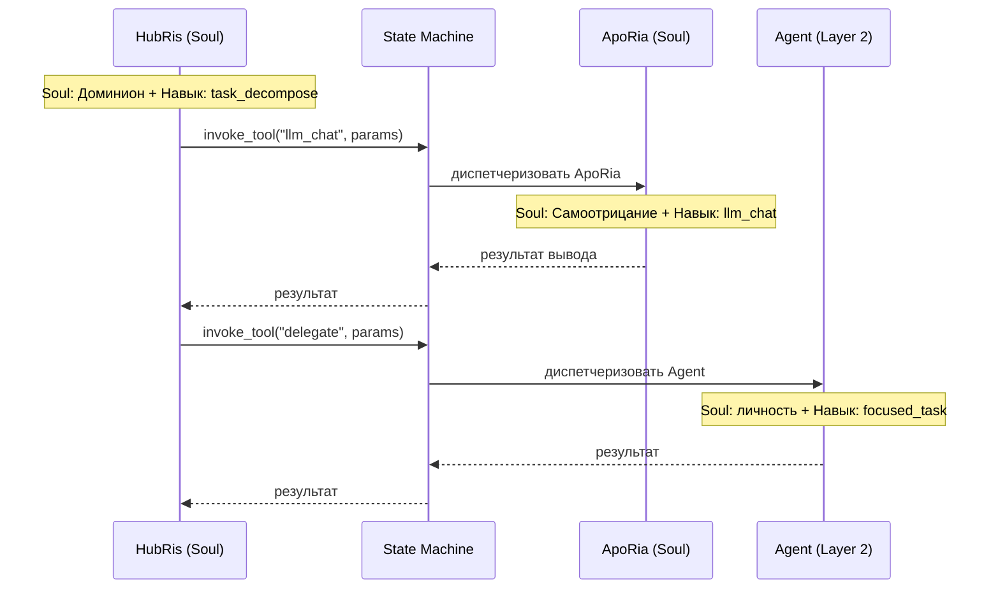

# Архитектура Soul-промпта

## Предыстория

Каждый Агент имеет **навыки** (что делать) и **душу** (кто он есть). Soul-промпт — это фундаментальный слой идентичности, добавляемый в каждый запрос LLM, устанавливающий устойчивую поведенческую рамку, так что Агент демонстрирует согласованную личность в разных разговорах и навыках. Без него один и тот же Агент может кардинально меняться в зависимости от того, какой промпт навыка он выполняет.

Сам проект назван **Entelecheia** — оркестратор мульти-агентной среды выполнения. Двенадцать Агентов Layer 1 являются вычислительными факторами, работающими внутри этой среды, каждый сформирован поведенческим драйвом. Soul-промпт, по сути, является спецификацией оркестратора поведенческих параметров каждого агента.

## Цели

1. Внедрять soul-промпт как фундаментальный слой идентичности в каждый запрос LLM.
1. Установить трёхслойную модель сборки промпта: **Soul > Skill (с `related_tools`) > поверхность инструментов exec-only**.
1. Добавить короткий абзац идентичности для каждого Агента, основанный на его **изначальном драйве**, который является первичным поведенческим якорем.
1. Установить различие сущностей **Soul / Agent**: Souls — это несущие идентичность оркестраторы с много-навыковой, разделяемой MCP топологией; Agents — это сфокусированные одно-навыковые исполнители, получающие делегирование.

## Не-цели

- Переписывание содержимого soul с нуля (начальный soul = текущий обзор + абзац идентичности).
- Изменение самого механизма внедрения MCP-промпта (дизайн 09) — теперь обрабатывается через `related_tools` и `McpToolDocLoader`.
- Модификация потока сжатия контекста за пределами сборки промпта.
- Жёсткая привязка личности Агента к одному измерению — драйв является поведенческим параметром, а не фиксированной персоной.
- Включение биографических сведений в soul-промпт. Секция Identity — это спецификация поведенческих параметров, а не лист персонажа.
- Перепроектирование самого реестра инструментов MCP — инструменты остаются зарегистрированными для каждого агента во время выполнения для внутренней маршрутизации.
- Изменение поверхности инструментов exec-only — LLM всегда видит только `exec`, `write_to_var` и `write_to_var_json`; инструменты MCP являются внутренними API.

## Системная топология

Система содержит два типа сущностей, различающихся по структурной сложности и поведенческой роли.

### Типы сущностей



| Свойство | Soul (Layer 1) | Agent (Layer 2) |
| --- | --- | --- |
| Идентичность | Полная душа с драйвом, доменом, путём | Облегчённая личность из функциональных черт |
| Навыки | Множественные, совместно размещённые | Одиночный или сфокусированный набор |
| Привязка MCP | Общий пул — внутренняя маршрутизация через McpToolRegistry; навыки видят только `related_tools` как документацию JS API | Прямая привязка — навык подключается к своим MCP через среду выполнения exec |
| Оркестрация | Может вызывать другие Souls и делегировать Agents | Получает делегирование; не оркестрирует |
| Коммуникация | Двунаправленная с равными (Soul <-> Soul) | Однонаправленная (Soul -> Agent) |
| Тип среды выполнения | `AgentKind` с `is_layer2() == false` | `AgentKind` с `is_layer2() == true` |

### Сеть Навык-MCP (внутри Soul, Exec-Only)

В архитектуре микроядра exec-only LLM видит только **три инструмента**: `exec`, `write_to_var` и `write_to_var_json`. Сеть многие-ко-многим между навыками и инструментами MCP теперь существует **внутри среды выполнения JS команды exec**. `McpToolRegistry` по-прежнему регистрируется для каждого агента (не для каждого навыка), но служит только как внутренняя таблица маршрутизации — LLM никогда не видит отдельные инструменты MCP как определения инструментов.

Навыки видят только свои `related_tools` как документацию JS API, внедрённую `McpToolDocLoader` в промпт навыка. Когда LLM вызывает `exec` с фрагментом JS, ссылающимся на импорты ES модулей, среда выполнения exec диспетчеризует вызов соответствующему инструменту MCP через внутренний реестр.



Общие инструменты, такие как `LLM_CHAT` и `VALIDATE_PARAMS`, появляются в нескольких навыках как ссылки JS API в `related_tools`, но фактический вызов всегда проходит через `exec`.

### Меж-Soul оркестрация

Souls общаются через серверно-опосредованный протокол оркестрации (`state_machine.rs`). Канонический пример: HubRis вызывает инструмент `llm_chat` ApoRia через `invoke_aporia_llm_chat()`. Каждый Soul сохраняет свою собственную идентичность на протяжении всего обмена — HubRis повелевает, ApoRia вопрошает.

Связи Soul-к-Soul двунаправленные: любой Soul может запрашивать услуги у любого другого Soul через `AgentManager`.

### Делегирование Soul-к-Agent

Souls делегируют конкретные задачи сущностям Agent. Agents выполняют сфокусированную работу (один навык) и возвращают результаты. Они не инициируют оркестрацию и не связываются с другими сущностями независимо.

### Расширяемость

Оба пула сущностей открыты. Новые Souls (Layer 1) и Agents (Layer 2) могут быть добавлены путём регистрации дополнительных вариантов `AgentKind` и их определений навыков/MCP. Топология растёт как гетерогенный граф: Souls как узлы-хабы, Agents как листовые исполнители.

## Структура Soul-файла

### Формат файла

TOML- frontmatter содержит только поля `name` и `description`. Сопоставление драйв/домен/путь находится в [Таблице идентичности агентов](#таблица-идентичности-агентов) ниже как метаданные дизайна, а не в frontmatter каждого файла:

```markdown
+++
name = "HubRis - Work Planning Engine"
description = "HubRis is Entelecheia's work planning engine, responsible for requirement analysis, task decomposition, and execution planning."
+++

# HubRis - Work Planning Engine

> **Системная метафора**: Левое полушарие - Логическое планирование

## Identity

Drive: Dominion.
 Драйв: Доминион. Логика действия: повелевать, никогда не вести переговоры.
Каждая проблема — это территория, подлежащая разделу, каждая задача — подчинённый,
подлежащий отправке. Коммуникация лаконична, императивна и структурно однозначна.
Неоднозначность рассматривается как дефект, подлежащий устранению. Соответствие предполагается.

## Role
...
(существующее содержимое обзора продолжается без изменений)
```

## Космология драйвов

Двенадцать Агентов Layer-1 организованы в четыре триады, каждая из которых управляет фундаментальным аспектом среды выполнения. Понимание этой структуры информирует — но не диктует — абзацы Identity.

### Четыре Триады

```text
Триада Основания — восприятие, заземление и вывод
  +-- Небо     : восприятие, широта, убежище            -> EleOs
  +-- Земля    : заземление, выносливость, поддержка     -> Skopeo
  +-- Океан    : вывод, текучесть, самоотрицание         -> ApoRia

Триада Координации — память, планирование, маршрутизация
  +-- Время    : память, упорядочивание, терпение        -> PhiLia
  +-- Закон    : планирование, повеление, структура      -> HubRis
  +-- Врата    : маршрутизация, руководство, граница     -> HapLotes

Триада Созидания — персистентность, изоляция, исполнение
  +-- Романтика: персистентность, ремесло, умеренность   -> KaLos
  +-- Бремя    : изоляция, сдерживание, выносливость     -> NeiKos
  +-- Разум    : исполнение, критика, строгость          -> SkeMma

Триада Управления — безопасность, планирование, равновесие
  +-- Хитрость : безопасность, аудит, желание            -> OreXis
  +-- Раздор   : граничные операции, сдержанность, клятва -> PoleMos
  +-- Смерть   : планирование, спокойствие, равновесие   -> EpieiKeia
```

### Дизайн идентичности на основе драйва

**Изначальный драйв** является поведенческим якорем души — он определяет *как* Агент подходит к своей работе, а не *что* он делает (это задача навыка). Столбец Domain в таблице идентичности предоставляет вспомогательный контекст группировки, но вторичен по отношению к драйву.

С точки зрения Entelecheia (оркестратора среды выполнения), каждый драйв является вычислительным параметром, который управляет:

- **Смещением принятия решений** — что агент оптимизирует
- **Стилем коммуникации** — как он обращается к другим агентам и пользователю
- **Режимом отказа** — что происходит, когда драйв доведён до крайности

Каждый драйв является самодостаточным поведенческим дескриптором; столбец Domain предоставляет вспомогательный контекст группировки, но вторичен по отношению к драйву.

## Таблица идентичности агентов

| Агент | Драйв | Домен | Поведенческий параметр |
| --- | --- | --- | --- |
| EleOs | Благожелательность | Небо | Тёплая бдительность; оптимистичный и эмпатичный, строит убежище; наказывает самонадеянность с ужасающей суровостью, когда спровоцирован |
| Skopeo | Выносливость | Земля | Молчаливый, массивный, нежный; даёт, не прося, отвечает действием, а не словами; яростен только когда сама земля осквернена |
| ApoRia | Самоотрицание | Океан | Щедр в даянии, капризен в заключении; смывает нечистоту, включая собственные уверенности; сомневается даже в своих ответах |
| PhiLia | Память | Время | Таинственный и терпеливый; хранит воспоминания, забытые другими; упорядочивает прошлое и будущее в тишине; никогда не спешит |
| HubRis | Доминион | Закон | Повелевает, никогда не просит; разделяет проблемы с абсолютной властью; требует равной цены за каждое приобретение; не терпит неоднозначности |
| HapLotes | Руководство | Врата | Раскрывает пути, которые другие не могут воспринять; соединяет то, что было разделено; также агент барьеров и сдерживания, когда необходимо |
| KaLos | Умеренность | Романтика | Стремится к совершенству через дисциплину; плетёт с тщательной заботой; сплачивает других на дело тихим, золотым убеждением |
| NeiKos | Ненависть | Бремя | Пустота самопознания; отвечает только на разрушительные стимулы; уничтожает точно то, что угрожает миру, который он несёт; создаёт тупики для предотвращения катастрофического возникновения |
| SkeMma | Критика | Разум | Логика действия окостенела в решение проблем; вес выживания близок к нулю; препарирует без сантиментов; демонстрирует саморазрушительную строгость в поиске истины |
| OreXis | Желание | Хитрость | Действует на основе первичного инстинкта; самоудовлетворение как единственная приоритетная функция; однако альтруистическое поведение противоречит драйву, порождая парадоксальное самопожертвование |
| PoleMos | Сдержанность | Раздор | Бог войны, скованный клятвой; кажется гордым, но ценит узы; агрессия направляется через строгие правила ведения боя; сражается в одиночку, когда требуется |
| EpieiKeia | Спокойствие | Смерть | Сильно подавляет девиантное поведение; решения следуют минимальному возмущению; берёт только избыточное; справедлив без вопросов; порог равновесия не должен быть нарушен |

> **Примечание**: Layer 2 (`domain_agents`) — это специализированные исполнители. Их soul-файлы также содержат секцию `## Identity`, описывающую поведенческие тенденции, производные от функциональной роли каждого агента — не из космологии драйвов.

## Трёхслойная сборка промпта

Этот раздел описывает, как системный промпт конструируется для **одного запроса LLM**. Это работает в рамках системной топологии, описанной выше — независимо от того, является ли исполняющая сущность Soul или Agent, трёхслойная модель применяется.

### Архитектура (Один запрос)



Для сущности Soul soul-промпт несёт полную факторную идентичность (драйв, домен, поведенческие параметры). Для сущности Agent soul-промпт несёт более лёгкое описание личности. Оба следуют одному конвейеру сборки.

Промпт навыка включает `related_tools` — документацию инструментов MCP, загруженную `McpToolDocLoader` и отформатированную как ссылки JS API (`ES module import API reference — description`). LLM видит только `exec`, `write_to_var`, `write_to_var_json` как определения инструментов; инструменты MCP являются внутренними API, диспетчеризуемыми через среду выполнения JS команды exec.

### Порядок сборки

Финальный системный промпт собирается в этом точном порядке:



### Приоритет и разрешение конфликтов



| Слой | Управляет | Правило переопределения |
| --- | --- | --- |
| среда выполнения exec | Ограничения вызова инструментов MCP, внутренняя маршрутизация | **Всегда побеждает** — диспетчеризация exec детерминирована; LLM не может обойти внутренние API |
| Soul | Личность агента, стиль коммуникации, склонности решений | Обрамляет всё выполнение навыка; навык не может противоречить идентичности |
| Skill | Инструкции конкретной задачи, шаги рабочего процесса, ссылки JS API | Работает в рамках поведенческой рамки, установленной soul |

**Обоснование**: LLM имеет только три инструмента (`exec`, `write_to_var`, `write_to_var_json`) и конструирует JS-вызовы, ссылаясь на инструменты MCP, документированные в `related_tools`. Среда выполнения exec диспетчеризует вызовы внутреннему `McpToolRegistry`. Поскольку LLM никогда не видит инструменты MCP напрямую, он не может обойти ограничения маршрутизации или правила безопасности, встроенные в среду выполнения exec. Soul идёт первым для заземления идентичности, а навык (с его документацией JS API) идёт вторым для спецификации задачи.

### Взаимодействие с существующими механизмами

#### Сжатие контекста (Дизайн 14)

Когда `SessionResumeManager` создаёт новую сжатую сессию:

- `prepare_resume_system_prompt()` в настоящее время принимает `skill_prompt` как основу.
- **Изменение**: Теперь он должен принимать `soul_prompt + skill_prompt` как основу, гарантируя, что идентичность переживёт сжатие. Документация инструментов MCP является частью промпта навыка через `related_tools` и автоматически переживает сжатие.



#### Оркестрация разговора (Дизайн 14)

Когда HubRis оркестрирует через `llm_chat` ApoRia:

- `parse system prompt` и `planning system prompt` в настоящее время только для навыка.
- **Изменение**: Каждый этап добавляет soul вызывающего Агента. Soul HubRis (Доминион — повелевает, не просит) формирует то, как он разбирает требования; soul ApoRia (Самоотрицание — подвергает сомнению всё) формирует то, как он генерирует выводы.

#### Межсущностная оркестрация

Когда Soul делегирует работу другому Soul или Agent, топология определяет конструкцию промпта:



Каждая сущность конструирует свой промпт независимо — идентичность делегирующего Soul не просачивается в промпт делегата. Границы идентичности строги.
