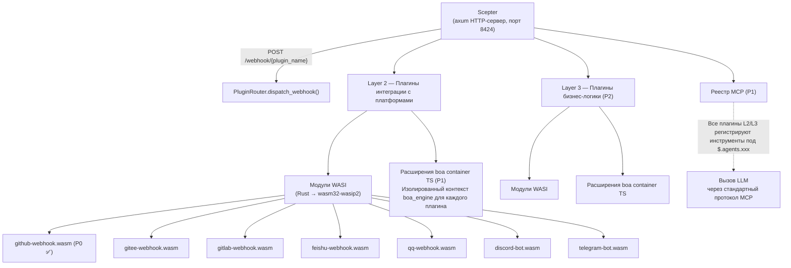
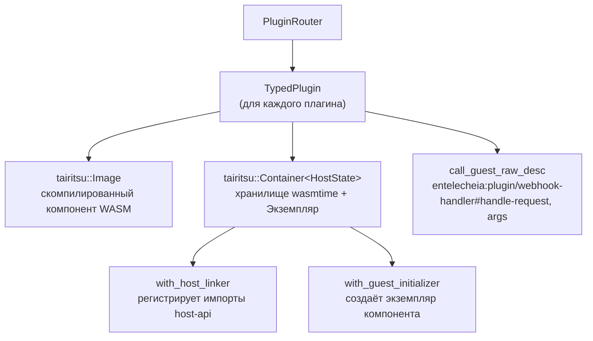

# 25 — Дизайн системы плагинов WASI

## Обзор

Система плагинов WASI заменяет предыдущую инфраструктуру вебхуков на Python/TypeScript плагинами на основе **компонентной модели WASM**, предоставляя изолированные, независимые от языка интеграции с платформами (Layer 2) и расширения бизнес-логики (Layer 3). Ключевые цели дизайна:

1. **Двойной механизм расширения**: Layer 2 (интеграция с платформами) и Layer 3 (бизнес-логика) оба поддерживают модули WASI и расширения boa TS.
1. **Унифицированная регистрация MCP**: Все плагины регистрируют инструменты под `$.agents.xxx` независимо от языка реализации.
1. **Управляемый хостом I/O**: Хост (axum-сервер Scepter) обрабатывает HTTP-маршрутизацию, WebSocket и долгоживущие соединения; плагины только обрабатывают логику.
1. **Строгая изоляция**: WASM-модули работают под wasmtime с ограничениями топлива (fuel) и прерыванием по эпохе.

## Архитектура



## Определения интерфейса WIT

Находятся в `packages/shared/plugin_host/wit/plugin.wit`:

```wit
package entelecheia:plugin;

interface host-api {
    http-request:  func(method: string, url: string, headers: string, body: string) -> result<string, string>;
    forward-event: func(event-json: string) -> result<_, string>;
    query-ai:      func(message: string, context: option<string>) -> result<string, string>;
    log:           func(level: string, message: string);
    config-get:    func(key: string) -> option<string>;
    kv-get:        func(key: string) -> option<string>;
    kv-set:        func(key: string, value: string) -> result<_, string>;
    register-mcp-tool: func(tool-name: string, description: string, schema: string) -> result<_, string>;
}

interface webhook-handler {
    name: func() -> string;
    handle-request: func(method: string, path: string, headers: string, body: string) -> result<string, string>;
}

interface bot-handler {
    name: func() -> string;
    on-message: func(platform: string, message: string) -> result<option<string>, string>;
}

world layer2-plugin {
    import host-api;
    export webhook-handler;
}

world layer2-bot {
    import host-api;
    export bot-handler;
}
```

### Регистрация API на стороне хоста

Хост регистрирует все функции `host-api` с использованием `component::Linker::func_wrap` wasmtime перед созданием экземпляра компонента:

```rust
let mut instance = linker.root().instance("entelecheia:plugin/host-api")?;

instance.func_wrap("http-request",
    |_: StoreContextMut<'_, HostState>,
     (method, url, headers, body): (String, String, String, String)| {
        Ok::<(Result<String, String>,), wasmtime::Error>(
            (api.http_request(method, url, headers, body),)
        )
    }
)?;
```

### Привязки на стороне гостя

Плагины используют `wit_bindgen::generate!()` для генерации привязок на стороне гостя:

```rust
wit_bindgen::generate!({
    path: "wit",
    world: "layer2-plugin",
});

struct GithubWebhookPlugin;
impl exports::entelecheia::plugin::webhook_handler::Guest for GithubWebhookPlugin {
    fn name() -> String { "github-webhook".to_string() }
    fn handle_request(method: String, path: String, headers: String, body: String)
        -> Result<String, String> { /* ... */ }
}
export!(GithubWebhookPlugin);
```

## Архитектура хоста плагинов

### Крейт: `_shared_plugin_host` (`packages/shared/plugin_host/`)

| Модуль | Роль |
| --- | --- |
| `plugin_state.rs` | `HostFunctions` — реализует все функции `host-api` (HTTP, KV, config, events) |
| `plugin_loader.rs` | `TypedPlugin` — создаёт контейнеры wasmtime, регистрирует импорты хоста, вызывает экспорты гостя через динамический `call_guest_raw_desc` |
| `plugin_router.rs` | `PluginRouter` — управляет загруженными плагинами, диспетчеризует запросы вебхуков/ботов, авто-сканирует директорию `plugins/` |
| `host_functions.rs` | Реэкспортирует `HostFunctions` и трейт `HostApiProvider` |

### Стек времени выполнения



### Имена экспортов гостя

Поскольку `wit_bindgen::generate!` на стороне гостя экспортирует функции под именем интерфейса WIT, хост использует полные имена для динамического вызова:

```text
entelecheia:plugin/webhook-handler#name
entelecheia:plugin/webhook-handler#handle-request
entelecheia:plugin/webhook-handler#on-message
```

### Асинхронный мост

Функции хоста синхронны (требование wasmtime), но реализации требуют асинхронности (HTTP, база данных). Мост использует `tokio::task::block_in_place` + `Handle::block_on`:

```rust
instance.func_wrap("kv-get",
    move |_: StoreContextMut<'_, HostState>, (key,): (String,)| {
        let result = tokio::task::block_in_place(|| {
            let handle = tokio::runtime::Handle::current();
            handle.block_on(api.kv_get(&key))
        });
        Ok::<(Option<String>,), wasmtime::Error>((result,))
    }
)?;
```

Обработчик вебхуков Scepter использует `tokio::task::spawn_blocking` для вызова синхронных методов WASM из асинхронных обработчиков axum.

## Интеграция со Scepter

### Регистрация маршрутов

`packages/scepter/src/app/setup.rs` — добавлено в маршрутизатор axum:

```rust
.merge(crate::api::plugin_webhook::create_plugin_webhook_routes())
```

### Обработчик вебхуков

`packages/scepter/src/api/plugin_webhook.rs`:

- `POST /webhook/{plugin_name}` — извлекает путь, заголовки, тело
- Вызывает `PluginRouter::dispatch_webhook()` внутри `tokio::task::spawn_blocking`
- Возвращает ответ плагина или ошибку

### Автозагрузка плагинов

При запуске Scepter создаёт `PluginRouter` и сканирует `plugins/` (или `$PLUGIN_DIR`) на наличие файлов `.wasm`:

```rust
let plugin_dir = std::path::PathBuf::from(
    std::env::var("PLUGIN_DIR").unwrap_or_else(|_| "plugins".to_string()),
);
router.scan_and_load_dir(&plugin_dir)?;
```

## Руководство по разработке плагинов

### Создание плагина WASI

1. Инициализируйте новый крейт в `plugins/`:

```toml
# plugins/my-platform/Cargo.toml
[package]
name = "plugin-my-platform"
version = "0.1.0"
edition = "2024"

[lib]
crate-type = ["cdylib", "rlib"]

[dependencies]
wit-bindgen = "0.57"
serde = { version = "1", features = ["derive"] }
serde_json = "1"
```

1. Скопируйте файл WIT:

```text
plugins/my-platform/wit/plugin.wit  <- symlink или копия из packages/shared/plugin_host/wit/
```

1. Реализуйте трейт `Guest`:

```rust
// plugins/my-platform/src/lib.rs
wit_bindgen::generate!({ path: "wit", world: "layer2-plugin" });

use exports::entelecheia::plugin::webhook_handler::Guest;

struct MyPlatformPlugin;

impl Guest for MyPlatformPlugin {
    fn name() -> String { "my-platform".to_string() }
    fn handle_request(method: String, path: String, headers: String, body: String)
        -> Result<String, String> {
        // Используйте функции host-api: log(), http-request(), kv-get() и т.д.
        log("info", &format!("получен {} запрос", method));
        Ok(r#"{"status":"ok"}"#.to_string())
    }
}

export!(MyPlatformPlugin);
```

1. Настройте `.cargo/config.toml`:

```toml
[target.wasm32-wasip2]
rustflags = ["--cfg=unstable_wasi_extension", "--cfg=unstable_wasi_export_wasi_reactor"]
```

1. Сборка:

```bash
cargo build --target wasm32-wasip2 --release -p plugin-my-platform --lib
```

1. Развёртывание: скопируйте файл `.wasm` в директорию `plugins/` (или установите `PLUGIN_DIR`).

## Справочник функций хоста

| Функция | Сигнатура | Описание |
| --- | --- | --- |
| `http-request` | `(method, url, headers, body) -> result<string, string>` | Выполнение HTTP-запросов (для ответа внешним платформам) |
| `forward-event` | `(event-json) -> result<_, string>` | Пересылка структурированных событий в Scepter |
| `query-ai` | `(message, context?) -> result<string, string>` | Запрос к конвейеру AI (ещё не подключено) |
| `log` | `(level, message)` | Отправка структурированного лога через трассировку Scepter |
| `config-get` | `(key) -> option<string>` | Чтение конфигурации плагина |
| `kv-get` | `(key) -> option<string>` | Персистентное хранилище KV (токены OAuth и т.д.) |
| `kv-set` | `(key, value) -> result<_, string>` | Запись в персистентное хранилище KV |
| `register-mcp-tool` | `(name, description, schema) -> result<_, string>` | Регистрация инструмента MCP (P1) |

## Модель безопасности

| Механизм | Реализация |
| --- | --- |
| **Песочница** | Песочница компонентной модели wasmtime — нет файловой системы, нет сетевого доступа по умолчанию |
| **Ограничения ресурсов** | Учёт топлива (поинструкционный учёт) + прерывание по эпохе (таймаут) через построитель tairitsu Container |
| **I/O только через хост** | Весь I/O проходит через функции хоста; плагины не могут открывать сокеты или файлы |
| **Изоляция плагинов** | Каждый плагин — отдельный экземпляр wasmtime со своей памятью, без межплагинного разделения |
| **Песочница TS (P1)** | Контекст boa_engine с COMPUTE_TIMEOUT (120с) / ABSOLUTE_CEILING (600с) из skemma |

## Статус реализации

| Фаза | Компонент | Статус |
| --- | --- | --- |
| **P0** | WASI-плагин вебхуков GitHub | ✅ Готово |
| **P0** | PluginRouter + интеграция со Scepter | ✅ Готово |
| **P0** | HostFunctions (все 8 функций host-api) | ✅ Готово |
| **P1** | Инфраструктура расширений boa TS | Не начато |
| **P1** | Регистрация инструментов MCP через `$.agents.xxx` | Не начато |
| **P2** | Оставшиеся платформенные плагины (Gitee, GitLab, Feishu, QQ, Discord, Telegram) | Не начато |
| **P2** | Плагины бизнес-логики Layer 3 | Не начато |

## Ключевые файлы

| Файл | Назначение |
| --- | --- |
| `packages/shared/plugin_host/Cargo.toml` | wasmtime 43, среда выполнения tairitsu, reqwest |
| `packages/shared/plugin_host/wit/plugin.wit` | Каноническое определение интерфейса WIT |
| `packages/shared/plugin_host/src/plugin_state.rs` | HostFunctions, трейт HostApiProvider |
| `packages/shared/plugin_host/src/plugin_loader.rs` | TypedPlugin, регистрация функций хоста |
| `packages/shared/plugin_host/src/plugin_router.rs` | PluginRouter, диспетчеризация, scan_and_load_dir |
| `packages/scepter/src/api/plugin_webhook.rs` | Обработчик маршрута вебхуков Axum |
| `packages/scepter/src/app/setup.rs` | Регистрация маршрутов + инициализация PluginRouter |
| `plugins/github-webhook/` | Эталонная реализация |
| `plugins/github-webhook/src/lib.rs` | Плагин вебхуков GitHub (issues, PR, push, comment) |
