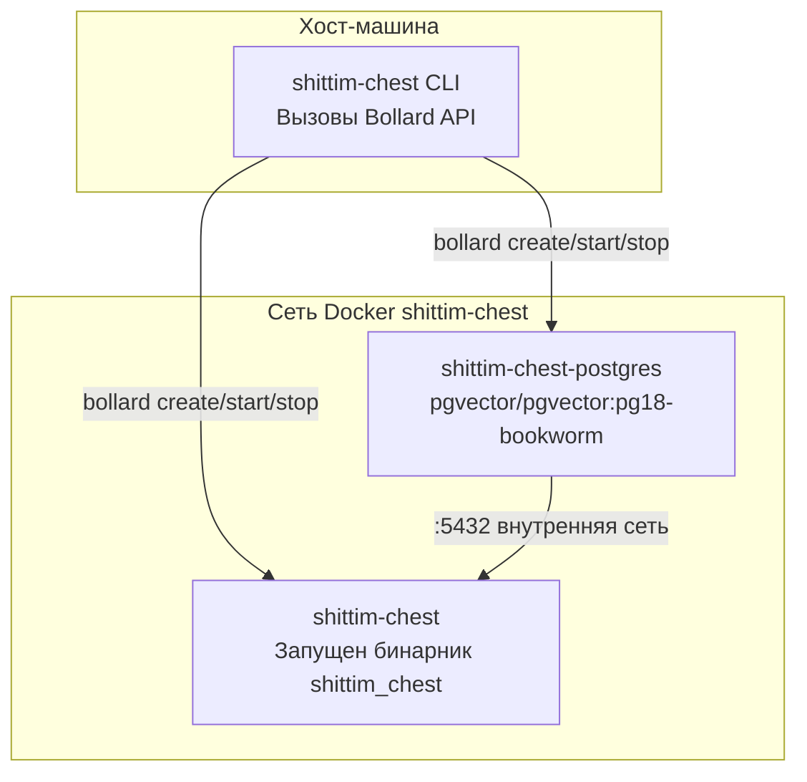

# Архитектура обёртки CLI: Оркестрация Docker на основе Bollard

## Обзор

`packages/cli/` — это бинарник Rust, который управляет жизненным циклом контейнеров напрямую через Docker API Bollard, полностью заменяя docker-compose и shell-скрипты. CLI работает на хост-машине, в то время как серверный бинарник (`shittim_chest`) работает внутри контейнеров.

## Почему не docker-compose

| Измерение | docker-compose | bollard (текущий подход) |
| --- | --- | --- |
| Зависимость | Требует отдельной установки docker-compose | Повторно использует Docker Engine API |
| Программируемость | YAML декларативный, ограниченная логика | Нативный Rust, произвольный поток управления |
| Проверки здоровья | depends_on + condition основан на событиях | Активный опрос; обнаружение смерти без таймаутов |
| Обработка ошибок | Выход контейнера = отказ | Повторные попытки + сбор логов + детальная информация об ошибке |
| Очистка ресурсов | `down -v` всё или ничего | Гранулярная очистка по контейнеру/сети/тому |
| Интеграция | Внешний инструмент | Встроен как библиотека, расширяем с дополнительной логикой |

## Топология контейнеров



## Именование контейнеров и ресурсы

| Константа | Значение | Назначение |
| --- | --- | --- |
| `NET` | `shittim-chest` | Мостовая сеть Docker |
| `PG` | `shittim-chest-postgres` | Имя контейнера PostgreSQL |
| `APP` | `shittim-chest` | Имя контейнера приложения |
| `VOL` | `shittim-chest-pgdata` | Том данных PG |
| `PG_IMG` | `pgvector/pgvector:pg18-bookworm` | Образ PG |
| `RUNTIME_IMG` | `debian:bookworm-slim` | Образ среды выполнения в режиме dev |
| `BUILD_IMG` | `shittim-chest` | Образ сборки в режиме release |

## Сопоставление команд

| Команда | Поведение |
| --- | --- |
| `dev [--clean]` | Одноразовый запуск: env → сеть → том → PG → cargo build → миграция → запуск → потоковые логи |
| `up` | Режим release: docker build образ → миграция → фоновый запуск (restart=unless-stopped) |
| `down [--clean]` | Остановить контейнеры (опциональная очистка томов + сети) |
| `migrate` | Запустить db-migrate в одноразовом контейнере (повторы до 5 раз, интервал 2с) |
| `logs` | Потоковое отслеживание логов контейнера приложения |
| `status` | Проверить статус работы PG и контейнера приложения + статус проверки здоровья |
| `build` | Собрать полный образ Docker (`docker build -t shittim-chest`) |

## Распространение переменных окружения

```text
.env файл → dotenvy::from_path_iter → HashMap<String, String>
→ Слияние SHITTIM_CHEST_HOST / PORT / DATABASE_URL
→ Vec<String> = ["KEY=VALUE", ...]
→ bollard Config::env()
```

CLI не читает свою конфигурацию из `.env` — он только передаёт полное содержимое `.env` в процесс `shittim_chest` внутри контейнера. Пароли и порты читаются через два конкретных ключа `SHITTIM_CHEST_DB_PASSWORD` и `SHITTIM_CHEST_PORT`.

## Соглашения логирования

Логи CLI выводятся напрямую в stderr, используя тот же формат, что и entelecheia:

- `tracing-subscriber` + `ShortTimer` (формат ЧЧ:ММ:СС)
- `.compact()` компактный режим
- `.with_target(false)` скрыть пути модулей
- `--log-level` параметр CLI (по умолчанию `info`)

## Принципы дизайна

1. **CLI не выполняет бизнес-логику**: Вся бизнес-логика находится в бинарнике `shittim_chest` внутри контейнера
1. **Контейнеры — неизменяемые единицы**: CLI создаёт/уничтожает контейнеры, никогда не модифицирует работающие
1. **Сетевая изоляция**: Порт PG не открыт на хосте, доступен только во внутренней сети Docker
1. **Пассивный опрос для проверок здоровья**: Не полагается на события Docker (ненадёжны); напрямую опрашивает результаты inspect
