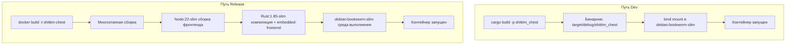

# Двухрежимные пути развёртывания: Dev vs Release

## Обзор

shittim-chest поддерживает два режима развёртывания: Dev (локальная быстрая итерация, без Node, без сборки образа) и Release (полный образ Docker с встроенными статическими файлами фронтенда). Оба режима используют одну и ту же топологию контейнеров и сеть.

## Мотивация дизайна

Сборка полного образа Docker (сборка фронтенда Node + компиляция Rust + `embedded-frontend`) занимает 30+ секунд, что неприемлемо для ежедневной итерации разработки. Режим Dev использует инкрементальный кеш компиляции Rust хост-машины, монтируя бинарник в минимальный контейнер среды выполнения для времени перезапуска менее секунды.

## Сравнение путей



| Измерение | Режим Dev (`just dev`) | Режим Release (`just up`) |
| --- | --- | --- |
| Фронтенд | Собирается Vite, обслуживается бэкендом через `just dev` | Встроен в бинарник (функция `embedded-frontend`) |
| Требует Node | Да (для сборки Vite) | Да (внутри Docker) |
| Источник бинарника | Локальный `cargo build` | Скомпилирован внутри Docker |
| Базовый образ контейнера | `debian:bookworm-slim` | `debian:bookworm-slim` (результат многоэтапной сборки) |
| Скорость перезапуска | < 5с (после инкрементальной компиляции) | 30-60с (полная сборка) |
| Сценарий использования | Ежедневная разработка, отладка | Развёртывание CI/продакшен |
| Метод запуска контейнера | `Config.cmd = ["shittim_chest"]` | Образ включает ENTRYPOINT |

## Детали реализации режима Dev

### Локальная компиляция

```rust
async fn cargo_build() -> Result<()> {
    Command::new("cargo")
        .args(["build", "-p", "shittim_chest"])
        .status().await?;
}
```

Путь вывода компиляции фиксирован: `$PWD/target/debug/shittim_chest` (профиль debug, символы отладки сохранены).

### Запуск с bind mount

```rust
let config = Config::<String> {
    image: Some("debian:bookworm-slim".into()),   // минимальная среда выполнения
    cmd: Some(vec!["shittim_chest".to_string()]),
    host_config: Some(HostConfig {
        binds: Some(vec![
            format!("{bin_path}:/usr/local/bin/shittim_chest:ro")
        ]),
        network_mode: Some(NET.into()),
        port_bindings: ...,
        ..
    }),
    env: Some(container_env(password, port)),
    ..
};
```

Ключевые моменты:

- Бинарник монтируется только для чтения (`:ro`) для предотвращения случайной модификации в контейнере
- Расположение бинарника: `/usr/local/bin/shittim_chest`, выполняется напрямую внутри контейнера
- Базовый образ `debian:bookworm-slim` предоставляет требуемую среду выполнения glibc

### Выполнение миграций

Миграции выполняются через одноразовый контейнер:

```bash
docker run --rm --network shittim-chest \
  -v $PWD/target/debug/shittim_chest:/usr/local/bin/shittim_chest:ro \
  -e SHITTIM_CHEST_DATABASE_URL=... \
  debian:bookworm-slim \
  shittim_chest db-migrate
```

Автоматически повторяет до 5 раз (интервал 2 секунды) для обработки случая, когда PG ещё не полностью готов.

## Детали реализации режима Release

### Многоэтапная сборка Dockerfile

```dockerfile
# Этап 1: фронтенд → Node:22-slim + pnpm → pnpm build:all → /app/dist/
# Этап 2: сборщик  → Rust:1.85-slim + COPY dist/ → cargo build --features embedded-frontend
# Этап 3: среда выполнения → debian:bookworm-slim + ca-certificates + COPY бинарник
```

### Функция embedded-frontend

```rust
# [cfg(feature = "embedded-frontend")]
{
    static FRONTEND_DIR: Dir<'_> = include_dir!("$CARGO_MANIFEST_DIR/../dist");
    // Монтируется на маршрутизатор Axum по путям /static/*
}
```

Эта функция использует макрос `include_dir!` для встраивания артефактов сборки фронтенда в бинарник во время компиляции. В режиме Release полный SPA может обслуживаться без дополнительного обратного прокси.

## Именование функций миграции и запуска

Чтобы избежать путаницы, код явно различает два набора функций:

| Путь Dev | Путь Release |
| --- | --- |
| `run_migrate_dev()` | `run_migrate_release()` |
| `start_app_dev()` | `start_app_release()` |
| `cargo_build()` | `build_image()` |

## Разработка фронтенда

В режиме Dev `dev.py` пересобирает ресурсы фронтенда при изменениях файлов. Бэкенд обслуживает как статические файлы, так и API на одном порту (:3000 для dev, :80 для продакшена).
