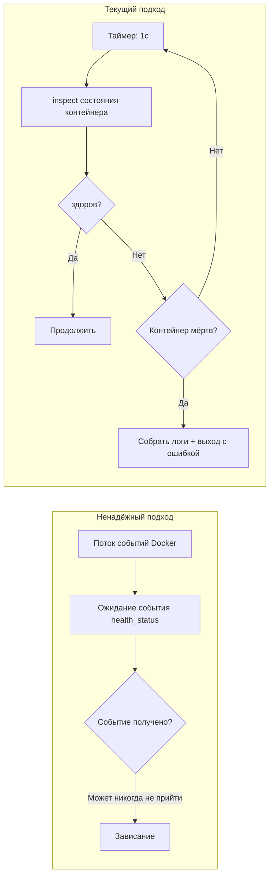

# Стратегия проверки здоровья PostgreSQL

## Обзор

Обёртка CLI должна убедиться, что PostgreSQL готов перед запуском контейнера приложения. Этот документ определяет дизайнерские решения, лежащие в основе стратегии пассивной проверки здоровья — отказ от событий Docker (ненадёжны) и фиксированных таймаутов (негибки).

## Почему не события Docker



В потоках событий Docker фильтр `container` ненадёжен для событий `health_status` — особенно после перезапуска контейнера PG. На практике события могут никогда не сработать, заставляя CLI ждать бесконечно.

## Стратегия опроса

```text
while true:
    sleep 1s
    state = docker.inspect_container(PG)
    if state.health.status == HEALTHY:
        break
    if !state.running:
        bail!(collect_logs(PG))
```

| Параметр | Значение | Обоснование |
| --- | --- | --- |
| Интервал опроса | 1с | Достаточно отзывчиво, без накладных расходов inspect |
| Таймаут | Нет | Без жёсткого таймаута; PG может иметь холодный старт |
| Обнаружение смерти | Каждый опрос | Контейнер отсутствует → немедленная ошибка и вывод последних 50 строк логов |

## Конфигурация здоровья контейнера PostgreSQL

```rust
HealthConfig {
    test:        ["CMD-SHELL", "pg_isready -U shittim_chest"],
    interval:    5_000_000_000,   // 5с (наносекунды)
    timeout:     5_000_000_000,   // 5с
    retries:     10,
    start_period: 30_000_000_000, // 30с начальный льготный период
}
```

| Параметр | Значение | Обоснование |
| --- | --- | --- |
| `pg_isready` | Уровень пользователя | Надёжнее, чем обнаружение порта TCP; гарантирует, что PG полностью принимает соединения |
| `interval: 5s` | Умеренный | Избегает частых повторных попыток и шума в логах |
| `retries: 10` | Высокий | Миграция и initdb могут быть длительными; достаточно повторных попыток |
| `start_period: 30s` | Длительный | Первый запуск initdb pg18 может быть медленным |

## Путь монтирования тома данных

```rust
Mount {
    target: "/var/lib/postgresql",     // новый путь pg18
    source: "shittim-chest-pgdata",
    typ: MountTypeEnum::VOLUME,
}
```

pg18 изменил директорию данных с `/var/lib/postgresql/data` на `/var/lib/postgresql`. Использование неправильного пути приводит к тому, что PG не может найти данные после запуска.

## Повторные попытки миграции

Миграции базы данных имеют независимую логику 5 повторных попыток:

```text
for retry in 0..5:
    выполнить docker run --rm ... shittim_chest db-migrate
    если успех: break
    sleep 2s
```

Даже после возврата `wait_healthy` миграции могут не сработать, потому что PG всё ещё завершает восстановление. Короткие повторные попытки обрабатывают это критическое окно.

## Сбор логов

Когда контейнер падает, последние 50 строк логов автоматически собираются:

```rust
async fn collect_logs(docker: &Docker, name: &str) -> String {
    docker.logs(name, LogsOptions { tail: "50", stdout: true, stderr: true, .. })
}
```

Это критически важно для отладки сбоев запуска PG — ошибки initdb, проблемы с правами, конфликты портов и т.д. видны только в логах контейнера.
