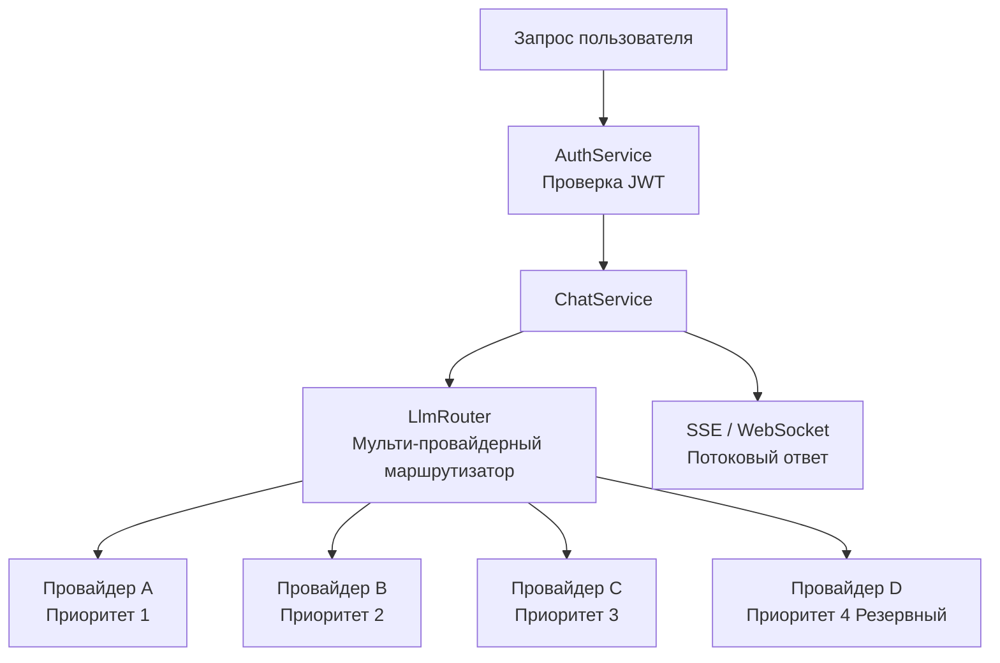
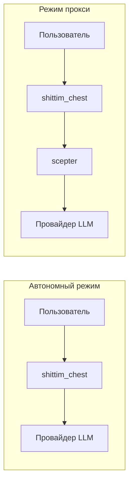

# Независимая архитектура LLM

## Обзор

shittim-chest имеет полностью независимый слой маршрутизации LLM, не зависящий от entelecheia. Пользователи могут настраивать несколько провайдеров LLM, а встроенный маршрутизатор автоматически выбирает на основе приоритета и доступности. Это ключевая отличительная способность shittim-chest по сравнению с Open WebUI.

## Архитектура



## Основные возможности

### 1. Мульти-провайдерная приоритетная маршрутизация

```text
Каждый провайдер имеет поле приоритета (меньшее число = более высокий приоритет).
Запросы выполняются от высшего к низшему приоритету:
  → Провайдер A (приоритет=1) доступен → использовать
  → Недоступен → Провайдер B (приоритет=2) доступен → использовать
  → Недоступен → ... → вернуть ошибку
```

### 2. Автоматическая отказоустойчивость

Когда провайдер с более высоким приоритетом возвращает ошибку (таймаут, ограничение скорости, недоступность), маршрутизатор автоматически переключается на следующего доступного провайдера, прозрачно для пользователя.

### 3. Шифрованное хранение API-ключей

Все API-ключи провайдеров статически шифруются с AES-256-GCM и хранятся в `shittim_chest_db`. Ключ шифрования предоставляется через переменную окружения `ENCRYPTION_KEY`. Даже если база данных скомпрометирована, API-ключи остаются нечитаемыми.

### 4. Двухпротокольная потоковая передача

| Протокол | Конечная точка | Сценарий использования |
| --- | --- | --- |
| SSE | `/api/chat/stream` | Простая HTTP-потоковая передача, совместимость с прокси, нативная поддержка браузера |
| WebSocket | `/ws/chat/stream` | Двунаправленная связь, поддерживает отмену и взаимодействие в реальном времени |

### 5. OpenAI-совместимость

Все интерфейсы провайдеров следуют формату OpenAI `/v1/chat/completions`, что позволяет интеграцию с любым OpenAI API-совместимым сервисом (DeepSeek, OpenAI, локальные Ollama/LM Studio и др.).

## Управление провайдерами

### Источники конфигурации

| Метод | Сценарий использования |
| --- | --- |
| Переменные окружения (`LLM_DEFAULT_PROVIDER_*`) | Быстрый старт, сценарии с одним провайдером |
| CRUD базы данных (`/api/providers/*`) | Мульти-провайдер, динамическое управление |
| Панель администратора arona | Графическое управление |

### Начальный провайдер

При первом запуске, если переменные окружения `LLM_DEFAULT_PROVIDER_*` установлены, `db-init` автоматически создаёт начального провайдера. Дополнительные провайдеры можно добавить позже через панель администратора arona.

## Автономный режим vs Режим прокси



| Режим | Условие | Поведение |
| --- | --- | --- |
| Автономный | scepter не настроен (или `Proxy: disabled`) | Вызывает провайдера LLM напрямую |
| Прокси | URL scepter настроен | Пересылает через прокси-слой к обработке агентами entelecheia |

Автономный режим полностью обеспечивает полный опыт чата: управление диалогами, сохранение сообщений, поиск, экспорт. Режим прокси добавляет возможности оркестрации агентов.

## Техническая реализация

- **Маршрутизатор**: `packages/shittim_chest/src/llm/router.rs`, поддерживает выбор по приоритету + отказоустойчивость
- **Клиент**: `packages/shittim_chest/src/llm/client.rs`, основан на `reqwest` + `rustls` (без зависимости OpenSSL)
- **CRUD провайдеров**: `packages/shittim_chest/src/api/providers.rs`, стандартные конечные точки REST
- **Шифрование**: крейт `aes-gcm`, переменная окружения `ENCRYPTION_KEY`
