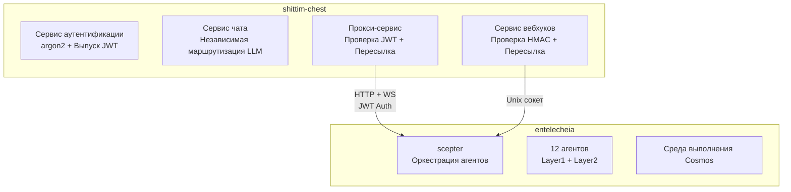

# Слабая связь с entelecheia

## Обзор

Интеграция между shittim-chest и entelecheia основана на JWT-аутентифицированном прокси-мосту HTTP/WebSocket. Этот дизайн позволяет shittim-chest работать полностью независимо без entelecheia, одновременно включая возможности оркестрации агентов по требованию, когда это необходимо.

## Дизайн границы



## Владение данными

| shittim_chest_db | entelecheia_db |
| --- | --- |
| auth_users (хеши паролей) | user_identities (user_id) |
| sessions (активные сессии) | groups |
| refresh_tokens | group_memberships |
| oauth_connections | role_assignments |
| api_keys (зашифрованные ключи провайдеров) | group_permissions (квоты провайдеров) |
| conversations | agent_configs |
| messages | cosmos_state |
| llm_providers (конфигурации провайдеров) | iepl_state |
| remote_devices (записи устройств) | |
| device_sessions | |
| channel_configs | |
| webhook_logs (журналы доставок) | |

**Принцип**: shittim-chest хранит данные «на стороне пользователя»; entelecheia хранит данные «на стороне агента». `user_id` — это ключ связи между двумя сторонами.

## Протокол аутентификации JWT

### Общий ключ

shittim-chest и scepter разделяют ключ подписи JWT через одну и ту же переменную окружения `JWT_SECRET`. Обе стороны могут независимо проверять JWT, выпущенные другой стороной.

### Структура токена

```json
{
  "sub": "user-uuid",
  "groups": ["admin", "developer"],
  "exp": 1710000000,
  "iat": 1709996400
}
```

| Поле | Описание |
| --- | --- |
| `sub` | UUID пользователя (общий для обеих баз данных) |
| `groups` | Список групп, к которым принадлежит пользователь |
| `exp` | Время истечения (по умолчанию 1 час) |
| `iat` | Время выпуска |

### Поток входа

```text
Пользователь → shittim_chest: POST /api/auth/login
shittim_chest: Проверить пароль argon2
shittim_chest → scepter: GET /api/user/{id}/permissions
scepter → entelecheia_db: Запросить группы и права
scepter → shittim_chest: { groups, permissions }
shittim_chest: Выпустить JWT (доступ + обновление)
shittim_chest → Пользователь: токены
```

## Прокси-мост

### HTTP-прокси

```text
Браузер → shittim_chest:80/api/proxy/chat (JWT в заголовке)
shittim_chest: Проверить JWT
shittim_chest → scepter:8424/api/chat (Переслать JWT)
scepter → Агент → LLM → scepter → shittim_chest → Браузер
```

### WebSocket-прокси

```text
Браузер → shittim_chest:80/api/proxy/ws (JWT в заголовке)
shittim_chest: Проверить JWT
shittim_chest ↔ scepter:8424/ws (Двунаправленная пересылка + JWT)
Браузер ↔ scepter: Полнодуплексное взаимодействие с агентом
```

### Ограничение скорости и мониторинг

На уровне прокси shittim-chest отвечает за:

- Ограничение скорости (на пользователя / на IP)
- Логирование использования
- Управление жизненным циклом соединения
- Переподключение при аномальных разрывах

## Конвейер вебхуков

```text
GitHub/GitLab/Gitee → POST /api/webhook/{source} → проверка HMAC → Разбор события → Unix сокет → scepter
```

shittim-chest обрабатывает проверку HMAC и разбор событий; scepter запускает действия агентов на основе событий (например, автоматическая проверка кода).

## Автономный режим работы

Когда URL scepter не настроен в переменных окружения или `SHITTIM_CHEST_SCEPTER_PROXY` установлен в `disabled`:

- Конечные точки `/api/proxy/*` возвращают 503 (Сервис недоступен)
- Конечные точки `/api/devices/*` возвращают 503
- Чат полностью использует встроенный LlmRouter
- Все остальные функции (аутентификация, чат, управление провайдерами, вход вебхуков) работают нормально

Это позволяет развёртывать shittim-chest как полный автономный WebUI для LLM без entelecheia.
