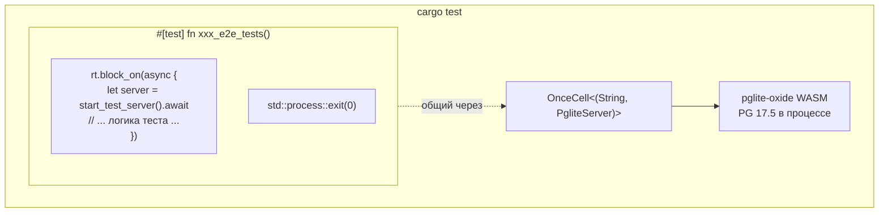

# Встроенная тестовая база данных (pglite-oxide)

## Обзор

shittim-chest использует [pglite-oxide](https://crates.io/crates/pglite-oxide) как встроенный PostgreSQL для всех интеграционных и E2E-тестов. Не требуется внешний Postgres, Docker или `testcontainers` — тесты запускаются одной командой `cargo test` на любой машине.

## Мотивация дизайна

Ранее интеграционные тесты полагались на `postgresql_embedded`, который загружает полный бинарник PostgreSQL (~100 МБ) во время выполнения. Это вызывало медленный запуск, сбои, специфичные для платформы, и нестабильность CI. pglite-oxide упаковывает PostgreSQL 17.5 как модуль WASM через среду выполнения wasmer — в процессе, портативно и быстро (~96 мс холодный старт).

## Архитектура



## Ключевые решения

| Решение | Обоснование |
| --- | --- |
| `pglite-oxide` (WASM) вместо `postgresql_embedded` (нативный бинарник) | Нет загрузки ~100 МБ, нет платформенно-специфичного бинарника PG, ~96 мс запуск |
| `pglite-oxide` вместо `pglite-rust-bindings` | Опубликован на crates.io (v0.5.0), более быстрый запуск, зрелый API построителя с поддержкой расширений |
| `tower::ServiceExt::oneshot` вместо `reqwest` | Избегает взаимоблокировки среды выполнения tokio между фоновыми задачами пула sqlx и HTTP-сервером hyper |
| Один runner `#[test]` с `std::process::exit(0)` | `sqlx::PgPool` порождает постоянные фоновые задачи (idle reaper, проверки здоровья), которые поддерживают среду выполнения tokio. `exit(0)` обходит это зависание |
| `max_connections=1` | Фундаментальное ограничение PGlite — только одно соединение |
| `OnceCell<(String, PgliteServer)>` | Общий экземпляр PG для подтестов в одном запуске бинарника; `PgliteServer` должен оставаться живым (не сброшенным) |
| `pglite-oxide` только в `[dev-dependencies]` | Среда выполнения wasmer НЕ ДОЛЖНА просачиваться в продакшен-сборки |

## Шаблон тестового harness

```rust
// tests/common/mod.rs
static PG: OnceCell<(String, PgliteServer)> = OnceCell::const_new();

async fn ensure_pg_url() -> String {
    PG.get_or_init(|| async {
        let server = PgliteServer::builder()
            .start()
            .expect("Не удалось запустить pglite-oxide");
        let url = server.database_url();
        // подключиться, выполнить миграции, закрыть начальное соединение
        (url, server)
    }).await.0.clone()
}

pub async fn start_test_server() -> TestServer {
    let db_url = ensure_pg_url().await;
    let db = Database::connect(/* max_connections=1 */).await;
    // построить AppState, Router, вернуть TestServer, оборачивающий tower oneshot
}
```

```rust
// tests/xxx_tests.rs
# [test]
fn xxx_e2e_tests() {
    let rt = tokio::runtime::Runtime::new().unwrap();
    rt.block_on(async {
        let mut server = common::start_test_server().await;
        // ... все подтесты с использованием server.request() ...
    });
    std::process::exit(0);
}
```

## Создаваемые таблицы

Все 13 таблиц создаются через миграции SeaORM во время настройки теста:

`auth_users`, `sessions`, `api_keys`, `oauth_connections`, `channel_configs`, `channel_messages`, `channel_pairings`, `conversations`, `messages`, `llm_providers`, `remote_devices`, `device_sessions`, `system_settings`, `workspace_sessions`

## Ограничения PGlite

1. **Одно соединение**: `max_connections` должен быть 1. Несколько пулов к одному экземпляру PGlite зависнут.
1. **Строгое приведение типов**: PGlite строже, чем стандартный PostgreSQL. Запросы типа `uuid_column = text_value` не сработают — всегда приводите типы явно.
1. **Нет конкурентных раннеров тестов**: Все асинхронные тесты, разделяющие один экземпляр PGlite, должны выполняться последовательно в одной функции `#[test]`.
1. **Зависание пула при сбросе**: `sqlx::PgPool::close()` может зависнуть на неопределённое время. Используйте `std::process::exit(0)` для завершения процесса теста.
