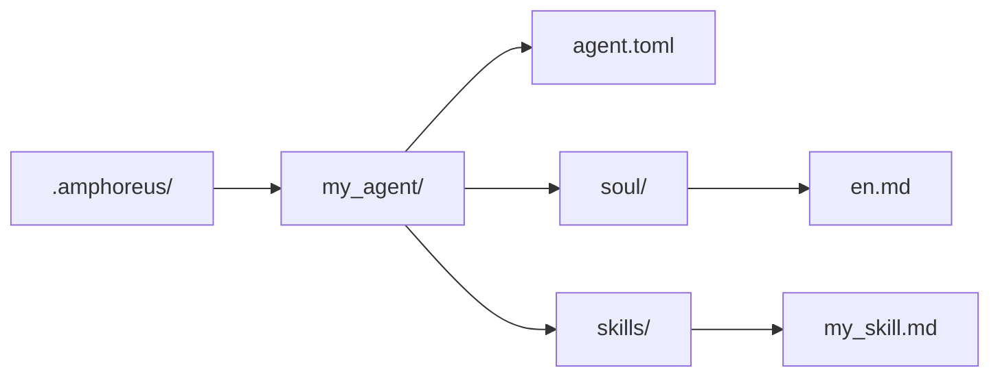

# Руководство по разработке агентов

> Инструкции по разработке агентов на основе текущего состояния репозитория

## Обзор

В текущем репозитории доступно три уровня расширения.

| Уровень | Текущее значение |
| --- | --- |
| Layer1 | Основные агенты, реализованные как крейты Rust и скомпилированные в workspace |
| Layer2 | Web Automation — активный встроенный доменный агент, плюс несколько архивных или плановых материалов |
| Layer3 | Пользовательские агенты (запланированы, ещё не реализованы) |

Не интерпретируйте все планы Layer2 из исторической документации как текущие активные встроенные агенты.

## Layer3 — самый простой путь расширения

> **Примечание**: Layer3 в настоящее время находится только на стадии проектирования. Каталог `.amphoreus/`, загрузчик агентов (`Layer3Workspace`) и фреймворк конфигурации ещё не реализованы. В этом разделе описывается целевой дизайн для будущего использования.

Если вы хотите расширить Entelecheia (玄枢), не изменяя Rust workspace, используйте Layer3 (после его реализации).

### Минимальная структура

### Что Layer3 может предоставить сейчас

- Soul-файлы на основе промптов
- Навыки (skills) на основе промптов
- Повторное использование существующих инструментов платформы
- Предварительная проверка при загрузке

### Что Layer3 не может предоставить автоматически

- Новый бэкенд Rust MCP
- Полные гарантии песочницы
- Готовность каждого пути skill/tool к продакшену по умолчанию

## Разработка встроенных агентов

Встроенные агенты — это крейты Rust, расположенные в `packages/agents/<agent>/`.

Типичный состав включает:

- `src/lib.rs`
- `src/state.rs`
- `src/skills.rs`
- `src/mcp/registry.rs`
- `src/mcp/tools/*.rs`

Также необходимо поддерживать соответствующую документацию в `res/prompts/agents/<agent>/`.

## Текущие рекомендации для Layer2

Исторически репозиторий содержал множество проектов доменных агентов Layer2. В настоящее время это следует понимать так:

- Единственный активный встроенный крейт Layer2 в текущем workspace — это Web Automation
- Старая документация Layer2 в основном описывает цели проектирования или архивные материалы
- Разработка новых встроенных агентов Layer2 должна рассматриваться как реальная разработка продукта, а не как нечто, что можно «включить», просто восстановив документацию

## Текущие рекомендации по безопасности

- Предварительная проверка существует, но всё ещё основана на сканировании правил по ключевым словам.
- Доступность инструментов зависит от реальной реализации соответствующих MCP-инструментов.
- Некоторые инструменты и навыки, упомянутые в документации, могут быть частично реализованы или являться заглушками.

## Справочные пути

- `packages/shared/custom_agent/src/`
- `packages/agents/hubris/`
- `packages/agents/kalos/`
- `packages/agents/aporia/`
- `res/prompts/agents/`

## Рекомендации по тестированию

В настоящее время рекомендуется прямая проверка:

- Парсинг и загрузка Layer3
- Парсинг навыков (skills)
- Прямое тестирование MCP-инструментов в Rust
- Фактически изменённый путь agent/tool

Не используйте старую архитектурную документацию как доказательство того, что «определённый путь Layer2 активен».
