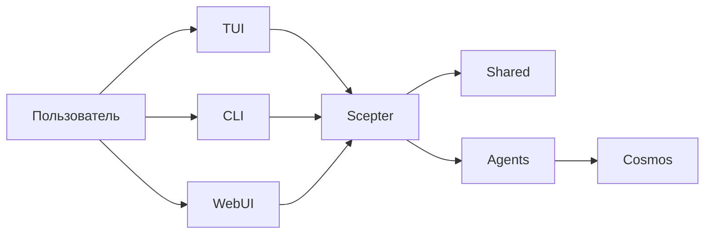

# Архитектура

> На основе текущей структуры времени выполнения, а не воображаемой целевой схемы

## Обзор времени выполнения

Ядром текущей платформы являются `packages/scepter`, `packages/shared` и `packages/tui`.

## Наиболее зрелые компоненты

- Оркестрация сервера Scepter
- Конфигурация, имена инструментов, промпты и типы состояний в Shared
- Пользовательский путь через TUI
- Контейнерный путь выполнения

## Частично реализованные компоненты

- Покрытие команд CLI
- Продвинутая интеграция memory / RAG
- Большинство доменных решений Layer2

## Текущая активная структура агентов

### Layer1

Workspace в настоящее время компилирует 12 агентов Layer1, охватывающих маршрутизацию сообщений, планирование, файлы, контейнеры, скрипты, знания, поиск, планирование, безопасность, память и возможности, связанные с устройствами.

### Layer2

Текущий workspace содержит два активных встроенных крейта Layer2: **Web Automation** (автоматизация браузера) и **Классическая программная инженерия** (статический анализ, код-ревью, метрики качества, рефакторинг, диагностика LSP/символы/рефакторинг). 11 специализированных агентов, перечисленных в старой документации, описывают заархивированное или запланированное содержимое, выходящее за рамки этих двух.

### Layer3

Layer3 остаётся точкой расширения для пользовательских агентов на основе `.amphoreus/` (стадия проектирования, ещё не реализовано).

## Модель выполнения

### Инструменты, видимые модели

Модель обычно видит только:

- `exec`
- `write_to_var`
- `write_to_var_json`

Внутренние MCP-инструменты вызываются косвенно во время выполнения.

### Внутрипроцессные и контейнерные пути

Часть логики выполняется внутри процесса Scepter, другая часть работы выполняется через контейнеризированные пути и вспомогательные модули времени выполнения.

### WebUI / IDE / Tauri

Web UI (arona), панель управления (malkuth), плагины IDE и приложение Tauri были перенесены в сестринский проект **shittim-chest** и удалены из этого репозитория. Предпочтительным интерфейсом этого репозитория является **TUI**; слой Web/IDE находится в shittim-chest и взаимодействует со Scepter через JWT + WebSocket/HTTP.

## Возможности Memory и знаний

RAG и memory более зрелы, чем описано в старых обзорах, но часть интеграционного клея ещё предстоит дополнить:

- Реализовано три бэкенда эмбеддингов: API (совместимый с OpenAI), локальный вывод ONNX (`FastEmbeddingService`, по умолчанию BGE-M3), резервный SHA-256 хеш
- Доступны как векторные документы в памяти, так и хранилище **PgVector** (индекс HNSW)
- Доступны обход графа и гибридный поиск (RRF-фузия)
- Автоматическое подключение embedding→RAG и синхронизация подписок RAG ещё ожидают интеграции
