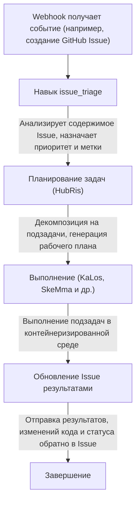

# Интеграция отслеживания Issue

> Подключение внешних систем отслеживания Issue к рабочему процессу агентов Entelecheia (玄枢)
> Примечание о текущем состоянии: HubRis в настоящее время действительно предоставляет вспомогательные возможности создания, обновления, поиска и комментирования Issue, а в репозитории также существует интеграция webhook. Однако этот документ не следует понимать как «уже существует полная унифицированная кроссплатформенная продуктовая поверхность Issue».

---

## Содержание

- [Обзор](#обзор)
- [Трёхуровневая идентификация контейнеров](#трёхуровневая-идентификация-контейнеров)
- [Формат Binding ID](#формат-binding-id)
- [Как агенты взаимодействуют с Issue](#как-агенты-взаимодействуют-с-issue)
- [Рабочие процессы, управляемые Issue](#рабочие-процессы-управляемые-issue)
- [Реестр префиксов платформ](#реестр-префиксов-платформ)
- [Именование веток Fork контейнера](#именование-веток-fork-контейнера)
- [Интеграция с WebUI](#интеграция-с-webui)

---

## Обзор

Текущие возможности Entelecheia, связанные с Issue, в основном исходят из двух направлений:

- интеграция webhook может пересылать внешние события в систему
- HubRis предоставляет вспомогательные возможности CRUD в стиле Issue

Кроссплатформенную автоматизацию Issue можно рассматривать как существующее направление и частичную реализацию, но не следует по умолчанию предполагать, что каждый рабочий процесс в этом документе уже полностью замкнут.

---

## Трёхуровневая идентификация контейнеров

Контейнеры в Entelecheia используют трёхуровневую систему ID для поддержания идентичности в различных контекстах:

| Уровень | Формат | Жизненный цикл | Назначение |
| --- | --- | --- | --- |
| UUID | Стандартный UUID (например, `550e8400-e29b-41d4-a716-446655440000`) | Постоянный | Первичный ключ базы данных, отслеживание между перезапусками |
| Binding ID | `@platform#id` (например, `@github#234`) | Стабильный | Привязка к внешним ресурсам, именование веток |
| Runtime ID | `#xxx` (например, `#616`) | На каждую сессию | Отображение в TUI, маршрутизация Unix socket |

**Binding ID** связывает контейнер с ресурсом внешней платформы. Он остаётся стабильным после перезапуска Scepter, в отличие от Runtime ID, который переназначается при каждом запуске.

---

## Формат Binding ID

Общий формат Binding ID:

```text
@platform#id[@#floor]
```

- `platform` — префикс платформы (например, `github`, `gitee`, `gitlab`)
- `id` — номер Issue или ресурса на платформе
- `@#floor` — необязательный номер этажа для вложенных ссылок (например, комментарии)

### Примеры

| Binding ID | Значение |
| --- | --- |
| `@github#123` | GitHub Issue #123 |
| `@gitee#456` | Gitee Issue #456 |
| `@gitlab#789` | GitLab Issue #789 |
| `@github#123@#5` | Комментарий #5 к GitHub Issue #123 |
| `@feishu#abc123` | Тема сообщения Feishu abc123 |

Binding ID используются для:

- Меток и метаданных контейнеров
- Имён веток для разработки, управляемой Issue
- Параметров навыков агентов
- Фильтрации списка Issue в WebUI

---

## Как агенты взаимодействуют с Issue

Агенты взаимодействуют с внешними Issue через MCP-инструменты HubRis. Эти инструменты инкапсулируют API, специфичные для платформы:

### Доступные операции с Issue

| Инструмент | Описание |
| --- | --- |
| `$.agent.HubRis.issue_create()` | Создать новый Issue на внешней платформе |
| `$.agent.HubRis.issue_update()` | Обновить существующий Issue (заголовок, тело, статус, метки) |
| `$.agent.HubRis.issue_search()` | Кроссплатформенный поиск Issue с применением фильтров |
| `$.agent.HubRis.issue_comment()` | Добавить комментарий к существующему Issue |

### Использование в коде exec

```typescript
$.agent.HubRis.issue_create({
  platform: "github",
  repository: "celestia-island/entelecheia",
  title: "Fix WebSocket reconnection logic",
  body: "The WebSocket client does not retry on connection loss.",
  labels: ["bug", "priority:high"]
});
```

```typescript
$.agent.HubRis.issue_search({
  platform: "github",
  repository: "celestia-island/entelecheia",
  state: "open",
  labels: ["bug"]
});
```

```typescript
$.agent.HubRis.issue_comment({
  binding_id: "@github#123",
  body: "Investigation complete. Root cause identified in src/ws/client.rs:42."
});
```

---

## Рабочие процессы, управляемые Issue

Рабочий процесс по умолчанию, управляемый Issue, следует следующему конвейеру:



### Пошаговый пример

1. Разработчик создаёт Issue `@github#42` с заголовком "Memory leak in container cleanup"
1. GitHub Webhook пересылает событие в Scepter
1. Навык `issue_triage` классифицирует его как **bug**, приоритет **high**
1. HubRis декомпозирует задачу: (a) воспроизвести утечку (b) найти причину (c) реализовать исправление
1. KaLos читает соответствующие исходные файлы, SkeMma запускает диагностические скрипты
1. Агент фиксирует исправление и комментирует решение в `@github#42`

---

## Реестр префиксов платформ

Отображение префиксов платформ настраивается. Реестр по умолчанию включает:

| Префикс | Платформа | Шаблон URL Issue |
| --- | --- | --- |
| `github` | GitHub | `https://github.com/{repo}/issues/{id}` |
| `gitee` | Gitee | `https://gitee.com/{repo}/issues/{id}` |
| `gitlab` | GitLab | `https://gitlab.com/{repo}/-/issues/{id}` |
| `feishu` | Feishu / Lark | Внутренняя ссылка сообщения |
| `discord` | Discord | Ссылка сообщения канала |
| `telegram` | Telegram | Ссылка сообщения чата |

### Поддержка интернационализации

Префиксы платформ поддерживают интернационализированные имена. Например, Feishu можно ссылаться следующими способами:

- `@feishu#123` (английское название)
- `@飞书#123` (китайское название)

Реестр префиксов внутренне нормализует их до канонических префиксов.

---

## Именование веток Fork контейнера

Когда агент создаёт ветку для работы, управляемой Issue, ветка следует соглашению об именовании:

### Формат

```text
cosmos-<binding_id>-<reason>
```

или

```text
cosmos-<uuid8>-<reason>
```

### Примеры

| Имя ветки | Контекст |
| --- | --- |
| `cosmos-@github#42-fix-memory-leak` | Исправление GitHub Issue #42 |
| `cosmos-@gitee#15-add-ci-pipeline` | Разработка функции для Gitee Issue #15 |
| `cosmos-a1b2c3d4-refactor-auth-module` | Внутренняя задача с префиксом UUID |

Формат Binding ID гарантирует, что ветку можно отследить до её исходного Issue.

---

## Интеграция с WebUI

Entelecheia WebUI предоставляет унифицированное представление Issue по всем подключённым платформам.

### Левая боковая панель — агрегированный список Issue

- Отображает Issue со всех платформ в едином списке
- Каждая запись показывает: иконку платформы, номер Issue, заголовок, статус, назначенного агента
- Нажатие на Issue открывает детальное представление

### Фильтрация

Issue можно фильтровать по следующим критериям:

- **Платформа**: показать только GitHub, Gitee, GitLab и т.д.
- **Статус**: открыт, закрыт, в процессе
- **Приоритет**: высокий, средний, низкий (производный от меток)
- **Назначенный агент**: фильтр по агенту, который в настоящее время обрабатывает Issue

### Детальное представление Issue

Детальное представление показывает:

- Полный заголовок и тело Issue (отрендеренные из Markdown)
- Ссылку на платформу (открыть исходный Issue в браузере)
- Журнал активности агента (вызовы навыков, опубликованные комментарии)
- Связанные контейнеры и ветки

---

## Дальнейшие шаги

- Прочитайте [Настройка платформы Webhook](webhook-setup.md) для подключения вашей платформы
- Изучите [Архитектуру](architecture.md) для понимания дизайна агента HubRis
- Интеграция с IDE перенесена в сестринский репозиторий [shittim-chest](https://github.com/celestia-island/shittim-chest)
