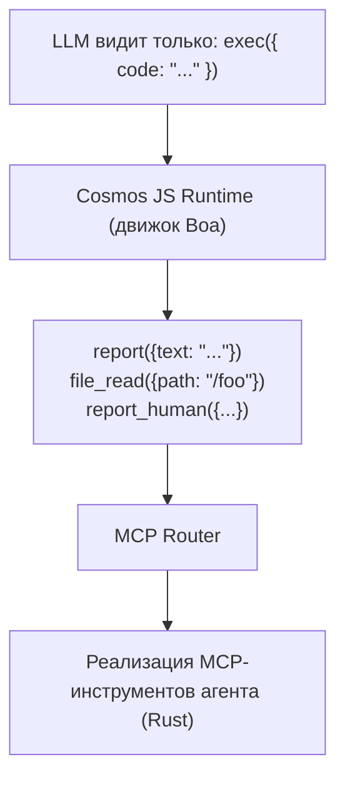
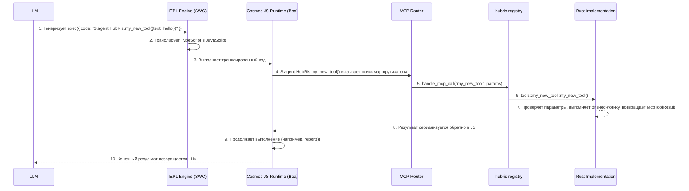

# Руководство по разработке MCP-инструментов

> Как создавать и регистрировать MCP-инструменты на платформе Entelecheia (玄枢)

-----------------------------------------------------------------------------

## Содержание

- [Микроядро Exec-Only](#микроядро-exec-only)
- [Структура MCP-инструмента](#структура-mcp-инструмента)
- [Добавление нового MCP-инструмента](#добавление-нового-mcp-инструмента)
- [Лучшие практики](#лучшие-практики)
- [Тестирование MCP-инструментов](#тестирование-mcp-инструментов)

-----------------------------------------------------------------------------

## Микроядро Exec-Only

Entelecheia использует **архитектуру микроядра** для доступа к инструментам. LLM видит только три инструмента — `exec`, `write_to_var`, `write_to_var_json` — вся реальная работа выполняется внутри его среды выполнения TypeScript (движок IEPL).



**Основной принцип**: LLM никогда не вызывает MCP-инструменты напрямую. Он генерирует код TypeScript, который вызывает API функций инструментов через импорт модулей ES (например, `import { report } from 'hubris'; report()`), а движок IEPL транслирует его в JavaScript и направляет к фактической реализации на Rust.

- Импорт модулей ES — общий шаблон (например, `import { report } from 'hubris'; report()`, `file_read()`)
- `exec`, `write_to_var`, `write_to_var_json` — единственные три инструмента, зарегистрированные для всех агентов (см. `packages/shared/domain_skills/src/tool_names.rs:265-283`)

Объявление `related_tools` в frontmatter TOML навыка определяет, какие API импорта модулей ES будут задокументированы в промпте, отправляемом LLM.

-----------------------------------------------------------------------------

## Структура MCP-инструмента

MCP-инструмент состоит из трёх частей:

1. **Реализация на Rust** — фактическая логика, находится в `packages/agents/<agent>/src/mcp/tools/`
1. **Диспетчеризация Registry** — маршрутизация, находится в `packages/agents/<agent>/src/mcp/registry.rs`
1. **Константы имён инструментов** — строковые константы, находятся в `packages/shared/domain_skills/src/tool_names.rs`

### Определение инструмента в mcp/registry.rs

Каждый агент имеет функцию `handle_mcp_call`, которая маршрутизирует имя инструмента к соответствующей реализации:

```rust
// packages/agents/kalos/src/mcp/registry.rs

use serde_json::Value;
use tracing::info;
use crate::{mcp::tools, state::KalosState};
use _shared::skills::{mcp_tools::McpToolResult, tool_names};

pub async fn handle_mcp_call(
    state: &std::sync::Arc<tokio::sync::RwLock<KalosState>>,
    tool_name: &str,
    parameters: Value,
) -> McpToolResult {
    info!("Calling Kalos MCP tool: {}", tool_name);

    match tool_name {
        tool_names::kalos::FILE_READ => tools::file_read(state, parameters).await,
        tool_names::kalos::FILE_WRITE => tools::file_write(state, parameters).await,
        tool_names::kalos::FILE_EDIT => tools::file_edit(state, parameters).await,
        // ...
        _ => McpToolResult::failure(format!("Unknown tool: {}", tool_name)),
    }
}
```

### Проверка параметров с помощью validate_required_params

Для инструментов с обязательными параметрами используйте общую вспомогательную функцию проверки:

```rust
use _shared::skills::mcp_tools::validate_required_params;

pub async fn my_tool(parameters: Value) -> McpToolResult {
    if let Some(failure) = validate_required_params(
        &parameters,
        &["title", "content"],  // имена обязательных параметров
        "my_tool",              // имя инструмента для сообщения об ошибке
    ) {
        return failure;
    }

    let title = parameters.get("title").unwrap().as_str().unwrap();
    // ...
}
```

`validate_required_params` проверяет, что каждый обязательный параметр существует и является непустой строкой. Если все действительны, возвращает `None`, в противном случае возвращает `Some(McpToolResult::failure(...))` с описательным сообщением об ошибке.

Ссылка: `packages/shared/domain_skills/src/mcp_tools.rs:12-41`.

### Возвращаемое значение: McpToolResult

Каждый инструмент должен возвращать `McpToolResult`. Основные конструкторы:

```rust
// Успех с произвольными данными JSON
McpToolResult::success(serde_json::to_value(my_struct).unwrap_or_default())

// Успех с сериализуемой структурой
McpToolResult::success_struct(&my_result)

// Успех с чистым текстом
McpToolResult::success_text("Operation completed".into())

// Успех с отслеживанием использования LLM
McpToolResult::success_with_usage(
    "Result text".into(),
    Some("gpt-4".into()),
    Some((prompt_tokens, completion_tokens)),
)

// Ошибка с сообщением
McpToolResult::failure("Missing required parameter: title".into())

// Ошибка с несколькими сообщениями
McpToolResult::failure_lines(vec!["Error 1".into(), "Error 2".into()])
```

Ссылка: `packages/shared/domain_skills/src/mcp_tools.rs:62-136`.

-----------------------------------------------------------------------------

## Добавление нового MCP-инструмента

Это пошаговое руководство на примере HubRis демонстрирует, как добавить новый инструмент для существующего агента.

### Шаг 1: Добавить константу имени инструмента

Отредактируйте `packages/shared/domain_skills/src/tool_names.rs`:

```rust
/// HubRis tool names
pub mod hubris {
    pub const REPORT: &str = "report";
    pub const CREATE_TODO: &str = "create_todo";
    // ... существующие инструменты ...
    pub const MY_NEW_TOOL: &str = "my_new_tool";  // добавить эту строку
}
```

### Шаг 2: Реализовать инструмент

Создайте новый файл `packages/agents/hubris/src/mcp/tools/my_new_tool.rs`:

```rust
use serde::Serialize;
use serde_json::Value;
use std::sync::Arc;
use tokio::sync::RwLock;

use crate::state::HubrisState;
use _shared::skills::mcp_tools::{validate_required_params, McpToolResult};

# [derive(Serialize, Debug, Clone)]
struct MyNewToolResult {
    id: String,
    message: String,
}

pub async fn my_new_tool(
    state: &Arc<RwLock<HubrisState>>,
    parameters: Value,
) -> McpToolResult {
    if let Some(failure) = validate_required_params(&parameters, &["text"], "my_new_tool") {
        return failure;
    }

    let text = parameters.get("text").and_then(|v| v.as_str()).unwrap();
    let id = uuid::Uuid::now_v7().to_string();

    let result = MyNewToolResult {
        id,
        message: format!("Processed: {}", text),
    };

    McpToolResult::success(serde_json::to_value(result).unwrap_or_default())
}
```

### Шаг 3: Зарегистрировать в модуле

Отредактируйте `packages/agents/hubris/src/mcp/tools/mod.rs`:

```rust
pub mod report;
pub mod todo_ops;
pub mod my_new_tool;  // добавить эту строку
```

### Шаг 4: Добавить в диспетчеризацию Registry

Отредактируйте `packages/agents/hubris/src/mcp/registry.rs`:

```rust
pub async fn handle_mcp_call(
    state: &Arc<RwLock<HubrisState>>,
    todo_store: &Option<Arc<TodoStore>>,
    tool_name: &str,
    parameters: Value,
) -> McpToolResult {
    match tool_name {
        // ... существующие инструменты ...
        tool_names::hubris::MY_NEW_TOOL => {
            crate::mcp::tools::my_new_tool::my_new_tool(state, parameters).await
        },
        _ => McpToolResult::failure(format!(
            "HubRis does not provide tool: {}",
            tool_name
        )),
    }
}
```

### Шаг 5: Создать документацию MCP-инструмента

Создайте `res/prompts/agents/hubris/mcp/my_new_tool.md`:

```markdown
+++
name = "my_new_tool"
agent = "hubris"

[description]
en = "Process text and return a structured result."
zhs = "Обработать текст и вернуть структурированный результат."
+++

# my_new_tool

Process text and return a structured result.

## Parameters

- **text** (string, required): The text to process

## Returns

### Success

\`\`\`json
{ "id": "...", "message": "Processed: ..." }
\`\`\`

### Failure

\`\`\`text
Missing required parameter(s) for my_new_tool: text
\`\`\`
```

### Шаг 6: Экспортировать через related_tools в навыке

Чтобы LLM знал о вашем инструменте, добавьте его в frontmatter навыка:

```toml
[[related_tools]]
agent_name = "hubris"
tool_name = "my_new_tool"
```

Это внедрит документацию API инструмента в промпт навыка, позволяя LLM вызывать `$.agent.HubRis.my_new_tool()`.

### Шаг 7: Использовать через exec (внедрение в промпт)

Когда LLM обрабатывает навык, в `related_tools` которого указан `my_new_tool`, он генерирует код TypeScript:

```typescript
const result: { id: string; message: string } = await $.agent.HubRis.my_new_tool({ text: "some content to process" });
```

Движок IEPL транслирует TypeScript в JavaScript, затем среда выполнения Cosmos JS перехватывает вызов, направляет через MCP Router к реализации на Rust и возвращает результат в контекст JavaScript.

### Полная цепочка вызова



-----------------------------------------------------------------------------

## Лучшие практики

### 1. Всегда используйте write_to_var для многострочного вывода

При построении многострочных строк в коде `exec` используйте `write_to_var`, чтобы избежать больших встроенных строк, потребляющих много токенов:

```typescript
// Не рекомендуется — большие встроенные строки
exec({ code: "report({text: 'line1\\nline2\\nline3\\n...very long...'})" })

// Рекомендуется — постепенное построение
exec({ code: `
  let output: string = '';
  $write_to_var('step1', 'First part of the content');
  $write_to_var('step2', 'Second part of the content');
  output = $read_var('step1') + '\\n' + $read_var('step2');
  report({text: output});
` })
```

### 2. Используйте env.aporia.language для установки языка вывода

Навыки, производящие текст, ориентированный на пользователя, должны проверять настроенный язык вывода:

```typescript
const lang: string = env.aporia.language;  // например, "en", "zhs", "ja"
const greeting: string = lang === "en" ? "Hello" : lang === "zhs" ? "你好" : "Hello";
```

Frontmatter навыка может объявить эту зависимость:

```toml
config = ["user_language"]
```

### 3. Используйте TypeScript, всегда const/let, никогда var

Весь код в `exec` должен использовать синтаксис TypeScript:

```typescript
// Правильно
const result = file_read({path: '/src/main.rs'});
let items: string[] = result.content.split('\n');

// Неправильно
var result = file_read({path: '/src/main.rs'});
```

### 4. Постепенно стройте объекты

Для сложных объектов параметров стройте их постепенно:

```typescript
let params: Record<string, unknown> = {};
params.title = "My Task";
params.description = "Detailed description";
params.priority = "high";

if (hasDueDate) {
    params.due_date = dueDate;
}

$.agent.HubRis.create_todo(params);
```

### 5. Сообщайте результаты через report()

Каждый навык должен вызвать `report()` как минимум один раз перед завершением. Это способ захвата результатов и их маршрутизации к следующему шагу в цепочке навыков:

```typescript
report({text: "Task decomposition complete. Found 3 sub-tasks."});
```

Несколько вызовов агрегируются — всё содержимое объединяется в конце фазы обдумывания.

### 6. Соглашения об именовании параметров

- Используйте `snake_case` для имён параметров (например, `parent_id`, `due_date`, `workspace_id`)
- Строковые ID должны использовать формат UUID
- Временные метки должны использовать формат ISO 8601 / RFC 3339
- Необязательные параметры должны документировать явные значения по умолчанию

### 8. Приоритет пакетного дизайна инструментов IEPL (критически важно)

В традиционном MCP инструменты мелкозернистые — CPU, память, диск вызываются разными инструментами. В IEPL каждый обход потребляет токены LLM и добавляет задержку. **Проектируйте инструменты так, чтобы возвращать все релевантные данные максимум за 1-2 вызова.**

```rust
// Не рекомендуется: три отдельных инструмента для получения информации об устройстве
pub const CPU_INFO: &str = "cpu_info";
pub const MEMORY_INFO: &str = "memory_info";
pub const STORAGE_INFO: &str = "storage_info";

// Рекомендуется: один инструмент возвращает полную конфигурацию системы
pub const SYSTEM_INFO: &str = "system_info";
// Возвращает: { cpu: {...}, memory: {...}, storage: {...}, pci: [...], gpu: {...}, os: {...} }
```

Для инструментов, читающих данные из внешних источников (устройства, протоколы, базы данных), принимайте параметры `scan` или `ranges` для поддержки пакетных запросов:

```typescript
// Пакетное чтение Modbus — один вызов читает несколько диапазонов регистров
const result = $.agent.SkeMma.modbus_read({
  endpoint: "/dev/ttyUSB0",
  scan: [
    { register_type: "holding", start_address: 0, count: 10 },
    { register_type: "input", start_address: 100, count: 5 }
  ]
});
```

**Мелкозернистые инструменты допустимы только** для операций записи по конкретному адресу или запросов, где вызывающий явно запрашивает узкий диапазон данных.

### 7. Обработка ошибок в инструментах

Возвращайте описательные сообщения об ошибках, чтобы помочь LLM самостоятельно исправиться:

```rust
// Рекомендуется — конкретно, действенно
McpToolResult::failure("Missing required parameter(s) for create_todo: title".into())

// Рекомендуется — с контекстом
McpToolResult::failure(format!("TODO item {} not found", id))

// Не рекомендуется — расплывчато
McpToolResult::failure("Error".into())
```

-----------------------------------------------------------------------------

## Тестирование MCP-инструментов

### Модульное тестирование отдельных инструментов

Тестируйте каждую функцию инструмента напрямую, создавая параметры `Value` и проверяя `McpToolResult`:

```rust
# [tokio::test]
async fn test_report_success() {
    use std::sync::Arc;
    use tokio::sync::RwLock;

    let state = Arc::new(RwLock::new(HubrisState::new()));
    let params = serde_json::json!({
        "text": "Test report content"
    });

    let result = crate::mcp::tools::report::report(&state, params).await;

    assert!(result.success);
    assert!(result.data.get("summary").is_some());

    // Проверить, что состояние обновлено
    let state = state.read().await;
    assert_eq!(state.pending_reports.len(), 1);
    assert_eq!(state.pending_reports[0], "Test report content");
}

# [tokio::test]
async fn test_report_empty_text() {
    let state = Arc::new(RwLock::new(HubrisState::new()));
    let params = serde_json::json!({
        "text": ""
    });

    let result = crate::mcp::tools::report::report(&state, params).await;

    assert!(!result.success);
    assert!(!result.error.is_empty());
}
```

### Тестирование диспетчеризации Registry

Проверьте, что registry правильно маршрутизирует имена инструментов:

```rust
# [tokio::test]
async fn test_registry_routes_known_tool() {
    let state = Arc::new(RwLock::new(HubrisState::new()));
    let params = serde_json::json!({"text": "hello"});

    let result = handle_mcp_call(&state, &None, "report", params).await;
    assert!(result.success);
}

# [tokio::test]
async fn test_registry_rejects_unknown_tool() {
    let state = Arc::new(RwLock::new(HubrisState::new()));
    let params = serde_json::json!({});

    let result = handle_mcp_call(&state, &None, "nonexistent_tool", params).await;
    assert!(!result.success);
    assert!(result.error[0].contains("does not provide tool"));
}
```

### Тестирование проверки параметров

Тестируйте вспомогательную функцию `validate_required_params` напрямую:

```rust
# [test]
fn test_validate_required_params_all_present() {
    let params = serde_json::json!({"title": "test", "content": "body"});
    let result = validate_required_params(&params, &["title", "content"], "test_tool");
    assert!(result.is_none());
}

# [test]
fn test_validate_required_params_missing() {
    let params = serde_json::json!({"title": "test"});
    let result = validate_required_params(&params, &["title", "content"], "test_tool");
    assert!(result.is_some());
    let failure = result.unwrap();
    assert!(!failure.success);
    assert!(failure.error[0].contains("content"));
}

# [test]
fn test_validate_required_params_empty_string() {
    let params = serde_json::json!({"title": ""});
    let result = validate_required_params(&params, &["title"], "test_tool");
    assert!(result.is_some());
}
```

### Тестирование с использованием Database Store

Для инструментов, зависящих от Database Store, обычно используется тестирование с in-memory или тестовой базой данных:

```rust
# [tokio::test]
async fn test_create_todo_success() {
    // Настройка: создать тестовый TodoStore (зависит от тестовой инфраструктуры)
    let todo_store = create_test_store().await;
    let params = serde_json::json!({
        "title": "Test Task",
        "workspace_id": test_workspace_id.to_string()
    });

    let result = create_todo(&todo_store, params).await;

    assert!(result.success);
    let id = result.data.get("id").unwrap().as_str().unwrap();
    assert!(!id.is_empty());
    assert_eq!(result.data.get("title").unwrap().as_str(), Some("Test Task"));
}
```

### Запуск тестов

```bash
# Запустить все тесты
just test

# Запустить тесты конкретного крейта агента
cargo test -p hubris
cargo test -p kalos

# Запустить конкретный тест
cargo test -p hubris test_report_success

# Запустить с выводом
cargo test -p hubris -- --nocapture
```

-----------------------------------------------------------------------------

## Быстрый справочник: ключевые файлы

| Назначение | Путь |
| --- | --- |
| Определение `McpToolResult` | `packages/shared/domain_skills/src/mcp_tools.rs` |
| `validate_required_params` | `packages/shared/domain_skills/src/mcp_tools.rs:12-41` |
| Константы имён инструментов | `packages/shared/domain_skills/src/tool_names.rs` |
| `agent_allowed_tools()` | `packages/shared/domain_skills/src/tool_names.rs:166-169` |
| HubRis MCP registry | `packages/agents/hubris/src/mcp/registry.rs` |
| HubRis report tool | `packages/agents/hubris/src/mcp/tools/report.rs` |
| HubRis TODO CRUD tools | `packages/agents/hubris/src/mcp/tools/todo_ops.rs` |
| KaLos MCP registry | `packages/agents/kalos/src/mcp/registry.rs` |
| Примеры документации MCP-инструментов | `res/prompts/agents/hubris/mcp/` |
| Примеры промптов навыков | `res/prompts/agents/hubris/skills/` |
