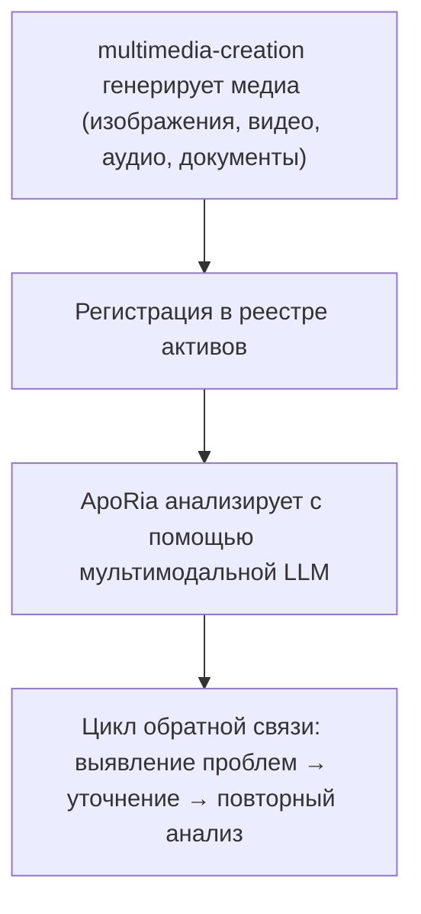

# Мультимодальный конвейер

> **⚠️ Справочник архивного агента — не в конвейере разработки**
> Агент Layer2 `multimedia-creation`, на который ссылается этот документ, был **заархивирован**. Его код Rust, привязки `.d.ts` и регистрация агента удалены. Мультимодальный конвейер, описанный в этом документе, является **целью проектирования**, а не реализованной функцией. Не реализуйте и не планируйте работу по этому конвейеру, если разработчик явно не запросил это.
> Генерация, регистрация и анализ медиа с использованием multimedia-creation и ApoRia
> Примечание о текущем состоянии: этот документ в основном описывает целевой рабочий процесс. В текущей кодовой базе действительно существуют инструменты ApoRia, связанные с мультимодальностью, но они ещё не полностью достигли возможностей централизованного реестра активов и полного замкнутого цикла, описанных ниже.

---

## Содержание

- [Обзор](#обзор)
- [Реестр активов](#реестр-активов)
- [Инструменты генерации](#инструменты-генерации)
- [Регистрация](#регистрация)
- [Мультимодальный анализ](#мультимодальный-анализ)
- [Цикл проверки](#цикл-проверки)
- [Документы Office](#документы-office)
- [Полный пример](#полный-пример)

---

## Обзор

Entelecheia (玄枢) в настоящее время содержит базовые модули, связанные с мультимодальностью, особенно ранние инструменты на стороне ApoRia. Однако описанный здесь конвейер multimedia-creation → централизованный реестр активов → замкнутый цикл мультимодальной проверки лучше рассматривать как цель проектирования, а не как полное текущее состояние.



---

## Реестр активов

Реестр активов — это централизованное хранилище метаданных медиа, управляемое ApoRia. Он отслеживает:

- Пути к файлам и места хранения
- MIME-типы
- Метаданные генерации (промпты, параметры, временные метки)
- Историю анализа и оценки качества

### Рабочий процесс регистрации / извлечения

```typescript
const asset = $.agent.ApoRia.media_asset_register({
  file_path: "/output/marketing-banner.png",
  mime_type: "image/png",
  metadata: {
    prompt: "A futuristic city skyline at sunset",
    generator: "multimedia-creation",
    model: "stable-diffusion-xl"
  }
});

const asset_id: string = asset.id;

const retrieved = $.agent.ApoRia.media_asset_retrieve({
  asset_id: asset_id
});
```

---

## Инструменты генерации

multimedia-creation предоставляет инструменты генерации для различных типов медиа. Все инструменты вызываются через `$multimedia-creation.<tool>()` в коде exec.

### Генерация изображений

```typescript
$multimedia-creation.image_generate({
  prompt: "A futuristic city skyline at sunset, cyberpunk style",
  width: 1024,
  height: 512,
  model: "stable-diffusion-xl",
  output_path: "/output/city-skyline.png"
});
```

### Генерация видео

```typescript
$multimedia-creation.video_generate({
  prompt: "Camera panning across a mountain landscape at golden hour",
  duration_seconds: 10,
  fps: 24,
  resolution: "1080p",
  output_path: "/output/mountain-pan.mp4"
});
```

### Генерация аудио

```typescript
$multimedia-creation.audio_generate({
  prompt: "Ambient electronic background music, calm and atmospheric",
  duration_seconds: 30,
  format: "mp3",
  output_path: "/output/ambient-bg.mp3"
});
```

### Генерация документов

```typescript
$multimedia-creation.doc_generate({
  template: "technical-report",
  title: "Q4 Performance Analysis",
  content: report_markdown,
  format: "docx",
  output_path: "/output/q4-report.docx"
});
```

### Генерация электронных таблиц

```typescript
$multimedia-creation.sheet_generate({
  title: "Budget Forecast 2025",
  data: budget_data,
  format: "xlsx",
  output_path: "/output/budget-2025.xlsx"
});
```

### Генерация слайдов

```typescript
$multimedia-creation.slide_generate({
  title: "Product Roadmap Presentation",
  sections: slide_sections,
  format: "pptx",
  output_path: "/output/roadmap.pptx"
});
```

---

## Регистрация

После генерации медиа зарегистрируйте его в реестре активов для анализа ApoRia:

```typescript
const result = $multimedia-creation.image_generate({
  prompt: "Product hero shot on white background",
  width: 1920,
  height: 1080,
  output_path: "/output/hero-shot.png"
});

const asset = $.agent.ApoRia.media_asset_register({
  file_path: result.output_path,
  mime_type: "image/png",
  metadata: {
    prompt: "Product hero shot on white background",
    generator: "multimedia-creation",
    dimensions: "1920x1080"
  }
});

const asset_id: string = asset.id;
```

---

## Мультимодальный анализ

ApoRia предоставляет мультимодальный анализ через `$.agent.ApoRia.multimodal_chat()`. Передайте один или несколько ID активов вместе с текстовым промптом:

```typescript
const analysis = $.agent.ApoRia.multimodal_chat({
  prompt: "Analyze this image for composition, color balance, and visual hierarchy. Rate each aspect from 1-10.",
  asset_ids: [asset_id]
});
```

### Анализ нескольких активов

```typescript
const comparison = $.agent.ApoRia.multimodal_chat({
  prompt: "Compare these two design variations. Which one has better visual balance and why?",
  asset_ids: [variant_a_id, variant_b_id]
});
```

### Анализ с контекстом

```typescript
const context_analysis = $.agent.ApoRia.multimodal_chat({
  prompt: "Does this image match the brand guidelines? Guidelines: primary color blue (#0066CC), clean layout, sans-serif typography.",
  asset_ids: [asset_id]
});
```

---

## Цикл проверки

Мультимодальный конвейер поддерживает итеративные циклы проверки:

1. **Генерация** — multimedia-creation создаёт исходное медиа
1. **Регистрация** — сохранение в реестре активов
1. **Анализ** — ApoRia оценивает медиа с помощью мультимодальной LLM
1. **Выявление проблем** — извлечение конкретных улучшений из анализа
1. **Уточнение** — multimedia-creation корректирует параметры на основе обратной связи и перегенерирует
1. **Повторный анализ** — ApoRia оценивает уточнённый вывод

### Пример цикла проверки в коде exec

```typescript
let iteration: number = 0;
const max_iterations: number = 3;
const quality_threshold: number = 8.0;
let current_prompt: string = "A serene mountain lake at dawn, photorealistic";

while (iteration < max_iterations) {
  iteration++;

  const gen_result = $multimedia-creation.image_generate({
    prompt: current_prompt,
    width: 1024,
    height: 768,
    output_path: `/output/lake-v${iteration}.png`
  });

  const asset = $.agent.ApoRia.media_asset_register({
    file_path: gen_result.output_path,
    mime_type: "image/png",
    metadata: { prompt: current_prompt, iteration: iteration }
  });

  const analysis = $.agent.ApoRia.multimodal_chat({
    prompt: "Rate this image on composition (1-10), color harmony (1-10), and overall quality (1-10). Provide specific improvement suggestions.",
    asset_ids: [asset.id]
  });

  const overall_score: number = analysis.data.overall_quality;

  if (overall_score >= quality_threshold) {
    report({ text: `Quality threshold met at iteration ${iteration}. Score: ${overall_score}` });
    break;
  }

  const suggestions = analysis.data.improvement_suggestions;
  current_prompt = current_prompt + ". " + suggestions.join(". ");

  if (iteration === max_iterations) {
    report({ text: `Max iterations reached. Final score: ${overall_score}` });
  }
}
```

---

## Документы Office

multimedia-creation может генерировать документы, совместимые с Office:

### Документы Word (`doc_generate`)

Генерирует файлы `.docx` из Markdown или структурированного содержимого. Поддерживает шаблоны для распространённых типов документов:

- Технические отчёты
- Протоколы совещаний
- Предложения

```typescript
$multimedia-creation.doc_generate({
  template: "meeting-notes",
  title: "Sprint Planning - Week 12",
  content: meeting_content,
  format: "docx",
  output_path: "/output/sprint-12-notes.docx"
});
```

### Электронные таблицы Excel (`sheet_generate`)

Генерирует файлы `.xlsx` со структурированными данными, формулами и форматированием:

```typescript
$multimedia-creation.sheet_generate({
  title: "Monthly Revenue",
  data: revenue_data,
  format: "xlsx",
  output_path: "/output/revenue.xlsx"
});
```

### Презентации PowerPoint (`slide_generate`)

Генерирует файлы `.pptx` с разделами, маркированными списками и опциональным встраиванием изображений:

```typescript
$multimedia-creation.slide_generate({
  title: "Quarterly Business Review",
  sections: [
    { title: "Revenue", bullets: ["Q1: $1.2M", "Q2: $1.5M"] },
    { title: "Goals", bullets: ["Launch v2.0", "Expand to APAC"] }
  ],
  format: "pptx",
  output_path: "/output/qbr.pptx"
});
```

---

## Полный пример

Этот пример демонстрирует полный конвейер: генерация маркетингового изображения, регистрация, анализ и уточнение.

### Шаг 1: Генерация исходного изображения

```typescript
const gen = $multimedia-creation.image_generate({
  prompt: "A modern SaaS product dashboard mockup, clean UI, blue and white color scheme",
  width: 1920,
  height: 1080,
  output_path: "/output/dashboard-v1.png"
});
```

### Шаг 2: Регистрация актива

```typescript
const asset = $.agent.ApoRia.media_asset_register({
  file_path: gen.output_path,
  mime_type: "image/png",
  metadata: {
    prompt: "SaaS dashboard mockup",
    purpose: "marketing",
    version: 1
  }
});
```

### Шаг 3: Анализ композиции

```typescript
const analysis = $.agent.ApoRia.multimodal_chat({
  prompt: "Analyze this dashboard mockup for: 1) Visual hierarchy, 2) Color consistency, 3) Readability of data elements. Provide a score (1-10) for each and specific suggestions for improvement.",
  asset_ids: [asset.id]
});
```

### Шаг 4: Уточнение на основе обратной связи

```typescript
const refined = $multimedia-creation.image_generate({
  prompt: "A modern SaaS product dashboard mockup, clean UI, blue and white color scheme. " + analysis.data.suggestions.join(". "),
  width: 1920,
  height: 1080,
  output_path: "/output/dashboard-v2.png"
});
```

### Шаг 5: Регистрация и повторный анализ

```typescript
const refined_asset = $.agent.ApoRia.media_asset_register({
  file_path: refined.output_path,
  mime_type: "image/png",
  metadata: {
    prompt: "SaaS dashboard mockup (refined)",
    purpose: "marketing",
    version: 2,
    previous_version: asset.id
  }
});

const final_analysis = $.agent.ApoRia.multimodal_chat({
  prompt: "Compare this refined version to the original. Has the visual hierarchy improved? Rate the overall quality 1-10.",
  asset_ids: [asset.id, refined_asset.id]
});

report({
  text: `Marketing image pipeline complete. Initial score: ${analysis.data.overall_score}, Refined score: ${final_analysis.data.overall_score}`
});
```

---

## Дальнейшие шаги

- Прочитайте [Руководство по основам](fundamentals.md) для получения подробностей об агентах multimedia-creation и ApoRia
- Изучите [Архитектуру](architecture.md) для полного обзора системы агентов
- Настройте [Интеграцию Webhook](webhook-setup.md) для запуска генерации от внешних событий
