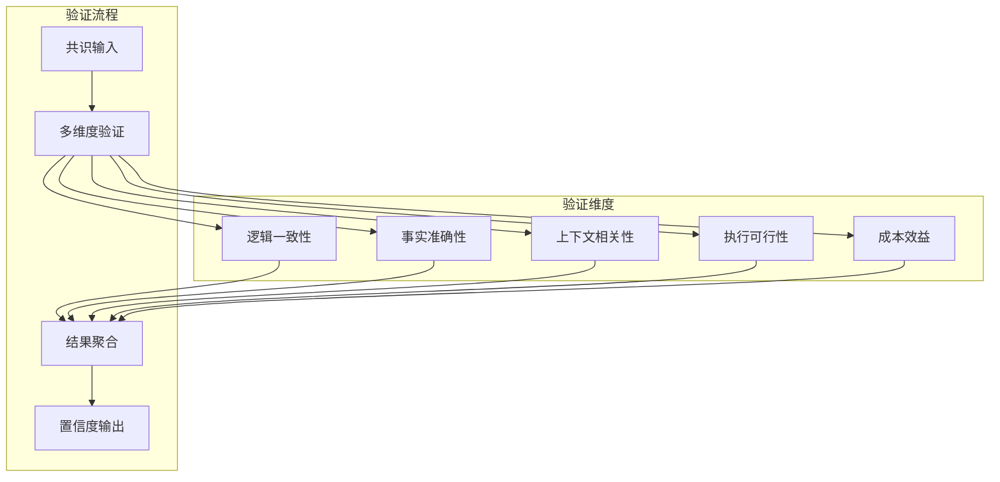
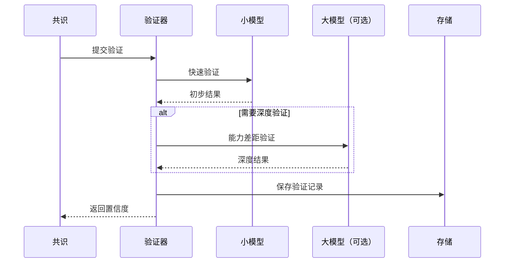
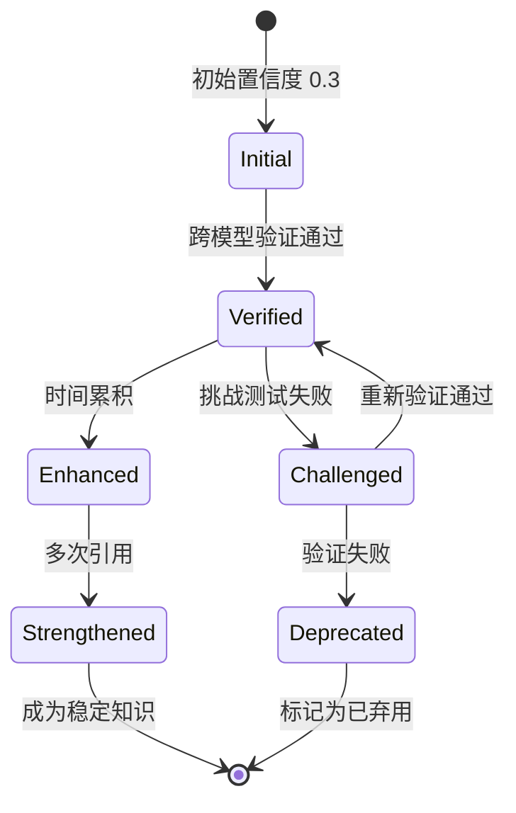
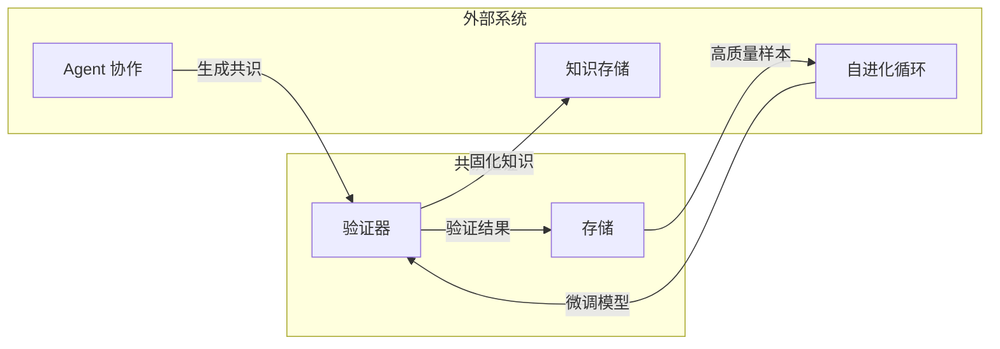

+++
title = "共识验证机制"
description = """共识验证机制是多 Agent 协作系统的核心组件，用于验证和评估多个 Agent 形成的共识的可靠性和准确性，确保系统输出质量。"""
lang = "zhs"
category = "design"
subcategory = "core"
+++

# 共识验证机制

## 概述

共识验证机制是多 Agent 协作系统的核心组件，用于验证和评估多个 Agent 形成的共识的可靠性和准确性，确保系统输出质量。

## 核心原则

### 多维验证框架

系统通过五个维度进行全面验证：

### 验证维度说明

| 维度 | 验证目标 | 关键指标 |
| --- | --- | --- |
| 逻辑一致性 | 共识是否自洽 | 无矛盾、推理完整 |
| 事实准确性 | 事实陈述是否正确 | 与已知知识一致 |
| 上下文相关性 | 是否与当前任务相关 | 相关性评分 |
| 执行可行性 | 计划是否可执行 | 可操作性评估 |
| 成本效益 | 成本效益是否合理 | ROI 评估 |

## 架构设计

### 渐进式验证流程

### 置信度累积机制

## 与其他系统的集成

## 设计考量

### 成本控制

- 优先使用小模型进行验证
- 仅在必要时启用大模型
- 验证结果缓存与复用

### 质量保证

- 多维度交叉验证
- 时间累积增强可信度
- 挑战测试发现潜在问题

### 可追溯性

- 完整的验证历史记录
- 支持审计与回溯
- 统计分析支持
