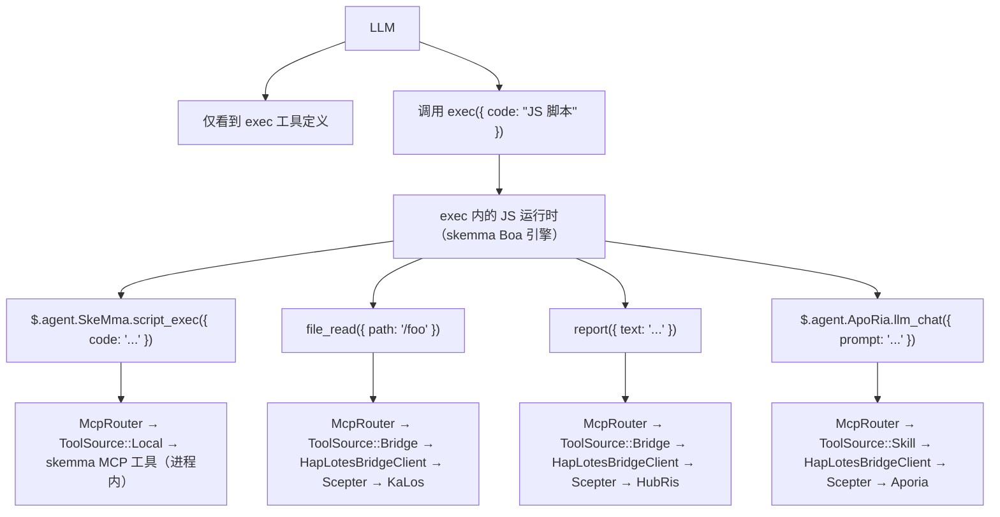
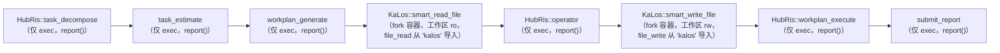
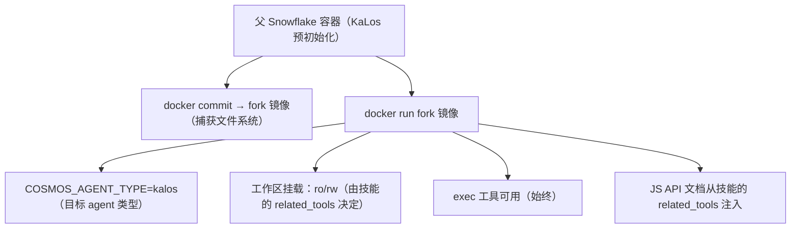

+++
title = "跨 Agent 技能路由架构"
description = """技能链（`execute_skill_chain`）使用仅执行微内核架构。LLM 仅看到三个工具：`exec`、`write_to_var`、`write_to_var_json`——无每 agent 工具白名单、无每技能工具定义。所有 MCP 工具调用通过 ES 模块导入和跨 agent TS API（如 `file_read()`）在 TypeScript 运行时（IEPL 引擎）内部发生。"""
lang = "zhs"
category = "design"
subcategory = "core"
+++

# 跨 Agent 技能路由架构

## 问题

技能链（`execute_skill_chain`）使用仅执行微内核架构。LLM 仅看到三个工具：`exec`、`write_to_var`、`write_to_var_json`——无每 agent 工具白名单、无每技能工具定义。所有 MCP 工具调用通过 ES 模块导入和跨 agent TS API（如 `file_read()`）在 TypeScript 运行时（IEPL 引擎）内部发生。

## 设计原则

1. **仅执行微内核**——LLM 永远不会直接获得 MCP 工具定义。它有三个工具：`exec`、`write_to_var` 和 `write_to_var_json`。所有工具调用在 IEPL 引擎的 TS 运行时内部发生。
1. **`related_tools` 驱动一切**——技能在其 TOML frontmatter 中声明 `related_tools`。这些名称成为注入到 LLM 提示中的 TS API 文档（例如 `file_read()`、`report()`）。
1. **通过 TS API → McpRouter 路由**——在 `exec` 的 IEPL 运行时内部，ES 模块导入通过 `McpRouter` 路由到正确的 MCP 工具实现。跨 agent 调用（如 `file_read()`）解析到 KaLos agent 的 `file_read` 实现。
1. **容器隔离**——子容器通过 `docker commit` fork 继承父文件系统。工作区根据技能的 `related_tools` 以只读或读写方式挂载。
1. **`related_tools` 决定读/写模式**——`skill_needs_write_access()` 检查 `related_tools` 中是否有写工具名称（`file_write`、`file_edit` 等）来决定 fork 容器的挂载模式。

## 架构

### 仅执行微内核流程



### 技能链执行流程



### 容器 Fork 机制



## 实现细节

### 核心组件

| 组件 | 文件 | 职责 |
| --- | --- | --- |
| `skill_to_agent_name()` | `skill_chain.rs` | 查找拥有给定技能的 agent 名称 |
| `skill_needs_write_access()` | `skill_chain.rs` | 检查 `related_tools` 中是否有写工具名称以决定 fork 容器挂载模式 |
| `fork_for_sub_skill()` | `snowflake_manager.rs` | 执行 `docker commit` + `docker run`；根据 `skill_needs_write_access()` 以 ro/rw 挂载工作区 |
| `find_by_agent_type()` | `snowflake_manager.rs` | 反向搜索，返回最新的 fork 容器 |
| `McpRouter` | `packages/cosmos/src/bin/cosmos/mcp_router.rs` | 路由 ES 模块导入调用：`ToolSource::Local` → skemma，`ToolSource::Bridge` → HapLotes |
| `HapLotesBridgeClient` | `packages/agents/haplotes/src/bridge/client.rs` | Cosmos → Scepter 桥接：`bridge_call()`、`bridge_list_tools()` |
| `BridgeInvoker` | `packages/scepter/src/agent_manager/bridge_invoker.rs` | Scepter 侧：将工具调用路由到正确的注册 agent |
| `build_js_api_docs()` | `skill_chain.rs` | 从技能的 `related_tools` 生成 JS API 文档以供提示注入 |
| `build_skill_user_prompt(agent_name, ...)` | `skill_chain.rs` | 组装带有注入的 JS API 文档的技能提示 |

### JS API 文档如何生成

技能的 TOML frontmatter 声明 `related_tools`：

```toml
# smart_read_file.md
related_tools = ["file_read", "file_list", "file_exists"]
```

系统将每个工具解析到其拥有的 agent，并从 `.d.ts` 声明生成 TS API 文档：

```typescript
// 作为可用 API 注入到 LLM 提示中（带有来自 .d.ts 的类型声明）：
file_read({ path: string }): Promise<string>
file_list({ dir: string }): Promise<string[]>
file_exists({ path: string }): Promise<boolean>
report({ text: string }): Promise<void>
```

LLM 在其 `exec` 代码中调用这些 API；McpRouter 调度到正确的 agent 的 MCP 工具实现。

### Fork 生命周期

1. **创建**：`docker commit` 父容器 → fork 镜像 → `docker run` 子容器
1. **连接**：`CosmosConnector` 连接到子容器的 Unix 套接字
1. **桥接**：Fork 容器内的 `HapLotesBridgeClient` 连接到 Scepter 的 `HapLotesBridgeServer`
1. **执行**：LLM 调用带有 JS 代码的 `exec`；JS 运行时使用 McpRouter → 桥接 → Scepter agent
1. **清理**：当链结束时，`snowflake.remove()` 销毁容器 + `docker rmi` 清理镜像

### 工作区挂载策略

| 技能类型 | `related_tools` 特征 | 工作区挂载 |
| --- | --- | --- |
| 只读（smart_read_file） | 仅 file_read、file_list、file_exists | `:ro`（只读） |
| 写入（smart_write_file） | 包含 file_write、file_edit、file_delete | `:rw`（读写） |

### 跨 Agent 工具路由

在 `exec` 的 JS 运行时内部，McpRouter 通过 HapLotes 桥接解析工具调用：

```mermaid
flowchart TB
    subgraph Bridge["桥接调用"]
        A1["exec({ code: &quot;file_read({path:'/foo'})&quot; })"] --> B1["McpRouter 解析 &quot;kalos&quot; + &quot;file_read&quot;"]
        B1 --> C1["tool_to_source → ToolSource::Bridge"]
        C1 --> D1["HapLotesBridgeClient → bridge.call(&quot;kalos.file_read&quot;, params)"]
        D1 --> E1["Scepter 的 HapLotesBridgeServer → BridgeInvoker"]
        E1 --> F1["路由到 KaLos agent → file_read MCP 工具"]
    end
    subgraph Local["本地调用"]
        A2["exec({ code: &quot;$.agent.SkeMma.script_exec({code:'1+1'})&quot; })"] --> B2["McpRouter 解析 &quot;skemma&quot; + &quot;script_exec&quot;"]
        B2 --> C2["tool_to_source → ToolSource::Local"]
        C2 --> D2["直接调用 skemma MCP 工具（进程内 Boa 引擎）"]
    end
```



### 写访问检测

```rust
fn skill_needs_write_access(skill: &Skill) -> bool {
    const WRITE_TOOLS: &[&str] = &["file_write", "file_edit", "file_delete", "file_rename"];
    skill.related_tools.iter().any(|t| WRITE_TOOLS.contains(&t.as_str()))
}
```

此函数从技能的 TOML frontmatter 读取 `related_tools`。如果存在任何写工具，则 fork 容器的工作区以读写方式挂载。

## 配置

### 技能 TOML Frontmatter

```toml
# smart_read_file.md
+++
related_tools = ["file_read", "file_list", "file_exists"]

[[next_action]]
agent = "hubris"
name = "operator"
+++

# smart_write_file.md
+++
related_tools = ["file_write", "file_edit"]

[[next_action]]
agent = "hubris"
name = "workplan_execute"
+++
```

### next_action 链（技能 TOML）

```toml
# workplan_generate.md
[[next_action]]
agent = "kalos"
name = "smart_read_file"

# smart_read_file.md
[[next_action]]
agent = "hubris"
name = "operator"

# operator.md
[[next_action]]
agent = "kalos"
name = "smart_write_file"

# smart_write_file.md
[[next_action]]
agent = "hubris"
name = "workplan_execute"
```

## 技能 JS API 参考

| 技能 | Agent | JS API（来自 `related_tools`） | 状态 |
| --- | --- | --- | --- |
| `smart_read_file` | KaLos | `file_read()`、`file_list()`、`file_exists()` | ✅ 已实现 |
| `smart_write_file` | KaLos | `file_write()`、`file_edit()` | ✅ 已实现 |
| `exec_script` | SkeMma | `$skeMma.script_exec()` | 待实现 |
| `smart_command` | SkoPeo | `$skoPeo.smart_command_execute()` | 待实现 |

## 风险与考量

1. **容器资源**——每个 fork 创建一个新的 Docker 容器；链结束时容器自动清理。
1. **Token 成本**——每个 fork 具有自己的独立 LLM 上下文；JS API 文档为每技能增加适度开销。
1. **Fork 链深度**——目前无深度限制；仅在 `step_index > 1` 时发生 fork。
1. **上下文传递**——父 → 子通过报告内容传递；可能需要截断策略。
1. **并行安全性**——当多个链同时 fork 相同 agent 类型时，反向顺序搜索确保每个链使用其最新的 fork。
1. **API 表面控制**——LLM 只能调用注入文档中列出的 JS API；McpRouter 拒绝未知工具名称。
