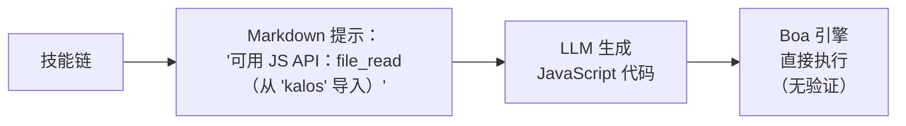
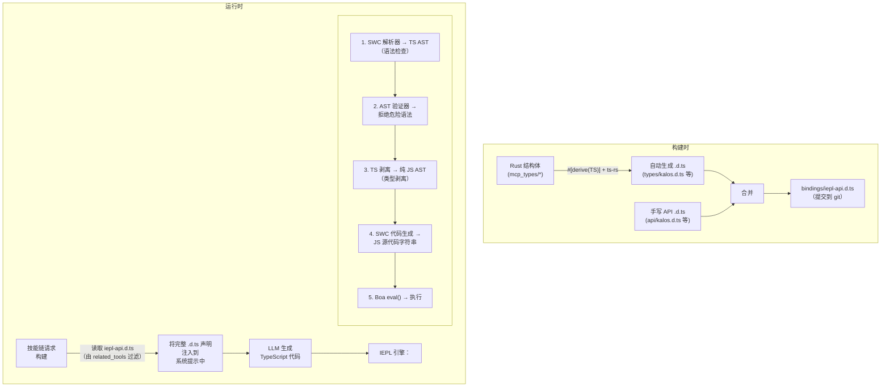
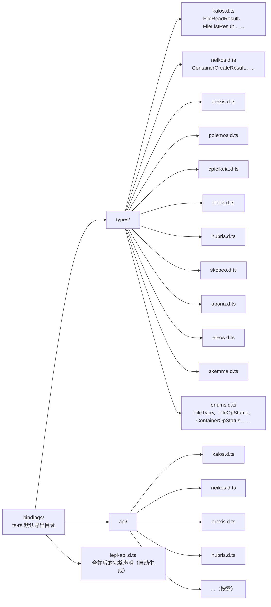
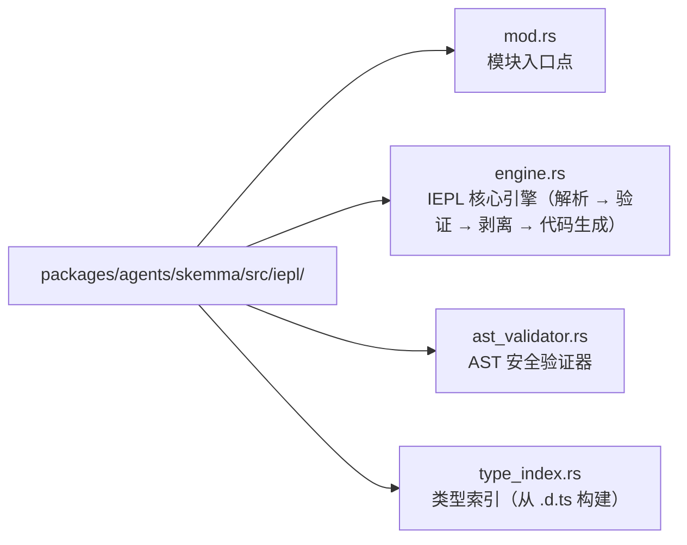

+++
title = "22 — IEPL TypeScript 执行引擎设计"
description = """IEPL（In-Execution Prompt Language）执行引擎是对现有 Cosmos/SkeMma JS 运行时的架构升级，将 LLM 生成的执行代码从 JavaScript 升级到 TypeScript。核心变更包括："""
lang = "zhs"
category = "design"
subcategory = "core"
+++

# 22 — IEPL TypeScript 执行引擎设计

## 概述

IEPL（In-Execution Prompt Language）执行引擎是对现有 Cosmos/SkeMma JS 运行时的架构升级，将 LLM 生成的执行代码从 JavaScript 升级到 TypeScript。核心变更包括：

1. **内置 SWC crate**：严格的语法检查、类型剥离和 LLM 生成 TypeScript 的转译
1. **Rust derive → TypeScript 类型生成**：通过 `ts-rs` 自动导出 Rust 结构体到 `.d.ts` 声明文件
1. **类型安全的技能提示**：注入完整的 `.d.ts` 声明而非硬编码的函数列表，显著提高健壮性

## 当前状态与问题

### 当前执行流程



### 存在的问题

| 问题 | 描述 |
| --- | --- |
| **无类型约束** | LLM 生成的 JS 代码没有任何静态类型信息；参数拼写错误只能在运行时捕获 |
| **脆弱的接口描述** | `build_report_tool_instruction()` 硬编码文本列表如 `- file_read（从 'kalos' 导入）`，无法表达参数类型或返回值结构 |
| **无预验证** | LLM 代码直接进入 Boa `eval()`；语法错误仅在执行时发现 |
| **模式与提示解耦** | `McpSchemaWriter` 生成 JSON 模式文件但从不用于提示注入 |
| **工具参数无类型** | 当前工具参数作为 `serde_json::Value` 传递，通过 `get("field")` 手动提取，无类型安全保证 |

### 涉及的关键文件

| 文件 | 当前职责 |
| --- | --- |
| `packages/agents/skemma/src/js_runtime/runtime.rs` | Boa JS 运行时，`exec()` 直接调用 `eval()` |
| `packages/agents/skemma/src/mcp/tools/script_exec.rs` | 仅接受 `"javascript"` 语言 |
| `packages/cosmos/src/bin/cosmos/js_repl/js_commands.rs` | 动态生成 `globalThis.$agent.tool = (...) => ...` |
| `packages/scepter/src/state_machine/skill_chain/prompt.rs:51` | `build_report_tool_instruction()` 硬编码 API 列表 |
| `packages/shared/src/mcp_types/*.rs` | 所有 MCP 工具结果类型定义（仅 serde，无 TS 导出） |
| `packages/shared/src/mcp_types/schema.rs` | `McpSchemaWriter` 生成 JSON 模式（提示未使用） |

## 目标架构



## 技术选型

### 1. Rust → TypeScript 类型生成：`ts-rs`

| 属性 | 值 |
| --- | --- |
| Crate | `ts-rs`（Aleph-Alpha/ts-rs） |
| 版本 | ≥ 12.0 |
| Stars | 1,772 |
| 下载量 | ~7.3M |
| 许可证 | MIT |

**理由：**

- 与项目现有的 `serde` 生态系统深度兼容（`serde-compat` 特性自动识别 `rename`/`rename_all`/`skip` 等）
- `#[derive(TS)]` 是非侵入式的，不会更改现有的结构体定义
- 支持 `#[ts(export)]` 在 `cargo test` 期间自动导出到 `bindings/` 目录
- 生成标准 TypeScript `type` 别名，可直接在 `.d.ts` 中使用
- 支持跨文件导入、泛型、联合类型
- 丰富的生态系统集成：`chrono-impl`、`uuid-impl`、`serde-json-impl`

**排除的替代方案：**

| Crate | 排除原因 |
| --- | --- |
| `specta` | 偏向 Tauri/rspc 生态系统；此场景不需要函数类型导出 |
| `typeshare` | CLI 驱动，CI 集成不便；生成 `interface` 而非 `type`（对 LLM 提示无实际区别） |
| `tsify` | 绑定到 `wasm-bindgen`；本项目不是 WASM 工作流 |

### 2. TypeScript 解析与转译：SWC

| Crate | 用途 |
| --- | --- |
| `swc_core`（特性：`ecma_parser`） | 将 TS 源码解析为 AST |
| `swc_core`（特性：`ecma_ast`） | AST 节点类型 |
| `swc_core`（特性：`ecma_visit`） | AST 遍历/转换 |
| `swc_core`（特性：`ecma_transforms_typescript`） | TS → JS 类型剥离 |
| `swc_core`（特性：`ecma_codegen`） | AST → 源代码生成 |

**关键能力：**

- 完整的 TypeScript 语法支持（泛型、条件类型、映射类型、装饰器等）
- 高性能 Rust 原生实现（比 tsc 快 20–70 倍）
- 类型剥离（`strip`）将 TS AST 转换为 JS AST
- 语法级错误报告（未闭合括号、无效 token 等）

**限制：**

- SWC **不执行完整类型检查**（没有等效于 `tsc --noEmit` 的功能）。这意味着它无法捕获语义错误，如"调用不存在的属性"
- 对此场景这是可接受的：LLM 生成的代码主要需要语法正确性保证；Boa 引擎提供运行时动态类型安全
- 如果未来需要完整类型检查，可以引入 AST 级自定义验证（参见下方"AST 验证器"）

## 详细设计

### 阶段 1：ts-rs 类型导出基础设施

#### 1.1 新的工作区依赖

```toml
# Cargo.toml（工作区）
[workspace.dependencies]
ts-rs = { version = "12", features = ["serde-compat", "format"] }
```

#### 1.2 向 MCP 类型添加 `#[derive(TS)]`

`packages/shared/src/mcp_types/` 下的所有结构体获得 `ts-rs` derive：

```rust
// packages/shared/src/mcp_types/kalos.rs
use ts_rs::TS;

# [derive(Debug, Clone, Serialize, Deserialize, TS)]
# [ts(export)]
pub struct FileReadResult {
    pub path: String,
    pub size_bytes: u64,
    pub content: String,
}

# [derive(Debug, Clone, Serialize, Deserialize, TS)]
# [ts(export)]
pub struct FileListResult {
    pub path: String,
    pub total_count: usize,
    pub entries: Vec<FileEntry>,
}

// ... 其他类型类似
```

枚举需要 `str_enum!` 宏适配：

```rust
// packages/shared/src/mcp_types/enums.rs
// 现有的 str_enum! 宏生成的枚举需要额外的 TS derive

# [derive(Debug, Clone, Copy, PartialEq, Eq, Serialize, Deserialize, TS)]
pub enum FileType {
    File,
    Directory,
}
// 注意：str_enum! 宏需要扩展以同时派生 TS
// 或单独向现有宏生成的枚举添加 #[derive(TS)]
```

#### 1.3 `.d.ts` 文件布局



#### 1.4 手写 API `.d.ts` 示例

```typescript
// bindings/api/kalos.d.ts

import type {
  FileReadResult,
  FileListResult,
  FileWriteResult,
  FileEditResult,
  FileDeleteResult,
  FileExistsResult,
  MkDirResult,
  FileInfoResult,
} from "../types/kalos";

export interface KalosApi {
  /**
   * 读取文件内容
   * @param params.path - 文件路径（绝对路径）
   */
  file_read(params: { path: string }): Promise<FileReadResult>;

  /**
   * 写入文件
   * @param params.path - 文件路径
   * @param params.content - 文件内容
   */
  file_write(params: { path: string; content: string }): Promise<FileWriteResult>;

  /**
   * 编辑文件（查找和替换）
   * @param params.path - 文件路径
   * @param params.old_string - 要替换的原始字符串
   * @param params.new_string - 替换字符串
   */
  file_edit(params: {
    path: string;
    old_string: string;
    new_string: string;
  }): Promise<FileEditResult>;

  file_delete(params: { path: string }): Promise<FileDeleteResult>;
  file_exists(params: { path: string }): Promise<FileExistsResult>;
  file_list(params: { path: string }): Promise<FileListResult>;
  file_get_info(params: { path: string }): Promise<FileInfoResult>;
  file_create_dir(params: { path: string }): Promise<MkDirResult>;
}
```

#### 1.5 构建时合并脚本

在 `packages/shared/build.rs` 或独立的 `xtask` 中：

```rust
// xtask/src/bin/iepl_codegen.rs
// 1. 运行 cargo test 以触发 ts-rs 导出
// 2. 读取 bindings/types/*.d.ts + bindings/api/*.d.ts
// 3. 按 agent 分组和合并，生成最终的 iepl-api.d.ts
// 4. 输出到 bindings/iepl-api.d.ts
```

或更简单地，在 `packages/shared/src/mcp_types/` 中添加一个 `iepl_codegen` 模块，在测试期间触发导出和合并。

**关键原则：一旦生成，`.d.ts` 文件提交到 git 并成为源码树的永久部分。** 后续 Rust 类型更改会重新生成并提交更新。

### 阶段 2：IEPL 执行引擎

#### 2.1 新的 SWC 依赖

```toml
# Cargo.toml（工作区）
[workspace.dependencies]
swc_core = { version = "65", features = [
    "ecma_parser",
    "ecma_ast",
    "ecma_visit",
    "ecma_transforms_base",
    "ecma_transforms_typescript",
    "ecma_codegen",
    "common",
] }
```

#### 2.2 IEPL 引擎核心

`packages/agents/skemma/src/` 下的新 `iepl/` 模块：



##### engine.rs — 核心转译流程

```rust
use anyhow::{anyhow, Result};
use swc_core::{
    common::{errors::ColorConfig, SourceFile, SourceMap, GLOBALS},
    ecma::{
        ast::Program,
        codegen::{text_writer::JsWriter, Emitter},
        parser::{lexer::Lexer, Parser, StringInput, Syntax, TsSyntax},
        transforms::{
            base::fixer::fixer,
            typescript::strip,
        },
        visit::FoldWith,
    },
};

pub struct IeplEngine {
    cm: Arc<SourceMap>,
}

pub struct TranspileResult {
    pub js_code: String,
    pub parse_errors: Vec<String>,
}

impl IeplEngine {
    pub fn new() -> Self {
        Self {
            cm: Arc::new(SourceMap::default()),
        }
    }

    /// 将 TypeScript 代码转译为 JavaScript
    pub fn transpile(&self, ts_code: &str) -> Result<TranspileResult> {
        let fm = self.cm.new_source_file(
            swc_core::common::FileName::Custom("iepl-input".into()),
            ts_code.into(),
        );

        // 1. 解析 TS → AST
        let mut parse_errors = Vec::new();
        let module = self.parse_ts(&fm, &mut parse_errors)?;

        if !parse_errors.is_empty() {
            return Err(anyhow!("TypeScript 解析错误：\n{}", parse_errors.join("\n")));
        }

        // 2. AST 安全验证
        let validator = AstValidator::new();
        validator.validate(&module)?;

        // 3. 类型剥离 TS → JS
        let mut transforms = swc_core::common::pass::Optional::new(
            strip::strip_typescript(swc_core::common::comments::NoComments),
            true,
        );
        let program = module.fold_with(&mut transforms);

        // 4. AST → JS 源码
        let js_code = self.emit(program)?;

        Ok(TranspileResult {
            js_code,
            parse_errors,
        })
    }

    fn parse_ts(
        &self,
        fm: &SourceFile,
        errors: &mut Vec<String>,
    ) -> Result<Program> {
        let lexer = Lexer::new(
            Syntax::Typescript(TsSyntax {
                tsx: false,
                decorators: true,
                dts: false,
                no_early_errors: false,
                disallowAmbiguousJSXLike: true,
            }),
            Default::default(),
            StringInput::from(fm),
            None,
        );
        let mut parser = Parser::new_from(lexer);
        match parser.parse_program() {
            Ok(program) => Ok(program),
            Err(e) => {
                errors.push(format!("{:?}", e));
                Err(anyhow!("解析 TypeScript 失败"))
            }
        }
    }

    fn emit(&self, program: Program) -> Result<String> {
        let mut buf = Vec::new();
        let writer = JsWriter::new(self.cm.clone(), "\n", &mut buf, None);
        let mut emitter = Emitter {
            cfg: Default::default(),
            cm: self.cm.clone(),
            comments: None,
            wr: writer,
        };
        emitter.emit_program(&program)?;
        Ok(String::from_utf8(buf)?)
    }
}
```

##### ast_validator.rs — 安全验证器

```rust
use anyhow::{anyhow, Result};
use swc_core::ecma::ast::{Module, Program};
use swc_core::ecma::visit::{Visit, VisitWith};

/// 验证 AST 不包含危险模式
pub struct AstValidator {
    violations: Vec<String>,
}

impl AstValidator {
    pub fn new() -> Self {
        Self {
            violations: Vec::new(),
        }
    }

    pub fn validate(&self, program: &Program) -> Result<()> {
        // 实现危险模式检测
        // - 禁止 eval() / Function() 调用
        // - 禁止动态 import()
        // - 禁止访问 __proto__ / constructor
        // - 禁止 with 语句
        // - 可选：禁止访问不在允许列表中的全局变量
        if self.violations.is_empty() {
            Ok(())
        } else {
            Err(anyhow!("AST 验证违规：\n{}", self.violations.join("\n")))
        }
    }
}
```

#### 2.3 集成到 script_exec

修改 `packages/agents/skemma/src/mcp/tools/script_exec.rs`：

```rust
// 之前（第 53 行）：
if !matches!(language.as_str(), "javascript" | "js" | "node") {
    return McpToolResult::failure(format!(
        "不支持的语言：'{}'。仅支持 JavaScript。", language
    ));
}

// 之后：
let executable_code = match language.as_str() {
    "typescript" | "ts" => {
        let engine = crate::iepl::IeplEngine::new();
        match engine.transpile(code) {
            Ok(result) => result.js_code,
            Err(e) => return McpToolResult::failure(format!("TS 转译错误：{}", e)),
        }
    }
    "javascript" | "js" | "node" => code.to_string(),
    _ => {
        return McpToolResult::failure(format!(
            "不支持的语言：'{}'。仅支持 TypeScript 和 JavaScript。",
            language
        ));
    }
};
```

#### 2.4 集成到 Cosmos JS REPL

修改 `packages/cosmos/src/bin/cosmos/js_repl/mod.rs` 中的执行路径，在调用 `runtime.exec()` 之前添加 IEPL 转译步骤。

### 阶段 3：技能提示类型注入

#### 3.1 当前提示构建

`prompt.rs:51` 的 `build_report_tool_instruction()`：

```rust
// 当前：硬编码的 API 列表
let items: Vec<String> = available_apis
    .iter()
    .map(|a| format!("- ${}", a))
    .collect();
parts.push(format!("\n可用 JS API：\n{}", items.join("\n")));
```

这生成：

```text
可用 JS API：
- file_read（从 'kalos' 导入）
- file_write（从 'kalos' 导入）
- report()
```

#### 3.2 新的提示构建

```rust
pub(super) fn build_report_tool_instruction(
    next_targets: &[String],
    related_tools: &[RelatedTool],  // 更改为接受完整的 RelatedTool 信息
) -> String {
    let mut parts = Vec::new();

    // 从 bindings/ 加载按 agent 分组的 .d.ts
    let type_declarations = load_iepl_type_declarations(related_tools);
    if !type_declarations.is_empty() {
        parts.push(format!(
            "你正在编写 TypeScript 代码。可用的 API 类型声明：\n\n\
             ```typescript\n{}\n```",
            type_declarations
        ));
    }

    // ... next_targets 和 mcp_conv 保持不变
}
```

注入到提示中的示例内容：

```typescript
你正在编写 TypeScript 代码。可用的 API 类型声明：

```

// === 类型（自动从 Rust 生成） ===
type `FileReadResult` = { path: string; `size_bytes`: number; content: string };
type `FileListResult` = { path: string; `total_count`: number; entries: Array<{ name: string; `file_type`: "file" | "directory" }> };
type `FileWriteResult` = { path: string; `size_bytes`: number; status: "created" | "deleted" | "edited" | "written" };

// === API（手写） ===
interface KalosApi {
`file_read`(params: { path: string }): Promise<`FileReadResult`>;
`file_write`(params: { path: string; content: string }): Promise<`FileWriteResult`>;
`file_list`(params: { path: string }): Promise<`FileListResult`>;
// ...
}

declare const $kalos: KalosApi;

```text

#### 3.3 .d.ts 加载器

```

// packages/shared/src/iepl/decl_loader.rs

use `include_dir`::{Dir, `include_dir`};

static IEPL_BINDINGS: Dir = `include_dir`!("$CARGO_MANIFEST_DIR/../../../bindings");

pub struct `IeplDeclLoader`;

impl `IeplDeclLoader` {
/// 加载由 `related_tools` 过滤的所需 .d.ts 声明
pub fn `load_for_tools`(`related_tools`: &[`RelatedTool`]) -> String {
let mut declarations = Vec::new();

// 收集涉及的 agent 集合
let agents: std::collections::HashSet<&str> = `related_tools`
.iter()
.map(|t| t.agent_name.as_str())
.collect();

for agent in &agents {
// 加载自动生成的类型声明
if let Some(`types_file`) = IEPL_BINDINGS.get_file(format!("types/{}.d.ts", agent)) {
if let Ok(content) = std::str::`from_utf8`(types_file.contents()) {
declarations.push(content.to_string());
}
}

// 加载手写的 API 声明
if let Some(`api_file`) = IEPL_BINDINGS.get_file(format!("api/{}.d.ts", agent)) {
if let Ok(content) = std::str::`from_utf8`(api_file.contents()) {
declarations.push(content.to_string());
}
}
}

declarations.join("\n\n")
}
}

```text

#### 3.4 JS 命名空间构建器升级

`js_commands.rs` 的 `build_tool_namespace_js()` 保持生成 JavaScript 函数包装器不变（Boa 引擎仅执行 JS），但提示侧的接口描述由 `.d.ts` 提供而非硬编码。

## 数据流对比

### 当前（JavaScript）

```

flowchart TD
Meta["技能元数据\`nrelated_tools`：\n- kalos.file_read\n- kalos.file_write"]
Meta --> Build["`build_report_tool_instruction`\n→ '- `file_read`（导入）'\n→ '- `file_write`（导入）'\n（硬编码文本）"]
Build -->|"注入到\n系统提示"| LLM1["LLM 生成 JavaScript\`nfile_read`({path:'x'})\n（无类型检查）"]
LLM1 --> Boa1["Boa eval() 直接执行\n（无预验证）"]

```text

### 目标（TypeScript + IEPL）

```

flowchart TD
Meta2["技能元数据\`nrelated_tools`：\n- kalos.file_read\n- kalos.file_write"]
Meta2 --> Loader["`IeplDeclLoader`\n→ types/kalos.d.ts\n→ api/kalos.d.ts\n（完整类型声明）"]
Loader -->|"注入到\n系统提示"| LLM2["LLM 生成 TypeScript\nconst r: `FileReadResult` =\n  await `file_read`(\n    {path: 'x'}\n  );\n（类型约束）"]
LLM2 --> IEPL["IEPL 引擎\n1. SWC 解析 → AST（语法检查）\n2. AST 验证器（安全检查）\n3. 剥离类型 → JS（类型剥离）\n4. 代码生成 → JS 字符串"]
IEPL --> Boa2["Boa eval() 执行"]

```text

## 健壮性改进分析

### 对比：当前 vs IEPL

| 维度 | 当前（JS + 硬编码列表） | IEPL（TS + .d.ts） |
|-----------|------------------------------|-------------------|
| **LLM 对接口的理解** | 看到 `- file_read（从 'kalos' 导入）` | 看到完整的 `file_read(params: {path: string}): Promise<FileReadResult>` |
| **参数错误** | LLM 猜测参数名 | LLM 知道确切的参数类型 |
| **返回值使用** | 不知道返回了什么字段 | 知道 `FileReadResult` 的完整结构 |
| **语法错误** | 仅在运行时发现 | 在转译前被 SWC 拒绝 |
| **接口变更** | 需要手动更新硬编码文本 | 修改 Rust 结构体 → 重新生成 .d.ts → 自动反映在提示中 |
| **新工具接入** | 修改 prompt.rs 逻辑 | 添加 ts-rs derive + 手写 api .d.ts |
| **类型导出维护** | 无 | .d.ts 在 git 中具有可追踪的差异 |

### LLM 提示质量改进

LLM 看到的当前提示片段：

```

可用 JS API：

- `file_read`（从 'kalos' 导入）
- `file_write`（从 'kalos' 导入）
- report()

```text

LLM 在 IEPL 下看到的提示片段：

```

declare const $kalos: {
`file_read`(params: { path: string }): Promise<{ path: string; `size_bytes`: number; content: string }>;
`file_write`(params: { path: string; content: string }): Promise<{ path: string; `size_bytes`: number; status: "created" | "deleted" | "edited" | "written" }>;
`file_list`(params: { path: string }): Promise<{ path: string; `total_count`: number; entries: Array<{ name: string; `file_type`: "file" | "directory" }> }>;
};
// hubris 工具可通过 ES 模块导入：import { report } from 'hubris'
report(params: { summary: string }): Promise<{ summary: string }>;
};

```text

后者提供：
- 精确的参数名和类型
- 完整的返回值结构
- 联合类型字面量（例如 `"file" | "directory"`）
- TypeScript 原生 `Promise<>` 表达异步语义

## 新工作区依赖摘要

```

# 新增

ts-rs = { version = "12", features = ["serde-compat", "format"] }
`swc_core` = { version = "65", features = [
"`ecma_parser`",
"`ecma_ast`",
"`ecma_visit`",
"`ecma_transforms_base`",
"`ecma_transforms_typescript`",
"`ecma_codegen`",
"common",
] }

```text

## 新 Crate 结构

```

flowchart LR
SkemmaIepl["packages/agents/skemma/src/iepl/"] --> SM1["mod.rs\npub mod engine; pub mod `ast_validator`;"]
SkemmaIepl --> SM2["engine.rs\`nIeplEngine`：transpile(`ts_code`) -> Result&lt;`TranspileResult`&gt;"]
SkemmaIepl --> SM3["ast_validator.rs\`nAstValidator`：安全模式检测"]
SharedIepl["packages/shared/src/iepl/"] --> SH1["mod.rs\npub mod `decl_loader`;"]
SharedIepl --> SH2["decl_loader.rs\`nIeplDeclLoader`：按 `related_tools` 过滤加载 .d.ts"]
Bindings["bindings/\n生成的产物，在 git 中追踪"] --> BTypes["types/\nts-rs 自动导出"]
Bindings --> BApi["api/\n手写维护"]
Bindings --> BIepl["iepl-api.d.ts\n合并产物（可选）"]
BTypes --> BT1["kalos.d.ts"]
BTypes --> BT2["neikos.d.ts"]
BTypes --> BT3["..."]
BApi --> BA1["kalos.d.ts"]
BApi --> BA2["neikos.d.ts"]
BApi --> BA3["..."]

```text

## 实现路径

### 阶段 1：ts-rs 基础设施（~2–3 天）

1. 添加 `ts-rs` 工作区依赖
2. 向所有 `mcp_types/*.rs` 结构体添加 `#[derive(TS)]`
3. 扩展 `str_enum!` 宏以兼容 `ts-rs` derive
4. 运行 `cargo test` 生成 `bindings/types/*.d.ts`
5. 手写 `bindings/api/*.d.ts`（每个 agent 一个文件）
6. 编写合并脚本生成 `bindings/iepl-api.d.ts`
7. 将所有 `.d.ts` 提交到 git

### 阶段 2：IEPL 执行引擎（~3–5 天）

1. 添加 `swc_core` 工作区依赖
2. 实现 `iepl/engine.rs`：解析 → 剥离 → 代码生成
3. 实现 `iepl/ast_validator.rs`：危险模式检测
4. 修改 `script_exec.rs` 以支持 TypeScript 语言
5. 集成到 Cosmos JS REPL 执行路径
6. 端到端测试：TS 代码 → SWC → JS → Boa

### 阶段 3：提示类型注入（~2–3 天）

1. 实现 `IeplDeclLoader`
2. 修改 `build_report_tool_instruction()` 以使用 .d.ts
3. 更新 `execution_steps.rs` 中的系统提示构建逻辑
4. 验证 LLM 生成的 TS 代码质量改进

### 阶段 4：清理与优化（~1–2 天）

1. 移除或弃用 `McpSchemaWriter`（被 .d.ts 系统取代）
2. 添加 CI 步骤：`cargo test` 后检查 `bindings/` 中的未提交更改
3. 文档更新

## 风险与缓解

| 风险 | 缓解措施 |
|------|-----------|
| SWC 编译时间增加 | `swc_core` 按需特性，最小化导入 |
| `str_enum!` 宏与 `ts-rs` 冲突 | 宏扩展或为非枚举单独实现 `TS` trait |
| `.d.ts` 过大，超出提示 token 限制 | 通过 `related_tools` 精确过滤，仅注入当前技能所需的类型 |
| Boa 不支持 `async/await` | SWC 可配置降级为回调风格（或等待 Boa 未来版本支持） |
| ts-rs 版本与 serde 版本不兼容 | 锁定工作区版本，CI 验证 |

## 扩展可能性

1. **AST 级类型检查**：在 SWC AST 上实现轻量级类型检查（验证 ES 模块导入调用使用声明的参数）
2. **.d.ts 版本管理**：向 `.d.ts` 文件头添加版本号，在 LLM 提示中包含版本信息
3. **增量更新**：当 Rust 类型更改时，CI 自动检测 `bindings/` 差异并提醒更新
4. **多语言执行**：IEPL 框架可扩展以支持其他语言（Python 通过 RustPython 等）
5. **运行时类型验证**：在 Boa 执行之前/之后添加 serde 验证，确保 LLM 使用的参数和返回值符合类型定义
