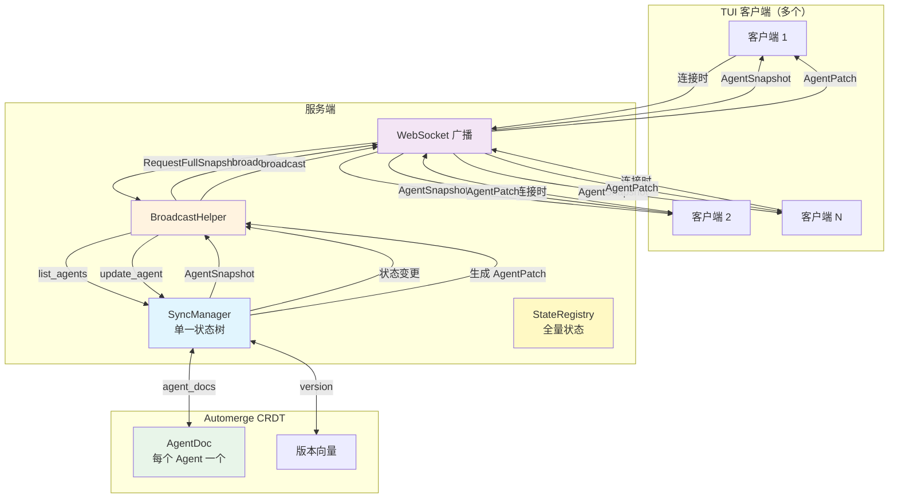
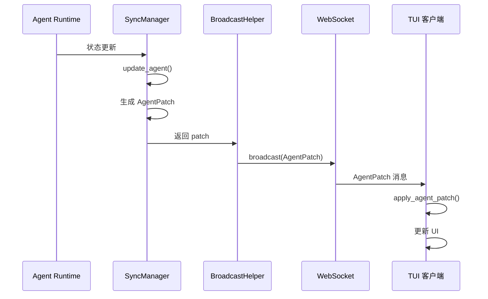
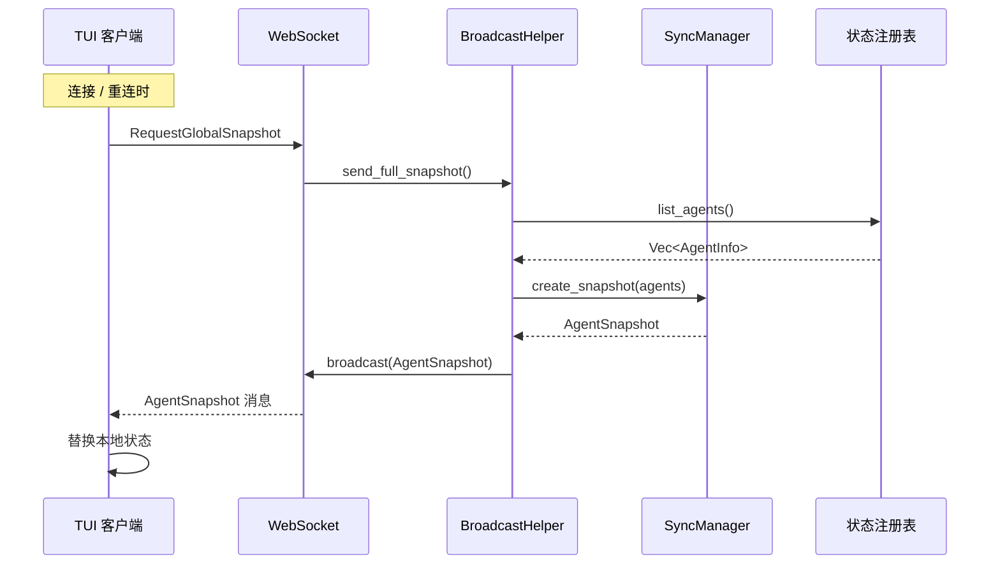
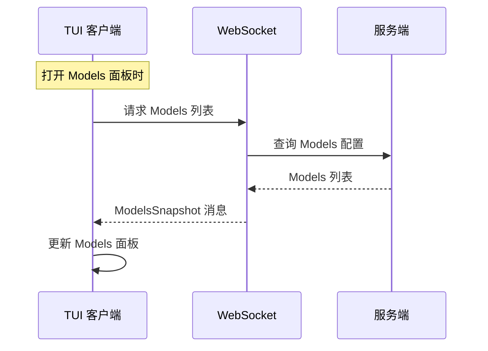
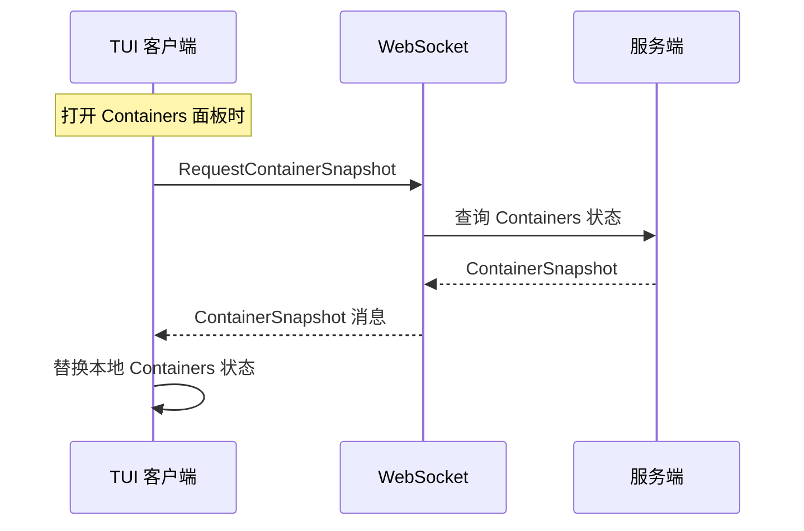
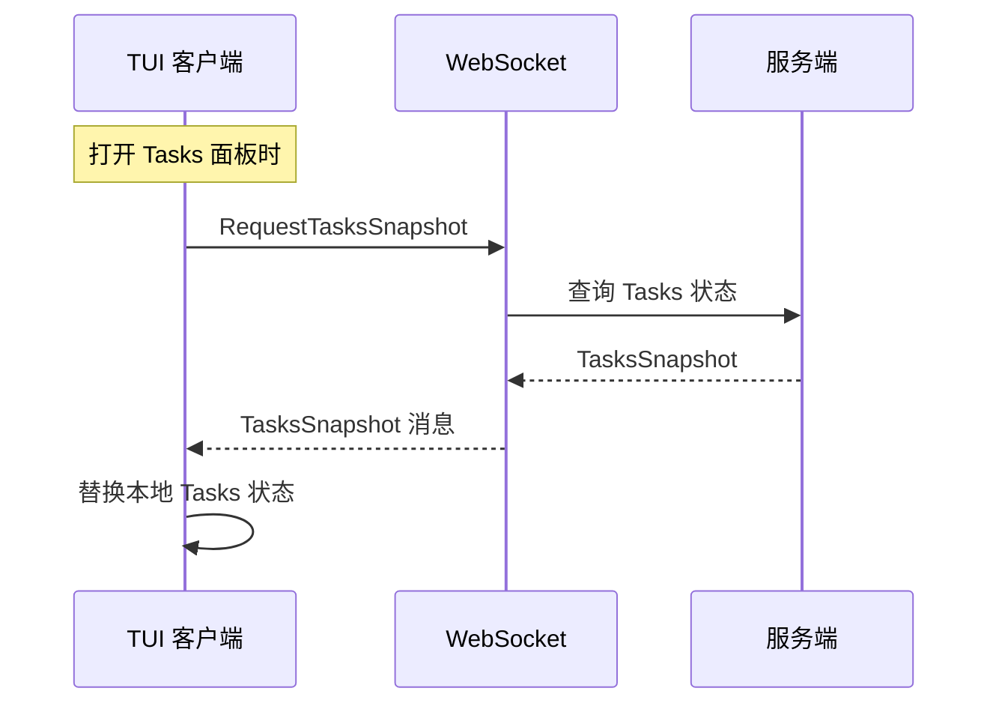

+++
title = "增量同步架构"
description = "基于 Automerge CRDT 的多客户端状态增量同步机制，支持实时增量更新与连接/重连时的全量同步，覆盖所有 TUI 面板。"
lang = "zhs"
category = "design"
subcategory = "core"
+++

# 增量同步架构

## 概述

基于 Automerge CRDT 的多客户端状态增量同步机制，支持实时增量更新与连接/重连时的全量同步，覆盖所有 TUI 面板。

## 架构图



## 同步策略矩阵

| 面板 | 同步方式 | 触发条件 | 频率 | 消息类型 |
| --- | --- | --- | --- | --- |
| **Agents 时间线** | 增量 + 全量 | 连接同步 + 实时推送 | 连接时 / 实时 | `AgentPatch` / `GlobalSnapshot` |
| **Containers** | 增量 + 全量 | 连接同步 + 实时推送 | 连接时 / 实时 | `ContainerPatch` / `GlobalSnapshot` |
| **Tasks** | 增量 + 全量 | 连接同步 + 实时推送 | 连接时 / 实时 | `TaskPatch` / `GlobalSnapshot` |
| **Models 列表** | 全量 | 客户端主动请求 | 打开面板时 | `ModelsSnapshot` |
| **Providers 配置** | 全量 | 客户端主动请求 | 打开面板时 | `ProvidersSnapshot` |

## 消息流程

### 增量更新流程（Agents）



### 全量同步流程



### Models 列表同步流程



### Containers 全量同步流程



### Tasks 全量同步流程



## 数据结构

### AgentPatch（增量更新）

```rust
pub struct AgentPatch {
    pub agent_id: String,
    pub version: u64,
    pub llm_working_changed: Option<bool>,
    pub work_status: Option<String>,
    pub current_model: Option<String>,
    pub token_usage_delta: Option<(u32, u32)>,
    pub token_usage_absolute: Option<(u32, u32)>,
    pub request_state: Option<RequestState>,
    pub cpu_usage: Option<f64>,
    pub memory_mb: Option<u64>,
}
```

### AgentSnapshot（全量快照）

```rust
pub struct AgentSnapshot {
    pub version: u64,
    pub timestamp: i64,
    pub agents: Vec<TuiAgentInfo>,
}
```

### GlobalSnapshot（全局快照）

```rust
pub struct GlobalSnapshot {
    pub version: u64,
    pub timestamp: i64,
    pub agents: Vec<TuiAgentInfo>,
    pub models: Vec<ModelInfo>,
    pub providers: Vec<ProviderInfo>,
    pub active_tasks: Vec<TaskInfo>,
}
```

### ModelsSnapshot（Models 列表）

```rust
pub struct ModelsSnapshot {
    pub models: Vec<ModelInfo>,
}
```

### ContainerPatch（Container 状态增量）

```rust
pub struct ContainerPatch {
    pub container_id: String,
    pub version: u64,
    pub status_changed: Option<String>,
    pub cpu_usage_changed: Option<f64>,
    pub memory_usage_changed: Option<u64>,
}
```

### ContainerSnapshot（Container 状态全量）

```rust
pub struct ContainerSnapshot {
    pub version: u64,
    pub timestamp: i64,
    pub containers: Vec<ContainerInfo>,
}
```

### TaskPatch（Task 状态增量）

```rust
pub struct TaskPatch {
    pub task_id: Uuid,
    pub version: u64,
    pub status_changed: Option<String>,
    pub progress_changed: Option<u8>,
}
```

### TasksSnapshot（Tasks 状态全量）

```rust
pub struct TasksSnapshot {
    pub version: u64,
    pub timestamp: i64,
    pub tasks: Vec<TaskInfo>,
}
```

## 同步策略

| 类型 | 方向 | 触发条件 | 频率 |
| --- | --- | --- | --- |
| Agent 增量更新 | 服务端 → 客户端 | 状态变更 | 实时 |
| Agent 全量同步 | 服务端 → 客户端 | 连接时 | 连接 / 重连时 |
| Containers 增量 | 服务端 → 客户端 | 状态变更 | 实时 |
| Containers 全量同步 | 服务端 → 客户端 | 连接时 | 连接 / 重连时 |
| Tasks 增量 | 服务端 → 客户端 | 状态变更 | 实时 |
| Tasks 全量同步 | 服务端 → 客户端 | 连接时 | 连接 / 重连时 |
| Models 列表 | 客户端 → 服务端 | 主动请求 | 打开面板时 |
| Providers 配置 | 客户端 → 服务端 | 主动请求 | 打开面板时 |

## 关键特性

- **单一状态树**：服务端维护一个 `SyncManager`，所有客户端接收相同的状态更新
- **CRDT 冲突解决**：基于 Automerge 的自动冲突解决
- **增量更新**：仅传输变更字段以减少网络流量
- **最终一致性**：连接时的全量同步保证最终一致性
- **按需拉取**：Models 和 Providers 在打开对应面板时按需请求，避免不必要的网络传输
- **首页同步**：Agents、Containers 和 Tasks 在连接时同步，因为它们会显示在首页

## 实现状态

- ✅ Agents 增量/全量同步
- ✅ Models 列表同步
- ✅ Providers 配置同步
- ✅ Containers 增量/全量同步
- ✅ Tasks 增量/全量同步
- ✅ 状态持久化（/tmp 存储，重启时重新加载）
