+++
title = "Provider TOML 配置系统设计"
description = "Provider TOML 配置系统将所有 LLM Provider 配置从硬编码值迁移到 TOML 配置文件，实现配置与代码分离，提高可维护性和可扩展性。"
lang = "zhs"
category = "design"
subcategory = "core"
+++

# Provider TOML 配置系统设计

## 概述

Provider TOML 配置系统将所有 LLM Provider 配置从硬编码值迁移到 TOML 配置文件，实现配置与代码分离，提高可维护性和可扩展性。

## 核心目标

| 目标 | 描述 |
| --- | --- |
| 可维护性 | 配置与代码分离，修改无需重新编译 |
| 可扩展性 | 添加新 Provider 只需添加 TOML 文件 |
| 可读性 | 配置文件清晰易懂 |
| 可复用性 | 配置可在不同环境间共享 |

## 架构设计

### 配置加载流程

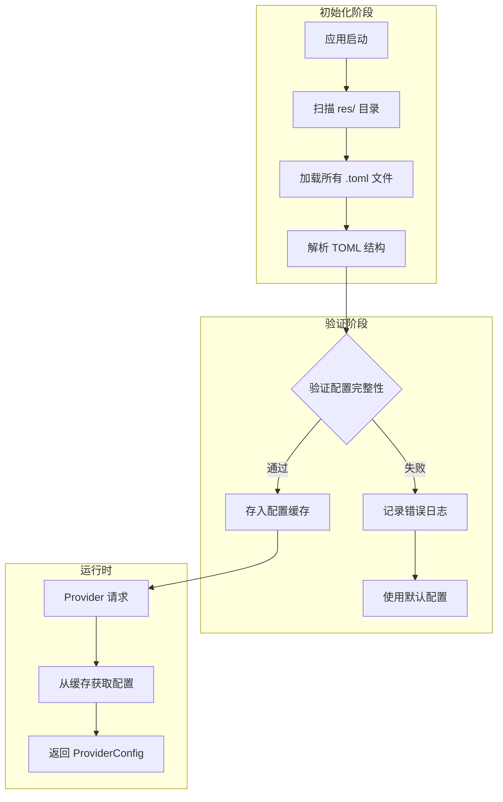
```mermaid
flowchart TB
    subgraph 初始化阶段
        A[应用启动] --> B[扫描 res/ 目录]
        B --> C[加载所有 .toml 文件]
        C --> D[解析 TOML 结构]
    end

    subgraph 验证阶段
        D --> E{验证配置完整性}
        E -->|通过| F[存入配置缓存]
        E -->|失败| G[记录错误日志]
        G --> H[使用默认配置]
    end

    subgraph 运行时
        F --> I[Provider 请求]
        I --> J[从缓存获取配置]
        J --> K[返回 ProviderConfig]
    end
```

### 配置层次结构

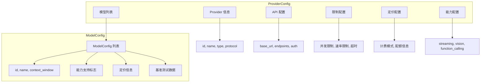
```mermaid
graph TB
    subgraph ProviderConfig
        A[Provider 信息]
        B[API 配置]
        C[限制配置]
        D[定价配置]
        E[能力配置]
        F[模型列表]
    end

    A --> A1[id, name, type, protocol]
    B --> B1[base_url, endpoints, auth]
    C --> C1[并发限制, 速率限制, 超时]
    D --> D1[计费模式, 配额信息]
    E --> E1[streaming, vision, function_calling]
    F --> F1[ModelConfig 列表]

    subgraph ModelConfig
        F1 --> M1[id, name, context_window]
        F1 --> M2[能力支持标志]
        F1 --> M3[定价信息]
        F1 --> M4[基准测试数据]
    end
```

## 配置优先级

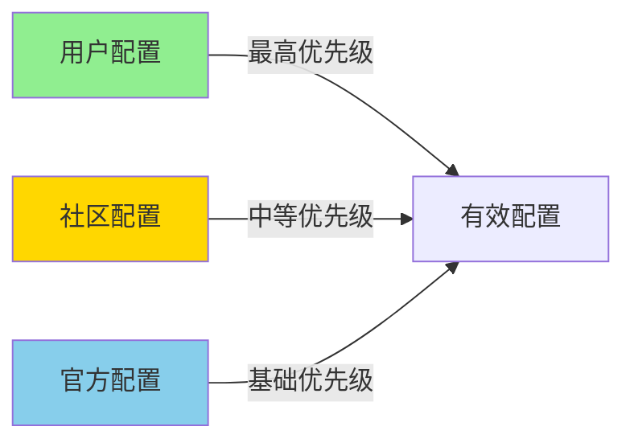
```mermaid
graph LR
    A[用户配置] -->|最高优先级| D[有效配置]
    B[社区配置] -->|中等优先级| D
    C[官方配置] -->|基础优先级| D

    style A fill:#90EE90
    style B fill:#FFD700
    style C fill:#87CEEB
```

### 优先级合并规则

| 层级 | 来源 | 描述 |
| --- | --- | --- |
| 1 | 官方配置 | Provider 官方文档数据，作为基础默认值 |
| 2 | 社区配置 | 社区贡献的优化配置，覆盖官方数据 |
| 3 | 用户配置 | 用户自定义配置，最高优先级 |

## 定价模型

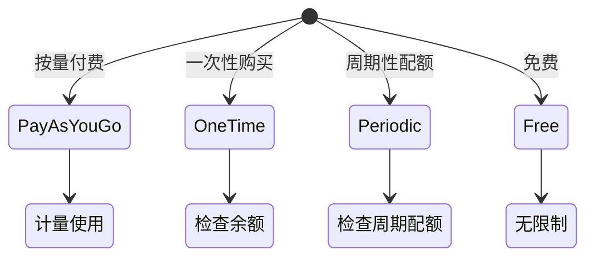
```mermaid
stateDiagram-v2
    [*] --> PayAsYouGo: 按量付费
    [*] --> OneTime: 一次性购买
    [*] --> Periodic: 周期性配额
    [*] --> Free: 免费

    PayAsYouGo --> 计量使用
    OneTime --> 检查余额
    Periodic --> 检查周期配额
    Free --> 无限制
```

### 定价模型对比

| 模型 | 适用场景 | 特点 |
| --- | --- | --- |
| PayAsYouGo | OpenAI、Anthropic | 按 Token 付费，实时扣费 |
| OneTime | 预付费套餐 | 预购配额，用完为止 |
| Periodic | 智谱 GLM 等 | 周期配额重置 |
| Free | Ollama 本地模型 | 无费用限制 |

## Provider 类型分类

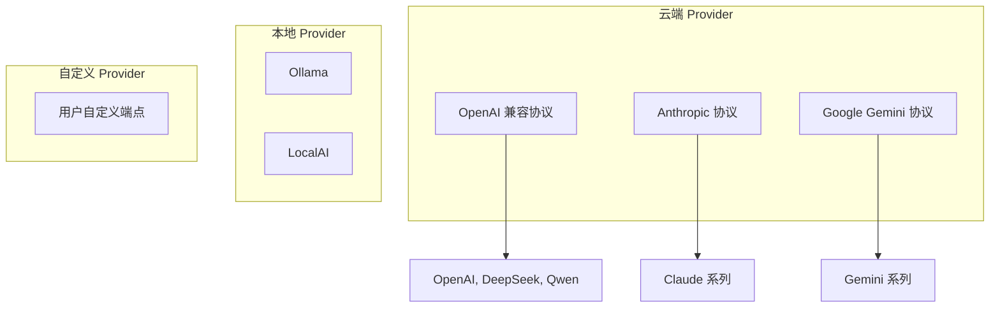
```mermaid
graph TB
    subgraph 云端 Provider
        A[OpenAI 兼容协议]
        B[Anthropic 协议]
        C[Google Gemini 协议]
    end

    subgraph 本地 Provider
        D[Ollama]
        E[LocalAI]
    end

    subgraph 自定义 Provider
        F[用户自定义端点]
    end

    A --> A1[OpenAI, DeepSeek, Qwen]
    B --> B1[Claude 系列]
    C --> C1[Gemini 系列]
```

## 热重载机制

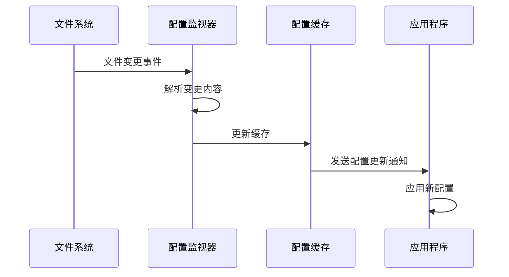
```mermaid
sequenceDiagram
    participant FS as 文件系统
    participant Watcher as 配置监视器
    participant Cache as 配置缓存
    participant App as 应用程序

    FS->>Watcher: 文件变更事件
    Watcher->>Watcher: 解析变更内容
    Watcher->>Cache: 更新缓存
    Cache->>App: 发送配置更新通知
    App->>App: 应用新配置
```

## 错误处理策略

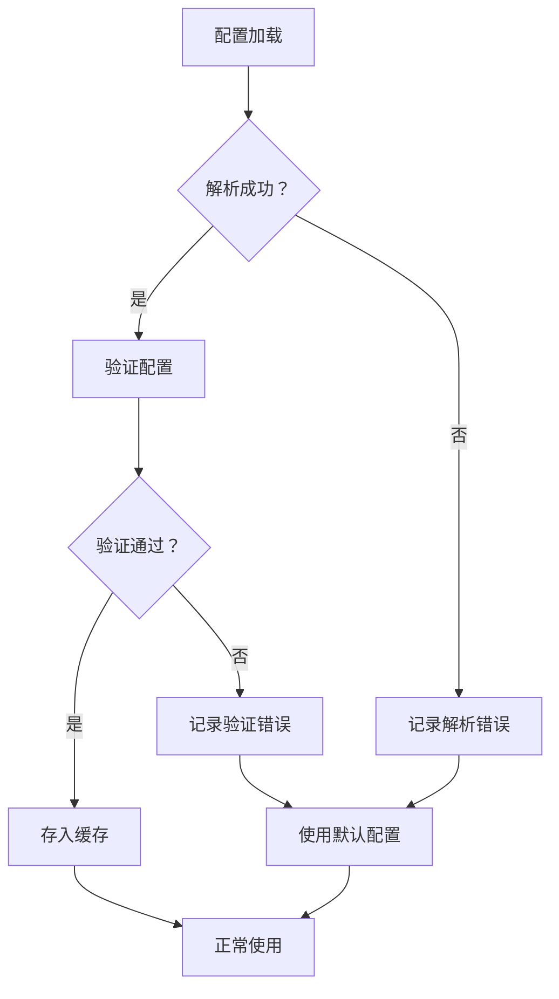
```mermaid
flowchart TB
    A[配置加载] --> B{解析成功？}
    B -->|是| C[验证配置]
    B -->|否| D[记录解析错误]

    C --> E{验证通过？}
    E -->|是| F[存入缓存]
    E -->|否| G[记录验证错误]

    D --> H[使用默认配置]
    G --> H

    F --> I[正常使用]
    H --> I
```

## 可扩展性设计

### 添加新 Provider

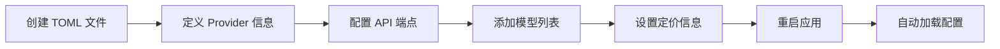
```mermaid
flowchart LR
    A[创建 TOML 文件] --> B[定义 Provider 信息]
    B --> C[配置 API 端点]
    C --> D[添加模型列表]
    D --> E[设置定价信息]
    E --> F[重启应用]
    F --> G[自动加载配置]
```

### 配置验证规则

| 字段 | 验证规则 | 错误处理 |
| --- | --- | --- |
| provider.id | 非空，唯一 | 拒绝加载，记录错误 |
| api.base_url | 有效 URL 格式 | 使用默认值 |
| models[].id | 非空 | 跳过该模型 |
| pricing.model | 枚举值检查 | 默认 PayAsYouGo |

## 安全考虑

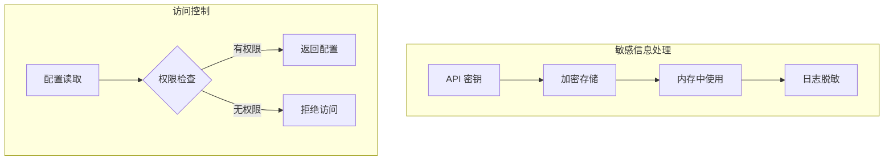
```mermaid
flowchart TB
    subgraph 敏感信息处理
        A[API 密钥] --> B[加密存储]
        B --> C[内存中使用]
        C --> D[日志脱敏]
    end

    subgraph 访问控制
        E[配置读取] --> F{权限检查}
        F -->|有权限| G[返回配置]
        F -->|无权限| H[拒绝访问]
    end
```

## 未来扩展

| 功能 | 描述 | 优先级 |
| --- | --- | --- |
| 配置热重载 | 运行时加载外部配置文件 | 高 |
| 配置校验 | 启动时验证配置完整性 | 高 |
| 配置合并 | 用户配置覆盖默认配置 | 中 |
| 配置导入/导出 | 支持配置文件导入导出 | 中 |
| Agent 更新 | 从官方文档自动更新配置 | 低 |

# Provider 元数据管理设计

## 概述

Provider 元数据管理系统负责从 LLM Provider 官方文档动态获取配置信息，实现配置数据的自动化更新和验证。

## 核心问题

当前实现包含硬编码的使用统计数据，缺乏动态 Provider 数据支持。需要建立自动化的元数据获取和管理机制。

## 架构设计

### 数据流架构

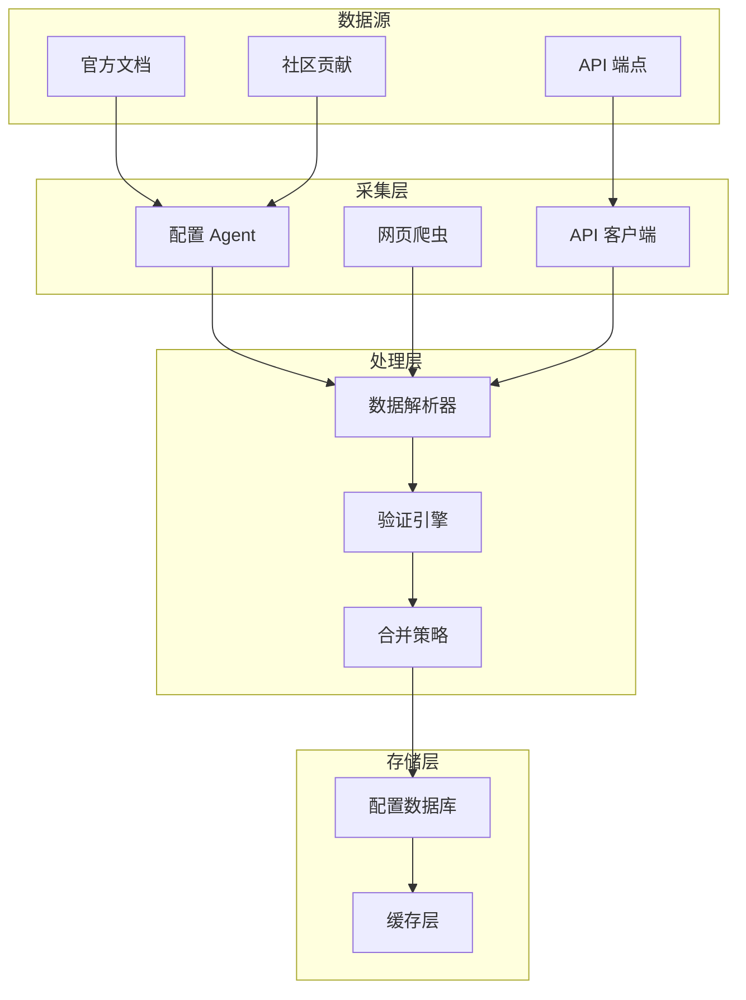
```mermaid
flowchart TB
    subgraph 数据源
        A[官方文档]
        B[API 端点]
        C[社区贡献]
    end

    subgraph 采集层
        D[配置 Agent]
        E[网页爬虫]
        F[API 客户端]
    end

    subgraph 处理层
        G[数据解析器]
        H[验证引擎]
        I[合并策略]
    end

    subgraph 存储层
        J[配置数据库]
        K[缓存层]
    end

    A --> D
    B --> F
    C --> D
    D --> G
    E --> G
    F --> G
    G --> H
    H --> I
    I --> J
    J --> K
```

### 配置优先级模型

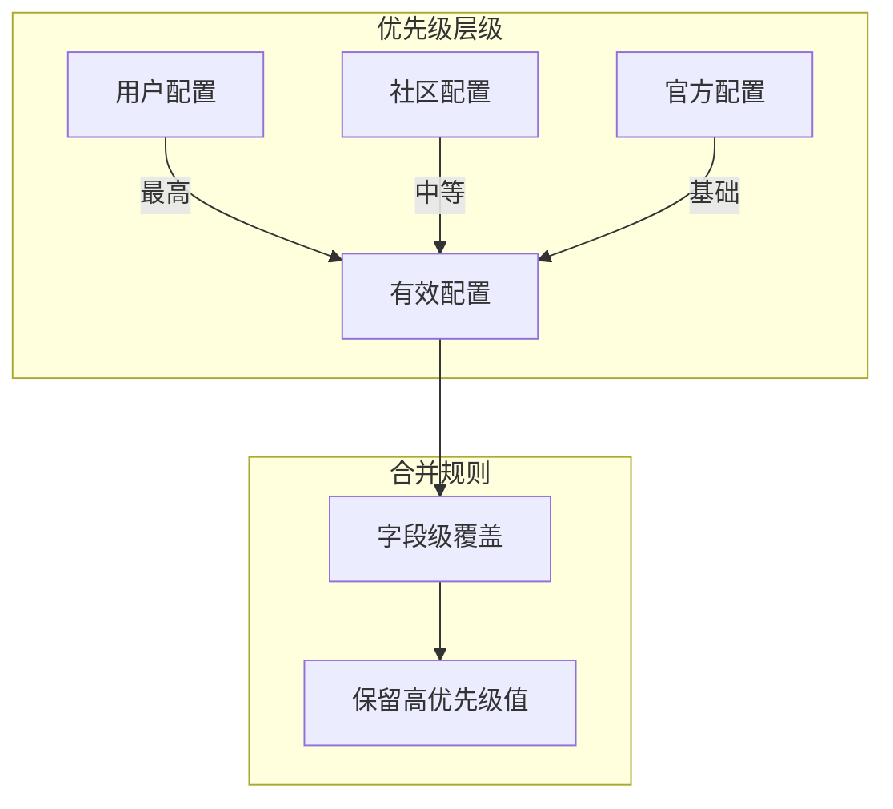
```mermaid
graph TB
    subgraph 优先级层级
        A[用户配置] -->|最高| D[有效配置]
        B[社区配置] -->|中等| D
        C[官方配置] -->|基础| D
    end

    subgraph 合并规则
        D --> E[字段级覆盖]
        E --> F[保留高优先级值]
    end
```

## 元数据结构

### Provider 配置层次

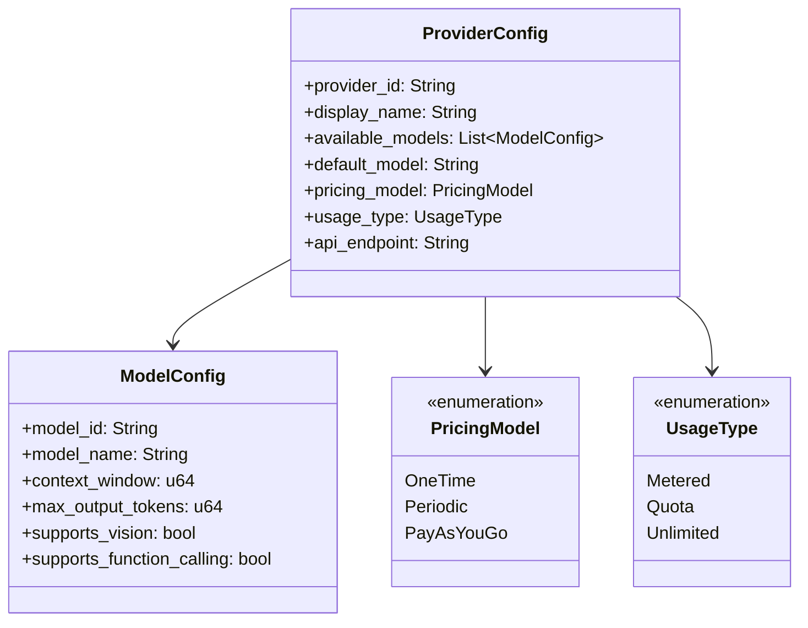
```mermaid
classDiagram
    class ProviderConfig {
        +provider_id: String
        +display_name: String
        +available_models: List~ModelConfig~
        +default_model: String
        +pricing_model: PricingModel
        +usage_type: UsageType
        +api_endpoint: String
    }

    class ModelConfig {
        +model_id: String
        +model_name: String
        +context_window: u64
        +max_output_tokens: u64
        +supports_vision: bool
        +supports_function_calling: bool
    }

    class PricingModel {
        <<enumeration>>
        OneTime
        Periodic
        PayAsYouGo
    }

    class UsageType {
        <<enumeration>>
        Metered
        Quota
        Unlimited
    }

    ProviderConfig --> ModelConfig
    ProviderConfig --> PricingModel
    ProviderConfig --> UsageType
```

### 配置来源分类

| 来源类型 | 描述 | 可靠性 | 更新频率 |
| --- | --- | --- | --- |
| 官方 | Provider 官方文档 | 高 | 自动定期 |
| 社区 | 社区贡献数据 | 中 | 手动更新 |
| 用户覆盖 | 用户自定义 | 最高 | 实时 |

## Agent 采集系统

### 采集流程

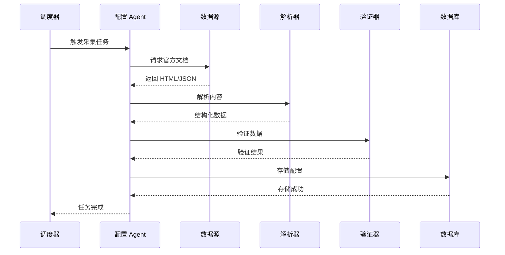
```mermaid
sequenceDiagram
    participant Scheduler as 调度器
    participant Agent as 配置 Agent
    participant Source as 数据源
    participant Parser as 解析器
    participant Validator as 验证器
    participant DB as 数据库

    Scheduler->>Agent: 触发采集任务
    Agent->>Source: 请求官方文档
    Source-->>Agent: 返回 HTML/JSON
    Agent->>Parser: 解析内容
    Parser-->>Agent: 结构化数据
    Agent->>Validator: 验证数据
    Validator-->>Agent: 验证结果
    Agent->>DB: 存储配置
    DB-->>Agent: 存储成功
    Agent-->>Scheduler: 任务完成
```

### Provider Agent 职责

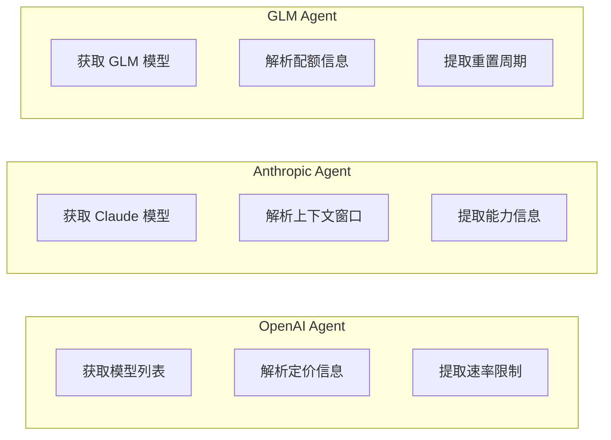
```mermaid
flowchart LR
    subgraph OpenAI Agent
        A1[获取模型列表]
        A2[解析定价信息]
        A3[提取速率限制]
    end

    subgraph Anthropic Agent
        B1[获取 Claude 模型]
        B2[解析上下文窗口]
        B3[提取能力信息]
    end

    subgraph GLM Agent
        C1[获取 GLM 模型]
        C2[解析配额信息]
        C3[提取重置周期]
    end
```

## 数据验证机制

### 验证流程

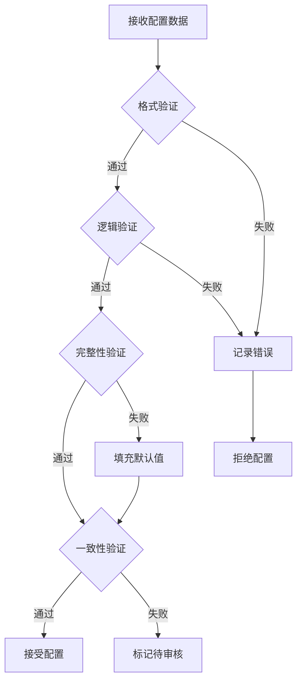
```mermaid
flowchart TB
    A[接收配置数据] --> B{格式验证}
    B -->|通过| C{逻辑验证}
    B -->|失败| D[记录错误]

    C -->|通过| E{完整性验证}
    C -->|失败| D

    E -->|通过| F{一致性验证}
    E -->|失败| G[填充默认值]

    F -->|通过| H[接受配置]
    F -->|失败| I[标记待审核]

    G --> F
    D --> J[拒绝配置]
```

### 验证规则

| 验证类型 | 检查内容 | 失败处理 |
| --- | --- | --- |
| 格式验证 | 数据类型、字段格式 | 拒绝并记录 |
| 逻辑验证 | 值范围、枚举值 | 使用默认值 |
| 完整性验证 | 必填字段存在 | 填充默认值 |
| 一致性验证 | 跨字段关系正确 | 标记待审核 |

## 配置合并策略

### 字段级合并

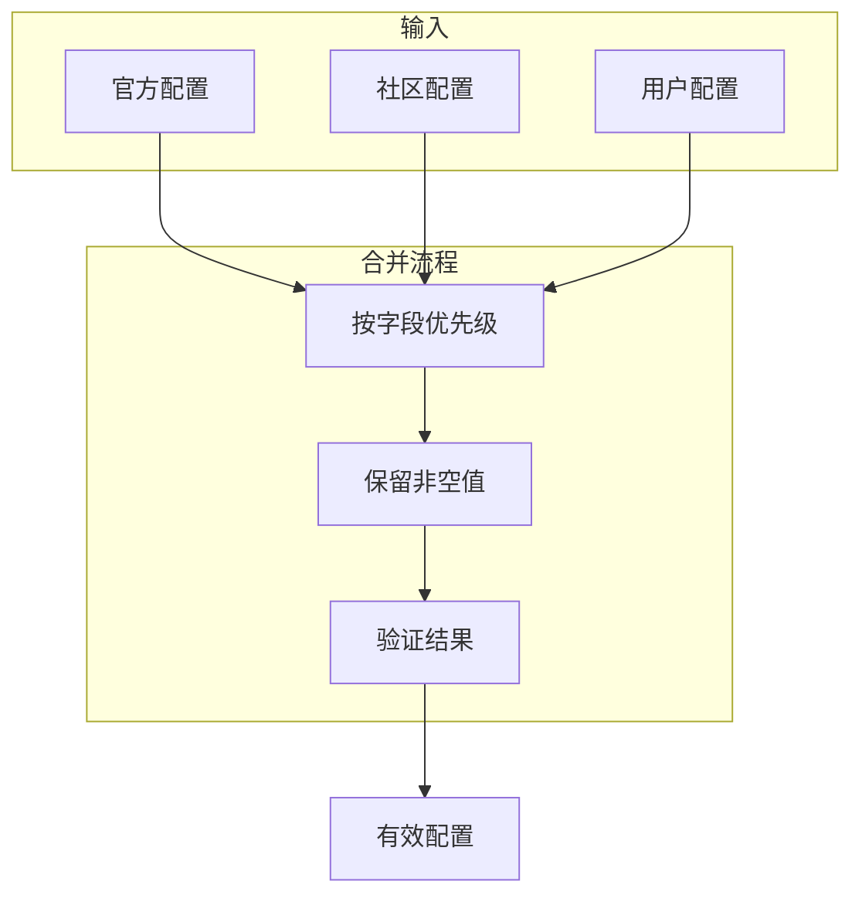
```mermaid
flowchart TB
    subgraph 输入
        A[官方配置]
        B[社区配置]
        C[用户配置]
    end

    subgraph 合并流程
        D[按字段优先级]
        E[保留非空值]
        F[验证结果]
    end

    A --> D
    B --> D
    C --> D
    D --> E
    E --> F
    F --> G[有效配置]
```

### 合并示例

| 字段 | 官方值 | 社区值 | 用户值 | 最终值 |
| --- | --- | --- | --- | --- |
| context_window | 128000 | - | 64000 | 64000 |
| max_concurrent | 100 | 50 | - | 50 |
| pricing_model | PayAsYouGo | - | - | PayAsYouGo |

## 用户配置界面

### 配置文件结构

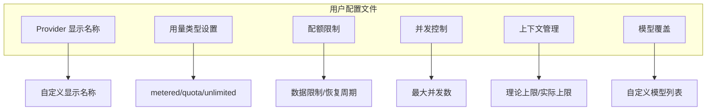
```mermaid
graph TB
    subgraph 用户配置文件
        A[Provider 显示名称]
        B[用量类型设置]
        C[配额限制]
        D[并发控制]
        E[上下文管理]
        F[模型覆盖]
    end

    A --> A1[自定义显示名称]
    B --> B1[metered/quota/unlimited]
    C --> C1[数据限制/恢复周期]
    D --> D1[最大并发数]
    E --> E1[理论上限/实际上限]
    F --> F1[自定义模型列表]
```

## 定时更新机制

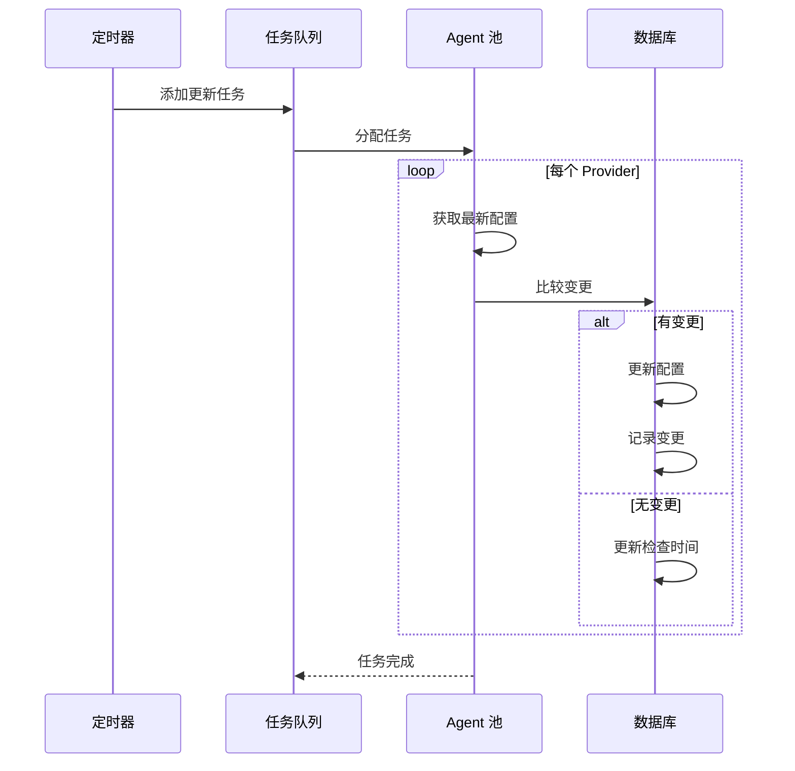
```mermaid
sequenceDiagram
    participant Timer as 定时器
    participant Queue as 任务队列
    participant Agent as Agent 池
    participant DB as 数据库

    Timer->>Queue: 添加更新任务
    Queue->>Agent: 分配任务

    loop 每个 Provider
        Agent->>Agent: 获取最新配置
        Agent->>DB: 比较变更
        alt 有变更
            DB->>DB: 更新配置
            DB->>DB: 记录变更
        else 无变更
            DB->>DB: 更新检查时间
        end
    end

    Agent-->>Queue: 任务完成
```

## 错误处理

### 采集失败处理

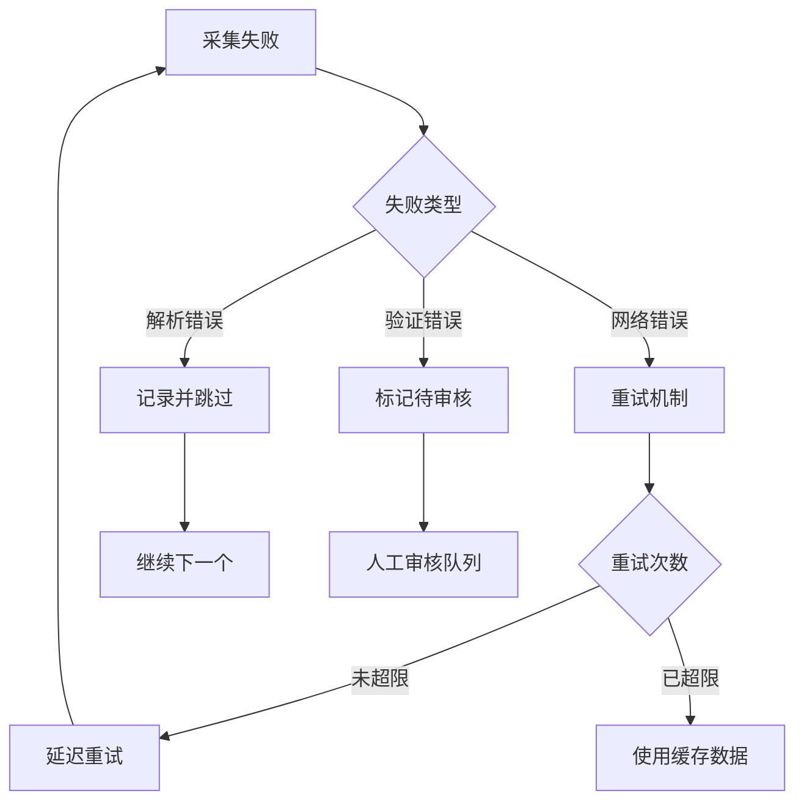
```mermaid
flowchart TB
    A[采集失败] --> B{失败类型}
    B -->|网络错误| C[重试机制]
    B -->|解析错误| D[记录并跳过]
    B -->|验证错误| E[标记待审核]

    C --> F{重试次数}
    F -->|未超限| G[延迟重试]
    F -->|已超限| H[使用缓存数据]

    G --> A
    D --> I[继续下一个]
    E --> J[人工审核队列]
```

## 可扩展性设计

### 添加新 Provider

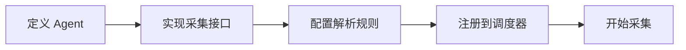
```mermaid
flowchart LR
    A[定义 Agent] --> B[实现采集接口]
    B --> C[配置解析规则]
    C --> D[注册到调度器]
    D --> E[开始采集]
```

### 扩展点

| 扩展类型 | 描述 | 实现方式 |
| --- | --- | --- |
| 新 Provider | 添加新配置来源 | 实现 Provider Agent 接口 |
| 新字段 | 扩展配置结构 | 更新数据模型和验证规则 |
| 新验证规则 | 添加验证逻辑 | 添加验证器实现 |

## Layer3 Agent 实现

### ProviderScratch Agent

`ProviderScratch` 是第一个 Layer3 官方 Agent，作为爬取设施的示例实现。

```mermaid
flowchart TB
    subgraph ProviderScratch Agent
        A[Agent 入口] --> B{执行模式}
        B -->|TUI 模式| C[交互式界面]
        B -->|CI 模式| D[自动执行]

        C --> E[选择 Provider]
        D --> F[读取环境变量]

        E --> G[调用 Skill]
        F --> G

        G --> H[爬取文档]
        H --> I[解析数据]
        I --> J[生成 TOML]

        J --> K{确认提交？}
        K -->|是| L[写入工作区]
        K -->|否| M[放弃变更]

        L --> N[请求用户提交]
    end
```

### 技能架构

每个 Provider 对应一个独立的 Skill：

```mermaid
graph LR
    subgraph Skills
        A[openai]
        B[anthropic]
        C[glm]
        D[deepseek]
        E[qwen]
        F[gemini]
    end

    subgraph 共享组件
        G[文档爬虫]
        H[数据解析器]
        I[TOML 生成器]
    end

    A --> G
    B --> G
    C --> G
    D --> G
    E --> G
    F --> G

    G --> H
    H --> I
```

### 目录结构

```mermaid
flowchart LR
    Root[".amphoreus/provider_scratch/"]
    AT["agent.toml"]
    OV["overview/"]
    SK["skills/"]
    Root --> AT
    Root --> OV
    Root --> SK
    OV --> ZH["zhs.md"]
    SK --> OA["openai/"]
    SK --> AN["anthropic/"]
    SK --> GL["glm/"]
    SK --> DS["deepseek/"]
    SK --> QW["qwen/"]
    SK --> GE["gemini/"]
    OA --> OAP["prompt.md"]
    AN --> ANP["prompt.md"]
    GL --> GLP["prompt.md"]
    DS --> DSP["prompt.md"]
    QW --> QWP["prompt.md"]
    GE --> GEP["prompt.md"]
```

### CI 自动化

```mermaid
flowchart LR
    A[定时触发] --> B[检出代码]
    B --> C[运行 ProviderScratch]
    C --> D{检测变更}
    D -->|有变更| E[创建分支]
    E --> F[提交变更]
    F --> G[创建 PR]
    G --> H[等待审核]
    D -->|无变更| I[完成]
```

### 环境变量

| 变量名 | 描述 |
| --- | --- |
| `AMPHOREUS_PROVIDER_SCRATCH_PROVIDERS` | 要爬取的 Provider 列表 |
| `AMPHOREUS_PROVIDER_SCRATCH_OUTPUT_DIR` | 输出目录路径 |
| `AMPHOREUS_PROVIDER_SCRATCH_GIT_BRANCH` | 目标 Git 分支 |
| `AMPHOREUS_PROVIDER_SCRATCH_DRY_RUN` | 仅试运行 |

## 未来规划

| 功能 | 描述 | 优先级 |
| --- | --- | --- |
| 配置版本控制 | 追踪配置变更历史 | 高 |
| 变更通知 | 配置更新时通知用户 | 中 |
| 配置回滚 | 支持回滚到历史版本 | 中 |
| 智能推荐 | 根据使用模式推荐配置 | 低 |
| GitHub 巡回 Agent | 自动创建 PR 更新配置 | 高 |
