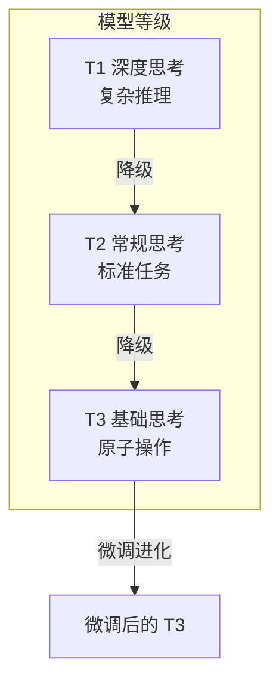
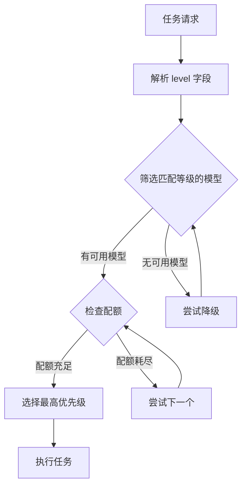
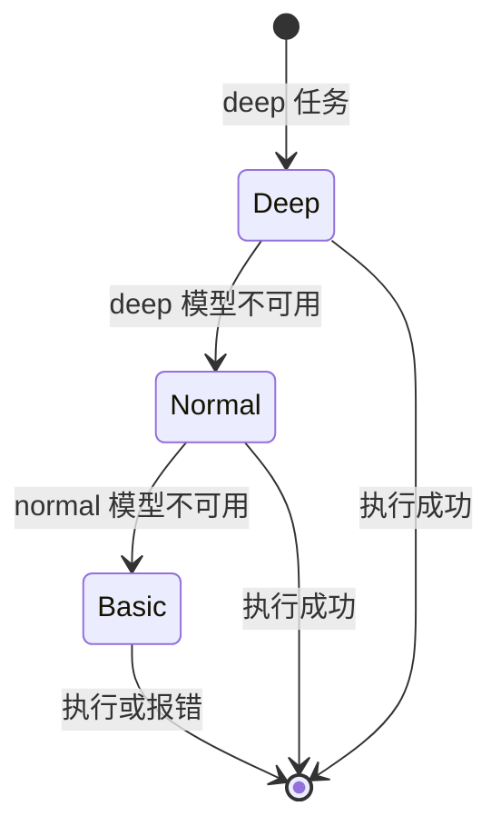
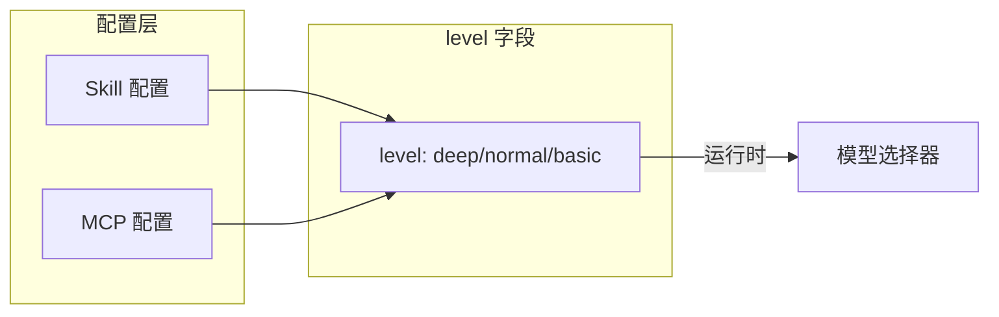
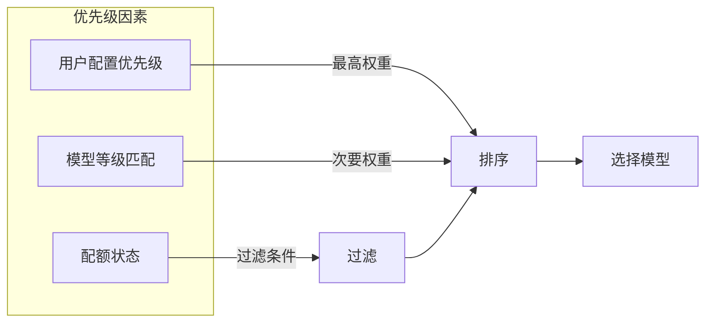
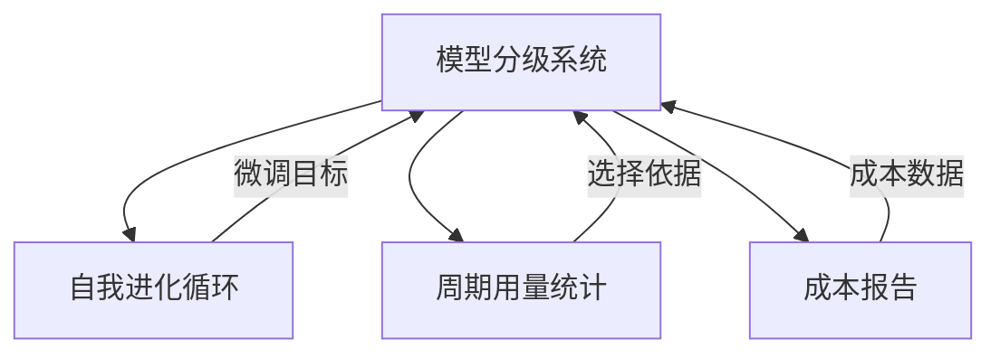

+++
title = "模型分级系统设计"
description = "模型分级系统是一个智能模型选择机制，根据任务复杂度匹配适当的模型等级，在保证质量的同时最大化资源利用效率。"
lang = "zhs"
category = "design"
subcategory = "core"
+++

# 模型分级系统设计

## 概述

模型分级系统是一个智能模型选择机制，根据任务复杂度匹配适当的模型等级，在保证质量的同时最大化资源利用效率。

> **相关文档**：本文定义的三级模型体系是[自我进化循环系统](04-self-evolution-loop.md)的基础。

## 核心原则

### 三级模型体系

### 等级对比

| 等级 | 定位 | 成本 | 典型场景 |
| --- | --- | --- | --- |
| T1（深度） | 复杂推理、决策 | 最高 | 架构设计、问题分析 |
| T2（常规） | 标准任务 | 中等 | 代码编写、文档生成 |
| T3（基础） | 原子操作 | 最低 | 文件读取、格式转换 |

## 模型选择机制

### 选择流程

### 降级策略

## 配置机制

### Skill/MCP 等级标注

每个 Skill 和 MCP 工具通过 `level` 字段声明所需的模型等级：

### 优先级控制

## 与其他模块的关系

## 设计考量

### 成本优化

- 优先选择低等级模型
- 自动降级避免任务失败
- 配额监控告警

### 质量保证

- 复杂任务要求高等级
- 降级需进行可行性验证
- 失败时自动重试

### 可扩展性

- 支持自定义等级
- 灵活的优先级配置
- 可插拔的选择策略
