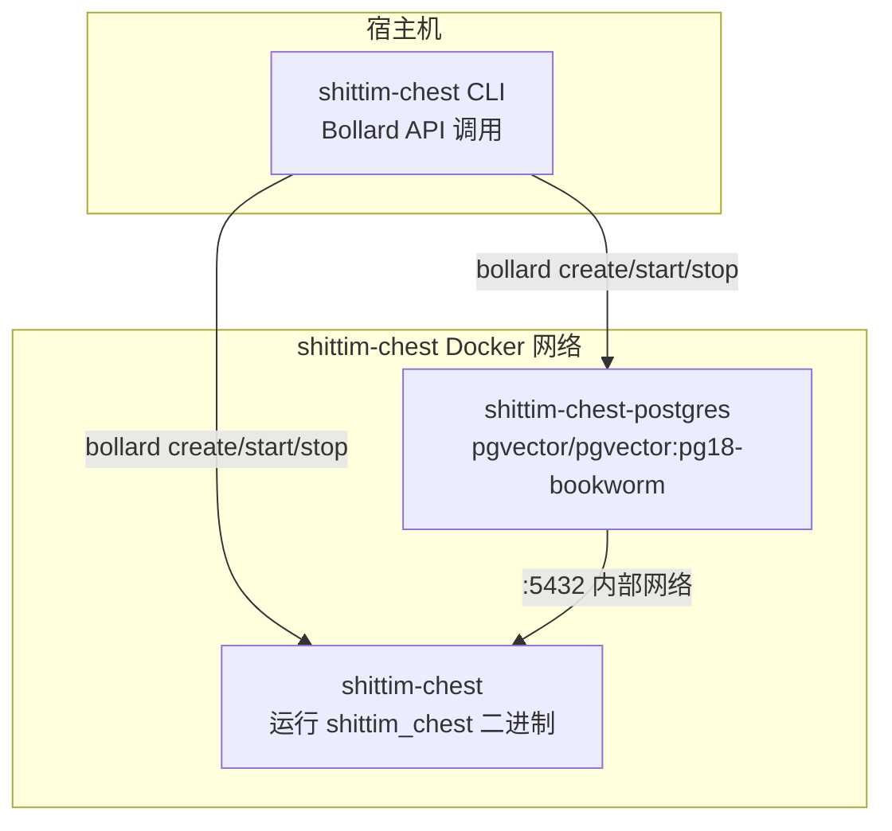

+++
title = "CLI 封装架构：基于 Bollard 的 Docker 编排"
description = """`packages/cli/` 是一个 Rust 二进制程序，通过 Bollard Docker API 直接管理容器生命周期，完全替代 docker-compose 和 Shell 脚本。CLI 运行在宿主机上，而服务端二进制（`shittim_chest`）运行在容器内。"""
lang = "zhs"
category = "design"
subcategory = "webui"
+++

# CLI 封装架构：基于 Bollard 的 Docker 编排

## 概述

`packages/cli/` 是一个 Rust 二进制程序，通过 Bollard Docker API 直接管理容器生命周期，完全替代 docker-compose 和 Shell 脚本。CLI 运行在宿主机上，而服务端二进制（`shittim_chest`）运行在容器内。

## 为什么不使用 docker-compose

| 维度 | docker-compose | bollard（当前方案） |
| --- | --- | --- |
| 依赖 | 需单独安装 docker-compose | 复用 Docker Engine API |
| 可编程性 | YAML 声明式，逻辑受限 | Rust 原生，任意控制流 |
| 健康检查 | depends_on + condition 为事件驱动 | 主动轮询；死亡检测无需超时 |
| 错误处理 | 容器退出 = 失败 | 重试 + 日志收集 + 详细错误信息 |
| 资源清理 | `down -v` 全量清理 | 按容器/网络/数据卷精细清理 |
| 集成度 | 外部工具 | 作为库嵌入，可扩展更多逻辑 |

## 容器拓扑



## 容器命名与资源

| 常量 | 值 | 用途 |
| --- | --- | --- |
| `NET` | `shittim-chest` | Docker 桥接网络 |
| `PG` | `shittim-chest-postgres` | PostgreSQL 容器名 |
| `APP` | `shittim-chest` | 应用容器名 |
| `VOL` | `shittim-chest-pgdata` | PG 数据卷 |
| `PG_IMG` | `pgvector/pgvector:pg18-bookworm` | PG 镜像 |
| `RUNTIME_IMG` | `debian:bookworm-slim` | 开发模式运行时镜像 |
| `BUILD_IMG` | `shittim-chest` | 发布模式构建镜像 |

## 命令映射

| 命令 | 行为 |
| --- | --- |
| `dev [--clean]` | 一次性启动：env → 网络 → 数据卷 → PG → cargo build → 迁移 → 启动 → 流式日志 |
| `up` | 发布模式：docker build 镜像 → 迁移 → 后台启动（restart=unless-stopped） |
| `down [--clean]` | 停止容器（可选清理数据卷和网络） |
| `migrate` | 在一次性容器中运行 db-migrate（最多重试 5 次，间隔 2s） |
| `logs` | 流式跟随应用容器日志 |
| `status` | 检查 PG 和应用容器运行状态 + 健康检查状态 |
| `build` | 构建完整 Docker 镜像（`docker build -t shittim-chest`） |

## 环境变量传播

```text
.env 文件 → dotenvy::from_path_iter → HashMap<String, String>
→ 合并 SHITTIM_CHEST_HOST / PORT / DATABASE_URL
→ Vec<String> = ["KEY=VALUE", ...]
→ bollard Config::env()
```

CLI 自身不从 `.env` 读取配置——它仅将完整 `.env` 内容传入容器内的 `shittim_chest` 进程。密码和端口通过 `SHITTIM_CHEST_DB_PASSWORD` 和 `SHITTIM_CHEST_PORT` 这两个特定键读取。

## 日志规范

CLI 日志直接输出到 stderr，采用与 entelecheia 相同的格式：

- `tracing-subscriber` + `ShortTimer`（HH:MM:SS 格式）
- `.compact()` 紧凑模式
- `.with_target(false)` 隐藏模块路径
- `--log-level` CLI 参数（默认 `info`）

## 设计原则

1. **CLI 不执行业务逻辑**：所有业务逻辑位于容器内的 `shittim_chest` 二进制中
1. **容器是不可变单元**：CLI 创建/销毁容器，从不修改运行中的容器
1. **网络隔离**：PG 端口不暴露给宿主机，仅在 Docker 内部网络中可达
1. **被动轮询健康检查**：不依赖 Docker 事件（不可靠）；直接轮询 inspect 结果
