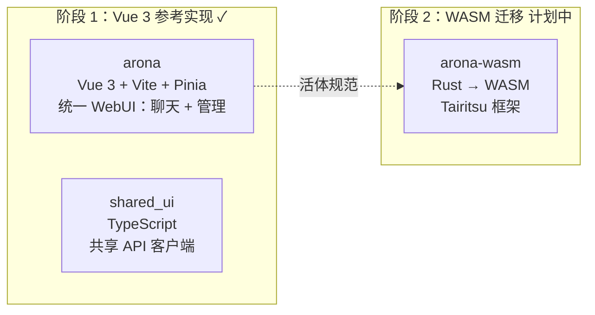
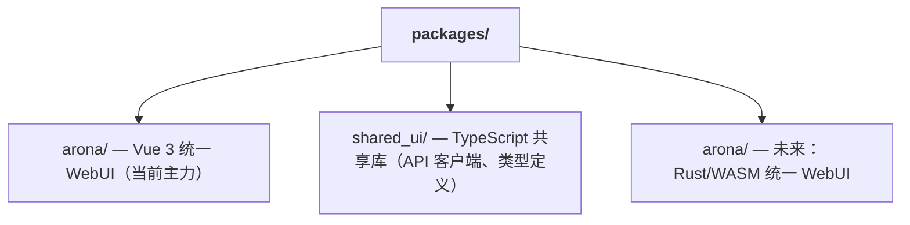

+++
title = "双前端 WASM 迁移策略"
description = """shittim-chest 采用"Vue 3 先行，WASM 后续"的两阶段前端策略。Vue 3 版本作为生产级参考实现先行交付，Rust/WASM 版本在条件成熟时迁移。在双版本并行运行期间，相同的用户交互必须产生相同的结果。"""
lang = "zhs"
category = "design"
subcategory = "webui"
+++

# 双前端 WASM 迁移策略

## 概述

shittim-chest 采用"Vue 3 先行，WASM 后续"的两阶段前端策略。Vue 3 版本作为生产级参考实现先行交付，Rust/WASM 版本在条件成熟时迁移。在双版本并行运行期间，相同的用户交互必须产生相同的结果。

## 阶段划分



## 技术栈对比

| 维度 | 阶段 1（Vue 3） | 阶段 2（WASM） |
| --- | --- | --- |
| 语言 | TypeScript / Vue 3 SFC | Rust |
| 框架 | Vite + Pinia + Vue Router | Tairitsu（自研） |
| 构建产物 | JS/CSS bundle | WASM 二进制 |
| 打包体积 | 较大 | 显著更小 |
| 运行时性能 | 良好 | 优秀（接近原生速度） |
| 开发体验 | 即时 HMR | 编译等待 |
| 生态成熟度 | 成熟 | 早期阶段 |

## "活体规范"原则

Vue 3 版本不仅仅是临时实现，它是 WASM 迁移的**可执行规范**：

1. **功能完整性**：WASM 版本的每个功能必须与 Vue 3 版本行为一致
1. **API 契约**：两个版本使用相同的 REST API 和 WebSocket 协议
1. **视觉一致性**：两个版本在相同状态下渲染相同的 UI
1. **渐进式替换**：arona 的聊天和管理功能可独立迁移到 WASM

## WASM 迁移决策阈值

迁移到 WASM 不会在条件成熟之前启动。决策阈值：

| 条件 | 描述 |
| --- | --- |
| Tairitsu 框架成熟度 | 组件库、路由、状态管理、i18n 等基础设施必须完备 |
| WASM 生态覆盖 | `web-sys` / `wasm-bindgen` 必须支持所需的 Web API |
| 开发带宽 | 有足够人力在推进迁移的同时维护两个版本 |
| 性能需求 | Vue 3 版本在实际场景中出现性能瓶颈 |

## 前端包结构



`shared_ui/` 包含共享前端代码：

- API 客户端（认证、聊天、Provider 管理等）
- 认证工具（JWT 存储、刷新、拦截器）
- 类型定义（领域枚举、请求/响应类型）

## 前端开发命令

```bash
just build-frontend  # 构建两个前端（pnpm build:all）
dev.py               # 监听 + 文件变更时自动重构建
```

开发模式下，`dev.py` 监听源文件并在变更时运行 `pnpm build`。后端在同一端口同时提供静态资源和 API 端点——无需单独的开发服务器或代理。

## 设计原则

1. **Vue 3 先交付功能**：无需等待 WASM。用户今天即可使用功能完整的聊天和管理界面。
1. **WASM 是增强，不是替代**：迁移不影响现有用户——两个版本使用相同的后端 API。
1. **框架无关的后端**：`shittim_chest` 后端不感知前端实现。任何 HTTP/WS 客户端均可集成。
1. **Tairitsu 是外部依赖，非内部开发**：WASM 迁移的启动取决于外部 Tairitsu 框架的成熟度。
