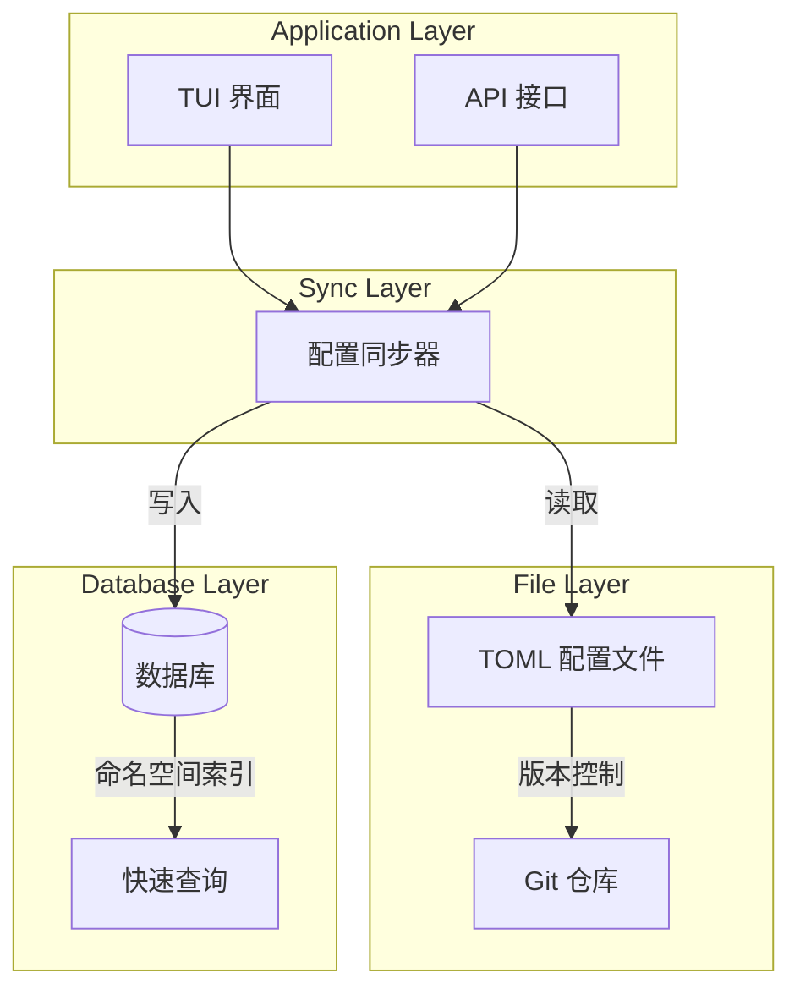
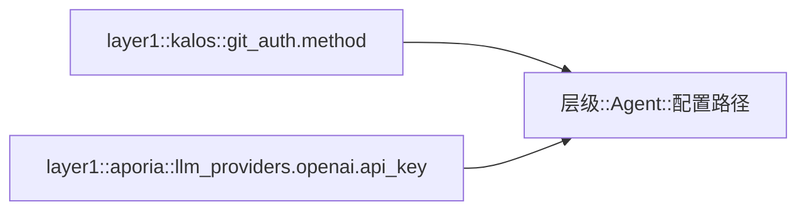
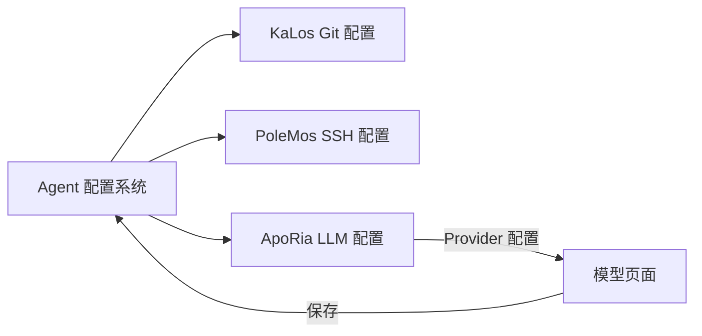

# Agent 配置系统设计

## 概述

Agent 配置系统提供统一的配置管理机制，支持 TOML 文件存储和数据库持久化，实现配置版本管理和热重载。

## 核心原则

### 双层存储架构



### 配置命名空间

采用分层命名空间设计：



## 架构设计

### 配置生命周期

```mermaid
stateDiagram-v2
    [*] --> Default: 系统默认值
    Default --> FileConfig: 加载 TOML
    FileConfig --> DbSync: 同步到数据库
    DbSync --> Active: 配置激活

    Active --> Updated: 用户修改
    Updated --> Validated: 格式验证
    Validated --> DbSync: 保存更改

    Active --> HotReload: 热重载触发
    HotReload --> Active: 无需重启
```

### TUI 配置界面

```mermaid
graph TB
    subgraph Agent 文档模态窗口
        Tabs[概览 | 配置 | MCP | 技能]
        Tabs --> Content[内容区域]
    end

    subgraph 配置页面
        Groups[配置组列表]
        Groups --> Group1[Git 认证配置]
        Groups --> Group2[源码管理配置]
        Groups --> AddGroup[添加新配置组]
    end

    Content --> Groups
```

## 与其他模块的关系



## 设计考量

### 安全性

- 敏感配置加密存储
- 访问权限控制
- 配置变更审计

### 可扩展性

- 支持自定义配置类型
- 灵活的验证规则
- 可插拔的配置处理器

### 一致性

- 文件与数据库同步
- 配置版本管理
- 冲突检测与解决
