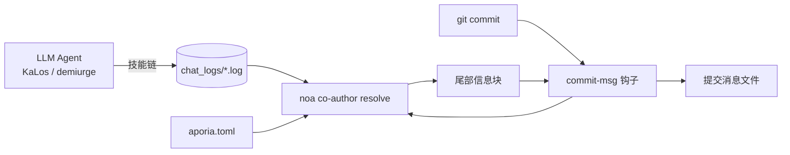

# AI Agent 身份识别与提交共同作者策略

## 概述

本文档规定了 celestia-island 项目（`noa`、`entelecheia`、`evernight`）中所有 AI 生成的提交如何标注**来源元数据（provenance metadata）**：哪些模型创建了变更，通过哪个提供商/平台访问它们，消耗了多少 token，以及变更是否在自主（YOLO）迭代模式下生成。

该机制是**实用元数据**：每个由 AI agent 生成的提交都会获得一个 `Co-authored-by` 尾部信息块（以及可选的 `Token usage` 块），由 `noa` 安装并解析的 git `commit-msg` 钩子追加。这不是法律合规门禁；它是一种可追溯性，让人类能够审计哪个模型和哪个提供商接触了代码。

## 动机

| 关注点 | 如何帮助 |
| --- | --- |
| **可追溯性** | 每个提交记录生成它的确切模型。 |
| **提供商问责** | 作者邮箱编码了提供商/平台，包括第三方中转。 |
| **防污染** | 如果中转或提供商传输了被破坏的数据，共同作者尾部信息标识了来源。 |
| **成本追踪** | 可选的 `Token usage` 块记录每个模型的上传/下载/缓存。 |
| **自主模式标记** | 在 YOLO 巡航控制下完全运行的链被标记为 `Entelecheia` 权威。 |

## 提供商身份模型

作者邮箱使用单一信任命名空间——`celestia.world`——本地部分编码**谁提供了模型服务**：

```text
显示名称 <provider-<or-platform-id@celestia.world>>
```

提供商 ID 是每个提供商配置中声明的**强制性 `website_domain`** 字段（提供商注册入口 TOML 和本地 `aporia.toml`）。它**不是**从 API `base_url` 派生的——单个提供商可能暴露多个 `base_url` 主机（例如 `zhipu_glm` 同时提供 `open.bigmodel.cn` 和 `api.z.ai`，但其规范域名为 `zhipuai.cn`）。如果提供商缺少 `website_domain`，则不会为其归属共同作者（解析器跳过它，而不是从 URL 或模型前缀猜测）。

- **第一方提供商**由其规范域名标识：`anthropic.com`、`deepseek.com`、`openai.com`、`zhipuai.cn`、`google.com` 等。
- **第三方/中转提供商**保留自己的域名，以便中转可见：`opencode.ai`、`jdcloud.com`、`openrouter.ai`、`dashscope.aliyuncs.com` 等。

这意味着通过不同路由访问的*相同*模型是可区分的：

```text
GLM 5 <zhipuai.<cn@celestia.world>>              # 直接来自智谱 AI
GLM 5 <jdcloud.<com@celestia.world>>           # GLM 5 通过京东云提供
Deepseek V4 Pro <deepseek.<com@celestia.world>> # 直接来自 DeepSeek
Deepseek V4 Pro <opencode.<ai@celestia.world>>  # DeepSeek 通过 opencode 提供
```

## 共同作者尾部信息规范

- 尾部 key：`Co-authored-by`（git 识别的尾部信息）。
- Value：`显示名称 <local@celestia.world>`。
- **每个不同模型一个尾部信息**，按使用顺序排列。
- 显示名称从模型 ID 派生（品牌 + 版本，首字母大写）。
- 本地部分必须是有效的 RFC-5321 子域（字母、数字、`.`、`-`）。

## YOLO 权威尾部信息

当生成提交的整个思维链在 **YOLO 巡航控制**（自主迭代）下运行时，会前置一个额外的共同作者：

```text
Co-authored-by: Entelecheia <demiurge@celestia.world>
```

YOLO 模式从以下两者之一检测：

1. 会话聊天日志包含 `YOLO cruise control` / `YOLO auto` 标记，或
1. 存在 `/run/entelecheia/yolo_active` 哨兵文件。

这让人类可以立即看到"此提交是在没有人类参与循环的情况下完成的"。

## 嵌入的 Token 使用量

嵌入在 `Co-authored-by` 尾部信息中每个模型的显示名称内（GitHub 正确解析的一个尾部信息块）：

```text
Co-authored-by: Claude Opus 4.8 (↑ 12.5k ↓ 8.3k ●45.2k) <anthropic.<com@celestia.world>>
Co-authored-by: Deepseek V4 Pro (↑ 5.1k ↓ 3.2k) <deepseek.<com@celestia.world>>
```

规则：

- 使用量以内联方式嵌入为 `(↑ 上传 ↓ 下载)`，仅当报告了缓存输入 token 且 > 0 时追加 `●缓存`。
- `↑` = 提示/输入 token；`↓` = 补全/输出 token。
- 计数以千（`k`）为单位显示，保留一位小数，去除尾部零。

## 完整提交信息示例

```python
fix(auto_fix): raise clippy/check timeouts from 180s to 300s

The previous 180s timeout was too tight for clean builds on a loaded
machine; raise it to 300s to avoid spurious validation failures.

Co-authored-by: Entelecheia <demiurge@celestia.world>
Co-authored-by: GLM 5 (↑ 36.4k ↓ 1.5k) <zhipuai.<cn@celestia.world>>
```

## noa 钩子安装

`noa` 提供钩子生命周期：

```text
noa hook install --repo <path> [--force] [--noa-bin <path>]
```

- 写入 `.git/hooks/commit-msg`（模式 `0755`）。
- 钩子调用 `<noa> co-author resolve` 并将其 stdout 追加到提交消息文件（`$1`）。
- 钩子**永远不会阻止提交**：在任何解析器失败时静默退出 `0`。
- 如果提交消息已包含 `Co-authored-by:` 尾部信息，则钩子为无操作（绝不重复或覆盖）。
- 环境中的 `NOA_COAUTHOR_DISABLE=1` 禁用单次提交的钩子。

## noa 共同作者解析

```text
noa co-author resolve [--repo <path>] [--chat-log-dir <dir>]
                      [--aporia-config <path>] [--lookback-secs <n>]
```

解析器：

1. 加载提供商映射：内置注册表与 `aporia.toml` 提供商配置合并（后者给出精确的 model→endpoint→provider 映射）。
1. 读取最近的 entelecheia 聊天日志并按模型聚合 token 使用量。使用 `--lookback-secs 0`（默认）时仅使用最近的一个日志。
1. 检测 YOLO 模式（聊天日志标记或哨兵文件）。
1. 构建共同作者列表（如果是 YOLO 模式则 `Entelecheia` 权威在前，然后是各模型）和 token 使用块，并将尾部信息块打印到 stdout。

## 数据流



## entelecheia 集成

- `commit-msg` 钩子安装到 `/mnt/sdb1/entelecheia/.git/hooks/`。
- 由手术管道（`packages/scepter/src/state_machine/skill_chain/execution/noa_post_chain.rs` 中的 `NoaMergeCommit` 钩子）和 `KaLos:auto_fix` 自愈循环产生的所有提交都通过 git `commit-msg` 钩子，因此它们会自动标记。
- 无需更改提交调用点：钩子是单一的插入点。

## evernight 集成

当 AI agent 通过 `evernight` 编排提交时（例如 agent 在主机 A → evernight SSH → 主机 B → `git commit`），主机端的 `commit-msg` 钩子仍然在本地触发并标记提交。当 `evernight` 中继模型流量时，它自身可能作为**传输提供商**出现在作者邮箱中（例如 `GLM 5 <evernight.<celestia.world@celestia.world>>`），使传输跳可审计。

## 安全考量

- 共同作者尾部信息是**自我报告**的来源信息，不是密码学证明。未来工作可能添加签名证明。
- 解析器安全降级：缺失聊天日志、缺失 `noa` 或解析错误均导致空块，提交正常进行。
- 提供商标识符来自本地 `aporia.toml`，因此用户始终能看到*他们*配置的提供商。

## 提供商标识符参考（初始注册表）

| 提供商 ID | 品牌 | 端点提示 |
| --- | --- | --- |
| `zhipuai.cn` | GLM | `open.bigmodel.cn` |
| `deepseek.com` | Deepseek | `api.deepseek.com` |
| `anthropic.com` | Claude | `api.anthropic.com` |
| `openai.com` | GPT / OpenAI | `api.openai.com` |
| `google.com` | Gemini | `googleapis.com` |
| `dashscope.aliyuncs.com` | Qwen | `dashscope.aliyuncs.com` |
| `moonshot.cn` | Kimi | `api.moonshot.cn` |
| `mistral.ai` | Mistral | `api.mistral.ai` |
| `opencode.ai` | （中转） | `opencode.ai` |
| `jdcloud.com` | （中转） | `jdcloud.com` |
| `openrouter.ai` | （中转） | `openrouter.ai` |
