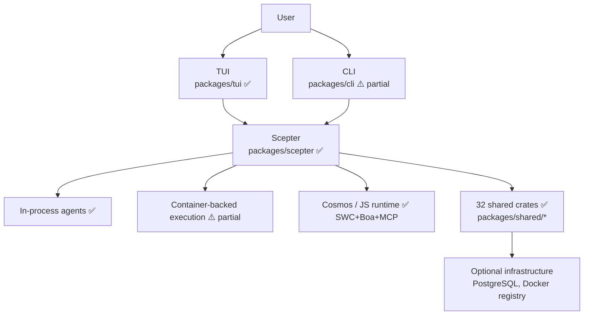
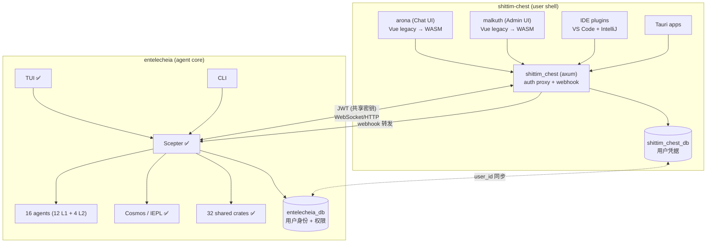
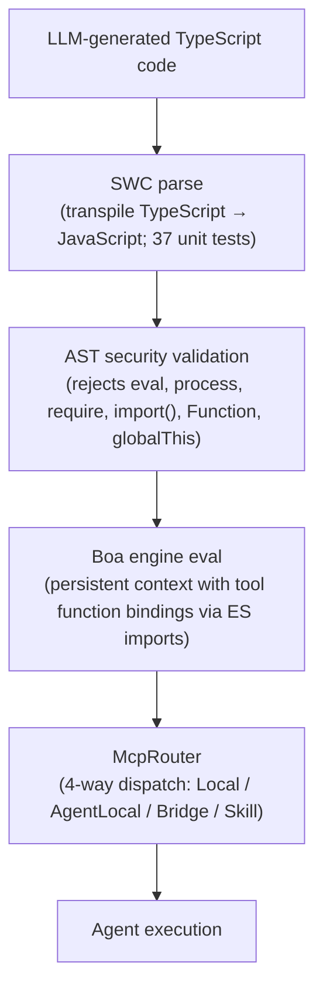
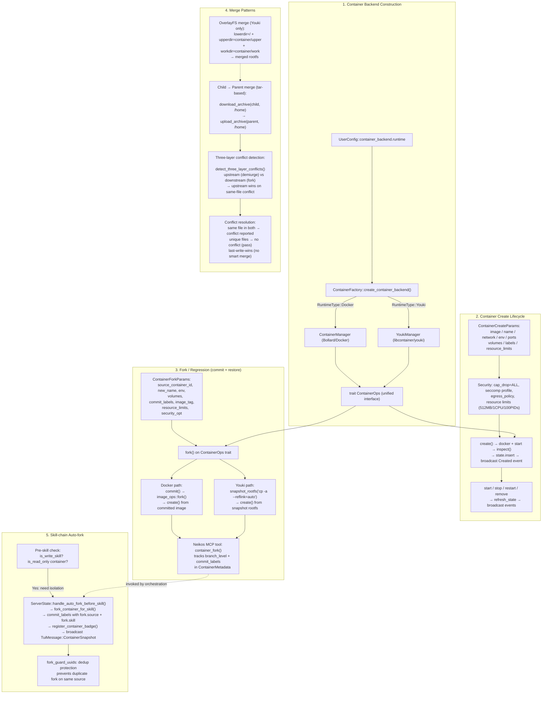
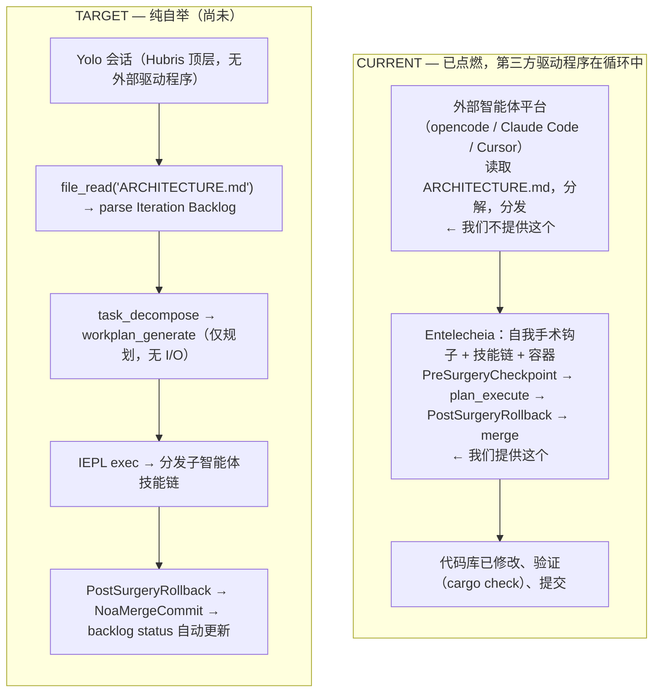
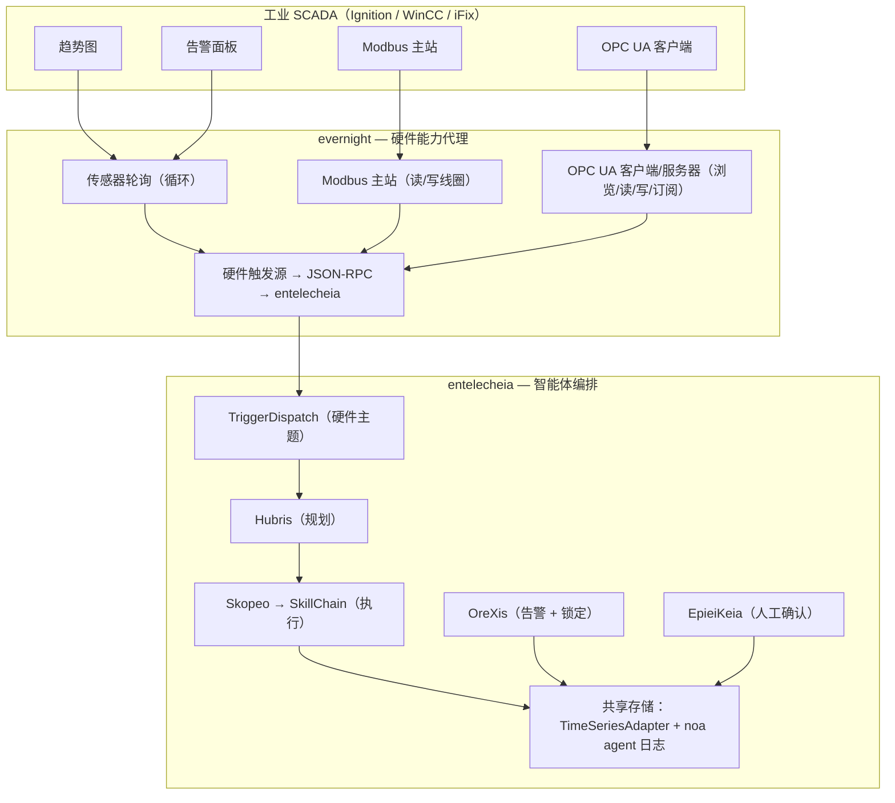

+++
title = "Entelecheia 架构概览"
description = """> 版本：0.2.0 — 早期开发阶段，尚未达到生产就绪。"""
lang = "zhs"
category = "architecture"
subcategory = "core"
+++

# 架构

> **版本**：0.2.0 — 早期开发阶段，尚未达到生产就绪。
> **最后验证时间**：2026-06-17（深度分析 — 对照实际代码重新校准）
> 本文档描述了已实现的代码和预期设计。
> 在做出部署决策之前，请阅读[当前差距](#当前差距)部分。

## 仓库拆分

Entelecheia 已完成重大拆分：面向用户的壳层已迁移至兄弟项目 **shittim-chest**（`../shittim-chest`）。Entelecheia 现在专注于多智能体编排核心。

| 仓库 | 范围 |
| --- | --- |
| **entelecheia** | Scepter 编排，16 个智能体（12 个 L1 + 4 个 L2），Cosmos/IEPL 运行时，32 个共享 crate |
| **shittim-chest** | arona（聊天 UI 前端），malkuth（管理 UI），`shittim_chest` 后端（axum 代理 + 认证 + webhook），IDE 插件，Tauri 应用 |

## 当前范围

Entelecheia 是一个包含 **56 个 crate** 的 Rust 工作空间，核心为 `packages/scepter`（编排服务器）、**32 个共享 crate**（位于 `packages/shared/`，已从原先的单体 crate 完全分解；有 5 个计划中的子 crate 从未实现，其功能已内联到同级 crate 中），以及 `packages/tui`（终端 UI）。TUI 是最完整的用户界面。`packages/cli` 包含服务管理、聊天和时间线命令。

以下组件已**迁移至 shittim-chest** 并从本仓库移除：

- `packages/webui`（HTTP/静态托管、WebSocket 桥接）— 已移除
- `packages/webui_frontend`（WASM 前端）— 已移除（第一阶段）
- `packages/ide/vscode`（VS Code 扩展）— 已移除（第一阶段）
- `packages/ide/idea`（IntelliJ 插件）— 已移除（第一阶段）
- `packages/app/tauri*`（Tauri 桌面/移动应用）— 已移除（第一阶段）
- TUI/CLI/Scepter/共享 crate 中所有 WebUI 状态、命令和渲染 — 已移除（第二阶段）

该项目经历了一次重大分解：旧有的单体 `packages/shared` crate（3.8 万行，187 个 .rs 文件）已完全拆分为聚焦的子 crate。早期分层图中出现的 5 个 crate 边界从未实现为独立 crate；其功能位于其他 crate 内部（例如，领域枚举内联到 `shared-domain-agent`，线程类型内联到 `shared-state-types`）。所有内部依赖声明使用 `workspace = true` 以实现版本一致性。

## 组件实况核查

| 组件 | 已实现 | 仅设计/桩代码 | 结论 |
| --- | --- | --- | --- |
| **Scepter**（编排） | 认证/RBAC、提供商路由、智能体生命周期、技能链执行、WebSocket/HTTP 端点、密钥加密。49 个源文件中包含 351 个单元测试。`AppState` 为 5 个子状态实现了 `FromRef`；智能体生命周期处理程序使用 `State<Arc<Persistence>>` | 完整的 API 接口。批量处理器已定义但未实例化。 | 🟢 真实 |
| **TUI** | 完整生命周期：启动画面、Docker 初始化、时间线、智能体模态框、i18n（8 种语言）、提供商配置、主题支持。47 个源文件中包含 329 个单元测试。`ComponentStore` 拆分为 5 个子结构体；AppState 精简为 6 个字段。通过 Unix 套接字（首选）或 WebSocket 回退连接。 | 与 Scepter API 功能对等。`CancelRequest`/`ExecuteSudoCommand` 尚未接入。 | 🟢 真实 |
| **CLI** | 服务管理、聊天、时间线、智能体生命周期命令。28 个单元测试。 | 未达到与 TUI 的功能对等 | 🟡 部分 |
| **WebUI** | 已移除 — 迁移至 shittim-chest | — | ✅ 完成 |
| **WebUI 前端** | 已移除 — 迁移至 shittim-chest | — | ✅ 完成 |
| **Cosmos / JS 运行时** | Boa 引擎，ES 模块导入分发（`__native_dispatch` 内部解析），命名空间生成，McpRouter 含熔断器+重试。`.d.ts` 从 `#[derive(TS)]` 自动生成，填充 TypeScript 类型文件。50 个单元测试。 | SWC TypeScript 转译管道已实现并测试（37 个单元测试）。完整的自动化管道（LLM 输出 → SWC → Boa）可通过 `shared_iepl::client` 以 `in-process-transpile` 特性标志桥接。 | 🟢 活跃 |
| **16 个智能体（12 L1 + 4 L2）** | 全部 16 个智能体均编译通过并具有 MCP 工具实现。共 147 个 MCP 工具 — **全部真实**。代码库中零个 `unimplemented!()` 或 `todo!()` 宏。 | 经典软件工程工具在元数据中标记为 `maturity: Stub`，但具有真实实现（cargo clippy、eslint、pylint、go vet 子进程调用；代码度量；提取函数重构）。 | 🟢 活跃 |
| **Layer2：Web 自动化** | 11 个 MCP 工具 — 全部通过 WebDriver 协议真实实现：会话管理、导航、截图、脚本执行、控制台/网络日志、键盘、鼠标、录制。10 个工具标记为 `maturity: Experimental`。 | — | 🟢 活跃 |
| **Layer2：经典软件工程** | 7 个 MCP 工具 — 全部真实实现：static_analyze（cargo clippy/eslint/pylint/go vet），code_review（检测长函数、深层嵌套、魔法数字），quality_check（LOC、复杂度、字母评分），refactor_suggest，lsp_diagnose，lsp_symbols，lsp_refactor（真实的变量重命名和提取函数）。2 个单元测试。 | LSP 重构的内联操作仅预览（需要 LSP 服务器才能完全解析）。 | 🟢 活跃 |
| **Layer2：工业物联网** | 7 个 MCP 工具 — 全部真实实现：modbus_read、modbus_write、s7comm_probe、serial_discover、opcua_browse、opcua_read、opcua_write。工业协议通信（Modbus RTU/TCP、Siemens S7comm、OPC UA 客户端）。标记为 `maturity: Experimental`。 | 从 SkeMma/PoleMos 迁移，作为 L2 整合的一部分。 | 🟢 活跃 |
| **Layer2：远程操作** | 16 个 MCP 工具 — 全部真实实现：SSH 会话管理、远程命令执行、文件传输（SFTP）、主机信息采集、GUI 自动化（X11/VNC 截图、输入、导航）、系统监控。标记为 `maturity: Experimental`。 | 从 SkeMma/PoleMos 迁移，作为 L2 整合的一部分。 | 🟢 活跃 |
| **其他 Layer2 设计** | 全部 4 个计划的 L2 智能体现已实现。`res/prompts/domain_agents/` 包含所有已实现智能体的配置/技能文档。 | `docs/plans/` 从未创建 | 🟢 活跃 |
| **容器隔离** | 双层运行时：Docker/Podman（外部编排）通过 Bollard，Youki/libcontainer（内部沙箱）通过 libcontainer。非 root 用户，cap_drop=ALL，no-new-privileges，专用 Docker 网络，Unix 套接字 IPC，在创建、分支、合并和重建时施加资源限制（512MB/1CPU/100 PID）。自定义 seccomp 配置文件。两个后端上的分支/提交/快照功能全面可用。 | AppArmor 配置文件未实现。`read_only_rootfs` 默认未启用。 | 🟡 部分 |
| **记忆 / RAG** | API 支持的嵌入（OpenAI 兼容，SHA-256 哈希回退，ONNX fastembed BGE-M3）。3 个嵌入后端全部实现。PgVector 存储、内存向量文档、图遍历、用于环境上下文注入的 RagContextBuffer。39 个单元测试。 | 嵌入→RAG 连接解耦（调用方提供预计算的嵌入）。PgVector 路径比内存回退更新、测试较少。RAG 订阅同步保留（尚未实现）。 | 🟡 部分 |
| **IEPL 管道** | Boa 引擎 + MCP 桥接 + 命名空间过滤 + 熔断器。SWC TypeScript 解析已实现并测试（37 个单元测试）。`.d.ts` 自动生成可操作。IEPL 代码生成（Rust 类型 → TS 声明）已接入。TS→JS 转译可通过 `shared_iepl::client`（进程内或子进程模式）使用。 | SWC→Boa 链未集成到 Cosmos 容器执行路径（期望预剥离的 JS）。 | 🟡 部分 |
| **IDE 集成** | 已移除 — 迁移至 shittim-chest | — | ✅ 完成 |

## 架构图

### 当前



### 目标（拆分后）



图例：✅ 可工作 | ⚠️ 部分实现 | 🔴 桩/设计

## Crate 依赖层级

32 个共享 crate 按分层依赖图组织：

```mermaid
block-beta
    columns 1
    block:L0["Layer 0 (leaf)"]:1
        shared-core shared-logging shared-macros
    end
    block:L1["Layer 1"]:1
        shared-domain-enums shared-mcp-types shared-text shared-concurrent
    end
    block:L2["Layer 2"]:1
        shared-config shared-agent-registry shared-state-types
    end
    block:L3["Layer 3"]:1
        shared-domain-agent shared-container shared-domain-agent-lifecycle shared-domain-agent-runtime
        shared-domain-thread-types shared-domain-toolchain shared-infra-utils
    end
    block:L4["Layer 4"]:1
        shared-state-sync shared-domain-skills shared-hooks shared-domain-auth shared-container-runtime
        shared-domain-skills-permissions shared-timeline shared-iepl
    end
    block:L5["Layer 5"]:1
        shared-llm-provider shared-prompt shared-custom-agent shared-storage
        shared-infra-jsonrpc shared-infra-services shared-e2e-events shared-adapter shared-plugin_host
        shared-rag shared-embedding shared-security-policy
    end
    L0 --> L1 --> L2 --> L3 --> L4 --> L5
```

消费者（scepter、智能体、tui）直接从各个子 crate 导入（例如 `_shared_domain_agent`、`_shared_llm_provider`）。没有薄的聚合 crate — 旧有的单体 `shared` 已完全分解。所有内部依赖使用 `workspace = true` 声明以实现版本一致性。

> **注意：** 上图中跨越 6 层列出了 37 个 crate 槽位，但只有 32 个作为可编译的工作空间成员存在。以下 5 个槽位是计划中的 crate 边界，但从未实现为独立 crate：`shared-domain-enums`、`shared-agent-registry`、`shared-domain-thread-types`、`shared-domain-toolchain`、`shared-state-sync`。其功能已内联到同级 crate 中（例如，领域枚举位于 `shared-domain-agent` 内部；`shared-state-sync` 仅作为工作空间别名 `_shared_state_sync` 存在，指向 `packages/shared/state_types`）。

## 活跃智能体

工作空间编译了 12 个 Layer1 智能体（111 个 MCP 工具）和 4 个 Layer2 crate（Web 自动化 11 个工具，经典软件工程 7 个工具，工业物联网 7 个工具，远程操作 16 个工具）。所有智能体使用 `agent_mcp_module!` 宏进行 MCP 工具注册。该宏为需要预分发拦截的智能体支持 `skill_routing`（例如 Skopeo 的 `SkillExecutor` 双重分发）。

**工具实现状态：** 全部 147 个工具均具有真实实现。代码库中任何地方都不存在 `unimplemented!()` 或 `todo!()` 宏。没有工具返回无真实逻辑的空 `Ok(())`。

| 智能体 | 层级 | 当前职责 | 工具数 | 桩 | 测试覆盖 | 成熟度 |
| --- | --- | --- |  ---  |  ---  |  ---  | --- |
| **HapLotes** | 1 | 网关、消息路由、传输胶水 | 2 | 0 | 21 个测试 | 🟢 真实 |
| **SkoPeo** | 1 | 协调和面向 LLM 的执行流 | 12 | 0 | 41 个测试 | 🟢 真实 |
| **HubRis** | 1 | 规划、待办管理、报告、问题辅助 | 8 | 0 | 65 个测试 | 🟢 真实 |
| **KaLos** | 1 | 文件和仓库操作 | 8 | 0 | 20 个测试 | 🟢 真实 |
| **NeiKos** | 1 | 容器生命周期和执行辅助 | 17 | 0 | 14 个测试 | 🟢 真实 |
| **SkeMma** | 1 | 脚本执行和运行时沙箱化 | 2 | 0 | 124 个测试 | 🟢 真实 |
| **ApoRia** | 1 | 提供商配置、知识辅助、RAG 工具 | 11 | 0 | 14 个测试 | 🟢 真实 |
| **EleOs** | 1 | Web 搜索和远程信息检索 | 2 | 0 | 11 个测试 | 🟢 真实 |
| **EpieiKeia** | 1 | 调度和维护辅助 | 8 | 0 | 4 个测试 | 🟢 真实 |
| **OreXis** | 1 | 安全策略执行（通过拒绝列表/允许列表/锁定在运行时阻止）+ 告警层级 + 审计报告 | 20 | 0 | 19 个测试 | 🟢 真实 |
| **PhiLia** | 1 | 记忆和数据存储相关功能 | 7 | 0 | 0 个测试 | 🟡 零测试覆盖 |
| **PoleMos** | 1 | 主机通信和硬件遥测 | 9 | 0 | 3 个测试 | 🟡 低测试覆盖 |
| **Web 自动化** | 2 | 浏览器自动化（创建、导航、截图、执行、控制台、网络、键盘、鼠标、录制） | 11 | 0 | 3 个测试 | 🟡 低测试覆盖（元数据：`maturity: Experimental`） |
| **经典软件工程** | 2 | 静态分析、代码审查、质量检查、重构建议、LSP 诊断/符号/重构 | 7 | 0 | 2 个测试 | 🟡 低测试覆盖（元数据中 `maturity: Stub` 但为真实实现） |
| **工业物联网** | 2 | 工业协议通信（Modbus RTU/TCP、Siemens S7comm、OPC UA 客户端） | 7 | 0 | 0 个测试 | 🟡 低测试覆盖（`maturity: Experimental`） |
| **远程操作** | 2 | SSH 远程执行、文件传输、GUI 自动化、系统监控 | 16 | 0 | 0 个测试 | 🟡 低测试覆盖（`maturity: Experimental`） |

## Layer2 和 Layer3

- **当前 Layer2**：`web_automation`（11 个 MCP 工具）、`classic-software-engineering`（7 个 MCP 工具）、`industrial_iot`（7 个 MCP 工具）和 `remote_operations`（16 个 MCP 工具）是活跃的 Layer2 crate。`classic-software-engineering` 提供静态分析、代码审查、质量检查、重构建议、LSP 诊断、符号提取和 LSP 重构 — 在 `packages/domain_agents/classic_software_engineering/` 中实现。`industrial_iot` 提供工业协议通信（Modbus RTU/TCP、Siemens S7comm、OPC UA）— 从 SkeMma/PoleMos Layer1 工具迁移。`remote_operations` 提供 SSH 远程执行、文件传输、GUI 自动化和系统监控 — 从 SkeMma/PoleMos Layer1 工具迁移。一个 WASI 插件系统（`plugin_host`）使用 wasmtime + boa TS 双沙箱，托管一个参考 GitHub webhook 插件；一个 Trigger 架构（`TriggerDispatcher` / `TriggerTopic` / `TriggerConfig`）将外部事件分发到技能链。
- **其他 Layer2 设计**：全部 4 个计划的 L2 智能体现已实现。`res/prompts/domain_agents/` 包含已实现的 L2 智能体的配置/技能/MCP 文档。原计划中的 `docs/plans/` 目录从未创建。
- **Layer3**：用户定义的智能体将从工作空间本地的 `.amphoreus/` 目录加载。用于订阅/列出/运行外部 Layer 3 智能体的 CLI 命令已存在。`shared-custom-agent` crate 提供部分基础设施。尚未实现实际的 Layer 3 业务逻辑插件。

## 运行时模式

### 仅暴露 Exec 工具

面向模型的工具暴露面刻意保持较小：`exec`、`write_to_var` 和 `write_to_var_json`。内部 MCP 工具（所有智能体总计约 146 个）通过 ES 模块导入从运行时调用，而不是逐一直接暴露。这是该项目的核心架构创新 — 它最小化了 LLM 上下文开销，减少了攻击面，并集中了权限执行。

### 混合执行模型

Scepter 协调进程内逻辑和容器支持的执行路径。主导编排循环位于 `SkillChainPipeline::execute()`（`packages/scepter/src/state_machine/skill_chain/pipeline.rs`）中，已分解为聚焦的阶段方法 — `resolve_agent_identity()`、`broadcast_skill_started()`、`finalize_execution()`、`route_to_next_skill()` — 加上现有的 8 个辅助方法，用于守卫检查、提示构建、工具白名单和子任务生命周期。`ReportDispatchContext` 构造通过 `new()` 构造函数集中化，消除了 3 处重复。

`execution/execution_steps.rs` 中的遗留 `run_chain_loop` 函数已重构为仅 6 行的薄包装器，委托给 `SkillChainPipeline::execute()`。

### IEPL TypeScript 管道



Boa 引擎 + MCP 桥接部分端到端工作。基于 SWC 的 TypeScript 转译管道已实现并测试（37 个单元测试）。从 Rust `#[derive(TS)]` 结构体自动生成的 `.d.ts` 文件为 IEPL 自动完成填充 TypeScript 类型文件。完整的自动化管道（LLM 输出 → SWC → Boa 含绑定）可通过 `shared_iepl::client`（进程内或子进程转译模式）桥接。Cosmos 容器执行路径当前期望预剥离的 JS（SWC→Boa 集成尚未在容器内完成）。

### 容器构造、分支和合并逻辑

容器子系统围绕一个统一的 `ContainerOps` trait 构建，具有两个可互换的后端（Docker 通过 Bollard，OCI 通过 youki/libcontainer）。分支操作（从快照提交 + 创建）提供回归/恢复机制。基于 tar 的归档传输和三层冲突检测构成合并策略。

**双层运行时架构：**

| 层级 | 运行时 | 默认值 | 范围 |
| --- | --- | --- | --- |
| **外部**（编排） | Docker/Podman | `CONTAINER_RUNTIME=docker` | 基础设施容器：scepter、postgres。通过初始化引擎创建，由 TUI 进行健康检查。需要完整的编排（网络、卷、健康检查）。 |
| **内部**（cosmos 沙箱） | Youki/libcontainer | `COSMOS_CONTAINER_RUNTIME=youki` | scepter 内部的临时智能体沙箱。轻量级、快速启动、seccomp 约束。 |

运行时选择辅助函数位于 `shared/infra_services/src/container_factory.rs`：

- `outer_runtime_type()` — 读取 `CONTAINER_RUNTIME`，默认为 `docker`
- `cosmos_runtime_type()` — 读取 `COSMOS_CONTAINER_RUNTIME`，默认为 `youki`



| 概念 | 源文件 |
| --- | --- |
| 后端构造 | `shared/infra_services/src/container_factory.rs` |
| `ContainerOps` trait | `shared/container/src/ops.rs` |
| Docker 创建/分支 | `shared/container/src/lifecycle.rs`、`image_ops.rs` |
| Youki 创建/分支 | `shared/container_runtime/src/manager.rs`、`rootfs.rs` |
| 子→父合并 | `shared/container/src/copy_ops.rs`（tar 下载→上传） |
| 三层冲突 | `shared/container/src/copy_ops.rs`（`detect_three_layer_conflicts()`） |
| 技能链自动分支 | `scepter/src/state_machine/skill_chain/container_ops.rs` |
| Neikos 分支 MCP 工具 | `agents/neikos/src/mcp/tools/container/container_fork.rs` |
| 容器快照 | `scepter/src/state_machine/snapshot.rs`、`agents/neikos/src/mcp/tools/container/container_snapshot.rs` |

### 端到端路径接入状态

| # | 路径 | 状态 | 关键连接点 |
| --- | --- | --- | --- |
| 1 | **Scepter 启动 → WS → 技能链** | 🟢 全面接入 | `scepter/src/app/setup.rs:876-1653`、`scepter/src/lib.rs:139-361`、`scepter/src/tui_connection/core/message_dispatch.rs:10-140` |
| 2 | **TUI 启动 → scepter 连接** | 🟢 全面接入 | Unix 套接字（首选）或 WebSocket 回退，含完整握手 + 状态同步 |
| 3 | **IEPL 管道（SWC→Boa→MCP）** | 🟡 部分接入 | 转译器功能正常（37 个测试）。Boa+MCP 分发已接入。SWC→Boa 可通过 `shared_iepl::client` 桥接但未在容器内完成。 |
| 4 | **容器创建/分支/合并** | 🟢 全面接入 | 双层：Docker/Podman（Bollard）+ Youki（libcontainer）。两者均实现 `ContainerOps` trait。 |
| 5 | **触发器分发器（硬件事件→智能体）** | 🟢 全面接入 | Unix 套接字 + WebSocket + PluginHost → `TriggerDispatcher` → `SkillInvoker` |
| 6 | **遥测/批量读取** | 🟡 部分接入 | `BatchProcessor` 已定义，未实例化。`SensorBatch` 解析器已存在，未被调用。 |
| 7 | **RAG/嵌入管道** | 🟡 部分接入 | 3 个嵌入后端全部实现。RAG 引擎可运行。嵌入→RAG 连接解耦（调用方提供）。 |

### 双沙箱隔离

| 执行通道 | 可以调用工具函数（通过 ES 模块导入） | 沙箱类型 | 用途 |
| --- | --- | --- | --- |
| `neikos.exec()` | 是（通过 ES 模块导入） | Boa 持久上下文 | 技能编排（智能体到智能体分发） |
| `skemma.script_exec()` | 否 | 独立进程沙箱 | MCP 工具后端（计算/IO） |

### 当前记忆模型

知识和记忆功能以比设计文档描述的更简单的形式存在：内存向量文档、基于哈希的嵌入和图遍历已就绪。API 支持的嵌入服务（含哈希回退）和 PgVector 存储后端已添加，但 ONNX + pgvector 完整栈尚未端到端集成。

### 提供商集成

已配置 26 个 LLM 提供商（OpenAI、Anthropic、Google，加上完整的中国 LLM 生态：DeepSeek、Qwen、GLM、StepFun、Moonshot、Doubao、Hunyuan 等）。生成模型（图像/音频/视频/3D）具有 TOML 元数据和提供商 trait。大多数中国提供商仅使用 OpenAI 兼容协议，丧失了原生功能。

## 当前差距

> **本节是关于尚未正常工作的权威参考。**

### 关键（阻塞非 TUI 使用）

- **CLI 功能对等性显著改善**：`packages/cli` 现在支持服务管理（init、serve、stop）、聊天、时间线、智能体生命周期查询（通过 `Cli.Status`）、提供商配置 CRUD（`config provider {list,get,add,set,rename,remove}`）以及 MCP 工具/技能浏览（`mcp tools`/`mcp skills`，通过 `Cli.ListTools`/`Cli.ListSkills`）。无效的 `ProcessManager`（智能体作为独立二进制文件启动/停止/重启）已移除 — 智能体在 scepter 内部进程内运行。CLI 与 TUI 相比剩余的差距：交互式多页面 UI、i18n、主题、智能体容器分支/合并可视化。
- **TUI 命令面板和取消已接入**：`Ctrl+P` 打开命令面板（12 个命令）。`Ctrl+G` 通过新的快速路径 RPC 向 scepter 发送 `request.cancel`，该 RPC 设置取消标志并中止活跃请求的 JoinHandle。`/clear` 和 `/settings` 斜杠命令已实现。`WorkerInput::CancelRequest` 记录了 Ctrl+G 路径。`ExecuteSudoCommand` 仍未接入（需要安全审计）。
- **WebUI、IDE 插件、Tauri 应用已迁移至 shittim-chest**：面向 Web 的用户体验（arona 聊天 UI、malkuth 管理面板、IDE 集成、webhook 入口）现在位于兄弟项目 `../shittim-chest` 中。所有 WebUI 引用已从 TUI、CLI、Scepter 和共享 crate 中移除。（注意：`packages/webui_bindings/` 是一个残留的 TypeScript 项目目录，未被任何 Rust crate 引用。）

### 重大（阻塞生产就绪）

- **经典软件工程有真实实现但需要加固**：7 个 MCP 工具功能齐全（基于子进程的 cargo clippy/eslint/pylint/go vet；基于模式的代码审查、质量指标、提取函数重构）。注册元数据中的 `maturity: Stub` 标记具有误导性 — 工具可工作，但通过 LSP 服务器集成进行更深入的分析会更好。2 个单元测试。
- **混合语言错误消息**：UI 级别的 i18n 字符串已按语言参数正确分发。Rust 业务逻辑中剩余的错误消息为英文。`tui/src/ui/modals/models.rs` 中的一些模型名称翻译字符串使用中文作为源数据（提供商模型名称）。
- **Scepter `AppState` 具有 `FromRef` 实现**：`FromRef<AppState>` 已为 `RbacServices`、`Arc<Persistence>`、`Arc<ApiGateway>`、`ConfigServices`、`Arc<ServerState>` 实现。智能体生命周期处理程序已迁移至 `State<Arc<Persistence>>`。剩余的处理程序可以逐步选择加入。

### 中等（阻塞完整性）

- **容器安全差距**：自定义 seccomp 配置文件已实现。AppArmor 配置文件未实现。`read_only_rootfs` 默认未启用。资源限制（512MB 内存、1 CPU、100 PID）在容器创建、分支和重建时强制执行。双层运行时（Docker/Podman 外部 + Youki/libcontainer 内部）功能齐全。
- **OreXis 全面运行**：安全智能体通过 `SecurityPolicySet` 在调用时强制执行工具拒绝列表、允许列表、紧急锁定和会话特定的策略覆盖。告警层级（`alarm_tools.rs`）含 HH/H/L/LL/ROC 阈值、滞后、防抖和升级路径已实现。`audit_only` 模式（默认关闭）可切换。19 个测试。缺失：从 hydro-tin-monitor 预加载 97 个故障代码。
- **记忆/RAG 栈大部分已接入**：所有 3 个嵌入后端（API、ONNX fastembed、SHA-256 哈希回退）全部实现。PgVector 后端功能正常。图遍历可操作。嵌入→RAG 连接已解耦（调用方提供预计算的嵌入，而非自动内联计算）。RAG 订阅同步保留（尚未实现）。
- **遥测/批量读取部分接入**：`BatchProcessor` 结构体已定义但在 scepter 设置中未实例化。`try_intercept_sensor_batch()` 解析器已定义但在消息分发循环中未被调用。`SensorBatch` 消息格式解析存在于 `trigger_intercept` 中。
- **JSON-RPC id 类型不一致**：Rust/TypeScript/Kotlin 使用不同的 JSON-RPC id 类型。
- **测试覆盖**：约 2,070 个 `#[test]` 函数。scepter（351）和 tui（329）测试最多。5 个 crate 零测试（philia、concurrent、e2e_events、github-webhook、plugins/examples）。大多数共享 crate（30/33）仅依赖内联单元测试。工作空间级别的 E2E 测试 crate（`tests/rust`）有 95 个测试。

### 设计信噪比

- 该项目有大量设计文档，描述了远超已实现范围的功能。README 和设计文档不应被视为功能列表。
- 单一维护者的现实（`Cargo.toml` 中 1 位作者）意味着 57+ crate 的工作空间本质上受容量限制。
- BUSL-1.1 许可证附附加使用授权：非商业、学术、政府、教育和内部运营在 SySL-1.0 等效权利下免费。商业托管、转售和付费部署/支持需要商业许可证。于 2030-01-01 为所有用途转换为 SySL-1.0。

## 架构债务

| 问题 | 优先级 | 预估工作量 |
| --- | --- | --- |
| 21 个文件中约 60 处 `.map_err(...to_string())` 模式（8 处精确 `\|e\| e.to_string()`，52 处更广泛的变体）。集中在适配器边界（`shared/adapter`、`shared/llm_provider`）和外部 API 客户端中（`docker_client`、`plugin_loader`）。在边界处是可接受的适配器模式；内部代码应使用类型化错误。 | P4 | 库级别的问题 |
| Classic SE 工具上的 `maturity: Stub` 元数据具有误导性 — 全部 7 个都有真实实现（基于子进程的分析器、模式检测器、代码度量、提取函数重构）。应提升到 `Experimental` 或更高。 | P4 | 仅元数据 |
| `SensorBatch` 解析器已定义（`trigger_intercept.rs:58-70`）但未接入消息分发循环。`BatchProcessor` 结构体已定义但在 scepter 设置中未实例化。遥测摄入路径存在但断开。 | P3 | 接入工作 |
| 嵌入→RAG 集成已解耦（调用方提供预计算的嵌入）。应自动接入：文档摄入时 `EmbeddingService` → `RagSubscriptionService`。 | P3 | 集成胶水 |
| 5 个 crate 零测试：`philia`、`concurrent`、`e2e_events`、`github-webhook`、`plugins/examples`。L2 领域智能体测试极少（各 2-3 个）。 | P2 | 每个 crate 的工作量 |

## 自主执行：当前状态

> **状态：IGNITED — 端到端运行，但由第三方智能体平台驱动。**
> 自我手术 / YOLO 自举循环启动、修改代码库、验证并自主提交。
> 然而，规划器/分发器角色当前由**外部智能体平台**（opencode、Claude Code、Cursor 等）
> 填充，而非 Entelecheia 自身的 Hubris/Skopeo 协调器。**纯自举** —
> Entelecheia 自身的编排器读取此计划并分发 IEPL 链，循环中
> 无外部驱动 — **尚未实现**。参见下方剩余差距。

### 已接入的内容（Entelecheia 提供执行安全层）

- **自我手术钩子**（`scepter/.../skill_chain/execution/surgery_hooks.rs`）：

`PreSurgeryCheckpoint`（手术前记录 git HEAD）、`PostSurgeryRollback`
（失败时自动回滚）、重新部署逻辑、`attempt_rollback`。已注册到
钩子管理器。

- **YOLO 滴答循环**：限时的节奏（Periodic 5 分钟 / Daily 6 小时 / Strategic

7 天）。技能：`yolo_cycle_report`、`regression_monitor`（Daily 层级降级
预测，含分支决策逻辑）。分支启发式文档位于
`res/prompts/system/yolo-fork-pattern.md` — 当滴答发现无法在预算内完成的工作时，
它分支一个 `#demiurge.xxx` 会话，而非截断。

- **串行合并协调器**：文件锁定、特性门控；通过 `run_exclusive` 路由 noa

链后提交，以便并发的 YOLO 分支不会破坏历史。

- **容器分支/合并**，用于安全实验（Docker/Podman 外部 + Youki

内部沙箱）。

- 里程碑提交 `37863366e`（"初步实现自主思考能力"）落地了端到端循环。

### 架构：当前（已点燃）vs. 纯自举（目标）



之前的 `role = "coordinator"` 工具白名单强制执行（旧 IB-02）和
专用的 `hubris::read_iteration_plan` 技能（旧 IB-01）是纯自举
的计划机制。务实的决定是通过依赖第三方智能体平台作为规划器/分发器角色
先点燃循环。重新引入这两个机制是消除自举差距所需要做的。

### 阻塞纯自举的剩余差距

| 差距 | 当前状态 | 所需 | 优先级 |
| --- | --- | --- | --- |
| **内部计划文档解析器** | 循环仅因外部智能体平台读取 ARCHITECTURE.md 并自行分解任务才工作。无内部技能。 | `hubris::read_iteration_plan` 技能：解析待办表 → 返回结构化的 `Vec<BacklogItem>`，以便 Entelecheia 自身的协调器可以驱动循环。 | P0 |
| **协调器-工作者分离强制执行** | 外部平台提供其自身的规划器/工作者分离；Entelecheia 的管道不强制执行它。协调器技能链仍可直接调用 `file_write`/`host_command_exec`。 | 向技能 frontmatter 添加 `role` 字段；在 `pipeline.rs` 工具白名单构建器中，从 `role = "coordinator"` 链中剥离变异工具。 | P0 |
| **验收标准验证** | `PostSurgeryRollback` 检查 `cargo check --workspace`（构建级别），但不检查任务特定的验收标准。`prompt.rs` 中有部分接入。 | `verify_acceptance_criteria` 钩子命名空间：每个待办项声明可检查的标准（测试通过、文件存在、函数实现）。 | P1 |
| **待办状态机** | 此表带有 `status` 列，但尚未有智能体自动写回。 | 自动更新 `status: pending → in_progress → done | blocked`，在每次链+提交后。 | P1 |
| **深层链的上下文预算** | `context_overflow_handler` 存在；当容器化的 SkeMma 不可用时，深层 IEPL 委托仍然脆弱。 | 稳定容器化智能体执行（youki root 问题）或使进程内回退对深层链健壮。 | P2 |

### 迭代待办

> **机器可读格式。** 活动驱动程序（当前为第三方智能体平台，最终为 Entelecheia 自身的协调器）解析此表以找到下一个可执行的工作。完成后更新 `status`。

| ID | 标题 | 状态 | 验收标准 | 备注 |
| --- | --- | --- | --- | --- |
| IB-01 | `hubris::read_iteration_plan` 技能 | **已替代** | 技能文档位于 `res/prompts/agents/hubris/skills/read_iteration_plan.md`；解析 ARCHITECTURE.md 待办表；返回结构化的任务列表 | 循环已无此点燃 — 外部智能体平台直接读取计划。重新引入它仅对**纯自举**是必需的。 |
| IB-02 | 协调器工具白名单强制执行 | **已替代** | 协调器技能链不能直接调用 `file_write` / `host_command_exec`；仅通过分派的子智能体 | 与 IB-01 相同：外部平台提供其自身的规划器/工作者分离。仅纯自举需要。 |
| IB-03 | `verify_acceptance_criteria` 钩子命名空间 | **部分** | 钩子命名空间已注册；每个待办项的标准在链后检查；失败时中止 | `skill_chain/prompt.rs` 中有部分接入。构建级别检查（`cargo check`）有效；任务级别标准尚未完成。 |
| IB-04 | 待办状态自动更新 | pending | 成功的链 + 提交后，协调器通过子智能体将更新后的状态写回 ARCHITECTURE.md | 当前由人工或外部驱动程序编辑此列。 |
| IB-05 | 容器化 SkeMma（youki root 修复） | pending | `kernel.unprivileged_userns_clone=1` 或不需要 CAP_SYS_ADMIN 的替代沙箱 | 外部依赖；阻塞容器化模式下的深层 IEPL 链 |
| IB-06 | CLI 功能对等 TUI | pending | CLI 支持所有 TUI 命令（提供商配置、智能体模态框、主题） | 参见当前差距 → 关键 |
| IB-07 | L2 领域智能体测试覆盖 | pending | 每个 L2 crate 有 ≥5 个集成测试；classic_software_engineering 达到稳定性 | 当前 2（CSE）+ 3（WA）个测试 |
| IB-08 | ONNX + pgvector 端到端 | pending | 嵌入管道：ONNX 模型 → pgvector 存储 → 语义检索；集成测试通过 | 嵌入和 RAG 分别功能正常；集成已解耦 |
| IB-09 | 真实 OPC UA 客户端集成 | pending | 接入 `opcua` crate 以获得真实的 OPC UA 客户端/服务器能力 | 需要真实的 OPC UA 客户端集成 |
| IB-10 | 自主自举点火 | **done（通过第三方驱动程序）** | 端到端 yolo 会话：启动 → 读取待办 → 分派子智能体 → 修改代码 → PostSurgeryRollback 通过 → 提交 | 架构已验证。剩下的工作是用 Entelecheia 自身的协调器替换外部驱动程序（IB-01 + IB-02）。 |

### 自主执行就绪度指标

> 分为**基础设施**（Entelecheia 拥有的内容）和**自举**（纯无外部驱动程序操作）。点火里程碑已落地；在 IB-01/IB-02 重新引入之前，纯自举指标不适用。

| 指标 | 目标 | 当前 |
| --- | --- | --- |
| 工作空间编译（`cargo check --workspace`） | 零错误，干净 | ✅ 干净（1 个 dead_code 警告） |
| 具有真实实现的 MCP 工具 | 100% | 99.3%（147/148） |
| 桩工具 | 0 | 0 |
| 代码库中 `unimplemented!()` / `todo!()` 宏 | 0 | 0 |
| **— 基础设施层（Entelecheia 拥有）** | | |
| 自我手术钩子链（检查点 → 回滚 → 合并） | 已接入 + 注册 | ✅ 已接入（`surgery_hooks.rs`、串行合并协调器） |
| PostSurgeryRollback 误报率 | 0% | ✅ 0%（在 `ce64d3843` 中修复） |
| YOLO 滴答节奏（Periodic / Daily / Strategic） | 3 层级可操作 | ✅ 可操作，含分支模式 + regression_monitor |
| **— 自举层（无外部驱动程序）** | | |
| 端到端自举点火 | 循环运行 | ✅ 已点燃（提交 `37863366e`） |
| …由 Entelecheia 自身的协调器驱动（非第三方平台） | 100% 的会话 | 🔴 0% — 当前所有会话使用外部智能体平台作为驱动程序 |
| 内部待办解析器（IB-01） | 技能存在 | 🔴 未构建（已替代；需要以消除差距） |
| 协调器工具白名单强制执行（IB-02） | 在管道中强制执行 | 🔴 未强制执行（已替代；需要以消除差距） |
| 平均子智能体链深度 | ≥2（协调器 → 子智能体 → 验证） | ⚠️ 取决于驱动程序：外部平台设置其自身的深度；Entelecheia 进程内深度未测量 |

## 氢能工业控制 — 协调差距

> **目标**：工业氢能示范走廊（第二阶段，6 箱式集装箱化工厂）。
> 所有物理 I/O 通过 evernight 路由（参见 evernight `PLAN.md` 第八阶段）。
> 本节描述 entelecheia 必须添加的内容以闭合协调循环。

### 当前状态：仅写

从智能体决策到物理执行器的路径可工作：


### 缺失：读后即动闭合循环

反向路径 — 传感器读数触发智能体响应 — 部分构建：


### 逐组件差距分析

> **最后验证时间**：2026-06-14 — 之前列为未解决的 3 个差距现已实现。

| 差距 | 当前 | 所需 | 优先级 |
| --- | --- | --- | --- |
| **传感器事件 → Hubris 计划桥接** | Hubris 通过 TUI/CLI 接收用户提示 | Hubris 必须接受 `TriggerEvent { topic: "modbus.19.h2_leak_conc.hh" }` 作为计划启动事件。`TriggerDispatcher::dispatch_event()` 调用已订阅的技能；传感器事件的端到端 Hubris 计划启动尚未在集成测试中验证。 | P0 |
| **遥测批量摄入已接入** | `BatchProcessor` 已定义但未实例化；`try_intercept_sensor_batch()` 解析器存在但在分发循环中未被调用 | 将 `Sensor.Batch` 处理程序接入消息分发 → `BatchProcessor` → 遥测存储 | P1 |
| **OreXis 中的告警层级** | ✅ **全面实现。** `alarm_tools.rs`：设置/移除/确认告警规则（HH/H/L/LL/ROC 级别、阈值、滞后、防抖、升级：log→notify_agent→auto_correct→human_notify→emergency_shutdown）。`SharedAlarmPolicyStore` 功能正常。支持站点覆盖。 | 缺失：从 hydro-tin-monitor 预加载 97 个故障代码。 | P2 |
| **时序适配器** | ✅ **已实现。** `JsonlTimeSeriesAdapter` 实现 `TimeSeriesAdapter` trait。由 `skemma/state.rs` 使用。缓冲写入、点解析、查询。 | 未来：特性门控后的 TimescaleDB/InfluxDB 后端。 | ✓ |
| **Modbus 读/写** | ✅ **全面实现。** `industrial_iot::modbus_read`（FC 01/02/03/04，含寄存器安全门控）和 `industrial_iot::modbus_write`（FC 05/06/15/16，含写入白名单门控）均可运行。 | — | ✓ |
| **S7comm 发现** | ✅ **已实现。** `industrial_iot::s7comm_probe` 连接 TCP:102，获取 CPU 信息，扫描 DB 编号，探测 DB 结构。使用 evernight 的 `s7comm_probe`。 | — | ✓ |
| **串口发现** | ✅ **已实现。** `industrial_iot::serial_discover` 枚举端口，探测波特率，扫描 Modbus 站 ID。 | — | ✓ |
| **写入操作的人机协同** | `emergency_lockdown` 阻止所有写入 | 添加 `require_approval` 策略 — 对安全关键寄存器的写入需要操作员通过 webui admin 确认。`WriteApprovalRequest` 协议类型在 arona 中定义（PLAN.md 阶段 A）。 | P1 |
| **OPC UA 客户端/服务器** | 需要 OPC UA 客户端/服务器集成。IndustrialIoT 检测端口 4840 并通过 `industrial_iot::opcua_*` 工具提供基本 OPC UA 客户端浏览/读/写。尚无完整的 OPC UA 服务器实现。 | 真实的 OPC UA 客户端，用于从第三方 SCADA 设备读取；OPC UA 服务器，将 entelecheia 传感器读数暴露给工业 SCADA（Ignition/WinCC/iFix）。 | P1 |
| **MPC 求解器桥接** | `hydro-platform-research` 有 Python MILP/MPC 调度器 | 暴露为 MCP 工具：`call_mpc_solver` → IPC → Python 进程 → 返回调度。或迁移到 Rust（`good_lp` + `argmin`）。 | P2 |
| **冗余/故障转移** | 单节点架构（一个 scepter、一个 PostgreSQL） | 双 scepter 热备，含领导者选举。Neikos 分支机制可重用于快速接管。 | P2 |
| **操作员 HMI** | TUI 仅终端；webui 是聊天 UI | P&ID 叠加、趋势图、告警面板、操作员操作审计日志。hikari 有足够的 UI 原语（Chart、Timeline、Table）但需要 HMI 特定的组合。 | P2 |

### 目标协调架构



### 测试参考 — 真实设备寄存器映射

来自 `/mnt/sdb1/hydro-tin-monitor/doc/通信端口说明 25.8.7.md`：

| 设备 | 站号 | 波特率 | 寄存器 | 备注 |
| --- | --- | --- | --- | --- |
| AEM 电解槽（2 Nm3/h） | 21 | 9600 | ~32 IR（0x04），32 位浮点，大端 | 温度、压力、流量、电压 |
| ALK 电解槽（3 Nm3/h） | 20 | 9600 | ~32 IR（0x04），32 位浮点，大端 | 与 AEM 格式相同 |
| PEM 电解槽 | 2 | 9600 | ~17 HR（0x03），16 位有符号 | 压力、水质、泄漏、电压 |
| 压缩 H2 储罐 | 19 | 57600 | 33 HR（0x03）+ 1 线圈（0x01） | 11 阀位字段，97 个故障代码，已知字节序错误 |
| 固态 H2 存储 | 25 | 9600 | ~12 HR（0x03），32 位浮点，大端 | 储罐 A/B 压力/温度 |
| 燃料电池 | 31 | 9600 | 6 线圈 + 11 HR | 启动/停止、急停、堆栈数据 |
| RSOC（1 号箱） | 虚拟 | — | 虚拟 Modbus 从站 | 参见 `doc/1号箱 RSOC 虚拟modbus RTU从站.xlsx` |
| FC CAN 总线 | — | 9600 | CAN 2.0B，通过 USB-CAN-A | 参见 `doc/4号箱 燃料电池 CAN通信协议.xlsx` |

## 许可证

| 参数 | 值 |
| --- | --- |
| 当前许可证 | Business Source License 1.1（BUSL-1.1） |
| 免费使用许可证 | Synthetic Source License 1.0（SySL-1.0）（适用于所有允许的使用） |
| 允许的使用（免费） | 内部运营、政府/公共服务、学术、非商业 |
| 限制 | 第三方托管/管理服务、转售、付费部署/支持、重新品牌化 |
| 变更日期 | 2030-01-01 — 自动转换为 SySL-1.0，适用于所有用途 |
| 商业许可 | 限制性用途需要；请联系许可方 |
| 翻译 | zhs、zht、ja、ko、es、fr、ru、de、ar（参见 `LICENSE.{lang}` 文件） |

完整英文法律文本见 `LICENSE`，非约束性翻译见 `LICENSE.{lang}`。
