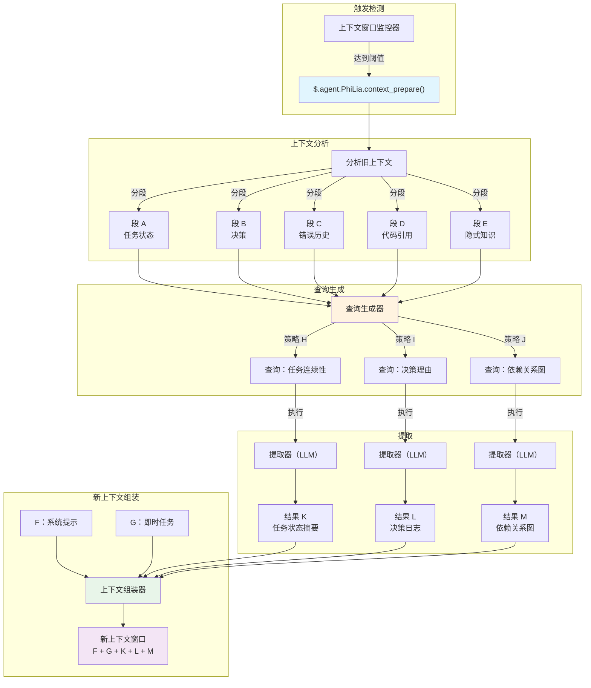
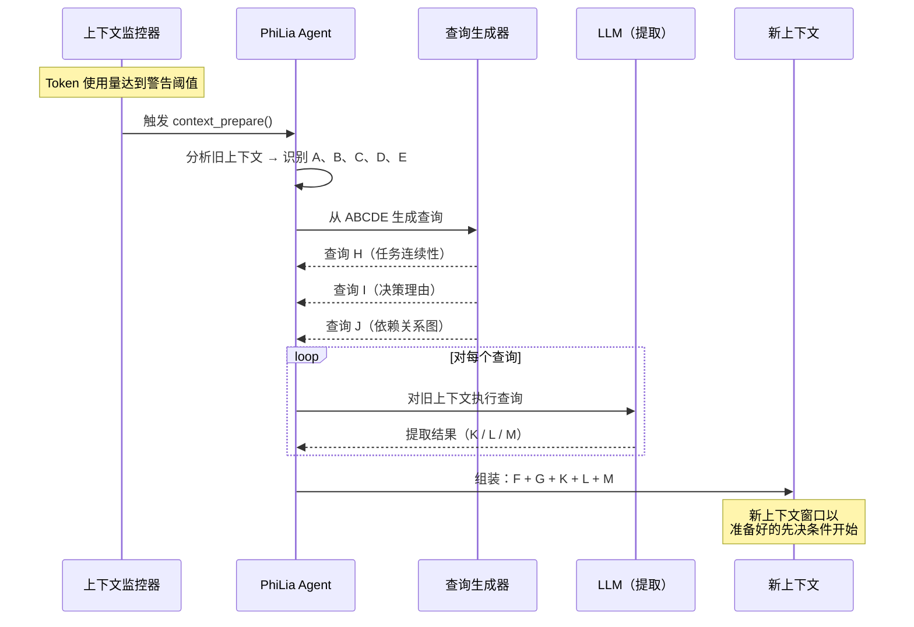

# 上下文准备机制

## 概述

上下文准备是一种主动提取机制，取代了传统的上下文压缩。它不是有损地压缩旧的对话历史，而是分析现有上下文、生成定向查询，并精确提取为新的上下文窗口播种所需的信息。该机制由 PhiLia agent 拥有，并通过 `$.agent.PhiLia.context_prepare()` 暴露。

## 问题陈述

### 上下文窗口限制

LLM agent 在有限的上下文窗口内运行。长时间运行的任务——多文件重构、跨越多条消息的调试会话或复杂的多步骤工作流——最终会耗尽可用的 token 预算。当这种情况发生时，系统必须决定保留什么和丢弃什么。

### 压缩丢失细节

传统的上下文压缩方法（摘要、截断、滑动窗口）本质上是**有损的**。压缩器不知道*下一个*上下文需要什么，因此它必须猜测。关键细节不可避免地会被丢弃：

- 变量名称及其当前值
- 中间决策及其理由
- 出现并部分解决的错误状态
- 任务之间的隐式依赖

根本缺陷：**压缩优化的是简洁性，而非相关性**。

### 跨任务干扰

当上下文窗口包含多个任务或主题时，压缩一个任务的历史通常会破坏另一个任务所需的信息。保留任务 A 状态的摘要可能掩盖任务 B 的关键错误链。不存在适用于所有可能的未来需求的通用压缩策略。

### 真正的问题

> 下一个上下文窗口需要从*当前*上下文中了解什么？

这不是一个压缩问题。这是一个**信息检索**问题——答案取决于接下来会发生什么，而不是之前发生了什么。

## 核心概念

### 主动提取 vs. 压缩

| 方面 | 压缩 | 上下文准备 |
| --- | --- | --- |
| 方向 | 过去 → 更短的过去 | 过去 → 未来就绪的提取物 |
| 对未来的了解 | 无 | 查询预见到未来的需求 |
| 信息损失 | 不可避免、无目标 | 定向、有意 |
| 类比 | 压缩文件 | 搜索数据库 |
| 质量上限 | 摘要质量 | 提取精度 |

上下文准备将旧上下文视为**数据源**——类似于 RAG 处理外部文档语料库的方式——但语料库是对话本身。它不是将一切压缩成摘要，而是对旧上下文提出定向问题并收集答案。

### ABCDE/KLM 模型

该机制使用基于字母的符号来描述信息流：

```text
旧上下文：    A + B + C + D + E
                    ↓ （分析）
查询：       ABCDE+H  ABCDE+I  ABCDE+J
                    ↓ （提取）
结果：             K        L        M
                    ↓ （组装）
新上下文：    F + G + K + L + M
```

- **A–E**：旧上下文的不同段/方面（任务状态、决策、错误历史、代码引用、隐式知识）
- **H、I、J**：从分析 A–E 的关键元素派生的查询策略。每种策略针对不同的信息需求
- **K、L、M**：提取结果——每个查询的精确答案
- **F、G**：新窗口的新系统提示和即时任务上下文
- **新上下文**接收 F + G（全新）+ K + L + M（提取），跳过完整的 A–E 历史

### 为什么这取代了压缩

一旦上下文准备存在，传统压缩就不再必要，因为：

1. **没有信息因猜测而丢失**——查询是基于新上下文实际需要什么生成的
1. **提取在结构上是确定性的**——相同的查询策略始终产生相同类别的答案
1. **多角度确保覆盖**——H/I/J 查询覆盖不同维度（任务状态、错误上下文、决策理由）
1. **旧上下文仍然可访问**——它没有被丢弃，而是在准备阶段*按需查询*

## 架构

### 高层次流程



### 时序图



## API 设计

### `$.agent.PhiLia.context_prepare()`

主入口点。当上下文窗口监控器检测到 token 使用量达到警告阈值时调用。

```typescript
interface ContextPrepareRequest {
    old_context: string;
    current_task: string;
    warning_threshold: number;
    current_usage: number;
    max_tokens: number;
}

interface ContextPrepareResult {
    segments: ContextSegment[];
    queries: GeneratedQuery[];
    extractions: ExtractionResult[];
    prepared_context: string;
    metadata: {
        old_context_tokens: number;
        prepared_context_tokens: number;
        compression_ratio: number;
        queries_executed: number;
        extraction_time_ms: number;
    };
}

// PhiLia API 端点
$.agent.PhiLia.context_prepare(request: ContextPrepareRequest): ContextPrepareResult
```

### `$.agent.PhiLia.context_query()`

用于对上下文执行单个查询的低级 API。由 `context_prepare()` 内部使用，但也可用于临时查询。

```typescript
interface ContextQueryRequest {
    context: string;
    query: string;
    strategy: "task_continuity" | "decision_rationale" | "dependency_map" | "custom";
    max_result_tokens: number;
}

interface ContextQueryResult {
    result: string;
    confidence: number;
    source_segments: string[];
    tokens_used: number;
}

$.agent.PhiLia.context_query(request: ContextQueryRequest): ContextQueryResult
```

### `$.agent.PhiLia.context_segment()`

分析上下文并将其分解为带标签的段（A–E）。

```typescript
interface SegmentRequest {
    context: string;
    max_segments: number;
}

interface Segment {
    id: string;           // "A", "B", "C", 等等
    label: string;        // "任务状态", "决策", 等等
    content: string;
    token_count: number;
    importance_rank: number;
}

$.agent.PhiLia.context_segment(request: SegmentRequest): Segment[]
```

## 查询策略

### H/I/J 查询如何生成

查询生成过程接受分段后的旧上下文（A–E）并产生三类查询，每类针对新上下文所需信息的不同维度。

### 策略 H：任务连续性

**目的**：确保新上下文可以在不丢失进度的情况下恢复当前任务。

**生成逻辑**：

1. 从段 A 和 E（任务状态 + 隐式知识）识别活动任务
1. 提取当前进度指示器（什么已完成、什么在进行中、什么被阻塞）
1. 生成询问的查询：*"所有活动任务的当前状态是什么，以及下一步是什么？"*

**示例查询**：

```text
根据对话历史，识别：
1. 所有当前进行中的任务及其完成状态
2. 任何阻塞或未解决的错误
3. 即将要采取的精确下一步
4. 当前正在修改的文件路径和行号
```

### 策略 I：决策理由

**目的**：保留决策背后的*原因*，而不仅仅是*结果*。

**生成逻辑**：

1. 扫描段 B 和 C（决策 + 错误历史）寻找选择点
1. 识别考虑和拒绝替代方案的决策
1. 生成询问的查询：*"做出了哪些决策，拒绝了哪些替代方案，以及为什么？"*

**示例查询**：

```text
从此对话中提取：
1. 所有做出的架构或实现决策
2. 对于每个决策：考虑了哪些替代方案
3. 对于每个决策：所选方法被偏好的具体原因
4. 影响这些选择的任何约束或需求
```

### 策略 J：依赖关系图

**目的**：捕获代码元素、文件和概念之间的关系。

**生成逻辑**：

1. 扫描段 D 和 E（代码引用 + 隐式知识）寻找实体关系
1. 映射哪些文件依赖哪些、哪些函数调用哪些、哪些概念相关
1. 生成询问的查询：*"所讨论实体之间的关键依赖和关系是什么？"*

**示例查询**：

```text
分析对话并映射：
1. 所有提到的文件/模块及其关系
2. 讨论或修改的函数调用链
3. 组件之间的数据流
4. 配置值及其使用位置
5. 未直接陈述但由工作隐含的任何隐式依赖
```

### 可扩展性

三种策略（H、I、J）是默认集。系统支持自定义策略：

```typescript
interface QueryStrategy {
    id: string;
    name: string;
    description: string;
    source_segments: string[];     // 要分析的段
    query_template: string;        // 带有 {segment_X} 占位符的模板
    priority: number;              // 执行优先级
    max_result_tokens: number;
}
```

可以通过配置注册新策略，允许特定领域的提取模式。

## 集成点

### 上下文窗口监控器

上下文准备的触发器位于上下文窗口监控子系统中。当 token 使用量超过警告阈值（默认：最大值的 80%）时，监控器调用 `$.agent.PhiLia.context_prepare()`。

```rust
// 在上下文窗口监控器中（概念）
fn check_context_health(&mut self) {
    let usage_ratio = self.current_tokens as f64 / self.max_tokens as f64;
    if usage_ratio >= self.warning_threshold {
        let result = philia.context_prepare(ContextPrepareRequest {
            old_context: self.get_full_context(),
            current_task: self.get_current_task_description(),
            warning_threshold: self.warning_threshold,
            current_usage: self.current_tokens,
            max_tokens: self.max_tokens,
        });
        self.spawn_new_context(result.prepared_context);
    }
}
```

### skill_chain.rs 集成

技能链执行器必须感知上下文准备。当技能链跨越多个上下文窗口时，准备机制确保：

1. 技能链状态在段 A（任务状态）中捕获
1. 当前技能的输入/输出在段 D（代码引用）中捕获
1. 链的剩余步骤在提取结果 K（任务连续性）中保留

```rust
// skill_chain.rs（概念集成）
impl SkillChainExecutor {
    fn execute_step(&mut self, step: ChainStep) -> Result<StepResult> {
        // 执行前，检查是否需要上下文准备
        if self.context_monitor.should_prepare() {
            let prepared = self.philia.context_prepare(
                self.build_prepare_request()
            )?;
            self.context = prepared.prepared_context;
        }
        // 继续步骤执行
        self.execute_with_context(step, &self.context)
    }
}
```

### PhiLia Agent 所有权

上下文准备是 PhiLia 拥有的能力。这意味着：

- `$.agent.PhiLia.context_prepare()` API 注册为 PhiLia 技能
- PhiLia 管理查询生成模板和提取策略
- 其他 agent 通过标准技能调用协议请求 PhiLia 进行上下文准备
- PhiLia 可以利用其知识存储以历史模式丰富查询

### 上下文生成

当系统生成新的上下文窗口时，准备好的上下文（F + G + K + L + M）取代传统的压缩摘要：

```rust
fn spawn_new_context(&mut self, prepared: ContextPrepareResult) {
    let system_prompt = self.build_system_prompt();      // F
    let immediate_task = self.get_current_task();         // G
    let new_context = format!(
        "{}\n\n{}\n\n---\n## 上下文准备结果\n### 任务状态\n{}\n### 决策日志\n{}\n### 依赖\n{}\n",
        system_prompt,    // F
        immediate_task,   // G
        prepared.extractions[0].result,  // K
        prepared.extractions[1].result,  // L
        prepared.extractions[2].result,  // M
    );
    self.launch_context(new_context);
}
```

## 实现阶段

### 阶段 1：基础（MVP）

- 实现 `$.agent.PhiLia.context_segment()`——上下文分析和分段
- 实现三种默认查询策略（H：任务连续性，I：决策理由，J：依赖关系图）
- 实现 `$.agent.PhiLia.context_prepare()`——分段 → 查询 → 提取 → 组装的编排
- 与上下文窗口监控器触发器集成
- 使用单任务对话验证

### 阶段 2：健壮性

- 向提取结果添加置信度评分
- 当提取置信度低时实现回退策略
- 为大型上下文添加流式支持
- 性能优化：并行查询执行
- 添加 `$.agent.PhiLia.context_query()` 用于临时查询

### 阶段 3：智能

- 从历史准备结果中学习最佳查询策略
- 基于任务类型的自适应段权重
- 跨上下文引用解析（链接多个生成的准备结果）
- 与内存沉淀集成以实现长期保留

### 阶段 4：完全替代

- 移除遗留上下文压缩代码路径
- 上下文准备成为上下文转换的唯一机制
- 完整的遥测和质量指标
- 自定义 agent 的文档和迁移指南

## 示例

### 示例 1：多文件重构

**场景**：一个 agent 正在重构一个 Rust crate，修改 3 个模块中的 15 个文件。修改文件 10 后上下文窗口填满。

**旧上下文（A–E）**：

- **A**（任务状态）：已修改 10/15 文件，模块 `auth` 和 `storage` 完成，`api` 进行中
- **B**（决策）：选择基于 trait 的抽象而非枚举分发；通过 `#[deprecated]` 保持向后兼容
- **C**（错误）：在 `storage/mod.rs:142` 遇到生命周期问题，通过 `Arc<Mutex<>>` 解决
- **D**（代码引用）：`auth/traits.rs`、`storage/mod.rs:142`、`api/handler.rs:38-56`
- **E**（隐式）：`User` 结构体必须保持 `Clone` 以供下游 crate 使用；追踪测试覆盖率

**生成的查询**：

- **H**（任务连续性）："还有哪些文件需要修改，正在应用的模式是什么，下一个要重构的文件是什么？"
- **I**（决策理由）："为什么选择基于 trait 的抽象而非枚举分发，存在哪些向后兼容约束？"
- **J**（依赖关系图）："映射 `auth`、`storage` 和 `api` 模块之间的依赖关系，注意哪些结构体/trait 跨越模块边界。"

**提取结果（K、L、M）** 与新的系统提示（F）和下一个任务指令（G）一起组装。

### 示例 2：调试会话

**场景**：调试一个跨多个假设和测试尝试的 WebSocket 连接问题。

**旧上下文（A–E）**：

- **A**（任务状态）：问题缩小到握手阶段；心跳不是原因
- **B**（决策）：排除了 TLS 配置错误；排除了代理干扰；当前假设是头部顺序
- **C**（错误）：在 3 秒标记处出现 `ConnectionReset`，用 curl 可以一致复现但浏览器不行
- **D**（代码引用）：`ws/handshake.rs:67-89`、`headers/mod.rs:23`、测试文件 `tests/ws_test.rs`
- **E**（隐式）：服务器位于 nginx 之后；问题仅在生产环境出现，本地开发没有

**生成的查询** 将调试状态、被拒绝的假设和剩余调查路径提取到新上下文中。

### 示例 3：跨 Agent 技能链

**场景**：PhiLia 将任务链委派给 Skemma（模式设计），然后委派给 Logos（文档编制）。在 Logos 的工作期间上下文填满。

**旧上下文（A–E）**：

- **A**（任务状态）：模式设计完成，文档完成 60%
- **B**（决策）：模式根据 PhiLia 的架构指导使用连接表处理 M:N 关系
- **C**（错误）：Skemma 报告了 `user_roles` 基数的歧义，通过添加 `UNIQUE` 约束解决
- **D**（代码引用）：`schema.sql:45-67`、`docs/api/endpoints.md:12-34`
- **E**（隐式）：文档必须匹配项目中其他地方使用的 OpenAPI 3.0 规范格式

准备确保 Logos 的新上下文接收到模式决策和文档格式约束，而无需完整的 Skemma 设计对话。
