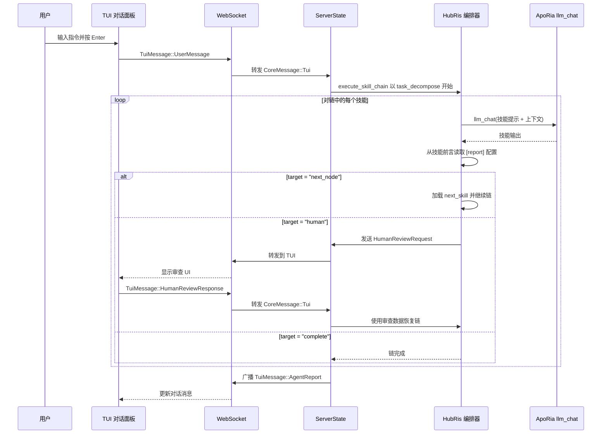

# 对话编排设计（HubRis + ApoRia）

## 背景

HubRis 是一个"纯技能 Agent"——所有能力都是通过 ApoRia `llm_chat` 调用的纯提示技能。在实现报告路由层之后，技能通过 `[report]` 章节在 TOML 前言中声明其路由行为，取代了硬编码的编排逻辑。

## 目标

1. 技能在前言中声明路由行为（而非硬编码）。
1. 一个通用的技能链执行器取代硬编码的 2-阶段管道。
1. 人类审查是一等路由目标。
1. 提示语言清理：技能/MCP 平面文件仅限英语。

## 技能报告配置（TOML 前言）

```toml
[report]
target = "next_node"              # "next_node" | "parent" | "human" | "complete"
next_skill = "workplan_generate"  # 若 target = "next_node" 则必填
```

## HubRis 技能链

```text
task_decompose → workplan_generate → operator → workplan_execute → submit_report → human
```

## 端到端流程



## 报告路由目标

| 目标         | 行为                                                              |
| --- | --- |
| `next_node`  | 执行器加载在 `next_skill` 中命名的技能并运行。                    |
| `parent`     | 将控制权返回给父编排器（保留用于嵌套链）。                        |
| `human`      | 暂停链，向 TUI 发送 `HumanReviewRequest`，收到 `HumanReviewResponse` 后恢复。 |
| `complete`   | 终止链并返回累积的 `AgentReport`。                                |

## 文件结构（阶段 1）

```text
res/prompts/agents/hubris/skills/
  task_decompose.md
  workplan_generate.md
  operator.md
  workplan_execute.md
  submit_report.md
```

每个文件是一个平面 Markdown 文档，仅限英语，带有包含 `[report]` 章节和任何其他技能元数据的 TOML 前言。

## 人类语言配置

Agent 运行时配置包含使用原生语言名称的 `human_language` 字段（例如 `"中文"`、`"English"`、`"日本語"`）。这控制所有面向用户输出的语言，而不影响仅限英语的技能提示文件。

## 默认模型策略

启动时使用 `glm-4.7-flash` 作为标准化环境默认模型。ApoRia `llm_chat` 默认使用该模型以保持开发和测试成本低廉。

## 失败回退策略

1. 如果技能失败：返回失败消息并结束当前链。
1. 如果 ApoRia 离线：返回 `Agent 未就绪` 消息。
1. 如果人类审查超时：返回超时通知而不阻塞后续聊天。
