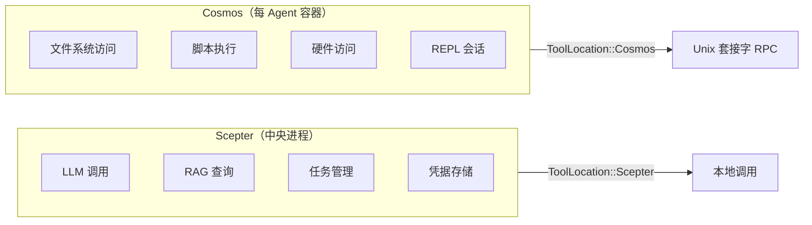
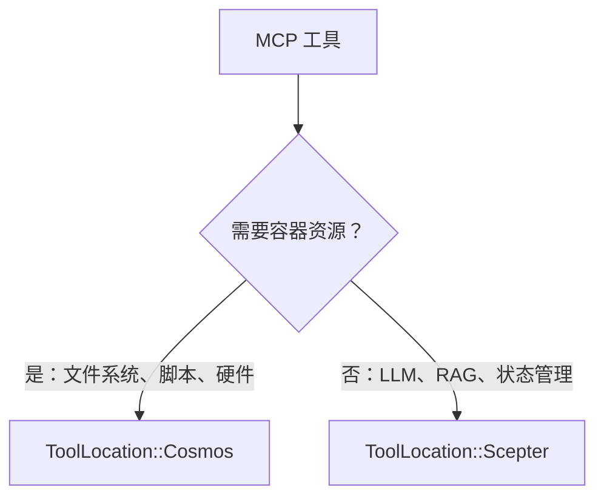
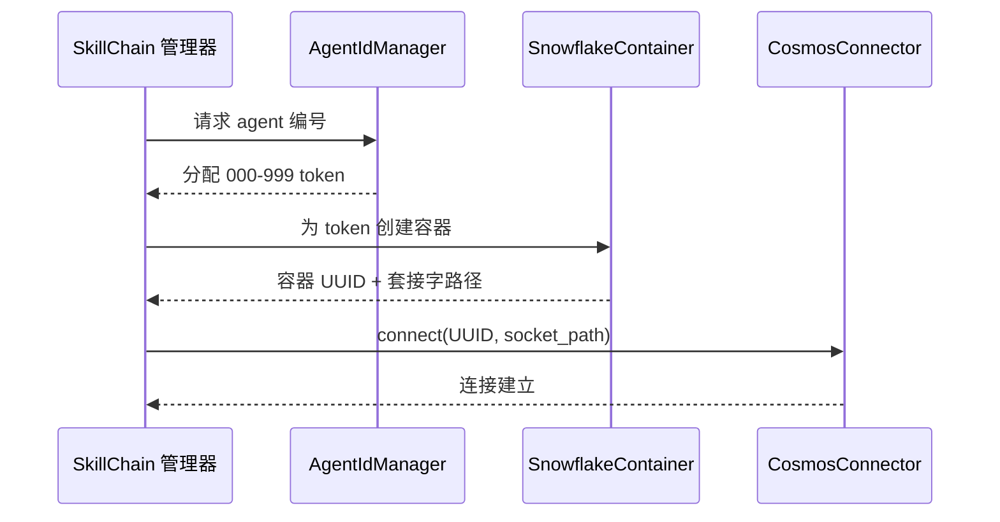
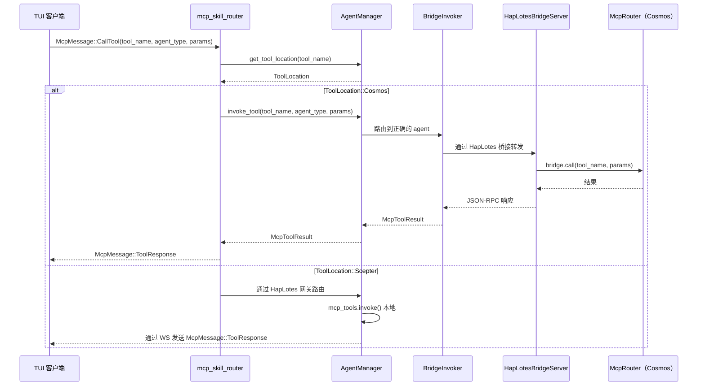
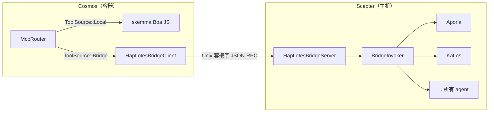
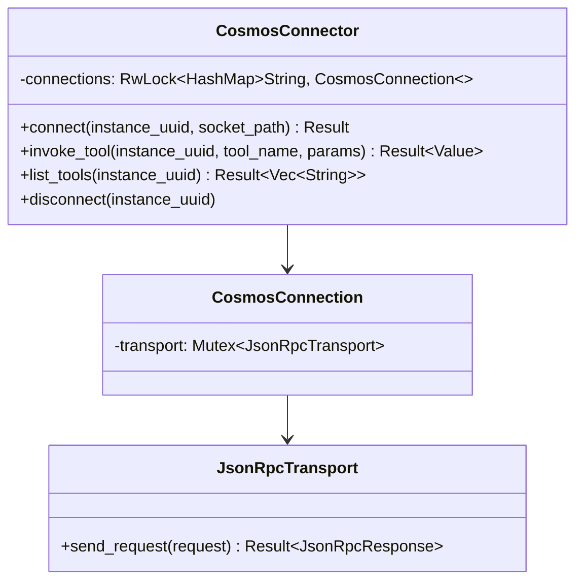
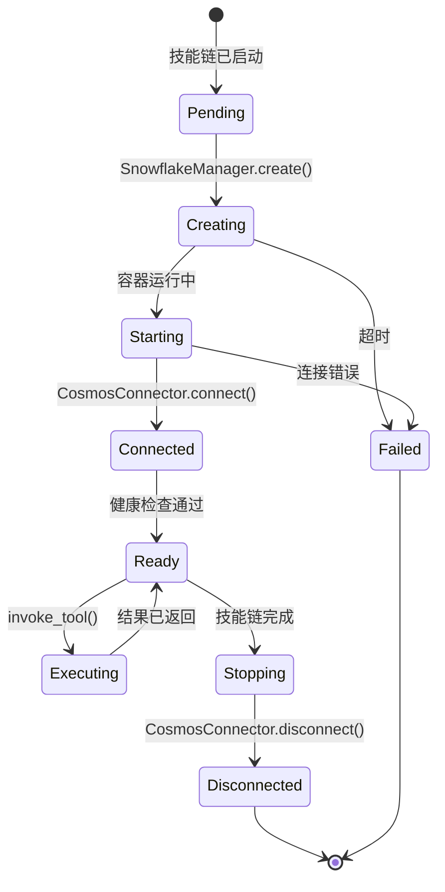
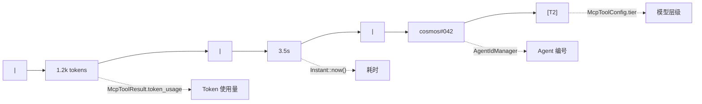
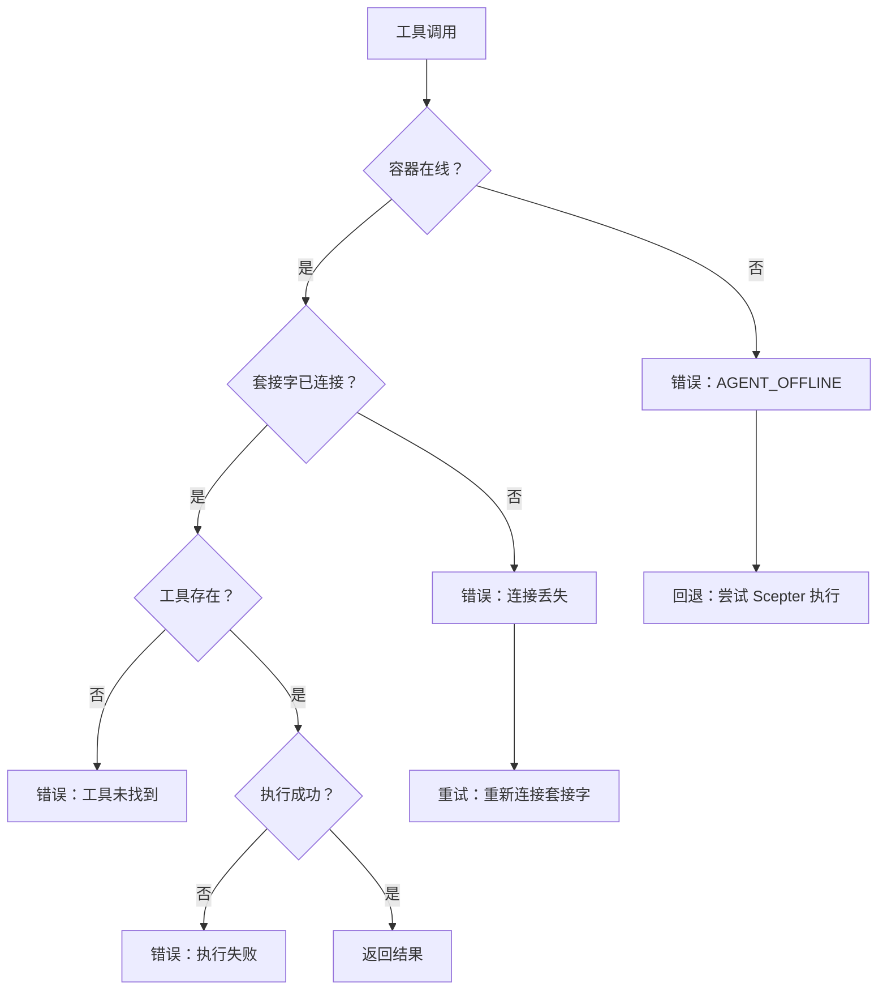

# Cosmos 容器调度与 Token 路由设计

## 概述

本文档描述了 Cosmos 容器调度架构：标记为 `ToolLocation::Cosmos` 的 MCP 工具如何通过 unix-socket JSON-RPC 路由到其对应容器，以及 token（agent 编号）系统如何与容器身份和路由关联。

## I. 工具位置模型

### 双执行环境



### ToolLocation 枚举

| 变体 | 执行位置 | 传输方式 |
| --- | --- | --- |
| `Scepter`（默认） | 进程内通过 `McpToolInvoker` | 直接函数调用 |
| `Cosmos` | 容器内通过 `CosmosConnector` | Unix 套接字 JSON-RPC |

### 位置决策标准



需要容器资源（文件系统、脚本执行、硬件访问）的工具标记为 `Cosmos`。集中式服务（LLM、RAG、任务管理、人类交互）保持为 `Scepter`。

## II. Token 系统与容器身份

### Agent 编号分配



### Token 属性

| 属性 | 描述 |
| --- | --- |
| 格式 | 三位数字：`000`-`999` |
| 分配器 | 技能链中的 `AgentIdManager` |
| 绑定 | 每个技能链面板一个 token |
| 显示 | 在 TUI 统计行中显示为 `cosmos#NNN` |
| 持久性 | 在 agent 重启后持续存在 |

## III. 请求路由流程

### TUI 发起的 MCP 调用



### 关键路由逻辑

路由决策在 `mcp_skill_router.rs` 中发生：

1. 检查 `agent_manager.get_tool_location(tool_name)`
1. 如果 `ToolLocation::Cosmos` 且容器化模式激活：

   - 调用 `agent_manager.invoke_tool()`，通过 `BridgeInvoker` → HapLotes 桥接 → Cosmos 的 `McpRouter` 路由
   - Cosmos 的 `McpRouter` 在本地调度（skemma）或通过桥接回到 Scepter 调度远程 agent
   - 直接向 TUI 返回 `McpMessage::ToolResponse`

1. 否则：通过 HapLotes 网关路由到 agent 进程

## IV. CosmosConnector / 桥接架构

### HapLotes 桥接（当前）

HapLotes 桥接是 Scepter 和 Cosmos 容器之间的**唯一通信通道**。



### 连接池（CosmosConnector——Scepter 侧）



### JSON-RPC 协议

所有方法名称使用 `UnixMethod` 枚举以确保编译时类型安全：

| UnixMethod 变体 | 方向 | 参数 |
| --- | --- | --- |
| `UnixMethod::McpCall` | Scepter → Cosmos | `{ tool_name, parameters }` |
| `UnixMethod::McpListTools` | Scepter → Cosmos | 无 |
| `UnixMethod::ReplSnapshot` | Scepter → Cosmos | `{ path }` |
| `UnixMethod::ReplRestore` | Scepter → Cosmos | `{ path }` |
| `UnixMethod::BridgeCall` | Cosmos → Scepter | `{ tool_name, parameters }` |
| `UnixMethod::BridgeListTools` | Cosmos → Scepter | 无 |

### 响应格式

```json
{
  "success": true,
  "data": { ... },
  "error": null
}
```

## V. 容器生命周期



### 容器 Agent

在 Cosmos 容器内部，仅 skemma 在本地运行（Boa JS 引擎）。所有其他 agent 工具通过 HapLotes 桥接路由回 Scepter：

| Agent | 角色 | 在 Cosmos 中？ |
| --- | --- | --- |
| SkeMma | 脚本执行（Boa JS） | **本地**（进程内） |
| Aporia | LLM 聊天 | 通过桥接 → Scepter |
| KaLos | 文件 I/O | 通过桥接 → Scepter |
| NeiKos | 容器管理 | 通过桥接 → Scepter |
| EleOs | Web 搜索 | 通过桥接 → Scepter |
| 所有其他 | 各种 | 通过桥接 → Scepter |

## VI. 统计行集成

### 显示格式

在 TUI `AgentDetailPage` 中，统计行显示：



| 段 | 来源 |
| --- | --- |
| `1.2k tokens` | `McpToolResult.token_usage` |
| `3.5s` | 从 `Instant::now()` 计算的耗时 |
| `cosmos#042` | 来自 `AgentIdManager` 的 Agent 编号 |
| `[T2]` | 来自 `McpToolConfig.tier` 的模型层级 |

## VII. 错误处理

### 故障模式



### 优雅降级

当容器不可用时，如果工具注册了本地实现，系统可以选择性地回退到 `Scepter` 本地执行。

## VIII. 未来扩展

| 功能 | 描述 | 优先级 |
| --- | --- | --- |
| 容器池化 | 跨技能链重用容器 | 中 |
| 健康监控 | 定期容器健康检查 | 高 |
| 资源限制 | 每容器的 CPU/内存限制 | 高 |
| 多容器工具 | 跨多个容器的工具 | 低 |
| 容器迁移 | 在主机之间移动运行中的容器 | 低 |
