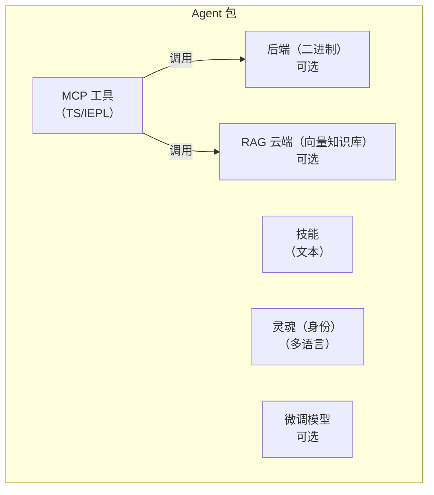

# Layer 2/3 Agent 包规范

> **状态**：草案 v1 — 2026-06-26
> **范围**：定义 Layer 2 和 Layer 3 Agent 的自包含包格式。

## 概述

一个 Layer 2/3 Agent 是一个**自包含包**，由最多五个组件组成。包是分发的基本单位——可以独立安装、更新和移除。



## 五个组件

### 1. MCP 工具（IEPL TypeScript）

主要的工具接口。以 TypeScript 源码形式编写，运行于 IEPL 沙箱（Boa JS 运行时）中。每个工具文件导出一个函数：

```typescript
// mcp/memory_store.ts
import type { McpResult } from '@entecheia/sdk';

export async function memory_store(params: {
  text: string;
  node_type: string;
  entity_type?: string;
  properties?: Record<string, string>;
}): Promise<McpResult> {
  // 工具逻辑——可调用后端原语、组合其他工具、
  // 或向云服务发起 HTTP 请求。
  const result = await backend.memory_store(params);
  return { ok: true, data: result };
}
```

工具可分为：

- **纯 TS**：仅逻辑，组合其他工具或转换数据
- **后端支持**：调用 MCP 后端提供的原语
- **云端支持**：调用远程 API（RAG、模型、外部服务）

TypeScript 源码是纯文本——可以版本控制、审查和分发，无需编译。自助式打包工具可以选择将多个 `.ts` 文件打包为单个 `bundle.js` 以提高加载效率。

### 2. MCP 后端（可选二进制）

某些工具需要超出 IEPL 沙箱能力的功能（文件 I/O、硬件访问、数据库连接）。这些由**二进制后端**提供——一个与 scepter 进程并行运行的 Rust 二进制。

- 后端被编译进 Docker 镜像，并携带在 scepter 的"口袋"（`/workspace-base/target/` 目录）中。
- 运行时，scepter 通过 `backend` 模块导入将二进制路径动态传递给 IEPL 环境。
- 后端暴露原语操作；所有组合和编排在 TS 层完成。

后端接口示例（从 Rust 自动生成）：

```typescript
// 从 Rust 后端自动生成
declare module 'backend' {
  export function memory_store_raw(params: {...}): Promise<McpResult>;
  export function memory_query_raw(query: string): Promise<McpResult>;
}
```

### 3. 技能（纯文本）

技能提示词是带有 TOML 前言的 Markdown 文件。它们定义了 Agent **如何**执行任务——系统提示词、工具白名单、执行模式和流水线结构。

```markdown
+++
name = "memory_consolidate"
agent = "philia"
related_tools = ["memory_consolidate", "memory_query"]
location = "scepter"
execution_mode = "read"

[features]
tier = "worker"
+++

# memory_consolidate

将记忆节点整合为一个 Episode，以便进行结构化回忆……
```

技能是语言无关的（`#` 正文是提示词模板）。它们是完全的纯文本——无需编译，无需二进制。

### 4. RAG 数据库（可选，云端托管）

为 Agent 提供领域特定知识的向量知识库，托管于 Entelecheia 的云基础设施上。

- 可选：Agent 无需 RAG 也能运行（能力降级）。
- 查询受限：当配额耗尽时，查询返回空——Agent 优雅降级。
- 通过 manifest 中的 URL + API 密钥引用，不打包在包内。

### 5. 微调模型（可选，云端托管）

为 Agent 特定领域微调的模型，同样托管于云端。

- 可选：Agent 默认使用平台的通用模型（如 GLM-5）。
- 未来可能开源权重以支持自托管。
- 通过 manifest 中的模型 ID 引用。

## 包目录结构

```text
packages/agents/{agent_name}/
├── manifest.toml           # 包元数据和配置
├── mcp/
│   ├── *.ts                # TypeScript 工具实现（IEPL）
│   └── *.md                # 工具文档（参数、返回值）
├── backend/                # 可选 Rust 后端
│   ├── Cargo.toml
│   └── src/
│       └── lib.rs
├── skills/
│   └── *.md                # 技能提示词
├── soul/
│   └── {lang}.md           # 按语言的 Agent 人格
├── rag.toml                # 可选：RAG 数据库引用
└── model.toml              # 可选：微调模型引用
```

## manifest.toml 格式

```toml
[package]
name = "philia"              # 必须与目录名一致
version = "0.2.0"
description = "认知记忆系统——存储、查询、整合"
layer = 2                    # 2 = 平台 Agent，3 = 扩展
category = "complex_tool"    # simple_tool | complex_tool | coordinator

[dependencies]
# 此 Agent 调用的其他 Agent 包
aporia = "0.2.0"

[backend]
# 纯 TS Agent 可完全省略
type = "rust"
binary = "philia"            # 位于 /workspace-base/target/debug/ 中的二进制名称
provides = [                 # 向 TS 层暴露的原语
  "memory_store_raw",
  "memory_query_raw",
  "memory_consolidate_raw",
]

[rag]
# 不使用云端 RAG 可省略
provider = "entelecheia-cloud"
database_id = "philia-knowledge-v1"
endpoint = "https://rag.entelecheia.ai/v1"

[model]
# 使用默认平台模型可省略
provider = "entelecheia-cloud"
model_id = "philia-ft-v1"
endpoint = "https://model.entelecheia.ai/v1"
```

## TS SDK（`@entecheia/sdk`）

SDK 为工具作者提供类型和工具：

```typescript
// @entecheia/sdk — 类型
export interface McpResult {
  ok: boolean;
  data?: unknown;
  error?: string;
}

export interface McpToolParams {
  [key: string]: unknown;
}

// @entecheia/sdk — 工具
export function rag_search(query: string): string;        // RAG 搜索（同步，缓存）
export function llm_chat(prompt: string): Promise<string>; // LLM 调用
export function vars_get(key: string): unknown;           // 跨技能状态
export function vars_set(key: string, value: unknown): void;
```

`backend` 模块根据 manifest 中的 `[backend].provides` 列表按 Agent 自动生成。它提供了围绕二进制原语的类型化包装。

## 层级架构

| 层级 | Agent | 分发方式 | 包？ | 容器？ |
| --- | --- | --- | --- | --- |
| L1 | SkeMma, HapLotes, HubRis, KaLos, NeiKos, ApoRia, EleOs, EpieiKeia, OreXis, PhiLia, PoleMos, SkoPeo | 内置在镜像中 | 仅后端（Rust crates） | 否（进程内） |
| L2 | ClassicSoftwareEngineering, WebAutomation, WebUiPanel, IndustrialIoT | 内置在镜像中 | **完整包**（TS + 技能 + 灵魂） | 是（e-skemma） |
| L3 | 用户安装的扩展 | 动态安装 | **完整包** | 是（e-skemma） |

- **Layer 1**（12个 Agent）：核心平台 Agent。它们的 Rust crates 提供原语操作（文件 I/O、记忆、容器、硬件等）。它们**不是**包——它们**就是**平台。它们的工具以可导入模块形式暴露（如 `import { file_write } from 'kalos'`）。
- **Layer 2**（4个 Agent）：第一批真正的包。它们**没有二进制后端**——它们是 Layer 1 原语的纯 TS/IEPL 组合。它们随镜像分发，作为包格式的示例。
- **Layer 3**：用户安装的包。格式与 L2 相同，但动态加载。可以可选地声明一个二进制后端（由用户编译，通过 scepter 注入）。

## 迁移路径

现有的 Rust Agent crates（`packages/agents/*/src/`）转变为**后端**。它们的 MCP 工具文档（`res/prompts/agents/*/mcp/*.md`）移入包内。技能提示词（`res/prompts/agents/*/skills/*.md`）移入包内。灵魂文件（`res/prompts/soul/`）移入包内。

旧的 `shared/plugin_host`（基于 wasm）被 `shared/iepl` 中已有的 IEPL TS 运行时取代。无需 wasm 编译。
