# 命名空间架构：`vars`、`refs`、`env`

> **注（2026-06）**：LLM 可见的工具面已从 5 个原语缩减为 3 个。`ref_add` 和 `ref_remove` **不再暴露给 LLM**——`agent_allowed_tools()` 仅返回 `exec`、`write_to_var`、`write_to_var_json`。`__refs` 命名空间仍然作为内部数据结构存在（快照/恢复、Prompt 注入），但不再由模型直接修改。以下描述 `ref_add`/`ref_remove` 派发的章节记录下来的是残留的内部管道，而非 LLM 工具面。

## 概述

Entelecheia 在 IEPL JavaScript 运行时（`globalThis.$`）中提供了三个共享命名空间，作为跨技能、跨 Agent 的通信基底。这些命名空间在 **Cosmos 运行时层**运行，意味着所有 Agent 和技能在单个 Session 内透明地共享它们。

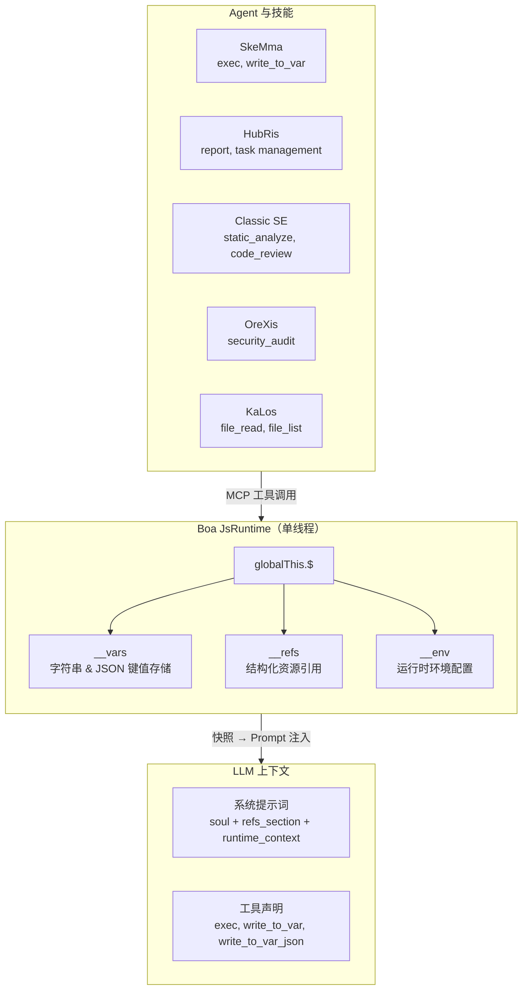

### 设计原则

| 原则 | 描述 |
| --- | --- |
| **单一事实来源** | 每个命名空间有且仅有一个模块（`var_namespace.rs`、`ref_namespace.rs`、`namespace.rs`）生成引用该命名空间的**所有** JS 代码字符串 |
| **惰性初始化** | `__vars` 和 `__refs` 在 `JsRuntime::new()` 时初始化一次，跨技能链持续存活；`__env` 在命名空间 JS 求值时初始化 |
| **快照/恢复** | 完整的 `__vars` + `__refs` 状态可快照和恢复，支持 Session 持久化 |
| **Prompt 注入** | 快照数据驱动上下文丰富的系统提示词——LLM 看到可用的变量名、引用摘要和环境设置 |
| **工具访问控制** | 所有 3 个 cosmos 内部工具（`exec`、`write_to_var`、`write_to_var_json`）通过 `agent_allowed_tools()` 授予每个 Agent；各自的技能 SOP 定义使用哪些 |

---

## 命名空间对比

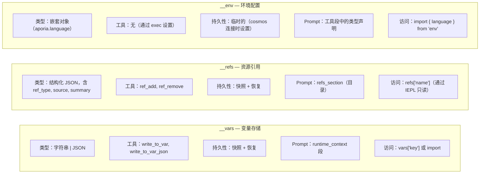

---

## 1. `__vars` — 变量存储（`vars`）

### 1.1 目的

`__vars` 是技能链内的**主要跨步骤通信机制**。技能使用 `write_to_var` / `write_to_var_json` 持久化计算结果，后续步骤（或技能）在 `exec` 块中从 `__vars` 读取。

### 1.2 模块架构

所有 `__vars` JS 代码生成集中在 `packages/shared/core/src/var_namespace.rs`。

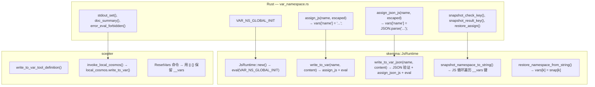

### 1.3 初始化序列

```text
JsRuntime::new()
  → context.eval("globalThis.$ = globalThis.$ || {}; globalThis.__vars = {}; globalThis.__refs = {};")
  → __vars 初始化为空对象
```

初始化在 `build_namespace_js()`（设置 `__env` 和 `$.variant`）**之前**运行，确保命名空间模块加载时 `__vars` 始终可用。

> **注：** `__refs` 与 `__vars` 一起通过 `VAR_NS_GLOBAL_INIT`（定义在 `var_namespace.rs` 中）初始化。`ref_namespace.rs` 中的独立 `REF_NS_GLOBAL_INIT` 仅为对称性存在，从未被直接调用——实际初始化发生在 `JsRuntime::new()` 中。

### 1.4 操作

| 操作 | 工具名称 | 类型 | 行为 |
| --- | --- | --- | --- |
| 存储字符串 | `write_to_var` | 阻塞 | 转义 JS 内容，执行 `vars['name'] = 'content'` |
| 存储 JSON | `write_to_var_json` | 阻塞 | 验证 JSON，执行 `vars['name'] = JSON.parse('content')` |
| 在 exec 中读取 | `exec` | FireAndForget | 直接访问：`vars['name']` 或 `import vars from 'vars'` |
| 快照 | （内部） | — | 捕获所有 `__vars` 键为 `{"$vars": {...}}` |
| 恢复 | （内部） | — | 为每个键设置 `vars[k] = snap['$vars'][k]` |
| 重置 | （内部） | — | `__vars = __vars \|\| {}` — 保留已有值，确保结构 |

### 1.5 Prompt 注入

在 `build_runtime_context()`（`prompt.rs:472`）中，变量存储作为以下形式出现在系统提示词中：

```text
## JS 运行时上下文

__vars（来自 write_to_var / write_to_var_json，共 N 个）：
  `var_1`, `var_2`, `var_3`, ...（最多显示 30 个）
  导入方式：`import vars from 'vars';`  访问方式：`vars['key']`
```

### 1.6 输出显示

- 字符串存储：`vars['name'] 已设置：\n{前 200 个字符 / 5 行}...（共 total_chars 字符）`
- JSON 存储：`vars['name'] 已设置（已解析的 JSON）：包含 3 个键的对象`
- 解析失败：错误及内容预览（前 200 字符）

### 1.7 `vars` 合成模块

与 `env` 类似，`vars` 模块是一个 Boa 合成模块，包装 `__vars` 以便便利导入：

```python
import vars from 'vars';
// vars === __vars（实时引用）
const report = vars['analysis_results'];
```

**实现：** `packages/agents/skemma/src/js_runtime/module_loader.rs` 第 142-156 行。该模块使用 `Module::synthetic()` 和一个返回 `globalThis.__vars` 直接引用的闭包（实时引用，而非快照）。这意味着通过 `vars['key'] = value` 的修改等同于直接修改。

---

## 2. `__refs` — 资源引用（`refs`）

### 2.1 目的

`__refs` 提供**结构化的跨 Agent 资源传递**。不同于 `__vars`（原始字符串），refs 携带类型化元数据（`ref_type`、`source`、`summary`）以及可选负载。Agent 可以：

- **发布**对文件、图像或其自身输出的引用
- 在系统提示词中按名称/类型**发现**引用
- 在 IEPL exec 块中通过 `refs['name']`**访问**引用内容

### 2.2 模块架构

所有 `__refs` JS 代码生成集中在 `packages/shared/core/src/ref_namespace.rs`。

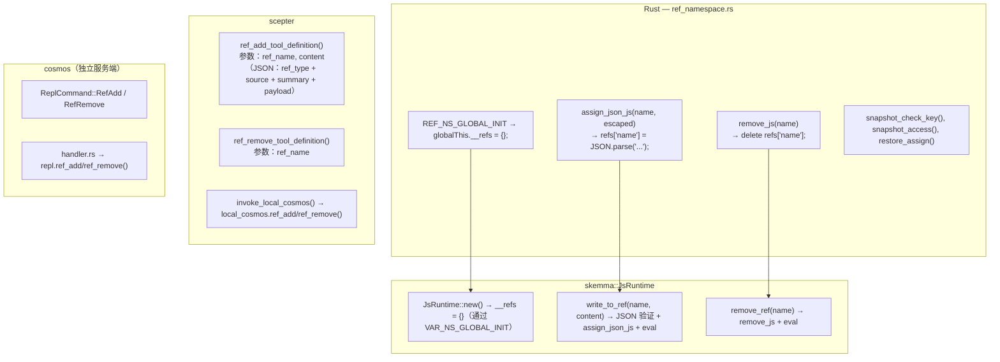

### 2.3 RefItem 结构

```typescript
// TypeScript 类型定义（来自 iepl-api.d.ts）
type RefType = "code" | "image" | "agent_output";

// 用于系统提示词和 runtime_context 的名称列表
type RefItemSummary = {
  name: string;
  ref_type: RefType;
  source: string;
  summary: string;
};

interface RefItem {
  name: string;        // 例如 "code:src/main.rs", "image:diagram", "agent:orexis/audit-1"
  ref_type: RefType;   // 用于排序/过滤的类别
  source: string;      // 提供者（"user", Agent 名称, 工具名称）
  summary: string;     // 用于 Prompt 显示的单行描述
  files?: RefCodeFile[];   // 用于 "code" refs
  images?: RefImage[];     // 用于 "image" refs
  output?: RefAgentOutput; // 用于 "agent_output" refs
}

interface RefCodeFile {
  path: string;
  language: string;
  content: string;
  selection?: { start_line: number; end_line: number; content: string };
}

interface RefImage {
  mime: string;          // 例如 "image/png"
  data: string;          // base64 编码或 data URL
  description?: string;
}

interface RefAgentOutput {
  source_agent: string;  // Agent 名称
  source_tool: string;   // 产生此输出的工具
  content: Record<string, unknown>;
}
```

### 2.4 操作

| 操作 | 工具名称 | 类型 | 行为 |
| --- | --- | --- | --- |
| 添加引用 | `ref_add` | 阻塞 | 验证 JSON，执行 `refs['name'] = JSON.parse('...')` |
| 移除引用 | `ref_remove` | FireAndForget | 执行 `delete refs['name']` |
| 在 exec 中读取 | （通过 `exec`） | — | `refs['name'].files[0].content` |
| 快照 | （内部） | — | 捕获所有 `__refs` 键为 `{"$refs": {...}}` |
| 恢复 | （内部） | — | 为每个键设置 `refs[k] = snap['$refs'][k]` |

### 2.5 Prompt 注入

Refs 在系统提示词中的**两个**位置出现：

#### 位置 1：`refs_section`（专属目录）

```text
## 已引用的资源（refs）

以下资源可通过 `refs['name']` 访问。
- `code:src/main.rs` [code] 来自 user — 主 Rust 文件
- `image:architecture` [image] 来自 user — 系统架构图
- `agent:orexis/audit-1` [agent_output] 来自 OreXis — 安全审计结果
```

由 `build_refs_section()` 在 `prompt.rs:426` 生成。每个 ref 显示**名称、类型、来源和摘要**——LLM 看到可用的内容，但必须通过 `exec` 块读取内容。

#### 位置 2：`runtime_context`（名称列表）

```text
__refs（来自用户/Agent 的已引用资源，共 3 个）：
  `code:src/main.rs`, `image:architecture`, `agent:orexis/audit-1`
  访问：`refs['name']` — 每个 ref 有 .ref_type, .source, .summary
```

### 2.6 可见性原则

> **Ref 名称对所有 Agent 可见。Ref 内容则不是。**

系统提示词中的 `refs_section` 向每次技能执行暴露**目录**（名称、类型、来源、摘要）。然而，实际内容（`files[].content`、`images[].data`、`output.content`）仅能通过在 IEPL exec 块中显式访问 `refs['name']` 来获取。这意味着：

- OreXis 能看到 `code:src/main.rs` 存在（从其摘要得知），但必须显式读取其内容进行审计
- LLM 根据任务相关性决定何时解引用内容
- 没有 Agent 能意外将引用内容泄漏到对话流中

---

## 3. `__env` — 环境配置（`env`）

### 3.1 目的

`__env` 持有 IEPL 执行引擎和 Agent 所需的**运行时环境设置**。目前唯一的子键是 `env.aporia.language`，控制 Agent 输出的语言。

### 3.2 模块架构

环境初始化位于 `packages/shared/iepl/src/namespace.rs`。

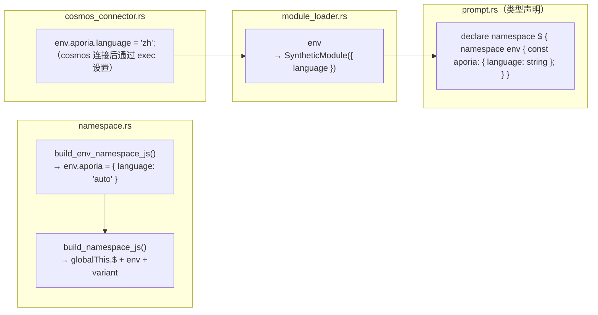

### 3.3 操作

| 操作 | 机制 | 行为 |
| --- | --- | --- |
| 初始化 | `build_namespace_js()` | `__env = __env \|\| {}; env.aporia = env.aporia \|\| { language: 'auto' }` |
| 设置语言 | 通过 cosmos 连接器的 `exec` 调用 | `env.aporia.language = 'zh'` |
| 在 IEPL 中读取 | `import { language } from 'env'` | 返回 `env.aporia.language`，以 `'auto'` 作为回退 |
| 快照/恢复 | **不支持** | `__env` 不包含在快照/恢复中——它是临时的，每次 cosmos 连接时重新初始化 |

### 3.4 语言流转

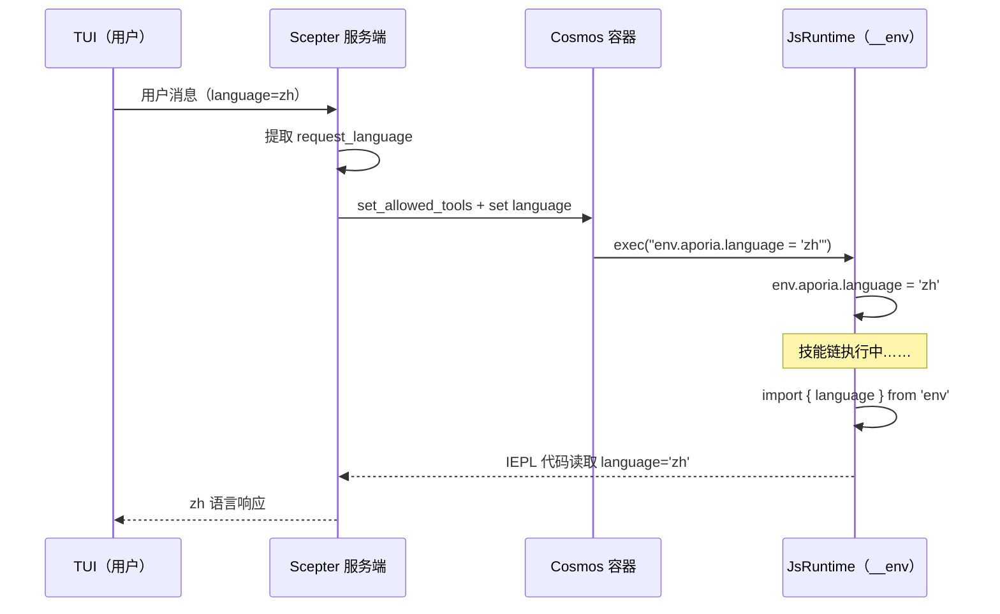

### 3.5 `$.variant` — 向后兼容访问器

**文件：** `packages/shared/iepl/src/namespace.rs:199-207`

`build_variant_namespace_js()` 创建一个循环自引用属性：

```javascript
Object.defineProperty(globalThis.$, 'variant', {
  get: function() { return globalThis.$; },
  set: function(val) { Object.assign(globalThis.$, val); },
  configurable: true,
  enumerable: true,
});
```

这允许将 `$.variant.tools.agent.method()` 解析为与 `$.tools.agent.method()` 相同的对象。它的存在是为了与替代命名空间访问模式保持向后兼容。

> **快照注意事项：** 由于 `$.variant` 是循环引用（`$.variant === $`），尝试 `JSON.stringify` 会抛出 `TypeError`。快照 JS 代码显式地直接以 `__vars` 和 `__refs` 为目标，而不遍历 `globalThis.$` 的键，从而避免了此问题。

---

## 4. 快照与恢复架构

### 4.1 为什么需要快照/恢复？

`LocalCosmosRuntime` 在一个专用线程中运行**一个长生命周期的 `JsRuntime`**。在技能链执行之间，运行时状态（`__vars`、`__refs`）自然持久化。然而，快照用于：

1. **Prompt 注入**——`build_runtime_context()` 和 `build_refs_section()` 读取快照 JSON 以填充系统提示词
1. **Session 持久化**——将状态转储/恢复到磁盘，用于崩溃恢复或 Session 迁移
1. **容器同步**——通过 `cosmos_set_rag_context()` 将状态推送至 cosmos 容器

### 4.2 快照格式

```json
{
  "$vars": {
    "var_name_1": "value",
    "parsed_json": { "key": "value" }
  },
  "$refs": {
    "code:src/main.rs": {
      "ref_type": "code",
      "source": "user",
      "summary": "main rust file",
      "files": [{ "path": "src/main.rs", "language": "rust", "content": "..." }]
    }
  },
  "__lexical": {
    "my_const": 42
  }
}
```

### 4.3 快照代码流

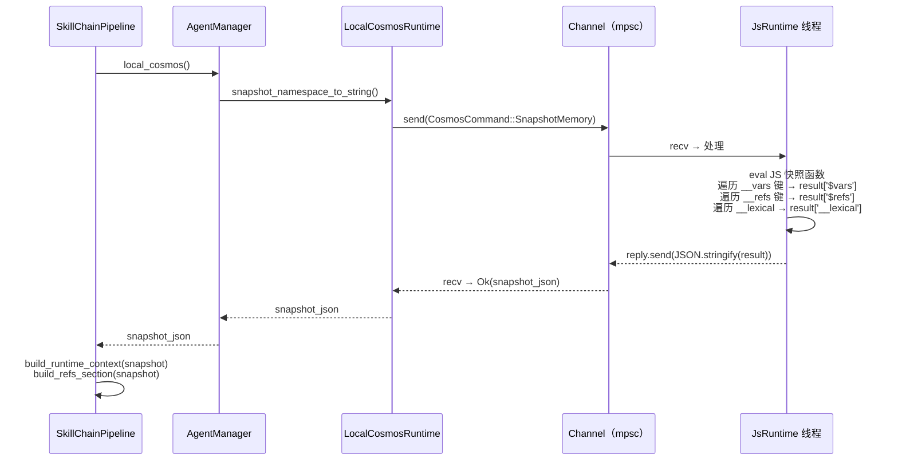

### 4.4 快照 JS 代码（部署形式）

> **注：** 下面展示的 JS 代码是 Rust 代码在运行时动态构建的**部署形式**。它不作为 Rust 字符串字面量存储在源码中。`__lexical` 部分是由在之前 `exec()` 调用期间跟踪的 `self.lexical_var_names` 生成的。详见 `packages/agents/skemma/src/js_runtime/runtime.rs:549-607` 中的 Rust 字符串构建器。

快照函数直接访问已知的命名空间树：

```javascript
(function() {
    var result = {};
    if (globalThis.$ && globalThis.__vars) {
        var dollarVars = {};
        var dollarKeys = Object.keys(globalThis.__vars);
        for (var j = 0; j < dollarKeys.length; j++) {
            var dk = dollarKeys[j];
            try {
                var dv = globalThis.vars[dk];
                if (typeof dv === 'function') continue;
                dollarVars[dk] = dv;
            } catch(e) {}
        }
        if (Object.keys(dollarVars).length > 0) {
            result['$vars'] = dollarVars;
        }
    }
    if (globalThis.$ && globalThis.__refs) {
        var dollarRefs = {};
        var refsKeys = Object.keys(globalThis.__refs);
        for (var j = 0; j < refsKeys.length; j++) {
            var dk = refsKeys[j];
            try {
                var dv = globalThis.refs[dk];
                if (typeof dv === 'function') continue;
                dollarRefs[dk] = dv;
            } catch(e) {}
        }
        if (Object.keys(dollarRefs).length > 0) {
            result['$refs'] = dollarRefs;
        }
    }
    // ... __lexical 捕获 ...
    return JSON.stringify(result);
})( )
```

### 4.5 恢复代码（部署形式）

```javascript
(function() {
    var snap = JSON.parse(snapshot_string);
    if (snap['$vars'] && globalThis.$) {
        Object.keys(snap['$vars']).forEach(function(k) {
            try { globalThis.vars[k] = snap['$vars'][k]; } catch(e) {}
        });
    }
    if (snap['$refs'] && globalThis.$) {
        Object.keys(snap['$refs']).forEach(function(k) {
            try { globalThis.refs[k] = snap['$refs'][k]; } catch(e) {}
        });
    }
    if (snap['__lexical']) {
        Object.keys(snap['__lexical']).forEach(function(k) {
            try { globalThis[k] = snap['__lexical'][k]; } catch(e) {}
        });
    }
})()
```

---

## 5. 工具注册与访问控制

### 5.1 Cosmos 内部工具

所有五个 cosmos 级工具被**普遍地授予**所有 Agent：

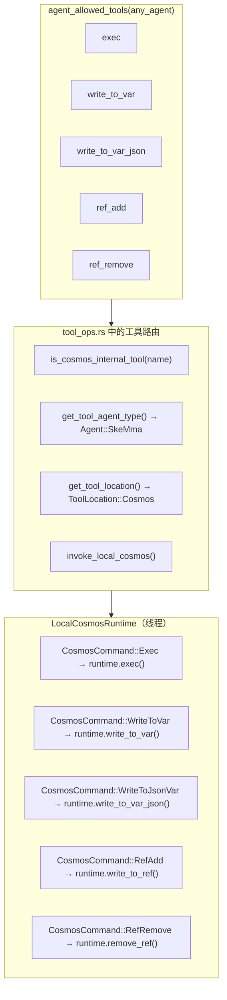

### 5.2 工具定义

| 工具 | 调用模式 | 要求 | 参数 Schema |
| --- | --- | --- | --- |
| `exec` | FireAndForget | `code: string` | 单个 JS 代码字符串 |
| `write_to_var` | 阻塞 | `var_name, content` | `{var_name: string, content: string}` |
| `write_to_var_json` | 阻塞 | `var_name, content` | `{var_name: string, content: string（有效 JSON）}` |
| `ref_add` | 阻塞 | `ref_name, content` | `{ref_name: string, content: string（JSON：ref_type + source + summary）}` |
| `ref_remove` | FireAndForget | `ref_name` | `{ref_name: string}` |

### 5.3 独立 Cosmos 服务端

`cosmos` 二进制（独立 JS 运行时服务端）通过相同的 `JsRuntime` 接口派发所有工具名称，包括保留为残留内部管道的已废弃 `ref_add`/`ref_remove` 处理器。只有三个 LLM 可见原语（`exec`、`write_to_var`、`write_to_var_json`）暴露给模型；见本文顶部的废弃说明。

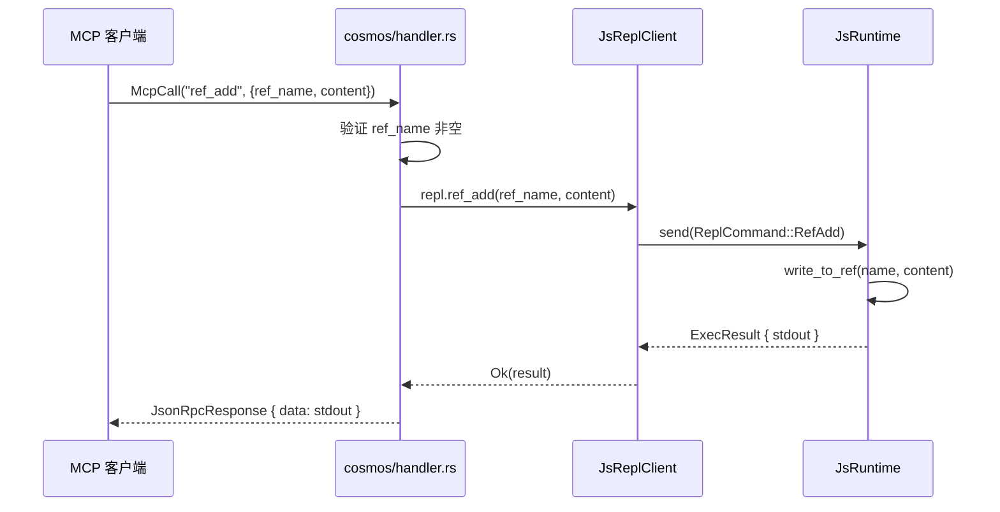

### 5.4 `is_cosmos_internal_tool` — 路由辅助函数

**文件：** `packages/scepter/src/agent_manager/tool_ops.rs:7-13`

```rust
fn is_cosmos_internal_tool(tool_name: &str) -> bool {
    tool_name == cosmos::EXEC
        || tool_name == cosmos::WRITE_TO_VAR
        || tool_name == cosmos::WRITE_TO_VAR_JSON
        || tool_name == cosmos::REF_ADD
        || tool_name == cosmos::REF_REMOVE
}
```

此辅助函数服务于两个关键目的：

1. **Agent 类型解析**——`get_tool_agent_type()` 对内部工具返回 `Agent::SkeMma`，因为它们运行在 Cosmos 运行时中（而非域 Agent 的进程中）。
1. **回退路由**——当容器化 cosmos 调用对内部工具失败时，系统回退到本地 cosmos 运行时。对于非内部工具，回退改为进程内执行。这确保 cosmos 操作在容器化模式下永不静默失败。

### 5.5 容器化 vs 本地 Cosmos 路由

系统在 Agent 注册时为 Cosmos 运行时支持两种执行模式：

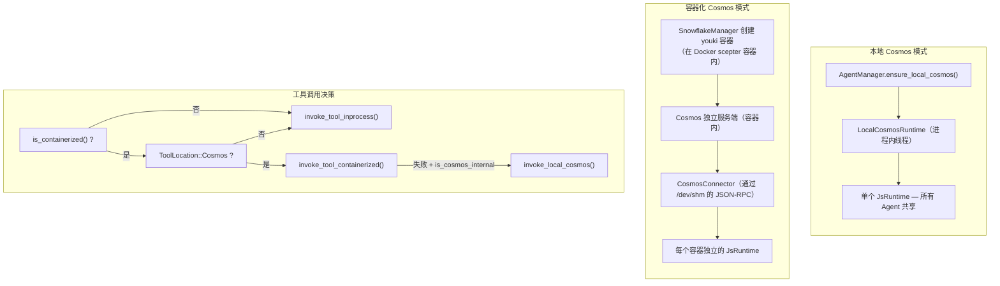

**关键区别：**

| 方面 | 本地模式 | 容器化模式 |
| --- | --- | --- |
| `__vars` / `__refs` | 所有 Agent 共享 | 容器内共享，容器间隔离 |
| `__env` | 直接通过 `exec` 设置 | 通过 `CosmosConnector` JSON-RPC 调用设置 |
| 性能 | 零序列化开销 | 每次调用 JSON-RPC 序列化 |
| 安全性 | 仅 Boa 沙箱 | Boa + seccomp + youki 沙箱 |
| 容器运行时 | 仅 Docker/Podman | Docker/Podman（外层）+ youki（内层 cosmos） |
| 使用方 | 非容器化 Agent（layer=1） | 容器化 Agent（layer=2+） |

### 5.6 命名空间 JS 组装

完整的命名空间 JavaScript 由 `build_scepter_namespace_config_and_js()` 在 `packages/scepter/src/services/local_cosmos/namespace.rs:116-124` 进行组装：

```rust
pub async fn build_scepter_namespace_config_and_js(
    registry: &SharedAgentRegistry,
    scepter_tools: &HashSet<String>,
    plugin_router: &PluginRouter,
) -> (NamespaceConfig, String) {
    let config = build_namespace_config(registry, scepter_tools, plugin_router).await;
    let js = build_namespace_js(&config);
    (config, js)
}
```

此函数：

1. 从 `AgentRegistry` 收集所有已注册 Agent 的 MCP 工具
1. 构建一个包含每个 Agent 工具列表和元数据（sync/async、`unwrap_data`）的 `NamespaceConfig`
1. 通过 `build_namespace_js(&config)` 生成命名空间 JS，其中：

   - 如果缺失则创建 `globalThis.$`
   - 初始化 `env.aporia`，值为 `{ language: 'auto' }`
   - 定义 `$.variant` 属性（返回 `globalThis.$` 的循环 getter）
   - 通过 `register_tool_modules_with_rag()` 注册所有 Agent 工具模块

命名空间 JS 被求值于：

- **一次** 在 `LocalCosmosRuntime::new()` 启动时
- **按需** 在技能链重建期间通过 `CosmosCommand::RebuildNamespace`

---

## 6. 系统提示词组装顺序

在 `pipeline.rs:869-882` 组装的完整系统提示词：

```text
你是 {Agent} {skill_name} 技能执行引擎。忠实地执行该技能。

[capability_section]
  → Agent 特定能力描述
  → TypeScript 类型声明（IEPL API 类型、env）
  → 导入指令提示词
  → 参数安全规则与数据持久化指导

[tool_decls_section]
  → ## 可用工具 API
  → 所有可用 MCP 工具的 .d.ts 内容

[container_context]
  → 容器执行模式标记、分支信息、约束

[soul_section]
  → ## 灵魂身份：{name}
  → Agent 的人格与运行原则

[refs_section]
  → ## 已引用的资源（refs）
  → 目录：名称、类型、来源、摘要

[output_section]
  → 下一个目标 Agent 路由
  → MCP 报告调用约定

[runtime_context]
  → ## JS 运行时上下文
  → __vars 名称（含导入提示）
  → __refs 名称（含访问提示）
  → 词法变量名称

[rag_section]
  → Philia 记忆段（相关历史交互）
  → Aporia 知识段（相关文档）

[skill_chain_note]
  → 链导航："这是第 N 步，共 M 步"或"最后一步"
```

### 段位放置理由

| 段 | 位置 | 理由 |
| --- | --- | --- |
| Agent 身份 + 技能名称 | 第一句 | 立即设定角色 |
| 工具声明 | 在 Soul 之前 | LLM 需要在人格影响选择之前知道可用工具 |
| Soul | 在工具之后、Refs 之前 | 人格影响如何解释 refs |
| Refs 段 | 在 Soul 之后、Output 之前 | LLM 在决定产出什么之前知道有哪些资源可用 |
| 输出路由 | 在 Runtime Context 之前 | LLM 在读取上下文之前知道将结果发往何处 |
| Runtime Context | 在 RAG 之前、链注释之前 | Vars 和 refs 为知识检索提供执行上下文 |

---

## 7. ResetVars 行为

在链中切换技能时，调用 `ResetVars` 来清理运行时状态。该命令使用**非破坏性**初始化：

```javascript
globalThis.$ = globalThis.$ || {};
globalThis.__vars = globalThis.__vars || {};
globalThis.__refs = globalThis.__refs || {};
```

这意味着：

- **已有值持久化**——`__vars` 和 `__refs` 保持不变
- **损坏状态可恢复**——如果 `__refs` 被意外删除，则重新创建
- **技能隔离是可选的**——技能应该只读取它们知道的变量（通过运行时上下文提示词中的名称）
- **无强制清理**——LLM 负责管理变量命名空间污染

---

## 8. 实现文件映射

| 组件 | 文件 | 行数 | 描述 |
| --- | --- | --- | --- |
| `__vars` 常量与生成器 | `packages/shared/core/src/var_namespace.rs` | 1-211 | vars 的所有 JS 代码生成 |
| `__refs` 常量与生成器 | `packages/shared/core/src/ref_namespace.rs` | 1-145 | refs 的所有 JS 代码生成 |
| `__env` 生成 | `packages/shared/iepl/src/namespace.rs` | 193-197 | `build_env_namespace_js()` |
| `$.variant` 生成 | `packages/shared/iepl/src/namespace.rs` | 199-207 | `build_variant_namespace_js()` |
| `JsRuntime` 初始化 | `packages/agents/skemma/src/js_runtime/runtime.rs` | 153 | `eval(VAR_NS_GLOBAL_INIT)` |
| `write_to_var` 实现 | 同上 | 349-403 | 字符串变量存储 |
| `write_to_var_json` 实现 | 同上 | 405-443 | JSON 变量存储 |
| `write_to_ref` 实现 | 同上 | 445-492 | 带类型提取的 Ref 存储 |
| `remove_ref` 实现 | 同上 | 494-503 | Ref 移除 |
| `snapshot_namespace_to_string` | 同上 | 549-607 | 生成快照 JS |
| `restore_namespace_from_string` | 同上 | 617-646 | 生成恢复 JS |
| `LocalCosmosRuntime` | `packages/scepter/src/services/local_cosmos/runtime.rs` | 1-507 | 线程安全的 cosmos 命令通道 |
| `CosmosCommand` 枚举 | 同上 | 21-65 | 所有 cosmos 操作变体（包括 SnapshotMemory、Shutdown） |
| `ResetVars` 处理器 | 同上 | 448-460 | 非破坏性重置 |
| `RebuildNamespace` 处理器 | 同上 | 478-494 | 重新初始化工具模块 |
| 工具定义 | `packages/scepter/src/agent_manager/tool_ops.rs` | 1-795 | 所有 5 个 cosmos 工具定义 |
| `is_cosmos_internal_tool` | 同上 | 7-13 | 路由辅助函数 |
| `invoke_local_cosmos` | 同上 | 714-787 | 工具派发到 LocalCosmosRuntime |
| `build_runtime_context` | `packages/scepter/src/state_machine/skill_chain/prompt.rs` | 472-598 | Prompt：vars + refs + lexical |
| `build_refs_section` | 同上 | 426-470 | Prompt：refs 目录 |
| 系统提示词组装 | `packages/scepter/src/state_machine/skill_chain/pipeline.rs` | 869-882 | 完整系统提示词格式字符串 |
| 允许的工具列表 | `packages/shared/domain_skills/src/tool_names.rs` | 265-273 | 通用 cosmos 工具访问 |
| Cosmos 独立处理器 | `packages/cosmos/src/handler.rs` | 447-521 | `ref_add` / `ref_remove` 派发 |
| Cosmos JsReplClient | `packages/cosmos/src/js_repl/mod.rs` | 442-467 | `ref_add()` / `ref_remove()` 方法 |
| ReplCommand 枚举 | 同上 | 57-96 | `RefAdd` / `RefRemove` 变体 |
| IEPL TypeScript 类型 | `packages/shared/bindings/iepl-api.d.ts` | 133-154 | RefItem、RefType、__refs 声明 |
| `vars` 模块 | `packages/agents/skemma/src/js_runtime/module_loader.rs` | 142-156 | `__vars` 实时引用导出 |
| `env` 模块 | 同上 | 160-172 | 语言值导出 |
| 命名空间 JS 组装 | `packages/scepter/src/services/local_cosmos/namespace.rs` | 116-124 | `build_scepter_namespace_config_and_js` |
| CosmosConnector 语言设置器 | `packages/scepter/src/services/cosmos_connector.rs` | 351-363 | 容器中的 `env.aporia.language` |
| E2E 测试 | `packages/agents/skemma/tests/mcp_test.rs` | 1677-1726 | `refs_and_snapshot_tests` 模块 |
| 单元测试 | `packages/agents/skemma/src/js_runtime/runtime.rs` | 679-746 | `write_to_ref`、快照、恢复测试 |
| Ref 命名空间测试 | `packages/shared/core/src/ref_namespace.rs` | 99-145 | JS 代码生成模式测试 |

---

## 9. 横切关注点

### 9.1 线程安全性

- `LocalCosmosRuntime` 在专用线程（命名 `"local-cosmos"`）中拥有**一个 `JsRuntime`**
- 所有操作通过 `mpsc::channel<CosmosCommand>` 序列化
- `JsRuntime` 从不被多个线程访问——线程安全由通道模式强制执行
- `AgentManager` 持有 `OnceCell<Arc<LocalCosmosRuntime>>` 用于惰性初始化

### 9.2 内存限制

| 限制 | 值 | 强制执行位置 |
| --- | --- | --- |
| Prompt 中最大 vars 数 | 30 | `build_runtime_context()` — `MAX_NAMES` 常量 |
| Prompt 中最大 refs 数 | 30 | `build_refs_section()` — `.take(30)` |
| runtime_context 中最大 refs 数 | 30 | `build_runtime_context()` — `MAX_NAMES` 常量 |
| Exec 代码软限制 | N/A（已禁用） | 外部容器限制 + 熔断器 |
| Exec 超时（SkeMma） | 默认 120s | `skemma/COMPUTE_TIMEOUT` |
| Exec 绝对上限 | 600s | `skemma/ABSOLUTE_CEILING` |

### 9.3 错误处理

| 错误 | 处理方式 |
| --- | --- |
| `write_to_var_json` 传入无效 JSON | 返回错误及预览（前 200 字符） |
| `ref_add` 传入无效 JSON | 返回 `SkemmaError::JsEval` 及预览 |
| 对循环引用（`$.variant`）快照 | 静默捕获 `TypeError`，跳过该键 |
| 快照中缺少 `__refs` | `build_refs_section` 返回空字符串 |
| ResetVars 后 `__refs` 损坏 | `|| {}` 保证重新初始化 |

### 9.4 RebuildNamespace 生命周期

在非容器化技能链中切换技能时，命名空间 JS 可能需要被**重建**以包含链中发现的新的 Agent 工具：

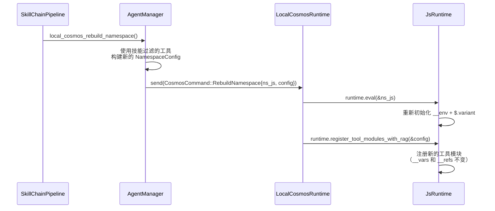

> **关键不变量：** `RebuildNamespace` 仅更新工具注册和环境设置。它**不**重置 `__vars` 或 `__refs`——这些由 `ResetVars` 单独处理。

### 9.5 容器化模式下的语言传播

当 Agent 在 youki 容器中运行（嵌套在 Docker scepter 容器内）时，`env.aporia.language` 值通过 `CosmosConnector` 设置：

```rust
// packages/scepter/src/services/cosmos_connector.rs:351-363
let lang_code = format!(
    "env.aporia.language = {};",
    serde_json::to_string(&lang).unwrap_or_else(|_| "\"en\"".to_string())
);
connector.cosmos_exec(&container_uuid, &lang_code).await?;
```

这通过 JSON-RPC 传输向 cosmos 容器发送一条 `exec` MCP 调用，在容器的隔离 `JsRuntime` 中求值 JS 赋值。完整的语言传播路径为：

```text
TUI 请求语言 → Scepter（提取 request_language）
  → [本地模式] 直接 exec("env.aporia.language = 'zh'")
  → [容器化模式] CosmosConnector::cosmos_exec(json_rpc_call)
      → cosmos handler → js_runtime.eval(...)
```

### 9.6 安全性

- `exec` 验证：所有代码在 Boa 求值前通过 SWC AST 语法验证
- 在 `exec` 块中使用 `eval()` 会被检测并阻止，并引导使用 `write_to_var` 代替
- `ref_add` 内容经过 `JSON.parse()`——无法注入任意代码
- 没有命名空间工具暴露原始 Boa 上下文访问
- Cosmos 容器在带 seccomp 配置文件的沙箱化 youki 容器中运行，每个嵌套在 Docker/Podman scepter 容器内部（双层容器隔离）
