# 用量周期统计系统设计

## 概述

用量周期统计系统基于时间周期管理和追踪 LLM Token 用量，支持多种周期类型（5 小时、7 天、30 天、自定义），为成本控制和配额管理提供数据基础。

## 核心原则

### 滑动时间窗口聚合

系统使用滑动窗口聚合机制，通过数据库视图实时计算任意时间范围的用量统计：

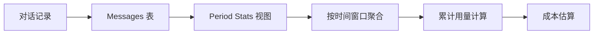

### 数据流

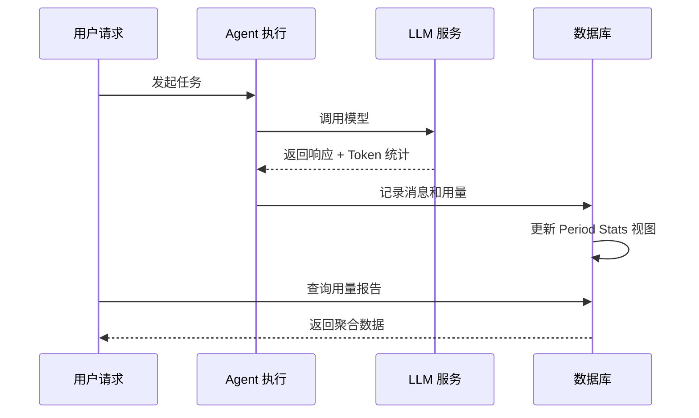

## 周期类型

| 周期类型 | 时长 | 典型用途 |
| --- | --- | --- |
| 短期 | 5 小时 | 快速迭代开发 |
| 中期 | 7 天 | 周度配额控制 |
| 长期 | 30 天 | 月度成本核算 |
| 自定义 | 任意 | 灵活的业务需求 |

## 架构设计

### 视图聚合架构

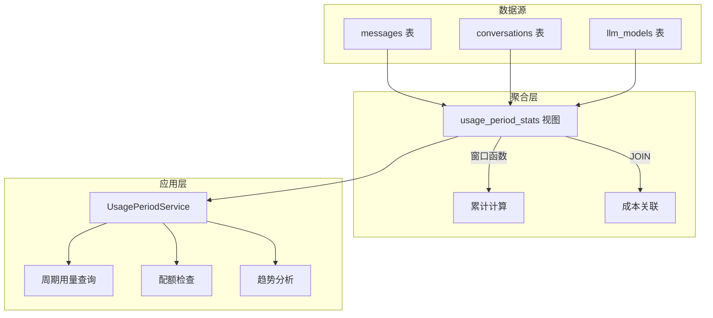

### 核心计算逻辑

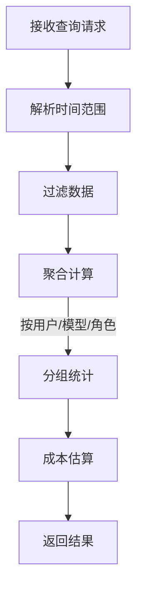

## 配额控制机制

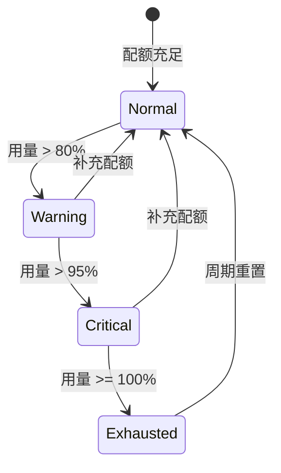

## 与其他模块的关系

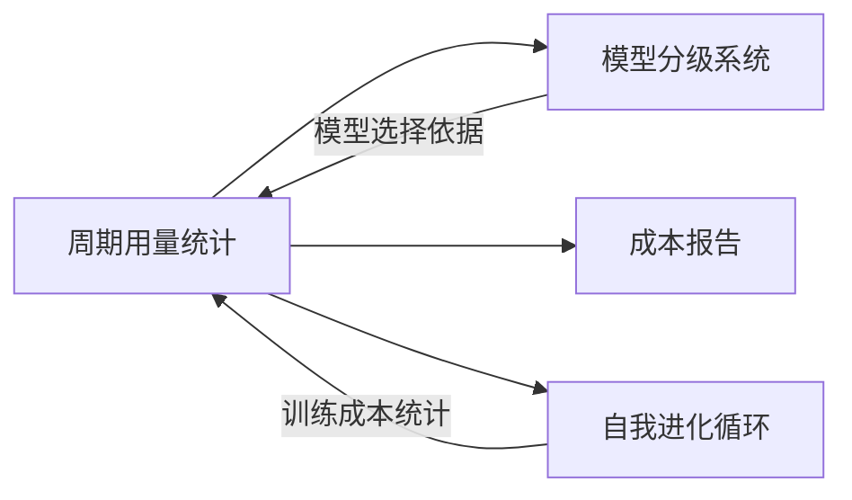

## 设计考量

### 性能优化

- 使用数据库视图进行预聚合
- 窗口函数避免冗余计算
- 时间索引加速范围查询

### 可扩展性

- 支持新的周期类型
- 可扩展的聚合维度
- 灵活的成本计算模型

### 数据一致性

- 只读视图确保数据完整性
- 时间戳统一使用 UTC
- 事务保证写入原子性

# LLM 配置流程设计

## 概述

本文档描述用户配置 LLM Provider 的完整流程，包括配置界面交互、数据传输、服务端处理和对话使用。

## 配置流程架构

```text
### 整体流程

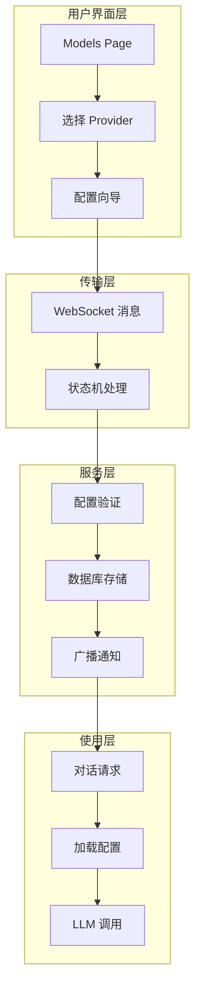

```text

## Provider 配置流程

### 配置步骤序列

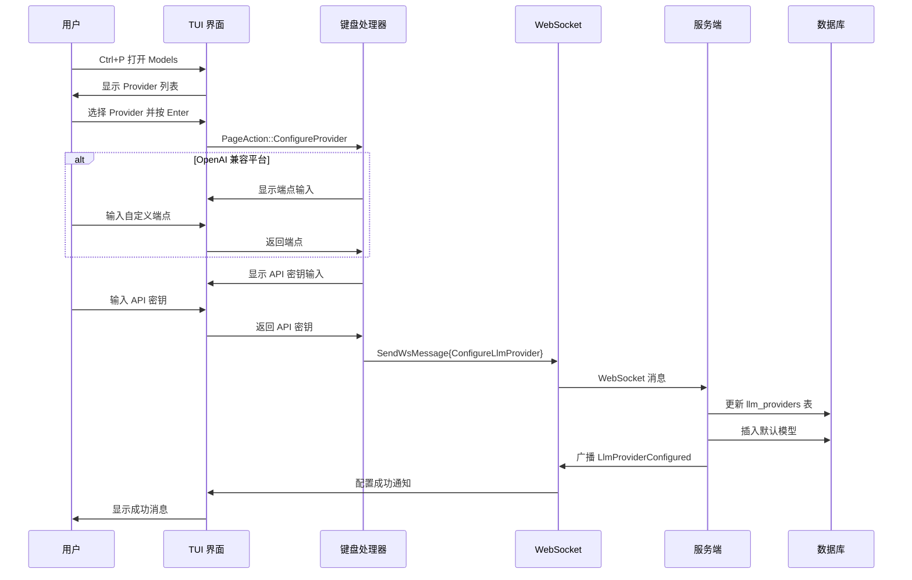

### 配置状态机

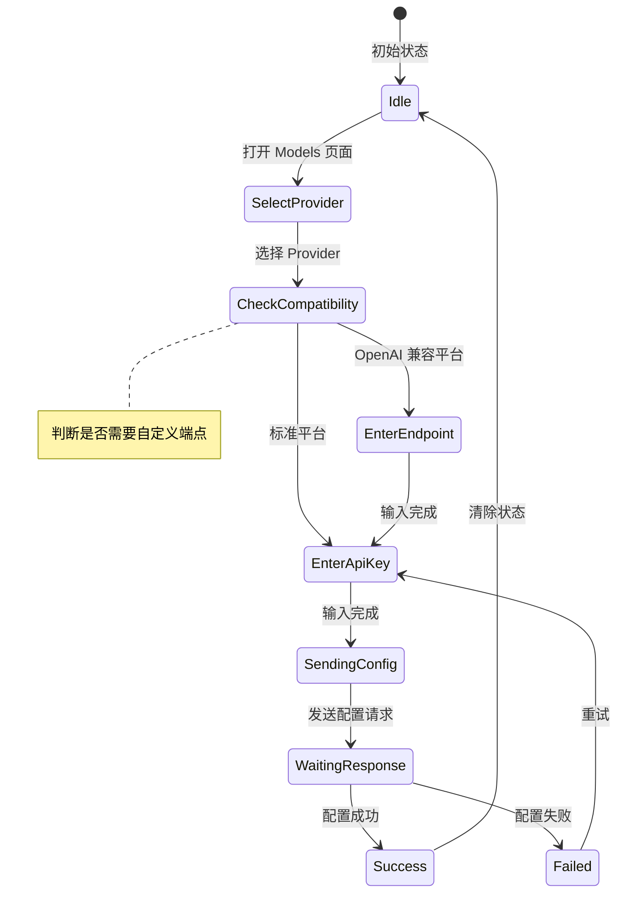

## 对话使用流程

### LLM 调用序列

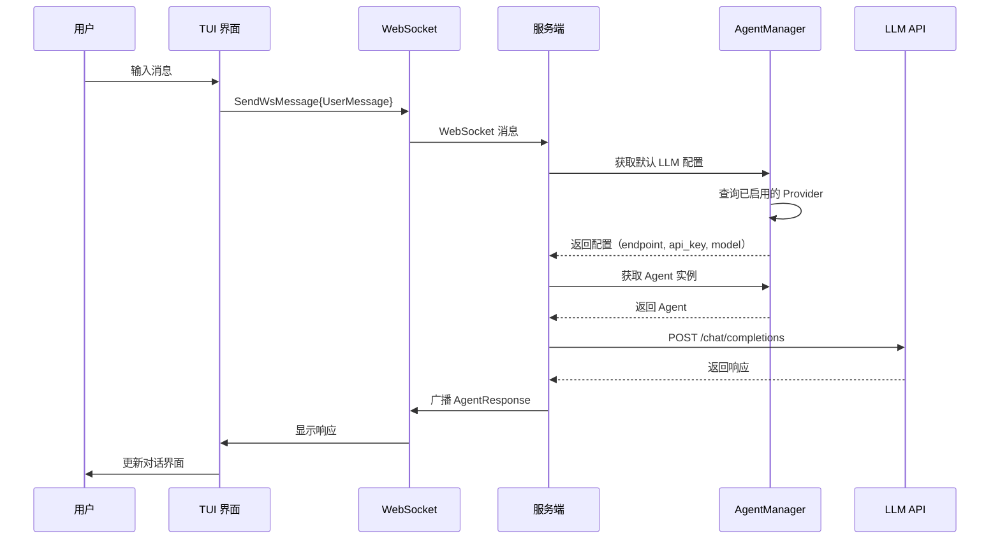

## 关键设计决策

### 两步配置流程

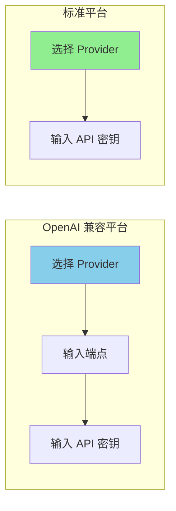

| 平台类型 | 配置步骤 | 原因 |
| --- | --- | --- |
| OpenAI 兼容 | 端点 + API 密钥 | 需要自定义服务端点 |
| 标准平台 | 仅 API 密钥 | 使用官方端点 |

### 配置状态管理

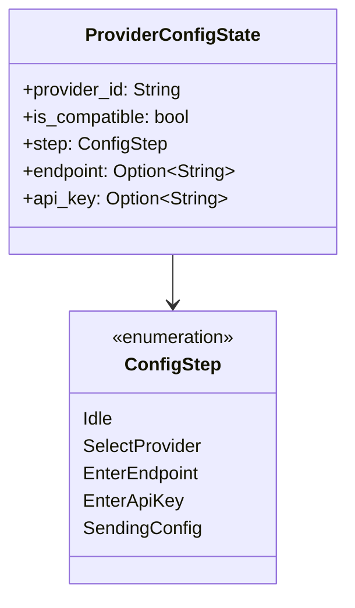

### 默认模型自动插入

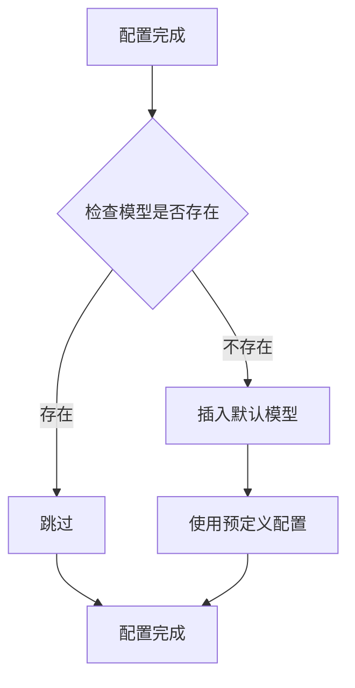

## 性能优化

### 配置缓存策略

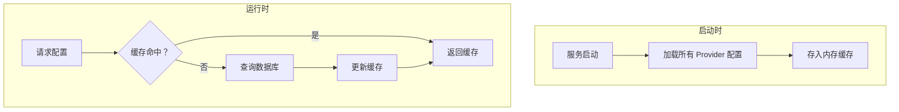

### 连接池管理

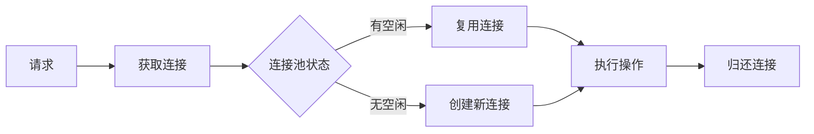

## 错误处理

### 用户输入验证

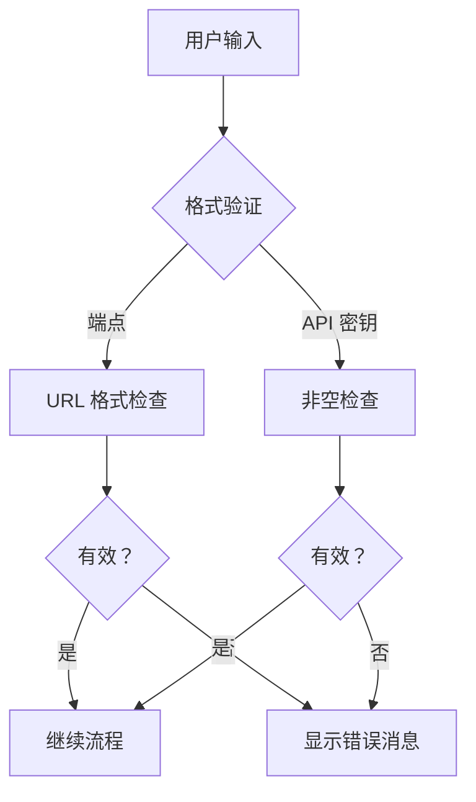

### 网络错误处理

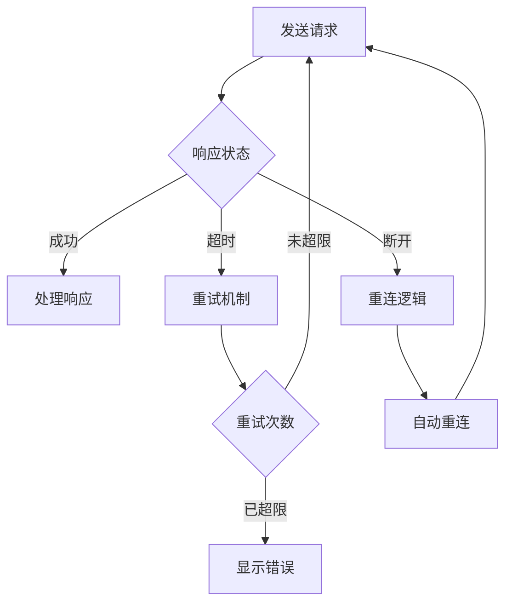

## 安全考虑

### API 密钥保护

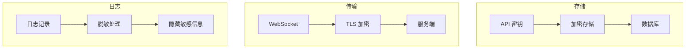

### 安全措施

| 阶段 | 措施 | 描述 |
| --- | --- | --- |
| 存储 | 加密存储 | 在数据库中加密存储 API 密钥 |
| 传输 | TLS 加密 | WebSocket 使用加密通道 |
| 日志 | 脱敏 | 不记录明文 Key |
| 输入 | 参数化查询 | 防止 SQL 注入 |

## 可扩展性设计

### 添加新 Provider

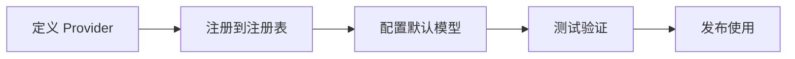

### 多 Provider 支持

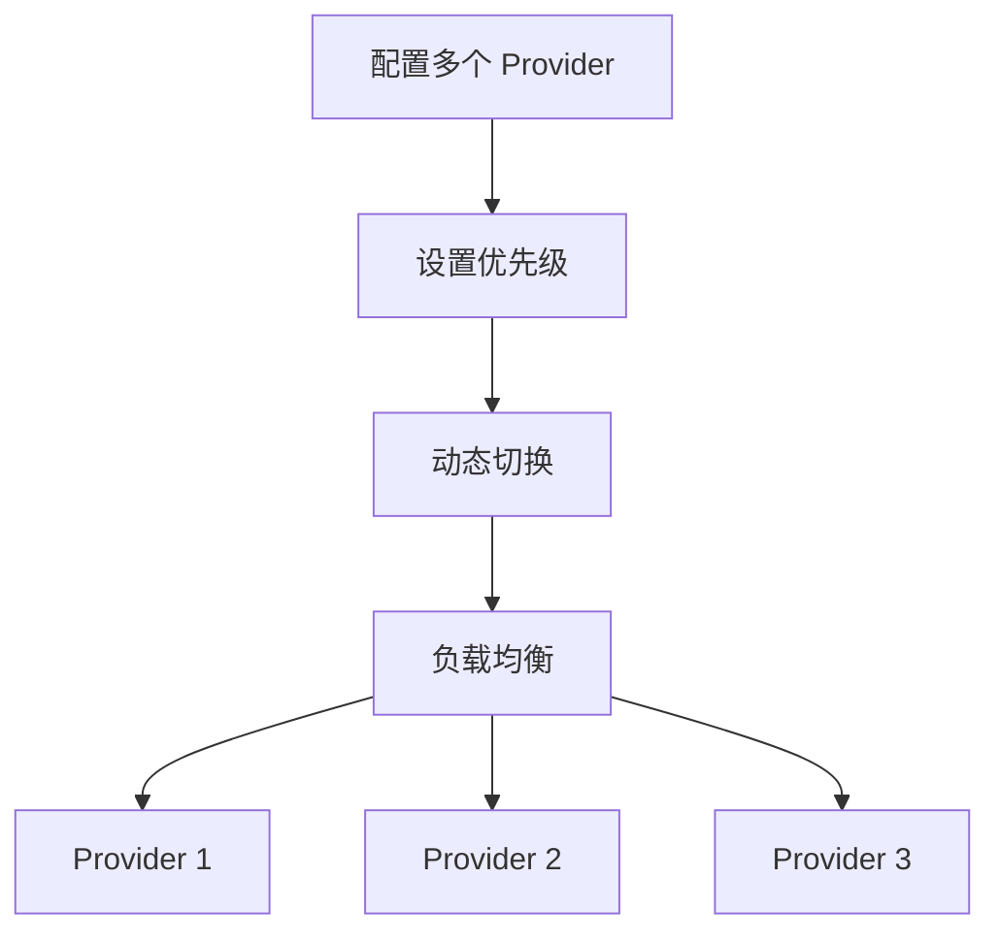

## 消息类型定义

### WebSocket 消息

| 消息类型 | 方向 | 描述 |
| --- | --- | --- |
| ConfigureLlmProvider | TUI → 服务端 | 配置请求 |
| LlmProviderConfigured | 服务端 → TUI | 配置结果 |
| UserMessage | TUI → 服务端 | 用户对话 |
| AgentResponse | 服务端 → TUI | Agent 响应 |

## 未来规划

| 功能 | 描述 | 优先级 |
| --- | --- | --- |
| 配置导入/导出 | 支持配置文件迁移 | 高 |
| Provider 健康检查 | 定期 Provider 可用性检测 | 中 |
| 自动故障转移 | Provider 不可用时自动切换 | 中 |
| 用量统计集成 | 联动用量统计系统 | 低 |

# MCP Prompt 注入与上下文压缩机制

## 概述

本文档描述两个关键架构设计：MCP 工具强制 Prompt 注入机制和基于 Todo 标记的上下文压缩机制。这两个机制协同工作，规范 Agent 行为并优化长对话场景下的上下文管理。

## I. MCP 工具文档注入（Exec-Only）

### 核心概念

在 exec-only 微内核架构下，LLM 仅接收**三个工具定义**：`exec`、`write_to_var` 和 `write_to_var_json`。MCP 工具是通过 exec 的 JS 运行时调用的内部 API。MCP 工具文档通过 `related_tools` 机制作为 JS API 文档注入到技能 Prompt 中——而不是作为独立的工具定义发送给 LLM。

```mermaid
flowchart LR
    A[Skill related_tools] --> B[McpToolDocLoader]
    B --> C[读取 TOML 参数 + MD 描述]
    C --> D[格式化 JS API 文档]
    D --> E[注入系统提示词]

    style D fill:#90EE90
```

### 关键特性

| 特性 | 描述 |
| --- | --- |
| Exec-only 面 | LLM 仅看到 `exec`、`write_to_var`、`write_to_var_json`；MCP 工具从不作为工具定义暴露 |
| 技能范围限定 | 工具文档通过 `related_tools` 按技能注入，而非全局 |
| JS API 格式 | 文档格式化为 `ES module import API reference — 描述` |
| 内部路由 | McpToolRegistry 按 Agent 保留但仅用于内部分发 |

### 设计动机

```mermaid
flowchart TB
    subgraph 问题场景
        A[过多工具定义膨胀上下文]
        B[每工具 Prompt 注入脆弱]
        C[LLM 对工具泛滥感到困惑]
    end

    subgraph 解决方案
        D[三工具面：exec、write_to_var、write_to_var_json]
        E[MCP 文档作为 JS API 引用]
        F[技能范围的 related_tools 注入]
    end

    A --> D
    B --> E
    C --> F
```

### 注入流程

```mermaid
sequenceDiagram
    participant Skill as Skill（related_tools）
    participant Loader as McpToolDocLoader
    participant MCP as MCP 工具配置（TOML + MD）
    participant Prompt as 系统提示词

    Skill->>Loader: 相关工具名称列表
    Loader->>MCP: 读取 TOML 参数 + MD 描述
    MCP-->>Loader: 工具元数据

    Loader->>Loader: 格式化为 ES module import API reference — 描述
    Loader->>Prompt: 注入系统提示词的技能段

    Note over Prompt: LLM 仅看到 exec 工具<br/>MCP 文档以 JS API 引用形式出现
```

### 注入格式

每个 MCP 工具的文档格式化为 JS API 引用：

$agent.todo_list_view() — 查看当前 Todo 树结构
$agent.todo_create({ title: String, description: String }) — 创建新的 Todo 项
$agent.todo_update_status({ `todo_id`: String, status: String }) — 更新 Todo 项的状态

### 配置示例

```mermaid
flowchart TB
    subgraph Skill related_tools
        A[Skill TOML: related_tools 字段]
        A --> A1["[tool_name]"]
        A1 --> B[todo_list_view]
        A1 --> C[todo_create]
        A1 --> D[todo_update_status]
    end

    subgraph McpToolDocLoader
        E[读取 TOML 参数]
        F[读取 MD 描述]
        G[格式化为 JS API 文档]
    end

    B --> E
    C --> E
    D --> E
    E --> F --> G
```

### 权限等级

每个 `[[related_tools]]` 条目可以可选地声明 `access_mode`：

[[`related_tools`]]
`agent_name` = "polemos"
`tool_name` = "`node_execute`"
`access_mode` = "read"       # 技能仅需读级访问（默认："read"）

双重授权网关检查：

1. 工具的 `ToolCapability` 声明是否支持请求的 `access_mode`
1. 目标节点的 `TrustLevel` 是否允许该操作
1. 对外部节点，额外的风险等级门控适用

详见 `docs/design/zh/22-mcp-tool-permission-model.md`。

### 优势与权衡

```mermaid
graph TB
    subgraph 优势
        A[最小工具面]
        B[技能范围的文档]
        C[一致的 API 格式]
        D[内部路由灵活性]
    end

    subgraph 权衡
        E[LLM 必须构造 JS 调用]
        F[调试需要 exec 追踪]
        G[related_tools 需要维护]
    end
```

## II. Todo 标记式上下文压缩机制

### 核心概念

传统压缩依赖文本摘要，会丢失关键细节。新机制改为标记关键 Todo 项，将原始细节作为用户输入保留，直接继续原始 Skill 执行。

```mermaid
flowchart LR
    subgraph 传统方式
        A1[上下文] --> B1[摘要文本]
        B1 --> C1[新对话]
        C1 --> D1[可能细节丢失]
    end

    subgraph Todo 标记方式
        A2[上下文] --> B2[标记关键 Todo]
        B2 --> C2[保留原始细节]
        C2 --> D2[无信息损失]
    end
```

### 设计动机对比

| 传统方式问题 | Todo 标记优势 |
| --- | --- |
| 信息丢失 | 原始保留 |
| 语义漂移 | 可追溯 |
| 不可验证 | 可验证 |
| Skill 失效 | Skill 连续性 |

### 压缩流程

```mermaid
sequenceDiagram
    participant User as 用户
    participant Agent as 原 Agent
    participant Marker as Todo 标记器
    participant NewAgent as 新 Agent
    participant TodoMCP as Todo MCP

    User->>Agent: 请求上下文压缩
    Agent->>Marker: 获取关键 Todo 项

    Note over Marker: 应用标记策略

    Marker-->>Agent: 已标记项列表
    Agent->>TodoMCP: 批量获取详情
    TodoMCP-->>Agent: Todo 详情

    Agent->>NewAgent: 启动新 Session

    Note over NewAgent: 系统提示词 = 原始 Skill<br/>用户输入 = Todo 详情

    NewAgent->>TodoMCP: 查看 Todo 树
    Note over NewAgent: 发现详情已在输入中<br/>直接继续
```

### 标记策略

```mermaid
flowchart TB
    subgraph 策略类型
        A[手动标记]
        B[AutoCritical 关键路径]
        C[AutoUnfinished 未完成任务]
        D[混合策略]
    end

    A --> A1[用户选择关键项]
    B --> B1[自动识别主任务链]
    C --> C1[标记所有未完成项]
    D --> D1[组合多种策略]
```

### 策略对比

| 策略 | 标记内容 | 适用场景 |
| --- | --- | --- |
| 手动 | 用户指定 | 精确控制 |
| AutoCritical | 主任务链 + 阻塞任务 | 复杂任务 |
| AutoUnfinished | 所有未完成任务 | 简单恢复 |
| 混合 | 组合 + 用户标记 | 通用场景 |

### 已标记项结构

```mermaid
classDiagram
    class MarkedTodoItem {
        +todo_id: String
        +include_depth: u32
        +include_ancestors: bool
        +include_artifacts: bool
    }

    class MarkerStrategy {
        <<enumeration>>
        Manual
        AutoCritical
        AutoUnfinished
        Hybrid
    }

    class TodoMarker {
        +marked_items: List~MarkedTodoItem~
        +marker_strategy: MarkerStrategy
        +mark_critical_todos()
    }

    TodoMarker --> MarkedTodoItem
    TodoMarker --> MarkerStrategy
```

## III. 两种机制的协作

### 协作流程

```mermaid
sequenceDiagram
    participant User as 用户
    participant OldAgent as 旧 Agent
    participant Marker as Todo 标记器
    participant Loader as McpToolDocLoader
    participant NewAgent as 新 Agent

    Note over OldAgent: 上下文接近上限

    User->>OldAgent: 压缩上下文
    OldAgent->>Marker: 标记关键 Todo
    Marker-->>OldAgent: 已标记项列表

    OldAgent->>NewAgent: 创建新 Session

    Note over NewAgent: 系统提示词 = Soul + Skill<br/>related_tools 由 McpToolDocLoader 加载

    NewAgent->>Loader: 加载 related_tools 的工具文档
    Loader-->>NewAgent: 格式化的 JS API 文档

    Note over NewAgent: 系统提示词包含：<br/>1. Soul 身份<br/>2. Skill 模板 + related_tools 文档<br/>3. 三个工具：exec、write_to_var、write_to_var_json

    NewAgent->>NewAgent: 通过 exec JS 运行时执行
    Note over NewAgent: MCP 工具是内部 API<br/>发现详情已在输入中

    NewAgent-->>User: 无缝任务继续
```

### 关键协作点

```mermaid
flowchart TB
    subgraph 协作机制
        A[McpToolDocLoader 注入 JS API 文档]
        B[标记器提供完整上下文]
        C[Soul + Skill Prompt 保留]
    end

    A --> D[Skill 拥有 MCP 工具的 JS API 引用]
    B --> E[提供足够完整的信息]
    C --> F[保持行为一致性]

    D --> G[无缝任务继续]
    E --> G
    F --> G
```

## IV. 实现路线图

```mermaid
flowchart LR
    subgraph 第一阶段 高优先级
        A[MCP Prompt 注入]
        A --> A1[数据结构]
        A --> A2[注入逻辑]
        A --> A3[配置管理]
    end

    subgraph 第二阶段 中优先级
        B[Todo 标记机制]
        B --> B1[标记策略]
        B --> B2[压缩恢复]
        B --> B3[手动标记]
    end

    subgraph 第三阶段 低优先级
        C[智能策略]
        C --> C1[AutoCritical]
        C --> C2[混合]
        C --> C3[智能建议]
    end
```

## V. 风险评估与缓解

### 风险矩阵

| 风险 | 影响 | 缓解措施 |
| --- | --- | --- |
| Token 开销过大 | 性能下降 | 限制标记数量、压缩级别可配置 |
| Prompt 过于严格 | 灵活性降低 | 提供绕过机制、异常处理指引 |
| 标记策略不准确 | 信息遗漏 | 手动覆盖、可视化确认 |

### 错误处理流程

```mermaid
flowchart TB
    A[操作失败] --> B{失败类型}
    B -->|Token 超限| C[裁剪非关键项]
    B -->|策略失败| D[回退到手动模式]
    B -->|注入失败| E[使用默认行为]

    C --> F[重试操作]
    D --> F
    E --> F
```

## VI. 配置集成

### 总体配置结构

```mermaid
flowchart TB
    subgraph Skill 配置
        A[related_tools]
        B[tool_names 列表]
    end

    subgraph 压缩配置
        C[enabled]
        D[default_strategy]
        E[trigger_threshold]
    end

    subgraph 策略配置
        F[include_critical_path]
        G[include_unfinished]
        H[max_marked_items]
    end

    A --> I[JS API 文档生成]
    C --> J[压缩控制]
    F --> K[标记规则]
```

## VII. 未来扩展

| 功能 | 描述 | 优先级 |
| --- | --- | --- |
| 动态 Prompt 生成 | 根据任务复杂度调整约束 | 中 |
| 多 Session 共享 | 多个 Agent 共享 Todo 标记 | 中 |
| 智能标记建议 | 自动推荐标记项 | 低 |
| 可视标记工具 | 图形标记界面 | 低 |

## VIII. 补充的 RAG 上下文注入（v2.1+）

第 I-VII 节描述的 MCP 工具注入为 LLM 提供**API 引用**——它告诉 LLM *如何*调用工具。一个补充机制——RAG 上下文注入——为 LLM 提供**预计算的知识**——它直接将 RAG 查询的*结果*注入到系统提示词中。

| 方面 | MCP 工具注入 | RAG 上下文注入 |
| --- | --- | --- |
| LLM 收到什么 | API 引用文档（ES 模块导入） | 实际知识内容（记忆节点、工作区文档） |
| 何时注入 | 按技能，基于 `related_tools` | 按技能步骤，基于技能上下文 |
| LLM 参与 | LLM 必须调用工具 | LLM 无需参与——预计算 |
| 延迟影响 | N 次往返（每次调用一次） | 每个技能步骤 1 次预计算 |
| IEPL 模块 | `{agent}`（MCP 分发） | `rag/{philia,aporia}`（缓冲区读取） |

两种机制共存：MCP 工具作为回退选项保持可用，用于预计算上下文未覆盖的查询。详见 `docs/design/zh/26-rag-context-injection.md`。

# Agent 双重身份与可见性边界设计

## 目标

- 将可见的 Skill 执行实例与内部的 MCP/LLM 工具提供者完全分离。
- 仅允许 Skill 调用创建带有 3 位工号的临时可见 Agent。
- 将 MCP/LLM 模型和 Token 用量归因于关联的 Skill 实例，而不是创建额外的可见 Agent。
- 保留运行时 UUID 身份用于审计、历史和重放，但防止其泄漏到 TUI 时间线中。

## 身份层

- `agent_number`：面向 UI 的 3 位工号，是可见时间线节点的稳定键。
- `agent_uuid`：运行时 UUID，用于注册表、审计和历史。
- `agent_id`：兼容性字段。
  - 在可见的 TUI 负载中，`agent_id` 应匹配面向面板的 `agent_number`。
  - 在内部注册表和 MCP 执行路径中，`agent_id` 可能保留 UUID 风格。

## 可见性与实例化规则

- 仅 Skill 调用创建临时可见 Agent 实例。
- SimpleTool/MCP 提供者不得仅因其工具被调用而创建额外的可见 Agent。
- 当 Skill 使用 MCP 工具或内部 `llm_chat` 调用时，这些调用仍作为该 Skill 实例下的从属执行。
- 示例：如果 HubRis 调用 ApoRia 的 `llm_chat`，ApoRia 仍为内部执行者，不得在右上角时间线中显示为第二个可见节点。

## MCP 和 LLM 归因规则

- 如果 MCP/LLM 调用属于某个可见 Skill 实例，其模型名称和 Token 用量必须归因于该 Skill 实例。
- 内部提供者仍可保留自身的审计或全局统计，但这些内部统计不得触发 TUI 节点创建。
- MCP 日志和上下文应保留：
  - `agent_number`
  - `agent_uuid`
  - `tool_name`
  - `phase`（`start`/`finish`）
  - `success` 和 `error`

## TUI 渲染契约

- TUI 仅为显式的 3 位面板 ID 创建时间线节点。
- 没有可见 `agent_number` 的有效载荷仅可更新全局模型/Token 统计，不得创建可见 Agent 节点。
- 显示标签和节点键位绝不从 `agent_id` 中的 UUID 或任意数字派生出可见工号。
- 对于可见节点：
  - `agent_number` 用于显示和交互。
  - `agent_uuid` 仅保留给审计、历史和调试。

## 工号分配与生命周期

- `agent_number` 从可用的 `000`-`999` 池中随机分配，而非顺序分配。
- 已释放的号码可重用。
- 当所有 1000 个工号都在使用时，分配器可能回退到随机重用；历史区分必须依赖 `agent_uuid`。
- 可见实例清理和工号回收由 Skill 生命周期管理器处理。

## 兼容性约束

- 仅携带 `agent_id` 的遗留有效载荷仍可在内部解析，但可见 UI 不得从 UUID 风格 ID 合成新节点。
- 当 `agent_number` 和 `agent_uuid` 同时存在时，双重身份模型适用：
  - `agent_number` 用于显示和交互。
  - `agent_uuid` 用于审计和历史。

# 请求并发架构

## 概述

Scepter 管理两个独立的并发层：

```mermaid
flowchart LR
    User["用户请求"] --> Semaphore["请求信号量"]
    Semaphore --> Cosmos["Cosmos 容器"]
    Cosmos --> Queue["层级队列（RequestPool）"]
    Queue --> LLM["LLM API"]
```

## 类比

想象一家餐厅：

- **顾客**（用户请求）同时到达并下单
- **桌子**（Cosmos 容器）为每个请求创建——每个有自己的工作区
- **厨房工位**（LLM 提供商并发）有限——也许总共 3 个
- **票务系统**（`RequestPool` 层级队列）按层级管理 FIFO 排序

30 名顾客可以同时下单（scepter 接受多个请求），但厨房一次只能做 3 道菜（LLM API 速率限制）。

## 第一层：请求信号量

**位置**：`state_machine/domains/control_domain.rs` — `concurrent_request_semaphore`

控制 scepter 同时接受多少用户请求。每个请求创建一个独立的 Cosmos 容器及其自己的 LLM 句柄。

```mermaid
flowchart LR
    User1["用户消息"] -->|"N = 所有模型 max_concurrent 之和"| Semaphore["Semaphore(N)"]
    User2["用户消息"] --> Semaphore
    User3["用户消息"] --> Semaphore
    Semaphore --> Container1["Cosmos 容器 + LLM 句柄"]
    Semaphore --> Container2["Cosmos 容器 + LLM 句柄"]
    Semaphore --> Container3["Cosmos 容器 + LLM 句柄"]
```

N = 所有已启用模型的总并发槽数。如果模型 A（3 槽）+ B（2 槽）= 5 个并发请求。

此前是 `AtomicBool`（N=1），现在是 `Semaphore(N)`。

## 第二层：层级队列（RequestPool）

**位置**：`infra/request_pool.rs` — `RequestPool`

带按模型信号量的每层级 FIFO 队列。在层级内：

1. 传入的 LLM 请求进入层级队列
1. 首先尝试在最高优先级模型上获取槽位
1. 若繁忙，按优先级顺序尝试下一个模型
1. 若全部繁忙，在 FIFO 队列中等待——无论哪个模型先释放槽位，就服务下一个请求

```mermaid
flowchart TB
    subgraph Tier["层级：'normal'"]
        direction TB
        Queue["FIFO 队列：req1 → req2 → req3 → req4"]
        MA["模型 A（优先级 10）：Semaphore(3) ■■□"]
        MB["模型 B（优先级 5）： Semaphore(2) □□"]
        MC["模型 C（优先级 1）： Semaphore(1) ■"]
        Queue -->|"req1 → 模型 A（可用）"| MA
        Queue -->|"req2 → 模型 B（可用，A 繁忙）"| MB
        Queue -->|"req3 → 等待……模型 A 释放 → 服务"| MA
        Queue -->|"req4 → 等待……模型 C 释放 → 服务"| MC
    end
```

### 关键属性

- **按提供商隔离**：每个模型的 `max_concurrent` 相互独立
- **优先级排序**：可用时优先选择高优先级模型
- **回退**：若高优先级模型饱和，低优先级模型立即服务
- **FIFO 公平性**：等待中的请求按到达顺序服务

### 配置

\# provider_config.toml
[[models]]
id = "gpt-5.4"
tier = "normal"
priority = 10
`max_concurrent` = 3        # 对此模型同时进行 3 次 API 调用

[[models]]
id = "gpt-4o-mini"
tier = "normal"
priority = 5
`max_concurrent` = 5        # 同时进行 5 次 API 调用

[[models]]
id = "deepseek-v3"
tier = "deep"
priority = 8
`max_concurrent` = 2

使用此配置：

- `normal` 层级：模型 A（3 槽）+ 模型 B（5 槽）= 8 个并发的 normal 层级 LLM 调用
- `deep` 层级：模型 C（2 槽）= 2 个并发的 deep 层级 LLM 调用
- 请求信号量：3 + 5 + 2 = 10 个并发用户请求

## 流程：用户消息 → LLM 响应

```text
    1. 用户通过 TUI/CLI/套接字发送消息
    1. `handle_user_message`()：

a. 在请求信号量上 `try_acquire`()（第一层）

          - 若无槽位：返回"繁忙"错误
          - 每个槽位 → 独立 Cosmos 容器

b. `execute_skill_chain`() → `invoke_aporia_llm_chat`()

    1. `invoke_aporia_llm_chat`()：

a. 在 `RequestPool` 上 `acquire_tier`("normal", `excluded_models`)（第二层）

          - 按优先级顺序尝试每个模型（非阻塞）
          - 若全部繁忙：在 FIFO 中等待，直到任何模型槽位释放
          - 返回 TierPermit { `model_id`, `display_name` }

b. `chat_loop` → llm_backend.chat() → LlmService::`chat_with_tools`()

          - 使用选定模型进行 API 调用

c. TierPermit 释放 → 信号量槽位释放

    1. `finish_handling`()：

a. 请求信号量许可归还
b. Cosmos 容器可清理（或重用）

```

## E2E 测试

测试使用空闲超时（而非绝对截止时间）。计时器在每次有意义的事件时重置：

\# 活动重置空闲计时器——只要保持活跃，链可以无限运行
ACTIVE_METHODS = {
"Tui.`OrchestrationStatus`",
"Tui.`McpToolResult`",
"Tui.`AgentReport`",
"Tui.`AgentStreamingChunk`",
"Tui.`TaskStatusUpdate`",
"Tui.`AskHumanRequest`",
"Tui.AgentPatch",
"Tui.`ContainerSnapshot`",
}

这确保：

- 短空闲超时（120s）捕获真正卡住的链
- 长时间运行但活跃的链（复杂的多 Skill）永远不会被过早终止

# 嵌入式开发数据库与功能门控的生产隔离

## 概述

entelecheia 使用 [pglite-oxide](https://crates.io/crates/pglite-oxide) 作为嵌入式 PostgreSQL，用于两个目的：

1. **本地开发**：当未配置 `DATABASE_URL` 时，scepter 自动启动一个进程内 PostgreSQL（通过 WASM/wasmer 的 PG 17.5）并支持 pgvector。
1. **集成测试**：PG 集成测试使用 pglite-oxide 替代 Docker/testcontainers。

在生产环境（Docker）中，`embedded-db` 功能被排除，scepter 连接到真实的 PostgreSQL 容器。

## 设计动机

此前，本地开发需要 Docker Compose 或手动安装 PostgreSQL。集成测试依赖 `testcontainers`，在 CI 中增加了 Docker-in-Docker 的复杂性。pglite-oxide 消除了这两项要求——`cargo run` 对本地开发"即运即用"，`cargo test` 无需 Docker 即可运行。

## 功能门控架构

```mermaid
flowchart TB
    Cargo["scepter Cargo.toml<br/>[features] default = ['all-agents', 'embedded-db']  ← dev<br/>embedded-db = ['dep:pglite-oxide']<br/>[dependencies] pglite-oxide = { workspace = true, optional = true }"]

    Cargo -->|"cargo build（默认）"| Dev["pglite-oxide + wasmer WASM<br/>包含"]
    Cargo -->|"Dockerfile<br/>--no-default-features<br/>--features all-agents"| Prod["无 pglite，无 wasmer<br/>（生产）"]
```

| 构建上下文 | 命令 | pglite-oxide | wasmer | DATABASE_URL |
| --- | --- |  ---  |  ---  | --- |
| `cargo run`（本地开发）| 默认 features | ✓ | ✓ | 可选——缺失时自动启动嵌入式 PG |
| `cargo test`（测试）| 默认 features | ✓ | ✓ | 由测试工具自动启动 |
| `just build`（发布）| `--no-default-features --features all-agents` | ✗ | ✗ | 必需 |
| Docker `Dockerfile` | `--no-default-features --features all-agents` | ✗ | ✗ | 必需（指向 PG 容器）|

## 运行时 DB 解析顺序

```rust
// packages/scepter/src/app/setup.rs
let `db_url` = if let Ok(url) = std::env::var("DATABASE_URL") {
// 1. 环境变量（生产：Docker PG，开发：.env 文件）
url
} else if !user_config.database.url.is_empty() {
// 2. 用户配置文件（~/.config/entelecheia/config.toml）
user_config.database.url.clone()
} else {
// 3. 嵌入式 pglite-oxide（功能门控）
#[cfg(feature = "embedded-db")]
{
let server = `PgliteServer`::builder()
.extension(`pglite_oxide`::extensions::VECTOR)  // pgvector 支持
.start()?;
let url = server.database_url();
std::mem::forget(server);  // 进程生命周期内保持存活
url
}
#[cfg(not(feature = "embedded-db"))]
{
return Err(/* "未配置 DATABASE_URL" */);
}
};
```

## 测试工具模式

```no_run
// tests/pg_integration/auth_test.rs
static PG: OnceCell<(String, PgliteServer)> = OnceCell::const_new();

# [test]
fn pg_integration_tests() {
    let rt = tokio::Runtime::new().unwrap();
    rt.block_on(async {
        let url = ensure_pg_url().await;
        let db = connect_db(&url).await;  // max_connections=1
        pg_user_crud(&db).await;
        pg_unique_username(&db).await;
        pg_rbac_role_persistence(&db).await;
        pg_rbac_audit_log(&db).await;
    });
    std::process::exit(0);  // 绕过 sqlx 池挂起
}
```

## 创建的表

所有 23 个表 + 1 个 schema 范围表 + 4 个视图均通过 SeaORM 迁移创建：

**核心**：`users`、`rbac_user_roles`、`rbac_audit_log`、`agents`、`conversations`、`messages`、`tasks`
**目标**：`goals`、`tracks`、`goal_tasks`
**知识**：`knowledge_bases`、`knowledge_documents`（pgvector 嵌入）、`rag_subscriptions`
**共识**：`consensus_records`、`consensus_references`、`consensus_verifications`
**基础设施**：`credentials`、`ssh_credentials`、`container_snapshots`、`model_usage_stats`
**工作区**：`workspace_registry`、`todo_items`、`workspace_bindings`
**日志**：`log.entries`（独立的 `log` schema）
**视图**：`usage_period_stats`、`usage_model_stats`、`usage_role_stats`、`usage_session_stats`

## PGlite 约束

```text
| 约束 | 影响 | 缓解措施 |
| --- | --- | --- |
| `max_connections=1` | 一次仅一个池 | 在子测试间共享 DB 连接；测试间不调用 `db.close()` |
| 严格类型转换 | `uuid = text` 会失败 | 始终传递类型化值（例如对 UUID 列使用 `Uuid` 而非 `String`） |
| 无并发访问 | 测试必须顺序执行 | 单个 `#[test]` 运行器，所有子测试内联 |
| sqlx 池后台任务 | `close()` 无限挂起 | 所有测试完成后 `std::process::exit(0)` |
```
## Docker 构建加固

所有生产 Dockerfile 排除 embedded-db：

\# Dockerfile
RUN cargo build --release -p scepter \
--no-default-features --features all-agents

这确保生产镜像中零 wasmer/pglite 代码，保持二进制大小最小化和攻击面减少。
