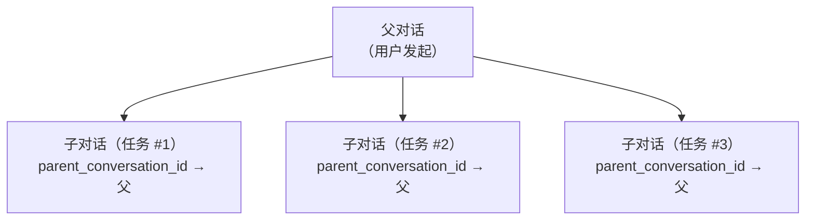

# ADR-004：Session 存储生命周期管理

> **状态**：已接受（2026-06-10）
> **上下文**：entelecheia + shittim-chest
> **灵感来源**：[opencode #16101](https://github.com/anomalyco/opencode/issues/16101)

## 背景

opencode（一个同类 AI 编码 Agent）仅在 2 个月内就积累了 9GB 的聊天历史数据库，消耗约 30B Token。内存使用量在仅加载约 10 个项目时经常超过 30GiB。根本原因是缺乏 Session 生命周期管理：没有 TTL、没有自动清理、没有存储上限、没有压缩后的空间回收。

如果不加处理，entelecheia 和 shittim-chest 面临相同的基本问题：

- **entelecheia**：`conversations` 和 `messages` 数据库表存在但从未写入；实际聊天存储为无限制的 TOML 日志文件；`dialogue_events` 表有 CRUD 代码但没有迁移；配置限制（`MAX_DIALOGUE_HISTORY_LEN`、`MAX_DIALOGUE_RECORDS`、`DIALOGUE_TIMEOUT_MS`）已定义但从未强制执行。
- **shittim-chest**：具有可用的对话/消息持久化，但没有过期认证 Session、过期工作区 Session、巡航历史或 webhook 交付日志的自动清理。

## 决策

实现统一存储生命周期管理系统，遵循以下原则：

### 1. 对话具有生命周期，而非仅有诞生

- **TTL**：超出 `CONVERSATION_TTL_DAYS`（默认 90 天）不活跃的对话在归档后有资格被清理。
- **归档后删除**：对话必须在 TTL 清理移除它们之前归档（`is_archived = TRUE`）。
- **子 Session**：父子对话关系通过 `parent_conversation_id` 追踪。子对话可以独立归档，并在 `CHILD_SESSION_RETENTION_DAYS`（默认 7 天）后清理。

### 2. 清理是自动的，而非手动的

- **后台任务**：定期清理按可配置间隔运行（`CLEANUP_INTERVAL_MINUTES`，默认 60）。
- **混合策略**：启动扫描 + 定期计时器。无需用户干预。
- **幂等**：清理任务可安全地多次运行。

### 3. 压缩实现存储空间回收

- 标记为 `is_compacted = TRUE` 的消息其内容已被摘要。其详细内容可在保留期后清理。
- 默认保守：仅清除压缩后的消息内容，保留元数据（工具名称、时间戳、Token 计数）。

### 4. 配置集中化

所有生命周期参数位于 `StorageLifecycleConfig`（entelecheia）和 `CleanupConfig`（shittim-chest）中，从环境变量加载并带有合理的默认值。

### 5. 基于文件的日志是次要的

- `CHAT_LOG_ENABLED` 默认为 `false`。TOML 聊天日志文件仅供调试使用。
- 启用时，日志文件在 `CHAT_LOG_RETENTION_DAYS`（默认 7 天）后清理。

## Schema 变更

### conversations 表（entelecheia）

新增列：

- `parent_conversation_id UUID REFERENCES conversations(conversation_id)` — 子 Session 追踪
- `is_archived BOOLEAN NOT NULL DEFAULT FALSE` — 归档标志
- `archived_at TIMESTAMPTZ` — 归档时间
- `metadata JSONB NOT NULL DEFAULT '{}'` — 可扩展元数据

### messages 表（entelecheia）

新增列：

- `is_compacted BOOLEAN NOT NULL DEFAULT FALSE` — 标记压缩消息有资格进行内容清理
- `metadata JSONB NOT NULL DEFAULT '{}'` — 可扩展元数据

### dialogue_events 表（entelecheia）

此前有 CRUD 代码但没有 `CREATE TABLE` 迁移。现在包含在 `baseline_tables.sql` 中。

### rbac_sessions 表（entelecheia）

用于 kirino Session 持久化的新表（SQL 后端）。

## 实现阶段

| 阶段 | 描述 | 状态 |
| --- | --- | --- |
| 0.1 | Schema 迁移修复（dialogue_events、conversations/messages 升级）| 已完成 |
| 1.2 | 统一配置命名空间（`StorageLifecycleConfig`）| 已完成 |
| 0.2 | 带 CRUD + 清理方法的 `ConversationStore` | 已完成 |
| 2.1 | 通用 `CleanupScheduler` 基础设施 | 已完成 |
| 2.2 | entelecheia 清理任务接入 scepter `setup.rs` | 已完成 |
| 2.3 | shittim-chest 清理任务 | 已移除（包不存在）|
| 1.3 | kirino `PgSessionManager`（SQL Session 后端）| 已完成 |
| 3.1 | 强制执行已有对话限制（`max_dialogue_records`、`enforce_max_conversations`）| 已完成 |
| 3.2 | 聊天日志文件默认关闭 + TTL 清理 | 已完成 |
| 4.1 | CLI 管理命令（`session stats`、`session purge`）| 已完成 |
| 5 | 子 Session 级联 + 孤儿生命周期 | 已完成 |

## 后果

### 积极方面

- 防止困扰 opencode 的无界存储增长
- 对话有明确的声明周期：活跃 → 已归档 → 已清理
- 后台清理无需用户干预
- 配置驱动，带有合理的默认值
- PostgreSQL VACUUM 在删除后回收磁盘空间（不同于 opencode 使用的 SQLite）

### 消极方面

- 额外的后台任务消耗少量 CPU/内存
- 已归档的对话在 TTL 后丢失详细内容（按设计）
- 需要监控以确保清理任务正在运行

### 已缓解的风险

- **数据丢失**：归档后删除提供缓冲期。清理仅移除已经归档的对话。
- **性能影响**：清理按可配置间隔运行，使用 `updated_at`/`created_at` 上的索引查询。
- **子 Session 孤儿化**：`parent_conversation_id` 追踪关系；孤儿 TTL 更短（30 天 vs 90 天）。

## 子 Session 生命周期设计（第 5 阶段）

### 问题

opencode issue #16101 揭示了 86% 的 Session 是由 `task()` 生成的子 Session，占存储的 75%。这些子 Session 在没有独立生命周期管理的情况下累积。

### 架构



### 生命周期规则

1. **创建**：当技能链生成子任务时，创建一个新的对话，其 `parent_conversation_id` 设为父对话的 `conversation_id`。

1. **独立归档**：子对话可以独立于父对话归档。当子任务完成时，在 `CHILD_SESSION_RETENTION_DAYS`（默认 7 天）后自动归档。

1. **父对话归档时级联**：当父对话被归档时，所有子对话都被归档。当父对话被删除时，所有子对话都被删除。

1. **孤儿处理**：`parent_conversation_id` 指向被删除/不存在的父对话的对话被视为孤儿，在 `ORPHAN_CONVERSATION_TTL_DAYS`（默认 30 天）后清理。

1. **压缩资格**：子对话在归档后立即有资格进行消息压缩（无缓冲期），因为父对话保留了摘要。

### 清理查询

```sql
-- 归档父对话已被归档的子对话
UPDATE conversations SET is_archived = TRUE, archived_at = NOW()
WHERE parent_conversation_id IN (
    SELECT conversation_id FROM conversations WHERE is_archived = TRUE
) AND is_archived = FALSE;

-- 删除父对话已被删除的子对话
DELETE FROM conversations WHERE parent_conversation_id IS NOT NULL
    AND parent_conversation_id NOT IN (SELECT conversation_id FROM conversations);

-- 删除已归档且超过保留期的子对话
DELETE FROM conversations WHERE is_archived = TRUE
    AND archived_at < NOW() - (CHILD_SESSION_RETENTION_DAYS || ' days')::interval
    AND parent_conversation_id IS NOT NULL;
```

### 实现状态

- `parent_conversation_id` 列存在于 `conversations` 表中（第 0.1 阶段）
- `ConversationStore.cleanup_expired_conversations()` 处理基于 TTL 的清理（第 0.2 阶段）
- `StorageLifecycleConfig.child_session_retention_days` 和 `orphan_conversation_ttl_days` 已配置（第 1.2 阶段）
- `ConversationStore` 中实现了级联查询：
  - `cascade_archive_children()` — 在父对话归档时归档子对话
  - `cascade_delete_orphaned_children()` — 删除父对话已被删除的子对话
  - `cleanup_expired_child_conversations()` — 对已归档子对话的基于 TTL 的清理
  - `cleanup_orphan_conversations()` — 清理缺少父对话的子对话
  - `enforce_max_dialogue_records()` — `dialogue_events` 数量的硬上限
  - `enforce_max_conversations()` — 活跃对话数量的硬上限
- 全部注册为 scepter `setup.rs` 中的定期清理任务
