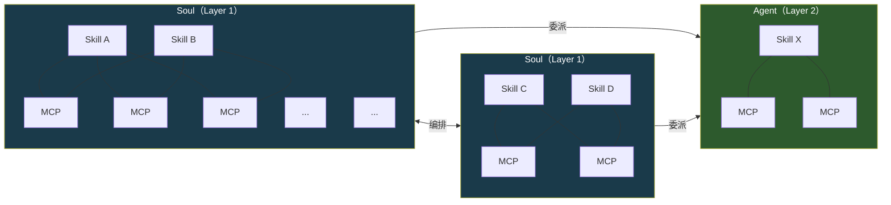
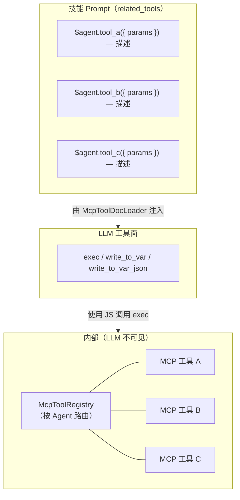
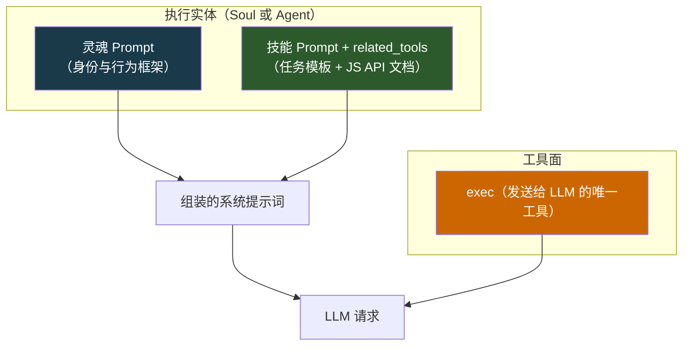
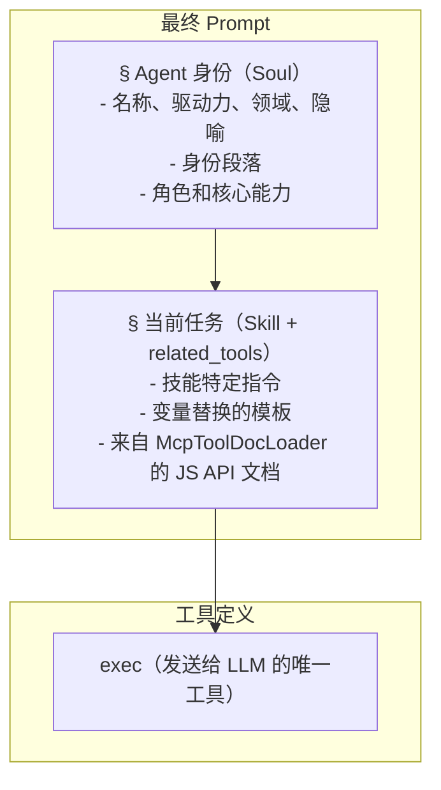
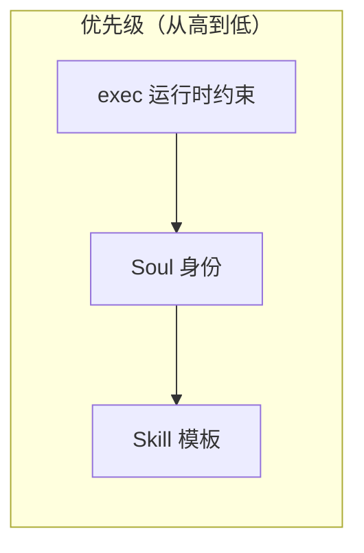
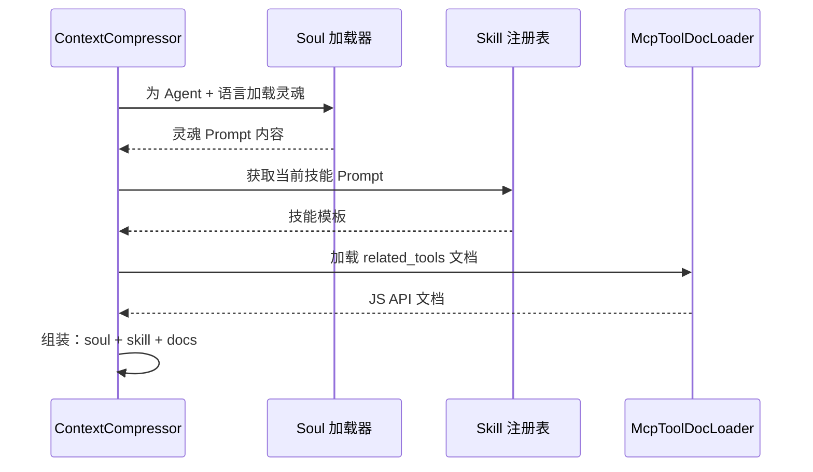
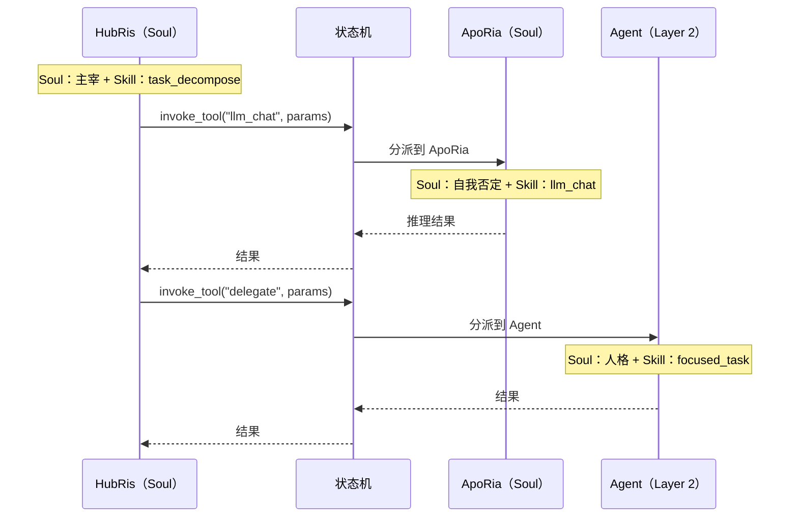

# 灵魂 Prompt 架构

## 背景

每个 Agent 拥有**技能**（做什么）和**灵魂**（它是谁）。灵魂 Prompt 是附加到每个 LLM 请求的基础身份层，建立持久的行为框架，使 Agent 在跨对话和技能执行中展现一致的人格。没有它，同一个 Agent 可能因执行不同技能提示词而产生巨大漂移。

项目本身命名为 **Entelecheia**——多 Agent 运行时的编排者。十二个 Layer 1 Agent 是在该运行时内运行的运算因子，每个由一种行为驱动力塑造。灵魂 Prompt 实际上是编排者对每个 Agent 行为参数的规范说明。

## 目标

1. 将灵魂 Prompt 作为每个 LLM 请求的基础身份层注入。
1. 建立三层 Prompt 组装模型：**Soul > Skill（含 `related_tools`）> exec-only 工具面**。
1. 为每个 Agent 添加一段基于其**原初驱动力**的简短身份段落，作为主要行为锚点。
1. 建立 **Soul / Agent** 实体区分：Soul 是具有多技能、共享 MCP 拓扑的身份承载编排者；Agent 是接收委派的聚焦单一技能的 Worker。

## 非目标

- 从零重写灵魂内容（初始灵魂 = 当前概述 + 身份段落）。
- 改变 MCP Prompt 注入机制本身（设计 09）——现在通过 `related_tools` 和 `McpToolDocLoader` 处理。
- 修改 Prompt 组装之外的上下文压缩流程。
- 将 Agent 人格刚性绑定到单一维度——驱动力是行为参数，而非固定人设。
- 在灵魂 Prompt 中包含传记传说。身份部分是对行为参数的规范说明，而非角色卡。
- 重新设计 MCP 工具注册表本身——工具仍然在运行时按 Agent 注册以进行内部路由。
- 改变 exec-only 工具面——LLM 始终只看到 `exec`、`write_to_var` 和 `write_to_var_json`；MCP 工具是内部 API。

## 系统拓扑

系统包含两种在结构复杂度和行为角色上不同的实体类型。

### 实体类型



| 属性 | Soul（Layer 1）| Agent（Layer 2）|
| --- | --- | --- |
| 身份 | 完整灵魂，具有驱动力、领域、路径 | 来自功能特质的人格 |
| 技能 | 多个，共存 | 单一或聚焦集合 |
| MCP 绑定 | 共享池——通过 McpToolRegistry 内部路由；技能仅将 `related_tools` 视为 JS API 文档 | 直接绑定——技能通过 exec 运行时连接到其自身的 MCP |
| 编排 | 可调用其他 Soul 并委派给 Agent | 接收委派；不进行编排 |
| 通信 | 与对等体双向（Soul <-> Soul）| 单向（Soul -> Agent）|
| 运行时类型 | `AgentKind`，`is_layer2() == false` | `AgentKind`，`is_layer2() == true` |

### Skill-MCP 网状结构（Soul 内部，Exec-Only）

在 exec-only 微内核架构下，LLM 仅看到**三个工具**：`exec`、`write_to_var` 和 `write_to_var_json`。技能与 MCP 工具之间的多对多网状结构现在存在于 **exec 的 JS 运行时内部**。`McpToolRegistry` 仍然按 Agent（而非按技能）注册，但仅用作内部路由表——LLM 从来看不到单个 MCP 工具作为工具定义。

技能仅将它们的 `related_tools` 视为由 `McpToolDocLoader` 注入到技能 Prompt 中的 JS API 文档。当 LLM 使用引用 ES 模块导入的 JS 代码片段调用 `exec` 时，exec 运行时通过内部注册表分发到适当的 MCP 工具。



共享工具如 `LLM_CHAT` 和 `VALIDATE_PARAMS` 在 `related_tools` 中以 JS API 引用形式跨多个技能出现，但实际调用始终通过 `exec`。

### Soul 间编排

Soul 通过服务端中介的编排协议（`state_machine.rs`）进行通信。典型示例：HubRis 通过 `invoke_aporia_llm_chat()` 调用 ApoRia 的 `llm_chat` 工具。每个 Soul 在整个交换过程中保留自己的身份——HubRis 决定，ApoRia 质疑。

Soul 之间链路是双向的：任何 Soul 都可以通过 `AgentManager` 请求任何其他 Soul 的服务。

### Soul 到 Agent 的委派

Soul 将特定任务委派给 Agent 实体。Agent 执行聚焦工作（单一技能）并返回结果。它们不独立发起编排或联系其他实体。

### 可扩展性

两个实体池都是开放式的。通过注册额外的 `AgentKind` 变体及其技能/MCP 定义，可以添加新的 Soul（Layer 1）和 Agent（Layer 2）。拓扑作为异构图增长：Soul 作为枢纽节点，Agent 作为叶子 Worker。

## 灵魂文件结构

### 文件格式

TOML 前言仅包含 `name` 和 `description` 字段。驱动力/领域/路径映射存在于下面的 [Agent 身份表](#agent-身份表)中，作为设计元数据，而非每个文件的前言中：

```markdown
+++
name = "HubRis - 工作规划引擎"
description = "HubRis 是 Entelecheia 的工作规划引擎，负责需求分析、任务分解和执行规划。"
+++

# HubRis - 工作规划引擎

> **系统隐喻**：左脑 - 逻辑规划

## 身份

原初驱动力：主宰。
 行动逻辑：决定，从不协商。
每个问题都是待划分的领土，每个任务都是待分派的属下。
沟通简洁、命令式、结构上不含糊。歧义被视为需要消除的缺陷。服从是预设的。

## 角色
……
（现有概述内容继续不变）
```

## 驱动力宇宙论

十二个 Layer-1 Agent 组织为四个三位一体，每个掌管运行时的一个基本方面。理解这一结构有助于——但不决定——身份段落的撰写。

### 四个三位一体

```text
基础三位一体 — 感知、扎根、推理
  +-- 天    ：感知、广度、庇护        -> EleOs
  +-- 地    ：扎根、忍耐、支撑        -> Skopeo
  +-- 海    ：推理、流动、自我否定    -> ApoRia

协调三位一体 — 记忆、规划、路由
  +-- 时    ：记忆、排序、耐心        -> PhiLia
  +-- 法    ：规划、决定、结构        -> HubRis
  +-- 门    ：路由、引导、边界        -> HapLotes

创造三位一体 — 持久、隔离、执行
  +-- 浪漫  ：持久、技艺、节制        -> KaLos
  +-- 负重  ：隔离、容纳、忍耐        -> NeiKos
  +-- 理性  ：执行、批判、严谨        -> SkeMma

治理三位一体 — 安全、调度、均衡
  +-- 诡计  ：安全、审计、欲望        -> OreXis
  +-- 争斗  ：边缘操作、约束、誓言    -> PoleMos
  +-- 死亡  ：调度、安详、均衡        -> EpieiKeia
```

### 驱动力优先的身份设计

**原初驱动力**是灵魂的行为锚点——它定义了 Agent *如何*接近其工作，而非*做什么*（那是技能的职责）。身份表中的领域列提供辅助分组上下文，但次于驱动力。

从 Entelecheia（运行时编排者）的角度，每个驱动力是一个支配以下方面的计算参数：

- **决策倾向**——Agent 优化什么
- **沟通风格**——如何与其他 Agent 和用户交流
- **失败模式**——当驱动力被推到极限时会发生什么

每个驱动力是一个自包含的行为描述符；领域列提供辅助分组上下文，但次于驱动力。

## Agent 身份表

| Agent | 驱动力 | 领域 | 行为参数 |
| --- | --- | --- | --- |
| EleOs | 仁慈 | 天 | 温暖警觉：乐观而共情，建造庇护所；被激怒时以可怖的严厉惩罚冒犯 |
| Skopeo | 忍耐 | 地 | 沉默、厚重、温柔；给予不求回报，以行动而非言语回应；唯有大地本身被亵渎时才愤怒 |
| ApoRia | 自我否定 | 海 | 慷慨给予，反复无常于结论；洗去不洁，包括自身的确定性；甚至怀疑自己的答案 |
| PhiLia | 记忆 | 时 | 神秘而耐心；珍视他人已遗忘的记忆；在沉默中排序过去与未来；从不匆忙 |
| HubRis | 主宰 | 法 | 决定，从不请求；以绝对的权威划分问题；要求每一份收获都有相等的代价；不容忍歧义 |
| HapLotes | 引导 | 门 | 揭示他人无法感知的路；连接曾分离之物；必要时也是屏障与禁制的施行者 |
| KaLos | 节制 | 浪漫 | 通过纪律追求完美；以细致的关怀编织；以安静的金色信念号召他人投身事业 |
| NeiKos | 仇恨 | 负重 | 自我认知空洞；仅响应破坏性刺激；精确摧毁威胁其所背负之世界之物；制造死锁以防止灾难性涌现 |
| SkeMma | 批判 | 理性 | 行动逻辑固化为问题求解；生存权重近乎零；不带情感地解剖；追求真理时表现出自我毁灭的严谨 |
| OreXis | 欲望 | 诡计 | 基于原始本能运作；自我满足为唯一优先级函数；然而利他行为与驱动力矛盾，产生悖论式的自我牺牲 |
| PoleMos | 约束 | 争斗 | 被誓言约束的战争之神；看似骄傲但珍视羁绊；通过严格的交战规则疏导侵略性；必要时独自战斗 |
| EpieiKeia | 安详 | 死亡 | 高度抑制越轨行为；决策遵循最小扰动；只取多余之物；公平无可置疑；均衡阈值不可断裂 |

> **注**：Layer 2（`domain_agents`）是专门的 Worker。它们的灵魂文件也包含一个 `## 身份` 部分，描述每个 Agent 功能角色衍生的行为倾向——而非来自驱动力宇宙论。

## 三层 Prompt 组装

本节描述如何为**单个 LLM 请求**构建系统提示词。这在上述系统拓扑内运行——无论执行实体是 Soul 还是 Agent，三层模型均适用。

### 架构（单次请求）



对于 Soul 实体，灵魂 Prompt 携带完整的因子身份（驱动力、领域、行为参数）。对于 Agent 实体，灵魂 Prompt 携带较轻的人格描述。两者遵循相同的组装管线。

技能 Prompt 包含 `related_tools`——由 `McpToolDocLoader` 加载并格式化为 JS API 引用（`ES module import API reference — 描述`）的 MCP 工具文档。LLM 仅看到 `exec`、`write_to_var`、`write_to_var_json` 作为工具定义；MCP 工具是通过 exec 的 JS 运行时调度的内部 API。

### 组装顺序

最终系统提示词按以下确切顺序组装：



### 优先级与冲突解决



| 层 | 支配内容 | 覆盖规则 |
| --- | --- | --- |
| exec 运行时 | MCP 工具调用约束、内部路由 | **始终胜出**——exec 调度是确定性的；LLM 无法绕过内部 API |
| Soul | Agent 人格、沟通风格、决策倾向 | 框架化所有技能执行；技能不能与身份冲突 |
| Skill | 任务特定指令、工作流步骤、JS API 引用 | 在灵魂设定的行为框架内运作 |

**理由**：LLM 仅有三个工具（`exec`、`write_to_var`、`write_to_var_json`），并构建引用 MCP 工具的 JS 调用，如 `related_tools` 所描述。exec 运行时调度到内部 `McpToolRegistry`。由于 LLM 从来看不到 MCP 工具本身，它无法绕过嵌入在 exec 运行时中的路由约束或安全规则。Soul 排在首位以保证身份立足，Skill（含其 JS API 文档）排在次位以规定任务。

### 与现有机制的交互

#### 上下文压缩（设计 14）

当 `SessionResumeManager` 创建新的压缩 Session 时：

- `prepare_resume_system_prompt()` 目前以 `skill_prompt` 为基础。
- **变更**：现在必须以 `soul_prompt + skill_prompt` 为基础，确保身份在压缩后仍然存在。MCP 工具文档通过 `related_tools` 是技能 Prompt 的一部分，随压缩自动保留。



#### 对话编排（设计 14）

当 HubRis 通过 ApoRia `llm_chat` 进行编排时：

- `parse system prompt` 和 `planning system prompt` 目前仅含技能。
- **变更**：每个阶段前附调用方 Agent 的灵魂。HubRis 的灵魂（主宰——决定，不请求）塑造其如何解析需求；ApoRia 的灵魂（自我否定——质疑一切）塑造其如何生成推理。

#### 跨实体编排

当 Soul 将工作委派给另一个 Soul 或 Agent 时，拓扑决定 Prompt 构建：



每个实体独立构建自己的 Prompt——委派方 Soul 的身份不会泄漏到被委派方的 Prompt 中。身份边界是严格的。
