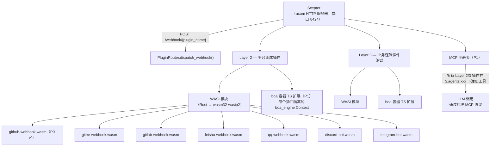
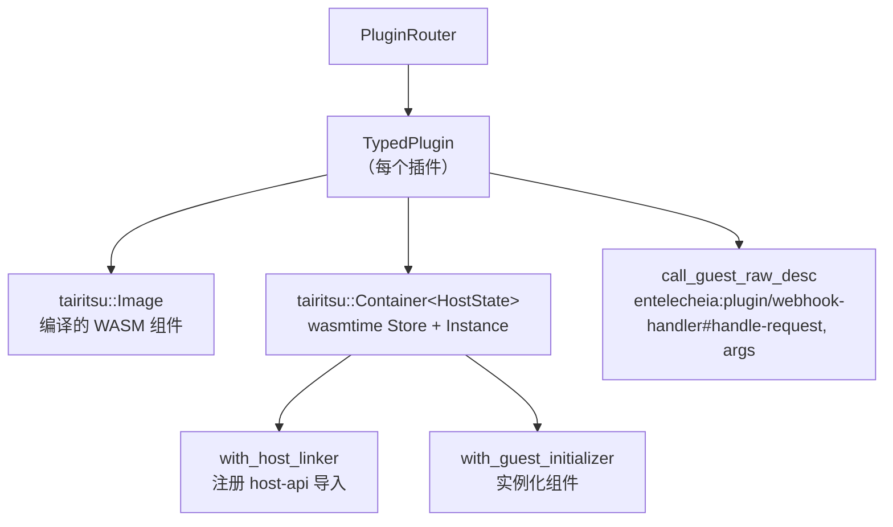

# 25 — WASI 插件系统设计

## 概述

WASI 插件系统以 **WASM 组件模型**插件替代了之前的 Python/TypeScript webhook 脚手架，提供沙箱化、语言无关的平台集成（Layer 2）和业务逻辑扩展（Layer 3）。关键设计目标：

1. **双重扩展机制**：Layer 2（平台集成）和 Layer 3（业务逻辑）均支持 WASI 模块和 boa TS 扩展。
1. **统一 MCP 注册**：所有插件在 `$.agents.xxx` 下注册工具，无论实现语言如何。
1. **宿主管理的 I/O**：宿主（Scepter axum 服务器）处理 HTTP 路由、WebSocket 和长连接；插件仅处理逻辑。
1. **强沙箱化**：WASM 模块在 wasmtime 下运行，具有燃料限制和纪元中断。

## 架构



## WIT 接口定义

位于 `packages/shared/plugin_host/wit/plugin.wit`：

```wit
package entelecheia:plugin;

interface host-api {
    http-request:  func(method: string, url: string, headers: string, body: string) -> result<string, string>;
    forward-event: func(event-json: string) -> result<_, string>;
    query-ai:      func(message: string, context: option<string>) -> result<string, string>;
    log:           func(level: string, message: string);
    config-get:    func(key: string) -> option<string>;
    kv-get:        func(key: string) -> option<string>;
    kv-set:        func(key: string, value: string) -> result<_, string>;
    register-mcp-tool: func(tool-name: string, description: string, schema: string) -> result<_, string>;
}

interface webhook-handler {
    name: func() -> string;
    handle-request: func(method: string, path: string, headers: string, body: string) -> result<string, string>;
}

interface bot-handler {
    name: func() -> string;
    on-message: func(platform: string, message: string) -> result<option<string>, string>;
}

world layer2-plugin {
    import host-api;
    export webhook-handler;
}

world layer2-bot {
    import host-api;
    export bot-handler;
}
```

### 宿主端 API 注册

宿主在组件实例化前使用 wasmtime 的 `component::Linker::func_wrap` 注册所有 `host-api` 函数：

```rust
let mut instance = linker.root().instance("entelecheia:plugin/host-api")?;

instance.func_wrap("http-request",
    |_: StoreContextMut<'_, HostState>,
     (method, url, headers, body): (String, String, String, String)| {
        Ok::<(Result<String, String>,), wasmtime::Error>(
            (api.http_request(method, url, headers, body),)
        )
    }
)?;
```

### 宾客端绑定

插件使用 `wit_bindgen::generate!()` 生成宾客端绑定：

```rust
wit_bindgen::generate!({
    path: "wit",
    world: "layer2-plugin",
});

struct GithubWebhookPlugin;
impl exports::entelecheia::plugin::webhook_handler::Guest for GithubWebhookPlugin {
    fn name() -> String { "github-webhook".to_string() }
    fn handle_request(method: String, path: String, headers: String, body: String)
        -> Result<String, String> { /* ... */ }
}
export!(GithubWebhookPlugin);
```

## 插件宿主架构

### Crate：`_shared_plugin_host`（`packages/shared/plugin_host/`）

| 模块 | 职责 |
| --- | --- |
| `plugin_state.rs` | `HostFunctions` — 实现所有 `host-api` 函数（HTTP、KV、配置、事件）|
| `plugin_loader.rs` | `TypedPlugin` — 构建 wasmtime 容器，注册宿主导入，通过动态 `call_guest_raw_desc` 调用宾客导出 |
| `plugin_router.rs` | `PluginRouter` — 管理已加载插件，分发 webhook/bot 请求，自动扫描 `plugins/` 目录 |
| `host_functions.rs` | 重导出 `HostFunctions` 和 `HostApiProvider` trait |

### 运行时栈



### 宾客导出名称

由于宾客方的 `wit_bindgen::generate!` 将函数导出在 WIT 接口名称下，宿主使用完全限定名称进行动态调用：

```text
entelecheia:plugin/webhook-handler#name
entelecheia:plugin/webhook-handler#handle-request
entelecheia:plugin/webhook-handler#on-message
```

### 异步桥

宿主函数是同步的（wasmtime 要求），但实现需要异步（HTTP、数据库）。桥使用 `tokio::task::block_in_place` + `Handle::block_on`：

```rust
instance.func_wrap("kv-get",
    move |_: StoreContextMut<'_, HostState>, (key,): (String,)| {
        let result = tokio::task::block_in_place(|| {
            let handle = tokio::runtime::Handle::current();
            handle.block_on(api.kv_get(&key))
        });
        Ok::<(Option<String>,), wasmtime::Error>((result,))
    }
)?;
```

Scepter 的 webhook 处理器使用 `tokio::task::spawn_blocking` 从异步 axum 处理器调用同步 WASM 方法。

## Scepter 集成

### 路由注册

`packages/scepter/src/app/setup.rs` — 添加到 axum 路由：

```rust
.merge(crate::api::plugin_webhook::create_plugin_webhook_routes())
```

### Webhook 处理器

`packages/scepter/src/api/plugin_webhook.rs`：

- `POST /webhook/{plugin_name}` — 提取路径、头部、正文
- 在 `tokio::task::spawn_blocking` 内调用 `PluginRouter::dispatch_webhook()`
- 返回插件响应或错误

### 插件自动加载

启动时，Scepter 创建 `PluginRouter` 并扫描 `plugins/`（或 `$PLUGIN_DIR`）查找 `.wasm` 文件：

```rust
let plugin_dir = std::path::PathBuf::from(
    std::env::var("PLUGIN_DIR").unwrap_or_else(|_| "plugins".to_string()),
);
router.scan_and_load_dir(&plugin_dir)?;
```

## 插件开发指南

### 创建 WASI 插件

1. 在 `plugins/` 下初始化新的 crate：

```toml
# plugins/my-platform/Cargo.toml
[package]
name = "plugin-my-platform"
version = "0.1.0"
edition = "2024"

[lib]
crate-type = ["cdylib", "rlib"]

[dependencies]
wit-bindgen = "0.57"
serde = { version = "1", features = ["derive"] }
serde_json = "1"
```

1. 复制 WIT 文件：

```text
plugins/my-platform/wit/plugin.wit  ← 从 packages/shared/plugin_host/wit/ 软链接或复制
```

1. 实现 `Guest` trait：

```rust
// plugins/my-platform/src/lib.rs
wit_bindgen::generate!({ path: "wit", world: "layer2-plugin" });

use exports::entelecheia::plugin::webhook_handler::Guest;

struct MyPlatformPlugin;

impl Guest for MyPlatformPlugin {
    fn name() -> String { "my-platform".to_string() }
    fn handle_request(method: String, path: String, headers: String, body: String)
        -> Result<String, String> {
        // 使用 host-api 函数：log()、http-request()、kv-get() 等
        log("info", &format!("received {} request", method));
        Ok(r#"{"status":"ok"}"#.to_string())
    }
}

export!(MyPlatformPlugin);
```

1. 配置 `.cargo/config.toml`：

```toml
[target.wasm32-wasip2]
rustflags = ["--cfg=unstable_wasi_extension", "--cfg=unstable_wasi_export_wasi_reactor"]
```

1. 构建：

```bash
cargo build --target wasm32-wasip2 --release -p plugin-my-platform --lib
```

1. 部署：将 `.wasm` 文件复制到 `plugins/` 目录（或设置 `PLUGIN_DIR`）。

## 宿主函数参考

| 函数 | 签名 | 描述 |
| --- | --- | --- |
| `http-request` | `(method, url, headers, body) → result<string, string>` | 发起 HTTP 请求（用于回复外部平台）|
| `forward-event` | `(event-json) → result<_, string>` | 将结构化事件转发到 Scepter |
| `query-ai` | `(message, context?) → result<string, string>` | 查询 AI 管线（尚未连接）|
| `log` | `(level, message)` | 通过 Scepter 的 tracing 发送结构化日志 |
| `config-get` | `(key) → option<string>` | 读取插件配置 |
| `kv-get` | `(key) → option<string>` | 持久 KV 存储（OAuth 令牌等）|
| `kv-set` | `(key, value) → result<_, string>` | 写入持久 KV 存储 |
| `register-mcp-tool` | `(name, description, schema) → result<_, string>` | 注册 MCP 工具（P1）|

## 安全模型

| 机制 | 实现 |
| --- | --- |
| **沙箱** | wasmtime 组件模型沙箱——默认无文件系统、无网络访问 |
| **资源限制** | 通过 tairitsu Container 构建器的燃料计量（每条指令计费）+ 纪元中断（超时）|
| **宿主独占 I/O** | 所有 I/O 通过宿主函数进行；插件无法打开套接字或文件 |
| **插件隔离** | 每个插件是独立的 wasmtime 实例，拥有自己的内存，无跨插件共享 |
| **TS 沙箱（P1）** | boa_engine Context，使用 skemma 的 COMPUTE_TIMEOUT（120s）/ ABSOLUTE_CEILING（600s）|

## 实现状态

| 阶段 | 组件 | 状态 |
| --- | --- | --- |
| **P0** | GitHub webhook WASI 插件 | ✅ 已完成 |
| **P0** | PluginRouter + Scepter 集成 | ✅ 已完成 |
| **P0** | HostFunctions（全部 8 个 host-api 函数）| ✅ 已完成 |
| **P1** | boa TS 扩展基础设施 | 未开始 |
| **P1** | 通过 `$.agents.xxx` 的 MCP 工具注册 | 未开始 |
| **P2** | 其余平台插件（Gitee、GitLab、飞书、QQ、Discord、Telegram）| 未开始 |
| **P2** | Layer 3 业务逻辑插件 | 未开始 |

## 关键文件

| 文件 | 用途 |
| --- | --- |
| `packages/shared/plugin_host/Cargo.toml` | wasmtime 43、tairitsu 运行时、reqwest |
| `packages/shared/plugin_host/wit/plugin.wit` | 规范的 WIT 接口定义 |
| `packages/shared/plugin_host/src/plugin_state.rs` | HostFunctions、HostApiProvider trait |
| `packages/shared/plugin_host/src/plugin_loader.rs` | TypedPlugin、宿主函数注册 |
| `packages/shared/plugin_host/src/plugin_router.rs` | PluginRouter、分发、scan_and_load_dir |
| `packages/scepter/src/api/plugin_webhook.rs` | Axum webhook 路由处理器 |
| `packages/scepter/src/app/setup.rs` | 路由注册 + PluginRouter 初始化 |
| `plugins/github-webhook/` | 参考实现 |
| `plugins/github-webhook/src/lib.rs` | GitHub webhook 插件（issues、PR、push、comment）|
