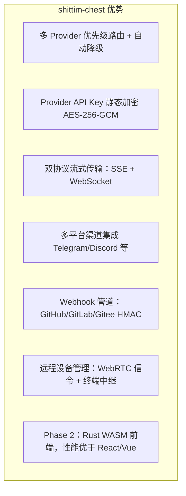

# 产品定位与竞争优势

## 概述

shittim-chest 是一个松耦合的 LLM WebUI 平台，直接竞品包括 Open WebUI、LobeChat 等。其与 entelecheia 的集成是可选特性，而非架构前提。

## 核心定位

| 维度 | 描述 |
| --- | --- |
| 本质 | 一个独立的多 Provider LLM 聊天 WebUI |
| 竞品 | Open WebUI、LobeChat、NextChat |
| 与 entelecheia 的关系 | 松耦合：通过 JWT 代理桥接的可选集成 |
| 独立性 | 无需 entelecheia 即可提供完整聊天体验 |

## 与 Open WebUI 的差异化

## 与 entelecheia 的边界

| shittim-chest | entelecheia |
| --- | --- |
| 用户认证（argon2 + JWT） | 用户身份与权限（RBAC） |
| 会话管理 | Agent 编排（scepter） |
| 聊天数据（对话/消息） | Cosmos 容器运行时 |
| LLM Provider 管理 + Key 加密 | IEPL TypeScript 执行引擎 |
| Webhook 入口（HMAC 验证 + 转发） | Agent 工具调用 |
| 前端渲染（arona） | WebSocket Agent 通道 |
| 远程设备会话 + 信令中继 | polemos 设备 Agent |
| 多平台渠道配置 | — |

**核心原则**：shittim-chest 仅持有"用户侧"数据；entelecheia 仅持有"Agent 侧"数据。两者通过 JWT 认证的 HTTP/WebSocket 通信，互不访问对方数据库。

## 架构演进路线图

| 阶段 | 状态 | 内容 |
| --- | --- | --- |
| P1-P6 | 已完成 | 独立聊天、认证、Provider 管理、Webhook、代理桥接、设备管理 |
| P7 | 计划中 | 语音输入/输出（STT Docker 容器 + TTS 代理） |
| P8 | 计划中 | PWA 移动端 + Tauri Mobile |
| P9 | 计划中 | Rust WASM 前端迁移（arona → Tairitsu） |

## 设计理念

1. **独立优先**：所有核心功能不依赖 entelecheia。`LLM_DEFAULT_PROVIDER_*` 环境变量即可独立启动聊天。
1. **松耦合集成**：entelecheia 集成是可选的代理层。用户可选择仅使用 LLM 聊天，或通过 entelecheia 启用 Agent 编排。
1. **渐进式 WASM**：Vue 3 前端先行交付，作为"活体规范"；WASM 迁移有明确的决策阈值（框架成熟度、生态覆盖、开发带宽）。
1. **Docker 原生**：所有服务端组件通过 bollard Docker API 管理，不依赖 docker-compose。
