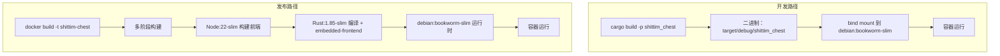

# 双模式部署路径：开发模式 vs 发布模式

## 概述

shittim-chest 支持两种部署模式：Dev（本地快速迭代，无需 Node，无需镜像构建）和 Release（完整 Docker 镜像，内嵌前端静态文件）。两种模式共享相同的容器拓扑和网络。

## 设计动机

构建完整 Docker 镜像（Node 前端构建 + Rust 编译 + `embedded-frontend`）耗时 30 秒以上，不适合日常开发迭代。开发模式利用宿主机的增量 Rust 编译缓存，将二进制 bind mount 到最小运行时容器中，实现亚秒级重启。

## 路径对比



| 维度 | 开发模式（`just dev`） | 发布模式（`just up`） |
| --- | --- | --- |
| 前端 | Vite 构建，后端通过 `just dev` 托管 | 内嵌于二进制（`embedded-frontend` 特性） |
| 需要 Node | 是（Vite 构建） | 是（Docker 内） |
| 二进制来源 | 本地 `cargo build` | Docker 内编译 |
| 容器基础镜像 | `debian:bookworm-slim` | `debian:bookworm-slim`（多阶段构建产物） |
| 重启速度 | < 5s（增量编译后） | 30-60s（全量构建） |
| 使用场景 | 日常开发、调试 | CI/生产部署 |
| 容器启动方式 | `Config.cmd = ["shittim_chest"]` | 镜像包含 ENTRYPOINT |

## 开发模式实现细节

### 本地编译

```rust
async fn cargo_build() -> Result<()> {
    Command::new("cargo")
        .args(["build", "-p", "shittim_chest"])
        .status().await?;
}
```

编译输出路径固定为 `$PWD/target/debug/shittim_chest`（debug 配置，保留调试符号）。

### Bind Mount 启动

```rust
let config = Config::<String> {
    image: Some("debian:bookworm-slim".into()),   // 最小运行时
    cmd: Some(vec!["shittim_chest".to_string()]),
    host_config: Some(HostConfig {
        binds: Some(vec![
            format!("{bin_path}:/usr/local/bin/shittim_chest:ro")
        ]),
        network_mode: Some(NET.into()),
        port_bindings: ...,
        ..
    }),
    env: Some(container_env(password, port)),
    ..
};
```

关键点：

- 二进制以只读方式挂载（`:ro`），防止容器内意外修改
- 二进制路径为 `/usr/local/bin/shittim_chest`，在容器内直接执行
- 基础镜像 `debian:bookworm-slim` 提供所需的 glibc 运行时

### 迁移执行

迁移通过一次性容器执行：

```bash
docker run --rm --network shittim-chest \
  -v $PWD/target/debug/shittim_chest:/usr/local/bin/shittim_chest:ro \
  -e SHITTIM_CHEST_DATABASE_URL=... \
  debian:bookworm-slim \
  shittim_chest db-migrate
```

自动重试最多 5 次（间隔 2 秒），以应对 PG 尚未完全就绪的情况。

## 发布模式实现细节

### Dockerfile 多阶段构建

```dockerfile
# Stage 1：前端  → Node:22-slim + pnpm → pnpm build:all → /app/dist/
# Stage 2：构建  → Rust:1.85-slim + COPY dist/ → cargo build --features embedded-frontend
# Stage 3：运行时 → debian:bookworm-slim + ca-certificates + COPY 二进制
```

### embedded-frontend 特性

```rust
# [cfg(feature = "embedded-frontend")]
{
    static FRONTEND_DIR: Dir<'_> = include_dir!("$CARGO_MANIFEST_DIR/../dist");
    // 挂载到 Axum Router 的 /static/* 路径
}
```

此特性使用 `include_dir!` 宏在编译时将前端构建产物嵌入二进制。发布模式下无需额外反向代理即可服务完整 SPA。

## 迁移与启动函数命名

为避免混淆，代码明确区分两组函数：

| 开发路径 | 发布路径 |
| --- | --- |
| `run_migrate_dev()` | `run_migrate_release()` |
| `start_app_dev()` | `start_app_release()` |
| `cargo_build()` | `build_image()` |

## 前端开发

开发模式下，`dev.py` 在文件变更时重新构建前端资源。后端在同一端口（开发环境 :3000，生产环境 :80）同时提供静态文件和 API 服务。
