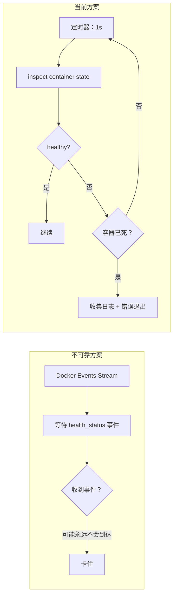

# PostgreSQL 健康检查策略

## 概述

CLI 封装器必须在启动应用容器之前确保 PostgreSQL 已就绪。本文档阐述了被动轮询健康检查策略的设计决策——拒绝 Docker 事件（不可靠）和固定超时（不灵活）方案。

## 为什么不使用 Docker 事件



在 Docker events stream 中，`container` 过滤器对 `health_status` 事件不可靠——尤其是在 PG 容器重启后。实际使用中，事件可能永远不会触发，导致 CLI 无限等待。

## 轮询策略

```text
while true:
    sleep 1s
    state = docker.inspect_container(PG)
    if state.health.status == HEALTHY:
        break
    if !state.running:
        bail!(collect_logs(PG))
```

| 参数 | 值 | 理由 |
| --- | --- | --- |
| 轮询间隔 | 1s | 响应足够快，无 inspect 开销 |
| 超时 | 无 | 无硬超时；PG 可能存在冷启动 |
| 死亡检测 | 每次轮询 | 容器不存 → 立即报错并转储最后 50 行日志 |

## PostgreSQL 容器健康配置

```rust
HealthConfig {
    test:        ["CMD-SHELL", "pg_isready -U shittim_chest"],
    interval:    5_000_000_000,   // 5s（纳秒）
    timeout:     5_000_000_000,   // 5s
    retries:     10,
    start_period: 30_000_000_000, // 30s 初始宽限期
}
```

| 参数 | 值 | 理由 |
| --- | --- | --- |
| `pg_isready` | 用户级别 | 比 TCP 端口检测更可靠；确保 PG 完全接受连接 |
| `interval: 5s` | 适中 | 避免频繁重试和日志噪音 |
| `retries: 10` | 高 | 迁移和 initdb 可能耗时较长；充足重试次数 |
| `start_period: 30s` | 长 | pg18 initdb 首次启动可能较慢 |

## 数据卷挂载路径

```rust
Mount {
    target: "/var/lib/postgresql",     // pg18 新路径
    source: "shittim-chest-pgdata",
    typ: MountTypeEnum::VOLUME,
}
```

pg18 将数据目录从 `/var/lib/postgresql/data` 更改为 `/var/lib/postgresql`。使用错误路径会导致 PG 启动后找不到数据。

## 迁移重试

数据库迁移具有独立的 5 次重试逻辑：

```text
for retry in 0..5:
    execute docker run --rm ... shittim_chest db-migrate
    if success: break
    sleep 2s
```

即使在 `wait_healthy` 返回后，迁移仍可能因 PG 仍在完成恢复而失败。短间隔重试可处理这一关键窗口期。

## 日志收集

当容器崩溃时，自动收集最后 50 行日志：

```rust
async fn collect_logs(docker: &Docker, name: &str) -> String {
    docker.logs(name, LogsOptions { tail: "50", stdout: true, stderr: true, .. })
}
```

这对于调试 PG 启动失败至关重要——initdb 错误、权限问题、端口冲突等仅能从容器日志中可见。
