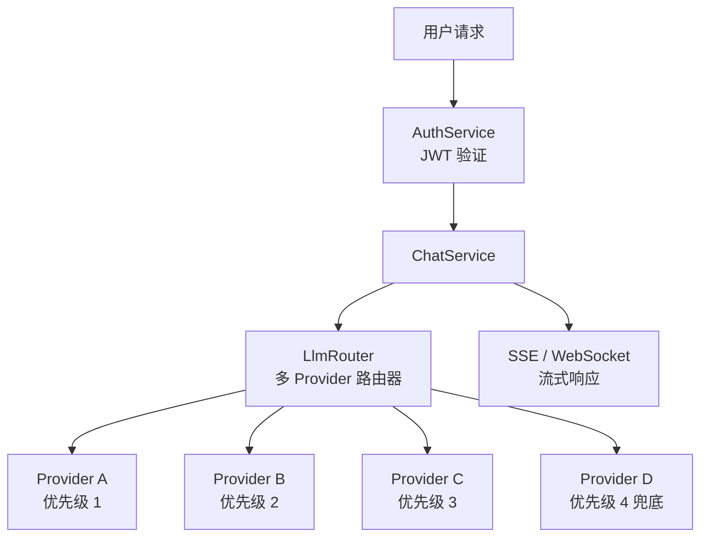
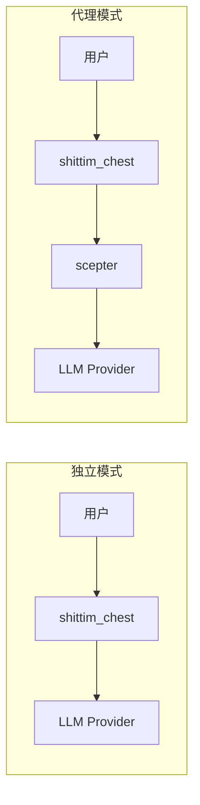

# 独立 LLM 架构

## 概述

shittim-chest 拥有完全独立的 LLM 路由层，不依赖 entelecheia。用户可以配置多个 LLM Provider，内置路由器根据优先级和可用性自动选择。这是 shittim-chest 与 Open WebUI 的核心差异化能力。

## 架构



## 核心能力

### 1. 多 Provider 优先级路由

```text
每个 Provider 有优先级字段（数字越小优先级越高）。
请求从高到低依次尝试：
  → Provider A（priority=1）可用 → 使用
  → 不可用 → Provider B（priority=2）可用 → 使用
  → 不可用 → ... → 返回错误
```

### 2. 自动降级

当高优先级 Provider 返回错误（超时、速率限制、无法访问）时，路由器自动切换到下一个可用 Provider，对用户透明。

### 3. API Key 加密存储

所有 Provider API Key 使用 AES-256-GCM 静态加密后存储在 `shittim_chest_db` 中。加密密钥通过 `ENCRYPTION_KEY` 环境变量提供。即使数据库被泄露，API Key 仍不可读。

### 4. 双协议流式传输

| 协议 | 端点 | 使用场景 |
| --- | --- | --- |
| SSE | `/api/chat/stream` | 简单 HTTP 流式，代理友好，浏览器原生支持 |
| WebSocket | `/ws/chat/stream` | 双向通信，支持取消和实时交互 |

### 5. OpenAI 兼容

所有 Provider 接口遵循 OpenAI `/v1/chat/completions` 格式，可与任何 OpenAI API 兼容的服务集成（DeepSeek、OpenAI、本地 Ollama/LM Studio 等）。

## Provider 管理

### 配置来源

| 方式 | 使用场景 |
| --- | --- |
| 环境变量（`LLM_DEFAULT_PROVIDER_*`） | 快速启动，单 Provider 场景 |
| 数据库 CRUD（`/api/providers/*`） | 多 Provider，动态管理 |
| arona 管理面板 | 图形化管理 |

### 种子 Provider

首次启动时，如果设置了 `LLM_DEFAULT_PROVIDER_*` 环境变量，`db-init` 会自动创建一个种子 Provider。后续可通过 arona 管理面板添加更多 Provider。

## 独立模式 vs 代理模式



| 模式 | 条件 | 行为 |
| --- | --- | --- |
| 独立 | 未配置 scepter（或 `Proxy: disabled`） | 直接调用 LLM Provider |
| 代理 | 已配置 scepter URL | 通过代理层转发至 entelecheia Agent 处理 |

独立模式完整提供聊天体验：对话管理、消息持久化、搜索、导出。代理模式在此基础上增加 Agent 编排能力。

## 技术实现

- **路由器**：`packages/shittim_chest/src/llm/router.rs`，支持优先级选择 + 降级
- **客户端**：`packages/shittim_chest/src/llm/client.rs`，基于 `reqwest` + `rustls`（无 OpenSSL 依赖）
- **Provider CRUD**：`packages/shittim_chest/src/api/providers.rs`，标准 REST 端点
- **加密**：`aes-gcm` crate，`ENCRYPTION_KEY` 环境变量
