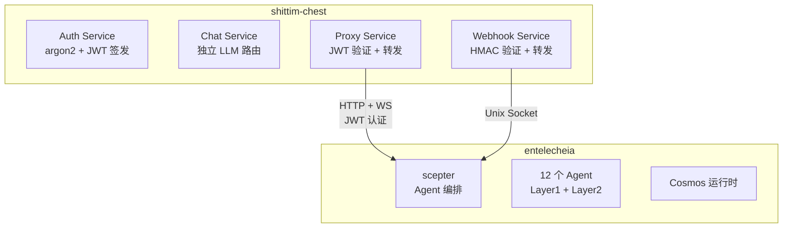

# 与 entelecheia 的松耦合设计

## 概述

shittim-chest 与 entelecheia 的集成基于 JWT 认证的 HTTP/WebSocket 代理桥接。此设计允许 shittim-chest 完全独立运行，无需 entelecheia；同时在需要时可按需启用 Agent 编排能力。

## 边界设计



## 数据所有权

| shittim_chest_db | entelecheia_db |
| --- | --- |
| auth_users（密码哈希） | user_identities（user_id） |
| sessions（活跃会话） | groups |
| refresh_tokens | group_memberships |
| oauth_connections | role_assignments |
| api_keys（加密的 Provider Key） | group_permissions（Provider 配额） |
| conversations | agent_configs |
| messages | cosmos_state |
| llm_providers（Provider 配置） | iepl_state |
| remote_devices（设备记录） | |
| device_sessions | |
| channel_configs | |
| webhook_logs（投递日志） | |

**原则**：shittim-chest 持有"用户侧"数据；entelecheia 持有"Agent 侧"数据。`user_id` 是两侧之间的关联键。

## JWT 认证协议

### 密钥共享

shittim-chest 和 scepter 通过相同的 `JWT_SECRET` 环境变量共享 JWT 签名密钥。双方均可独立验证对方签发的 JWT。

### Token 结构

```json
{
  "sub": "user-uuid",
  "groups": ["admin", "developer"],
  "exp": 1710000000,
  "iat": 1709996400
}
```

| 字段 | 描述 |
| --- | --- |
| `sub` | 用户 UUID（跨两个数据库共享） |
| `groups` | 用户所属的群组列表 |
| `exp` | 过期时间（默认 1 小时） |
| `iat` | 签发时间 |

### 登录流程

```text
用户 → shittim_chest：POST /api/auth/login
shittim_chest：验证 argon2 密码
shittim_chest → scepter：GET /api/user/{id}/permissions
scepter → entelecheia_db：查询群组和权限
scepter → shittim_chest：{ groups, permissions }
shittim_chest：签发 JWT（access + refresh）
shittim_chest → 用户：tokens
```

## 代理桥接

### HTTP 代理

```text
浏览器 → shittim_chest:80/api/proxy/chat（Header 中携带 JWT）
shittim_chest：验证 JWT
shittim_chest → scepter:8424/api/chat（转发 JWT）
scepter → Agent → LLM → scepter → shittim_chest → 浏览器
```

### WebSocket 代理

```text
浏览器 → shittim_chest:80/api/proxy/ws（Header 中携带 JWT）
shittim_chest：验证 JWT
shittim_chest ↔ scepter:8424/ws（双向转发 + JWT）
浏览器 ↔ scepter：全双工 Agent 交互
```

### 速率限制与监控

在代理层，shittim-chest 负责：

- 速率限制（按用户 / 按 IP）
- 使用日志
- 连接生命周期管理
- 异常断线重连

## Webhook 管道

```text
GitHub/GitLab/Gitee → POST /api/webhook/{source} → HMAC 验证 → 解析事件 → Unix socket → scepter
```

shittim-chest 处理 HMAC 验证和事件解析；scepter 根据事件触发 Agent 操作（如自动化代码审阅）。

## 独立运行模式

当环境变量中未配置 scepter URL 或 `SHITTIM_CHEST_SCEPTER_PROXY` 设置为 `disabled` 时：

- `/api/proxy/*` 端点返回 503（服务不可用）
- `/api/devices/*` 端点返回 503
- 聊天完全使用内置 LlmRouter
- 所有其他功能（认证、聊天、Provider 管理、Webhook 入口）正常运行

这使得 shittim-chest 可以作为完整的独立 LLM WebUI 部署，无需 entelecheia。
